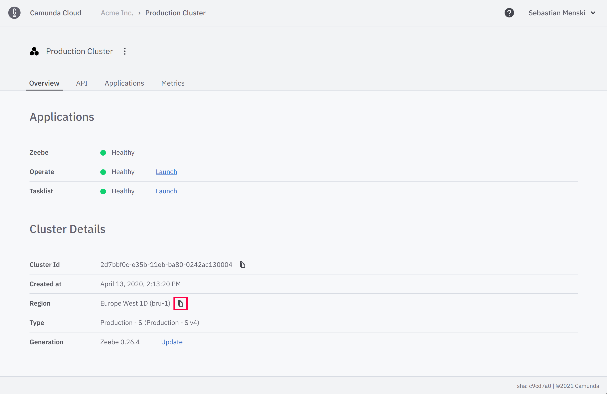

The following sections will explain for each component of the system which
adjustments have to be made to migrate from Camunda Cloud 1.0.x to 1.1.0

## Server

### Operate

With Operate 1.1 a new feature was introduced to navigate between call activity
hierarchies. This feature is only available for instances started after the
version update. Older instances will not expose this information to the user.

## Client

### Zeebe Java Client

To prepare to support multiple regions in Camunda Cloud SaaS we adopted the
Zeebe URLs used to connect to your cluster to contain a region sub-domain, i.e
`${CLUSTE_ID}.zeebe.camunda.io` is now `${CLUSTER_ID}.bru-2.zeebe.camunda.io`.

We are confident that we rolled out this change transparent and as backwards
compatible as possible. Still there exists situation which this might impact
you on your update path. For existing clusters the old URLs still be
functional, we still recommend to update the configuration of your clients to
the new URL format.

To support this feature we expose a new configuration method
[`withRegion`](https://javadoc.io/doc/io.camunda/zeebe-client-java/latest/io/camunda/zeebe/client/ZeebeClientCloudBuilderStep1.ZeebeClientCloudBuilderStep2.ZeebeClientCloudBuilderStep3.ZeebeClientCloudBuilderStep4.html#withRegion(java.lang.String))
in the Camunda Cloud builder of the Java Client to set the region.

By default the builder will assume the `bru-2` region which is the region of
any clusters create after Camunda Cloud GA in May 2021.

In case you are using the Java Client Camunda Cloud builder with a pre GA
cluster you have to set the region to the specific value of your cluster.

To copy the region of your cluster, please visit the clusters details page in
Camunda Cloud Console, and press the copy button next to the region.

