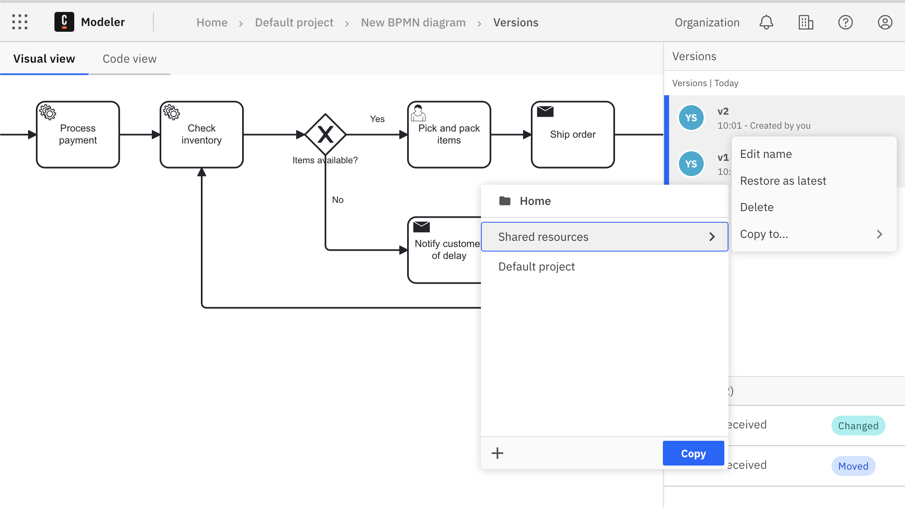

Camunda 8 only

Organizations often manage process documentation across multiple layers, from high-level strategic models to detailed operational workflows. The [process landscape](/docs/components/modeler/web-modeler/process-landscape-visualization.md) concept streamlines this complexity by supporting different levels of abstraction, enabling seamless collaboration across teams, and providing tailored insights for various stakeholders.

This guide explores how to consolidate these perspectives into a single shared project, ensuring clarity, reusability, and governance within your organization’s efforts.

By utilizing shared projects, teams can:

- Prevent duplicate work
- Maintain a single source of truth
- Enable cross-project navigation and transparency
- Govern access to organization resources effectively

## Setting Up a Shared Project

You can create a shared project that serves as an organizational resources repository.
From Modeler, select **Create new project** to create a new project and store resources in it.

## Invite Members & Assign Permissions

If you want to invite collaborators to your shared project, you'll need to first make sure they have the proper permissions and roles.

1. First, add your colleague to the Organization. Click your account name then **Organization Management**.
2. Navigate to **Users > Add New User**. Add your colleague's email and assign them an appropriate role - **Developer** is likely a good default option here as the user will have full access to Console, Operate, and Tasklist without deletion privileges. See [all roles and permissions](/components/console/manage-organization/manage-users.md#roles-and-permissions) for additional details.
3. Click **Add**. An email will be sent to the email you provided. Your colleague must hit **Join** to finish adding them to the organization.
4. Now that they're added to the organization, you can add them to a project. Open **Modeler**, navigate to your project and open the **Collaborators** panel on the right side.
5. Click **Add user** and find your colleague you added to your organization. Assign their role with the dropdown and click **Send invites**.
   
   Or use **All users in the organization** option to bulk invite all of your colleagues.
   
6. After your colleague clicks **Accept invitation**, they will have access to the project based on the role you assigned.

## Adding resources to the Shared project

You can share a specific version of the file or process application.

1. In the versions list, hover over the version you want to place in shared project.
2. Select the three vertical dots to open the actions menu.
3. Select Copy to....
4. Choose a project which intended to store shared resources and select Copy here to make it available for all members of the project.
   

## Browsing the process landscape of shared to organization resources

The Process Landscape View offers a visual map of BPMN files and their interfile connections (e.g., call activities).

Landscape view is available by clicking **Landscape view** button from:

- Project view
- Folder view
- [Process application](/docs/components/modeler/web-modeler/process-applications.md) view

### Landscape interaction

1. **Selecting a BPMN File:** Click on any node to see the BPMN file’s information including the latest version of the process on the sidebar.

   :::note
   For process applications, version tags represents a unified "versioned" snapshot of all process application files rather than separate versions for each file as is done with simple BPMN files.
   :::
   

2. **Searching**: Press `Ctrl+F` or `⌘+F` combination to initialize search. Type the name or identifier of a BPMN file to quickly find, highlight and jump to the corresponding node.
   
3. **Highlighting Paths:** Clicking on a node or connection will highlight the entire chain of related connections.
   

### Reading Documentation (README Files)

To access associated README file for process within the shared project:

1. Open the Process Landscape View.

2. Click on a node in the landscape.

3. The README file(if associated) will be displayed in the sidebar, providing a high-level overview of the process.

## Reusing Resources from the Shared Project

Users can reuse published resources by copying them into their own projects:

1. Open the shared project and navigate to the file.

2. In versions list choose version which should be reused and elect the three vertical dots to open the actions menu.
3. Select **Copy to...**.
4. Select the target project and click **Copy**.

By leveraging shared projects, organizations can create a centralized and structured repository which provides transparency, improves collaboration, and enables efficient governance over shared resources.
Teams can work at different levels of granularity, ensuring both strategic and operational needs are met while preventing duplication and maximizing asset reuse.
Implementing these practices helps streamline automation efforts and fosters a more efficient, scalable, and well-governed workflow within the organization.
