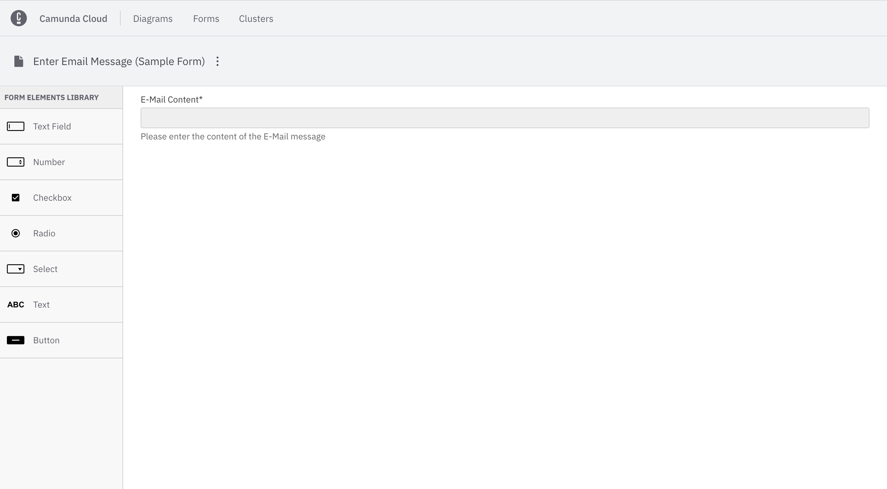
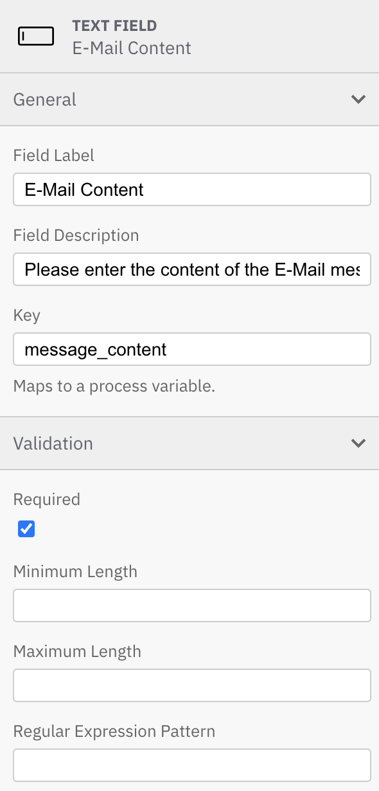

:::note
The initial release of Camunda Forms includes a debut minimal feature set, which will be expanded with upcoming versions.
:::

# Overview

The Camunda Forms feature allows you to easily design and configure forms. Once configured, they can be connected to a user task or start event to implement a task form in your application.

# Quickstart

## Create new form

To start building a form, take the following steps:

1. Log in to your [Camunda Cloud](./getting-started/create-camunda-cloud-account.md) account.
2. Click on the **Forms** tab at the top of the page.
3. Click the blue **Create New Form** button.

## Build your form

Now you can start to build your Camunda form. First, let's name our form by clicking the three vertical dots next to the text reading **New Form** in the top left corner of the page. Select **Rename** to give your form a new name. In this example, we'll analyze a form to help with a task in obtaining an email message.

Add your desired elements from the palette on the left side by dragging and dropping them onto the canvas.

Within Forms for Camunda Cloud, we have the option to add text fields, numerical values, checkboxes, radio elements, selection menus, text components, and buttons.

In the properties panel on the right side of the page, view and edit attributes that apply to the selected form element. For example, apply a minimum or maximum length to a text field, or require a minimum or maximum value within a number element. In this case, we have labeled the field, described the field, and required an input for our email message.

Refer to the [Camunda Forms reference material](https://docs.camunda.org/manual/latest/reference/forms/camunda-forms/) to explore all form elements and configuration options in detail.

## Save your form

To save your form, click the blue **Save** button in the top right corner of the page.

## Connect your form to a BPMN diagram

Click on the **Forms** tab again to view a list of all the forms you've created.

Next, let's implement a task form into a diagram. To connect your form to a user task or start event, take the following steps:

1. Click the **Diagrams** tab at the top of the screen.
2. Select the diagram where you'd like to apply your form.
3. Select the user task requiring the help of a form.
4. On the right side of the page, select the **Form** tab.
5. Click **SELECT FORM** to incorporate the JSON configuration of the form you've built on Camunda Cloud.

# Additional resources

- [Camunda and Cloud Modeler](./components/modeler/what-is-camunda-modeler.md)
- [Model your first process](./getting-started/model-your-first-process.md)
- [User task reference](./reference/bpmn-processes/user-tasks/user-tasks.md)