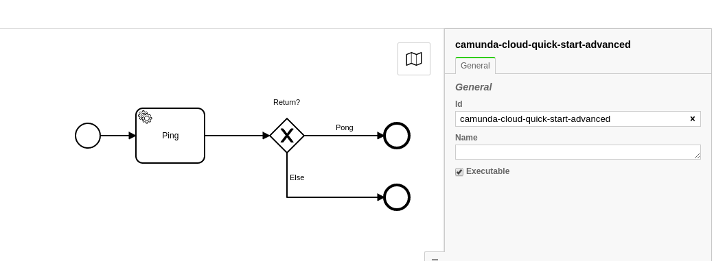
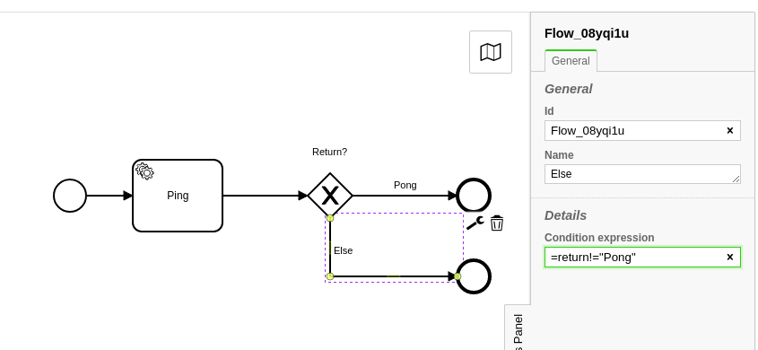
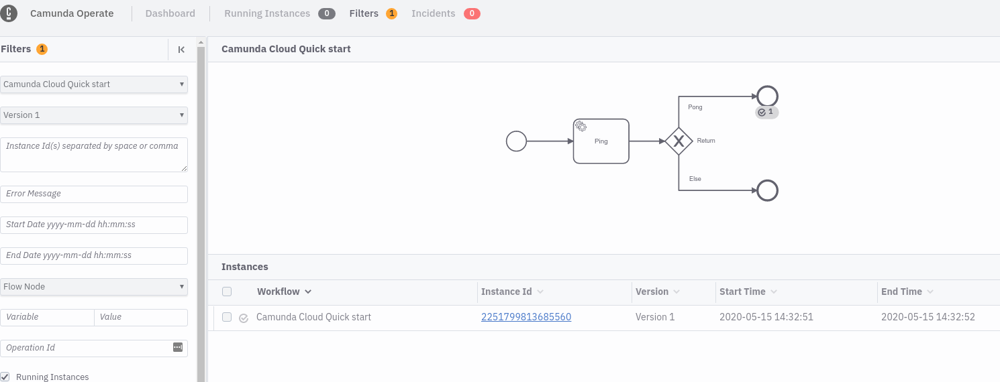
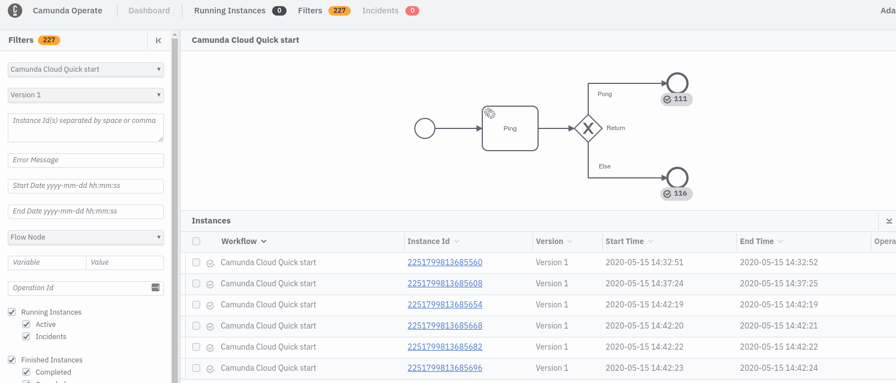

In this tutorial, you will learn to use the CLI client _zbctl_ to interact with Camunda Cloud.

## Prerequisites

- [Camunda Cloud Account](/guides/getting-started/create-camunda-cloud-account.md)
- [Cluster](/guides/getting-started/create-cluster.md) and [Client Credentials](/guides/getting-started/setup-client-connection-credentials.md)
- [Modeler](/guides/getting-started/model-your-first-process.md)
- [NPM environment](https://www.npmjs.com/)

## Set Up

### Installation

An installation can be done quickly via the package manager `npm`. The corresponding package is [here](https://www.npmjs.com/package/zbctl).

```bash
npm i -g zbctl
```

You can also download a binary for your Operating System from the [Zeebe GitHub Releases page](https://github.com/zeebe-io/zeebe/releases).

### Connection Settings

To use _zbctl_ it is recommended to define environment variables for the connection settings:

```bash
export ZEEBE_ADDRESS='[Zeebe API]'
export ZEEBE_CLIENT_ID='[Client ID]'
export ZEEBE_CLIENT_SECRET='[Client Secret]'
export ZEEBE_AUTHORIZATION_SERVER_URL='[OAuth API]'
```

When you create client credentials in Camunda Cloud you have the option to download a file with above lines filled out for you.

Alternatively, use the [described flags](https://www.npmjs.com/package/zbctl#usage) (`--address`, `--clientId` and `--clientSecret`). with the zbctl commands.

### Test Command

Use this command to verify that everything is set up correctly:

```bash
zbctl status
```

As a result you will get a similar result:

```bash
Cluster size: 1
Partitions count: 2
Replication factor: 1
Gateway version: unavailable
Brokers:
  Broker 0 - zeebe-0.zeebe-broker-service.456637ef-8832-428b-a2a4-82b531b25635-zeebe.svc.cluster.local:26501
    Version: unavailable
    Partition 1 : Leader
    Partition 2 : Leader
```

## Advanced Workflow

Use [this workflow model](./assets/gettingstarted_quickstart_advanced.bpmn) for the tutorial.



This workflow includes a Service Task and an XOR Gateway. Select the Service Task and fill in the properties. Set the task-type to 'test-worker'.


The worker will return a JSON object as a result, which is used to decide which path to take.
Now, we can use the JSON object to route your process by filling in the condition expression on the two sequence flows after the XOR gateway.

Use the following expression for the "Pong" sequence flow:

```bash
=return="Pong"
```

And for the Else Sequence flow:

```bash
=return!="Pong"
```



## Deploy a Workflow

Now you can deploy the [workflow](./assets/gettingstarted_quickstart_advanced.bpmn). Navigate to the folder, where you saved your workflow.

```bash
zbctl deploy gettingstarted_quickstart_advanced.bpmn
```

If the deployment is successful you'll get the following output:

```bash
{
  "key": 2251799813685493,
  "workflows": [
    {
      "bpmnProcessId": "camunda-cloud-quick-start-advanced",
      "version": 1,
      "workflowKey": 2251799813685492,
      "resourceName": "gettingstarted_quickstart_advanced.bpmn"
    }
  ]
}
```

Important here is the `bpmnProcessId`, which you'll need for creating a new instance.

## Register a worker

The workflow uses the worker with the type `test-worker`. Register a new one by using the following command:

```bash
zbctl create worker test-worker --handler "echo {\"return\":\"Pong\"}"
```

## Start a new instance

You can start a new instance with a single command:

```bash
zbctl create instance camunda-cloud-quick-start-advanced
```

As a result, you'll get the following output, which contains, among others, the `workflowInstanceKey`:

```bash
{
  "workflowKey": 2251799813685492,
  "bpmnProcessId": "camunda-cloud-quick-start-advanced",
  "version": 1,
  "workflowInstanceKey": 2251799813685560
}
```

Navigate to Operate to monitor the workflow instance.



Because the worker returns

```json
{
  "return": "Pong"
}
```

the workflow ends in the upper end event.

Changing the worker to

```bash
zbctl create worker test-worker --handler "echo {\"return\":\"...\"}"
```

and creating a new instance leads to a second instance in Operate, which you'll see ending in the second end event:


As a next step you can now connect both workers in parallel and create more workflow instances:

```bash
while true; do zbctl create instance camunda-cloud-quick-start-advanced; sleep 1; done
```

In Operate you will see instances ending in both end events depending on which worker picked up the job.


