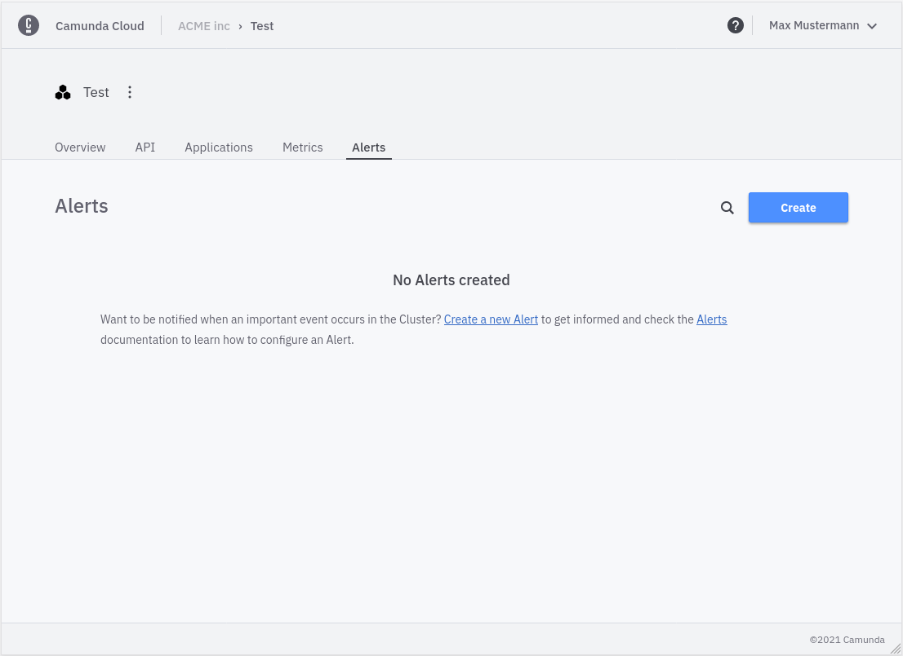
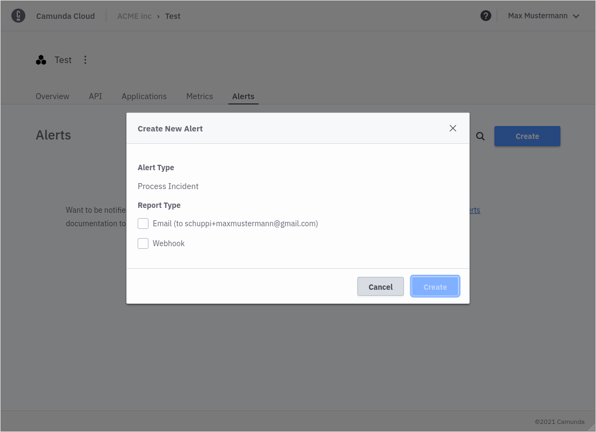
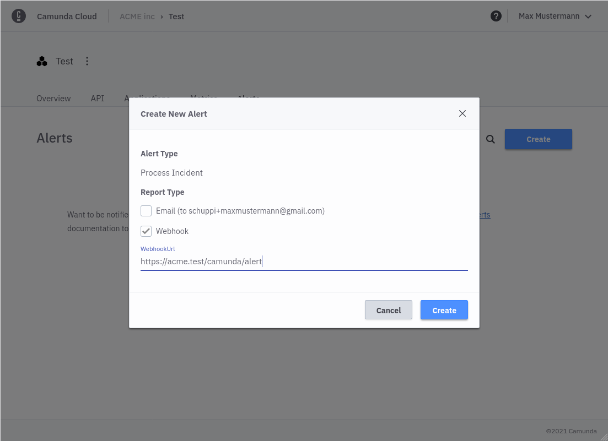

Camunda Cloud allows you to get notified when Workflow Process Instances stop with an error. 
There are two types of reporting, 
- By mail to the email address of your user accounts
- By webhook

### Create an Alert

To create a new alert you have to navigate into the `Alert` tab:



Click **Create** to create a new alert.



You can choose between `Email` and `Webhook`. For `Email` no further information is needed.
To create a `Webhook` alert, you need to provide a valid webhook url that excepts `POST` requests. 



You can only have one `Email` alert per Cluster but you can create multiple `Webhook` alerts if needed.

### Webhook Alerts
Webhook alerts contain a JSON body with following structure:

```
{
    operateUrl: string, // direct link to the incident in operate 
    workflowInstanceId: string // id of the failed workflow,
    errorMessage: string, // error message as seen in operate
    errorType: string, // error type
    flowNodeId: string, // id of the flow node that created the error
    jobKey: string, // key of the failed job
    creationTime: string, // the time when the error was created
    workflowName: string, // name of the failed workflow
    workflowVersion: number, // version number of the failed workflow
}
```