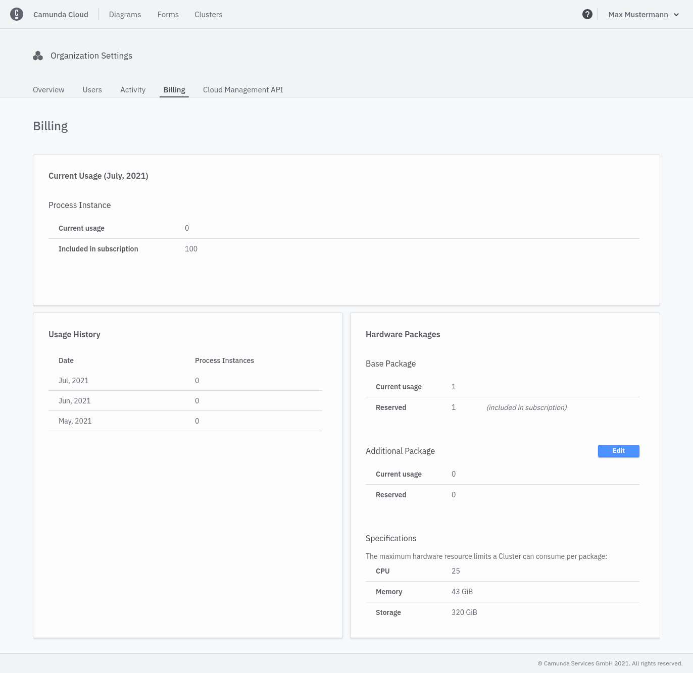

Let's manage our hardware packages and edit reservations.

:::note
This setting is only visible in the Professional Plan for owners and admins.
:::

## Managing Hardware Packages

Once signed up for the Professional Plan, you have access to the **Billing** page.

In the upper part, the created process instances from the current period are displayed. On the bottom left there is a history of the metrics on a monthly basis. On the right side you can see how many hardware packages are included and you can change the reservations for additional hardware packages.

Reservations control how many clusters you can deploy. Increasing the number of reservations allows you to deploy more clusters, decreasing the number of reservations does the opposite.

You can access the **Billing** page by selecting the menu entry **Organization Settings** from the Camunda Cloud Console navigation bar.

### Edit reservations

The number of reserved clusters can be changed with the `Edit` button. The number of reserved clusters cannot exceed the maximum limit and cannot go below what is currently in use.
