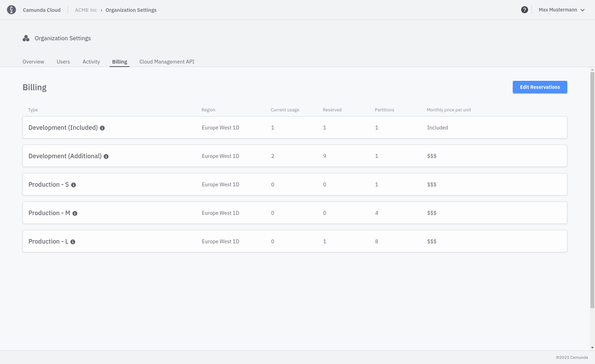

:::note
This setting is only visible in the Professional Plan for owners and admins.
:::

## Managing Hardware Packages

Once signed up for the Professional Plan, you have access to the **Billing** page.

The left side of the page shows the number of started process instances in the current period. On the right-hand side is the hardware specification of the reservable hardware packages of a cluster. Additionally it is shown how many packages are included and how many additional packages are reserved.

Reservations control how many clusters you can deploy. Increasing the number of reservations allows you to deploy more clusters, decreasing the number of reservations does the opposite.

You can access the **Billing** page by selecting the menu entry **Organization Settings** from the Camunda Cloud Console navigation bar.

### Edit reservations

The number of reserved clusters can be changed with the `Edit` button. The number of reserved clusters cannot exceed the maximum limit and cannot go below what is currently in use.
