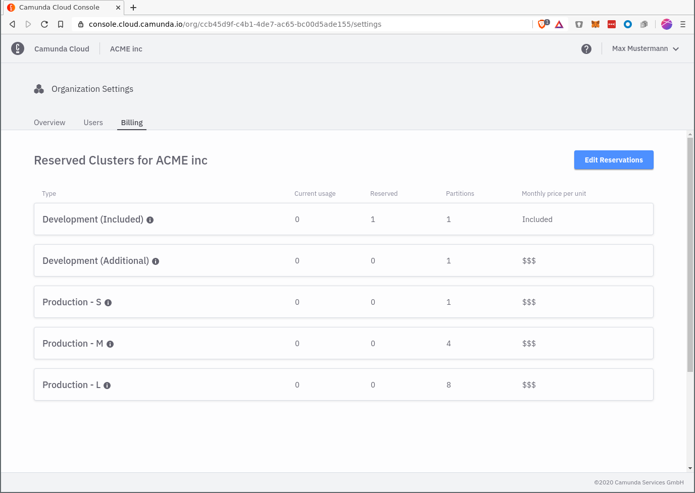
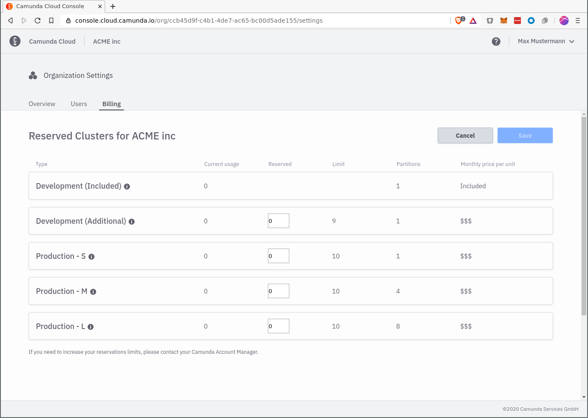

_Note: the terms under which the Professional Plan is available might change in the future._

## Overview

For users who seek to use Camunda Cloud for production projects we make available an early access edition of the professional plan.

The early access edition ensures that you have the support of Camunda that you need to be successful in your project.

The professional plan is a subscription (anually renewing) providing access to Camunda Cloud at an [affordable monthly fee](https://camunda.com/cloud).

Details:

* Professional support by Camunda (8x5)
* Remote consulting budget for dedicated sessions with technical expert from Camunda
* Access to one Zeebe development cluster
* Additional production clusters can be added on demand using a flexible pay as you go model

Request access to the professional plan by visiting the [Camunda Cloud page on the website](https://camunda.com/cloud).

## Requesting Access

To request you need to have an active [Trial Plan](./trial-plan.md) account. In case you have not yet signed up for Camunda Cloud, you can do it via [the signup form](https://accounts.cloud.camunda.io/signup).

To request early access to the Professional Plan, use the button in the navigation bar. This will send a request to the Camunda Sales Team, and an Account Manager will contact you as soon as possible. The account manager will explain the conditions and next steps to you.

## Managing Reservations

Once signed up for the professional plan, you have access to the Cluster Reservations Page.

Cluster Reservations control how many clusters you can deploy. Increasing the number of reservations allows you to deploy more clusters, decreasing the number of reservations does the opposite.

You can access the Cluster Reservations page by selecting the menu entry "Organization Settings" from the Camunda Cloud Console navigation bar.

### Inspect active Reservations

The page lists available cluster types along with their specification. A cluster type has the following parameters:

* **Type**: Name of the cluster type
* **Current Usage**: Number of clusters currently deployed for a given cluster type
* **Reserved**: Number of clusters currently reserved. This value is important for [billing](#billing). Users in your organization cannot deploy more clusters per cluster configuration than specified by this value
* **Partitions**: The Number of partitions specified in the cluster configuration
* **Monthly price per unit**: The monthly price of this this cluster type. Indicates the price of this cluster in dollars if used for a full month

### Edit Reservations

The number of reserved clusters can be changed with the Edit button. The number of reserved clusters cannot exceed the maximum limit and cannot go below what is currently in use.

## Billing

The Professional Plan has a fixed monthly subscription fee (*"Base Fee"*) as well as a variable, pay as you go component which depends on the amount of [cluster reservations](#managing-reservations) (*"Reservations Billing"*).

Reservations billing works as follows: for each day (GMT+2), the *daily total* is calculated. To obtain the daily total, all reservations that were active on that day are recorded and for each such reservation, the daily price of the cluster type corresponding to that reservation is added. (Note: The daily price of a cluster type is obtained by dividing the monthly price of the cluster type by the numbers of days in the month). At the end of the month, the daily totals are added up to obtain the *monthly total*.

### Example

_Note: Example values are used to better understand calculation. These are not actual prices in Camunda Cloud_

**Given**

- Cluster Type A: 300 Euro
- Cluster Type B: 900 Euro

**Reservation updates**

| Day of the month             | Number of reservations for A | Number of reservations for B |
| ---------------------------- | ---------------------------- | ---------------------------- |
| reservations from last month | 2                            | 1                            |
| 11, 10:00                    | 3                            | 2                            |
| 11, 17:00                    | 5                            | 2                            |
| 21, 09:00                    | 4                            | 3                            |

**Daily Totals**

| Day of month | Price A | Price B | Daily Total |
| ------------ | ------- | ------- | ----------- |
| 1            | 20      | 30      | 50          |
| ...          | 20      | 30      | 50          |
| 10           | 20      | 30      | 50          |
| 11           | 50      | 60      | 110         |
| ...          | 50      | 60      | 110         |
| 20           | 50      | 60      | 110         |
| 21           | 40      | 90      | 130         |
| 30           | 40      | 90      | 130         |

**Monthly Total**

| Position  | Value         |
| --------- | ------------- |
| Basic Fee | 1000 Euro     |
| A         | 1100 Euro     |
| B         | 1800 Euro     |
| **Sum**   | **3900 Euro** |
