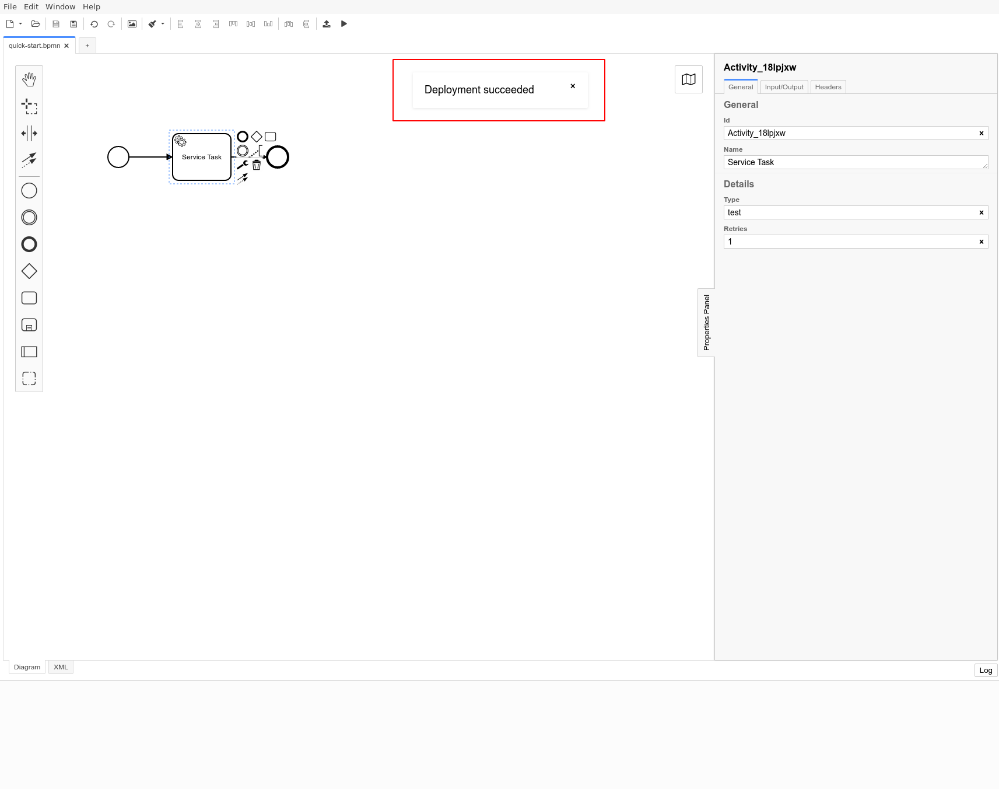

Once you have established your [connection to Camunda Cloud](./connect-to-camunda-cloud.md) you can deploy your BPMN diagram.

Click the deployment icon:

:::note
The BPMN diagram must not only be valid, but must also be understood by the Zeebe engine. For example, if you model a service task but do not configure the element, you will get an error message during the deployment.
:::

If the BPMN diagram has been deployed successfully, a corresponding message is displayed.

