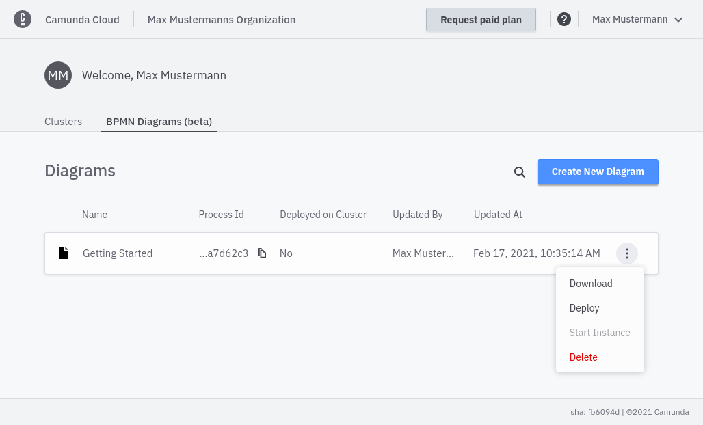

You can deploy processes and start instances directly from the **Overview** page. Hover over the diagram you want to use, and select your action from the context menu. From here, you can also download and delete diagrams.

