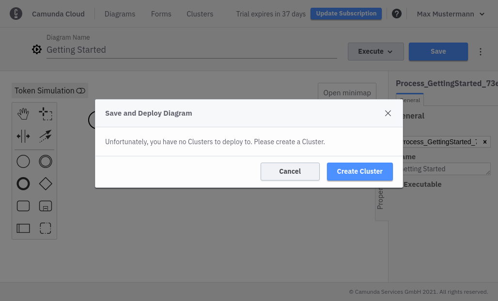
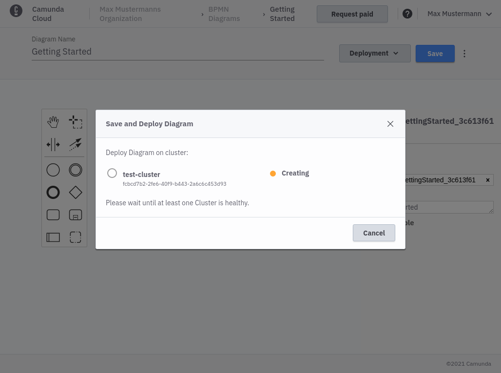
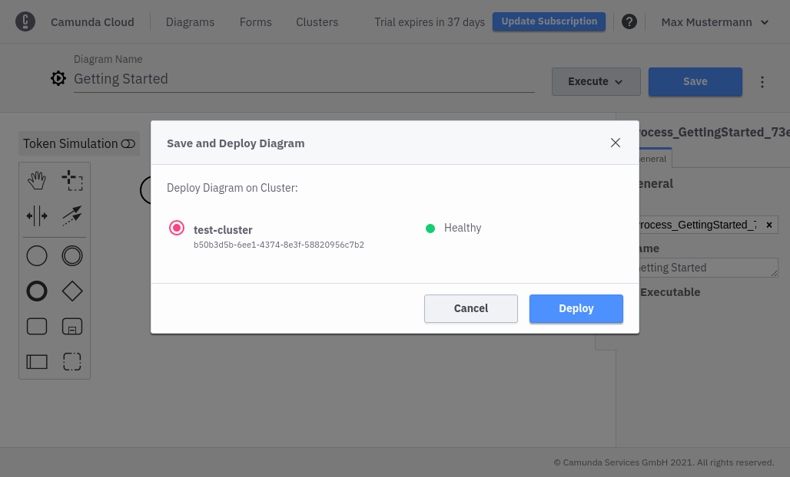

Your BPMN diagram can be saved in your organizational context at any time. You have to differentiate between saving and deploying. If a diagram is only saved it has no effect on your cluster(s). It can be used by all members of your organization.

As soon as you deploy the diagram it will be available on the selected cluster and new instances can be started. Click **Save and Deploy** in the **Deployment** menue to deploy your diagram. If no cluster is available yet you can create a new cluster.

After you have created a cluster it must be ready to deploy a diagram.

As soon as the cluster is _Healthy_, the deployment is possible.

After a successful deployment you can [start a new instance](./start-instance.md).

