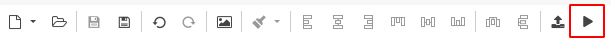
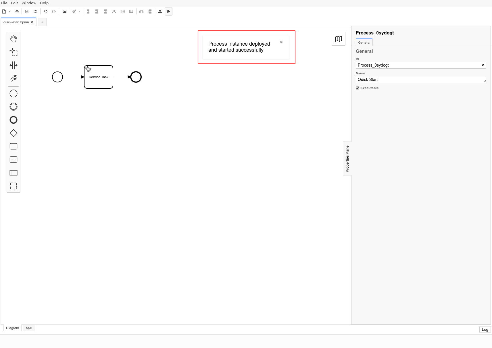

Once you have established your [connection to Camunda Cloud](./connect-to-camunda-cloud.md) you can start a new Instance of your BPMN diagram via the play icon.

:::note
The BPMN diagram must be deployed on your cluster before, otherwise no instance can be started.
:::

If an instance could be started successfully a corresponding message is displayed.

