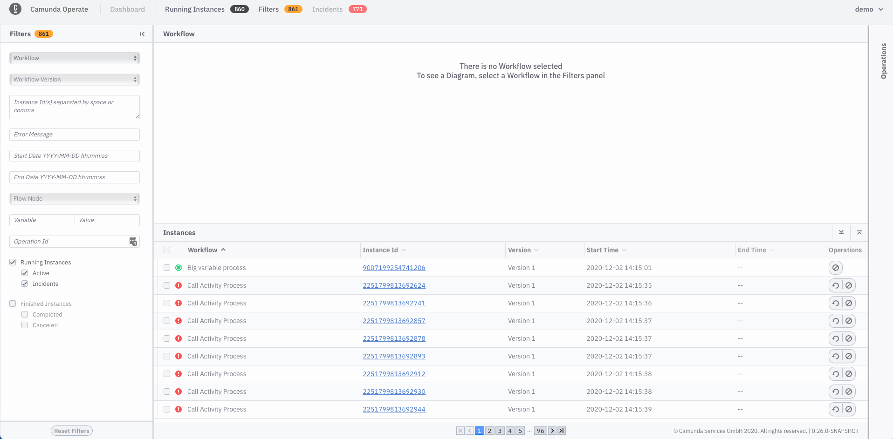
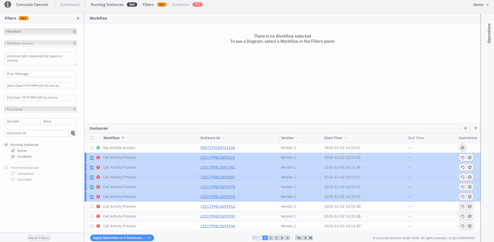
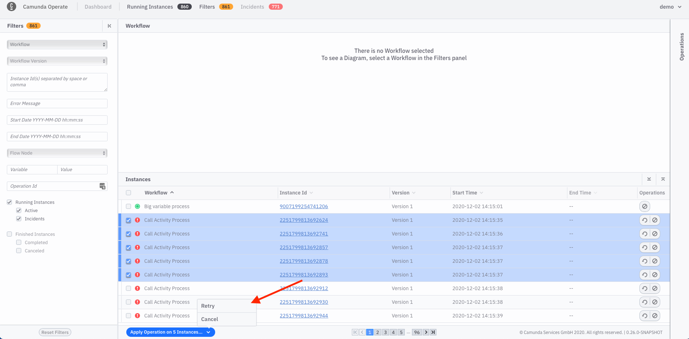
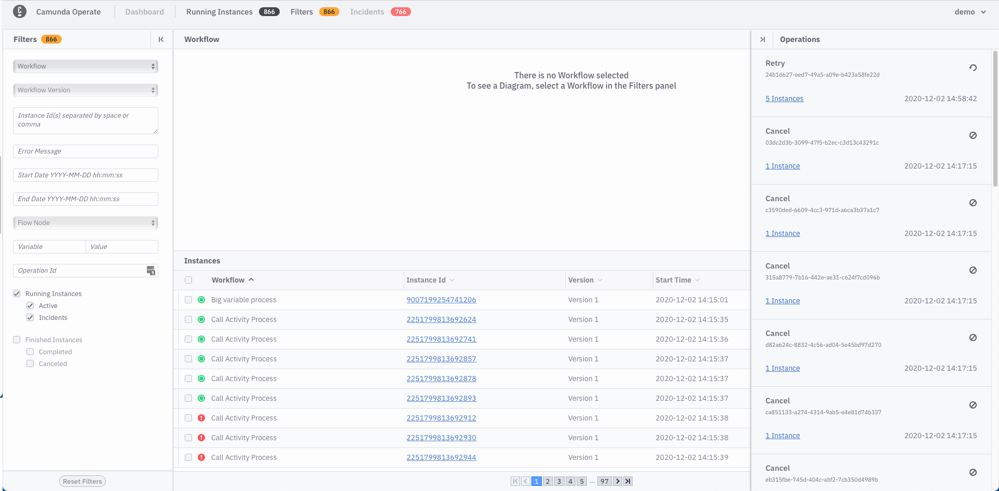

In some cases, you’ll need to retry or cancel many process instances at once. Operate also supports this type of operation.

Imagine a case where many process instances have an incident caused by the same issue. At some point, the underlying problem will have been resolved (for example, maybe a microservice was down for an extended period of time then was brought back up). 

But even though the underlying problem was resolved, the affected process instances are stuck until they are “retried”.

Let's create a _selection_ in Operate. A selection is simply a set of process instances on which you can carry out a batch retry or batch cancellation. To create a selection, check the box next to the process instances you'd like to include, then click on the blue `Apply Operation on N Instances` button. 

Then select the operation you want to apply.

After confirmation you can see the _Operations_ panel with current status of all operations.

