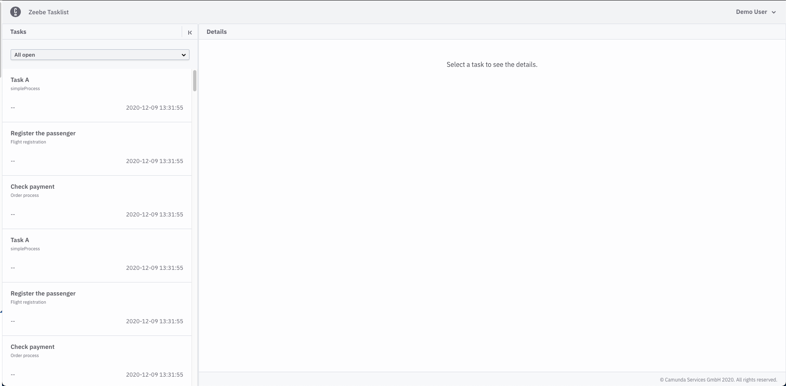

## Running via Docker (local development)

You can use the Docker image `camunda/zeebe-tasklist:latest` to run Tasklist as container.

Please make sure to set appropriate settings described in [configuration](../deployment/configuration) section of deployment guide.
Here an example configuration for `docker-compose`:
```
zeebe-tasklist:
    container_name: zeebe-tasklist
    image: camunda/zeebe-tasklist:latest
    ports:
        - 8080:8080
    environment:
        - zeebe.tasklist.elasticsearch.url=http://elasticsearch:9200
        - zeebe.tasklist.zeebeElasticsearch.url=http://elasticsearch:9200
        - zeebe.tasklist.zeebe.brokerContactPoint=zeebe:26500
```
## Manual configuration (local development)

Here, we’ll walk you through how to download and run a Tasklist distribution manually, without using Docker.

Note that the Tasklist web UI is available by default at [http://localhost:8080](http://localhost:8080), so please be sure this port is available.

### Download Tasklist and a compatible version of Zeebe.

[Tasklist and Zeebe distributions are available for download on the same release page. ](https://github.com/zeebe-io/zeebe/releases)

Note that each version of Tasklist is compatible with a specific version of Zeebe.

On the Zeebe release page, compatible versions of Zeebe and Tasklist are grouped together. Please be sure to download and use compatible versions. This is handled for you if you use the Docker profile from our repository.

### Download Elasticsearch

Tasklist uses open-source Elasticsearch as its underlying data store, and so to run Tasklist, you need to download and run Elasticsearch.

Tasklist is currently compatible to Elasticsearch 6.8.14. [You can download Elasticsearch here.](https://www.elastic.co/downloads/past-releases/elasticsearch-6-8-14)

### Run Elasticsearch

To run Elasticsearch, execute the following commands in Terminal or another command line tool of your choice:

```
cd elasticsearch-*
bin/elasticearch
```

You’ll know Elasticsearch has started successfully when you see a message similar to:

```
[INFO ][o.e.l.LicenseService     ] [-IbqP-o] license [72038058-e8ae-4c71-81a1-e9727f2b81c7] mode [basic] - valid
```

### Run Zeebe

To run Zeebe with Elasticsearch Exporter, execute the following commands:

```
cd zeebe-broker-*
ZEEBE_BROKER_EXPORTERS_ELASTICSEARCH_CLASSNAME=io.zeebe.exporter.ElasticsearchExporter ./bin/broker
```


You’ll know Zeebe has started successfully when you see a message similar to:


```
[partition-0] [0.0.0.0:26501-zb-actors-0] INFO  io.zeebe.raft - Joined raft in term 0
[exporter] [0.0.0.0:26501-zb-actors-1] INFO  io.zeebe.broker.exporter.elasticsearch - Exporter opened
```

### Run Tasklist

To run Tasklist, execute the following commands:

```
cd zeebe-tasklist*
./bin/tasklist
```

You’ll know Tasklist has started successfully when you see messages similar to:

```
2020-12-09 13:31:41.437  INFO 45899 --- [           main] i.z.t.ImportModuleConfiguration          : Starting module: importer
2020-12-09 13:31:41.438  INFO 45899 --- [           main] i.z.t.ArchiverModuleConfiguration        : Starting module: archiver
2020-12-09 13:31:41.555  INFO 45899 --- [           main] i.z.t.w.StartupBean                      : Tasklist Version: 0.26.0-alpha2
```

## Access the Tasklist web interface

The Tasklist web interface is available at [http://localhost:8080](http://localhost:8080).

The first screen you'll see is a sign-in page. Use the credentials `demo` / `demo` to sign in.

If you already have some user tasks in Zeebe you can see these on the left panel in the start screen:


