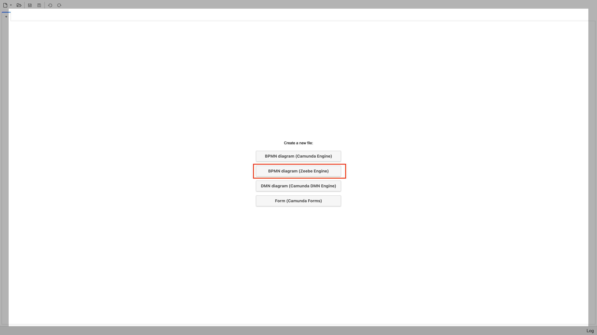
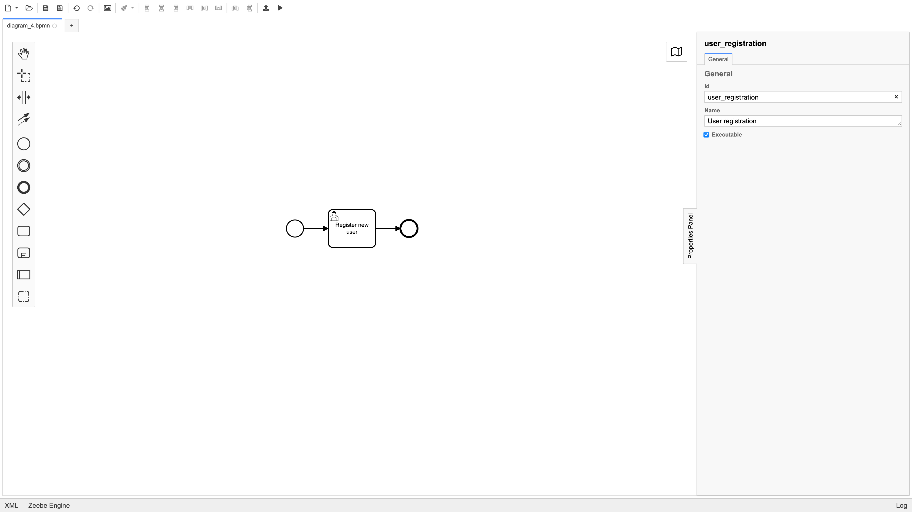
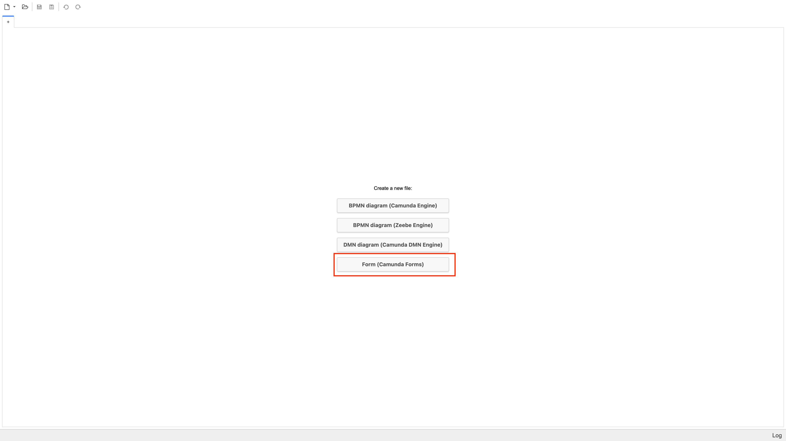
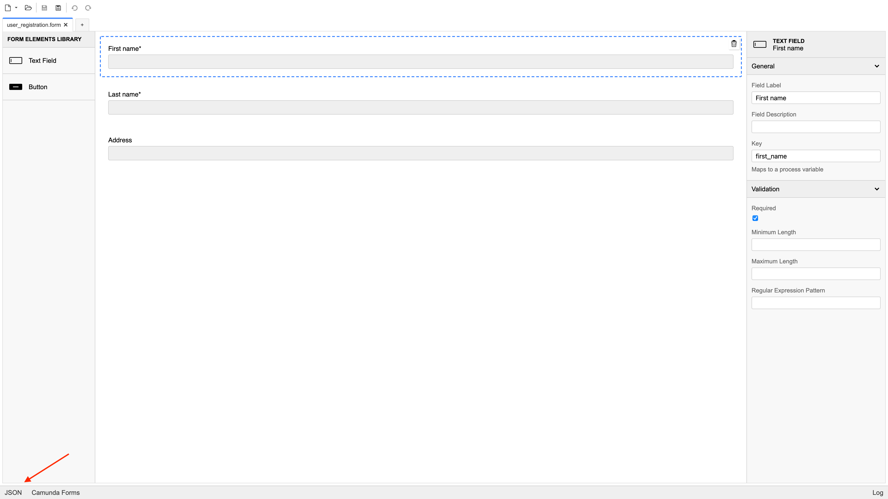
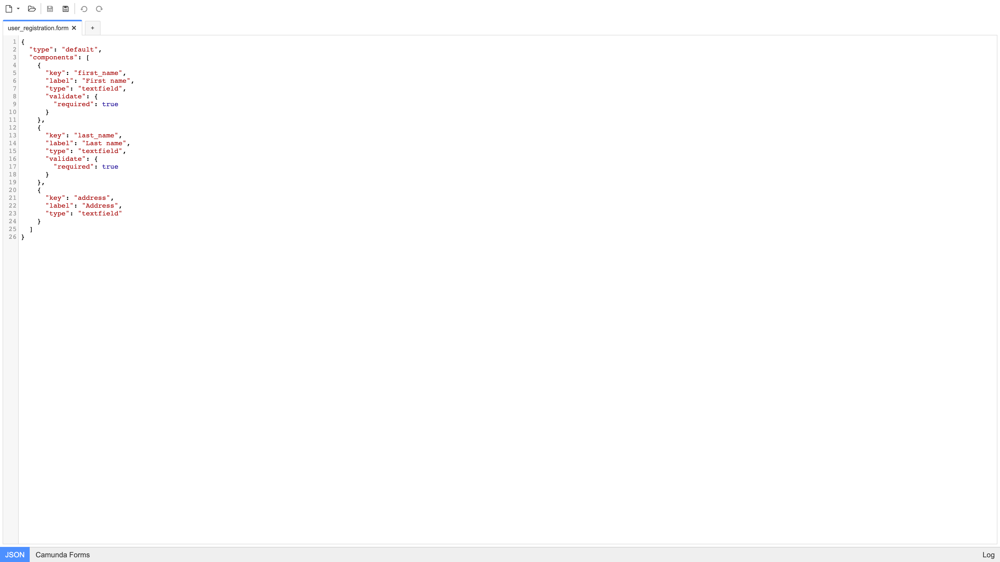
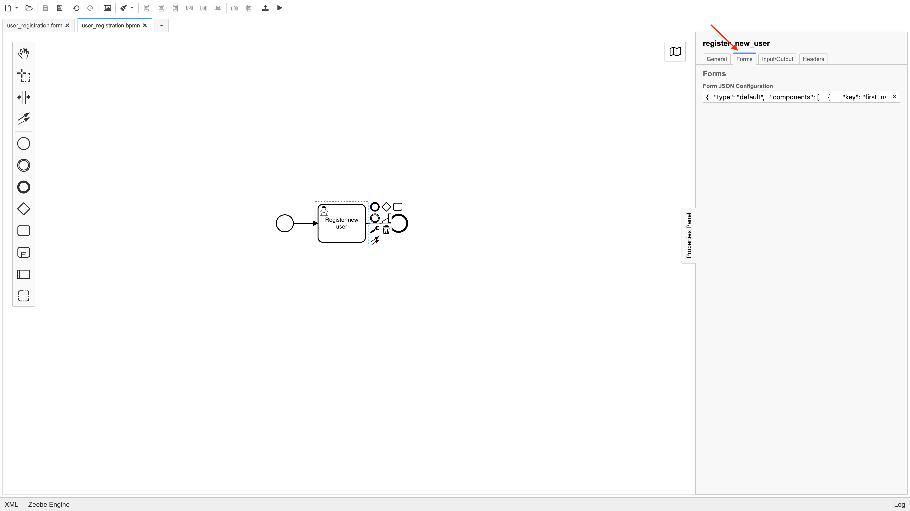
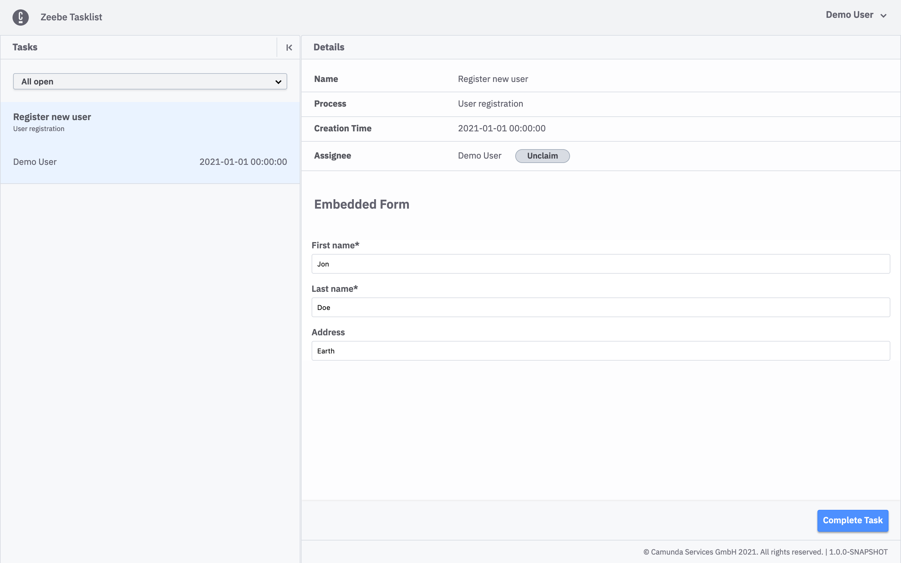
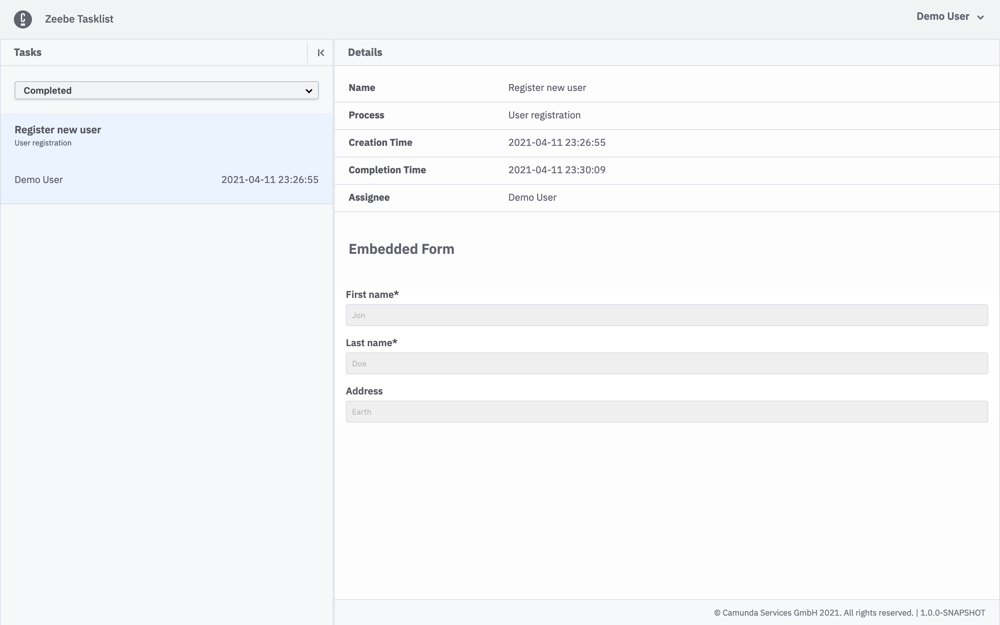
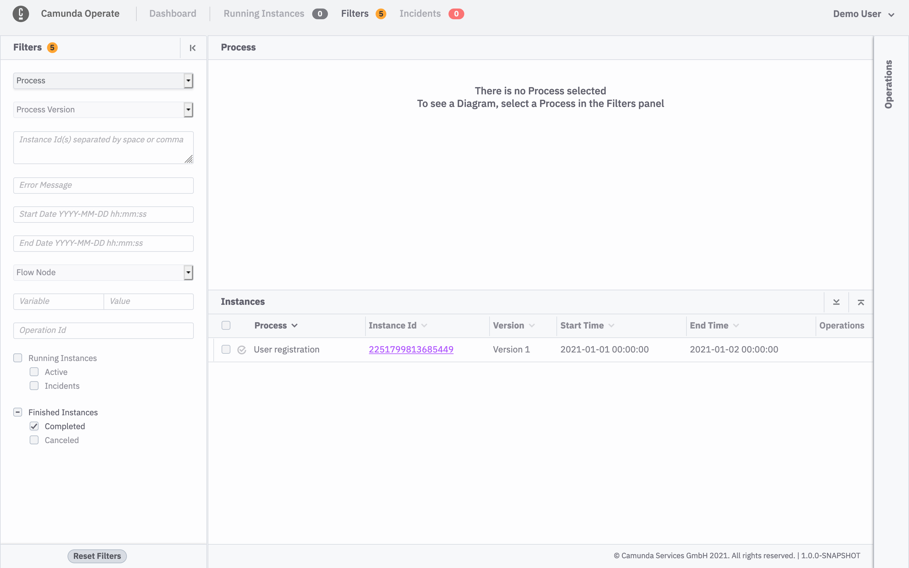
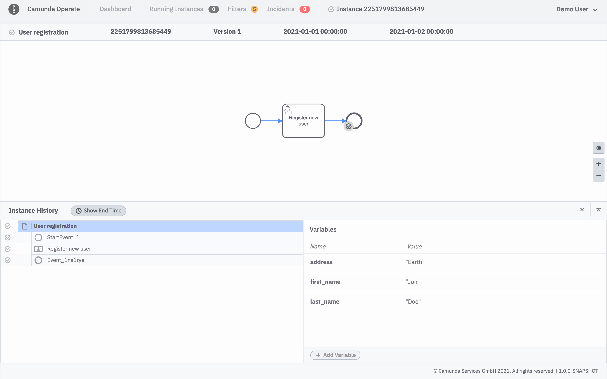

Let's learn about Camunda Forms, how to use them, how to model them with a diagram, and deploying.

## What are Camunda Forms?

Camunda Forms is one of the ways of handling a user task on Tasklist. These forms can be created in the Camunda Modeler where they can also be embedded in the BPMN file with your diagram and then assign a form to a user task.

After deploying a diagram with an embedded form, Tasklist will import this form schema and use it to render the form on every task assigned to it.

All new tasks that have a form assigned to it on the BPMN diagram will render the form modeled on the Camunda Modeler. The fields will be pre-filled with variables with the same names as the respective fields. When the task is complete, variables will be updated or created based on the field names of the form.

## How to use Camunda Forms?

### Modeling the diagram and form

Open the Camunda Modeler and create a new diagram for the Zeebe Engine.


Model a process with a user task


Now create a form by clicking on **Form (Camunda Forms)**


Model your form and click on the bottom left corner that says **JSON** to switch to the JSON view.

Pay attention when naming the fields of your form - fields will have their values pre-filled from variables that have the same name.



Copy the JSON schema


Go back to the BPMN diagram you modeled earlier, select the **user task**, and click on the **Forms** tab. After switching tabs you should see the field where you can paste the form JSON schema. Paste the schema and save the file.


### Deploying the diagram

Deploy your diagram to Zeebe and create an instance.

```sh
zbctl deploy /path/to/my/diagram.bpmn
zbctl create instance diagram-id
```

### Completing the task

Now open Tasklist, you should see an unclaimed task, click on it and the details will open with the form you modeled earlier.


Claim this task, fill in the form, and complete the task.


If you filter by **Completed Tasks** you should see your task listed.


### Checking instance on Operate

If you go to Operate you should see your instance completed (if your diagram consisted of only 1 user task).


Go to the instance details page, you can see that values you filled on the form are now process variables.

