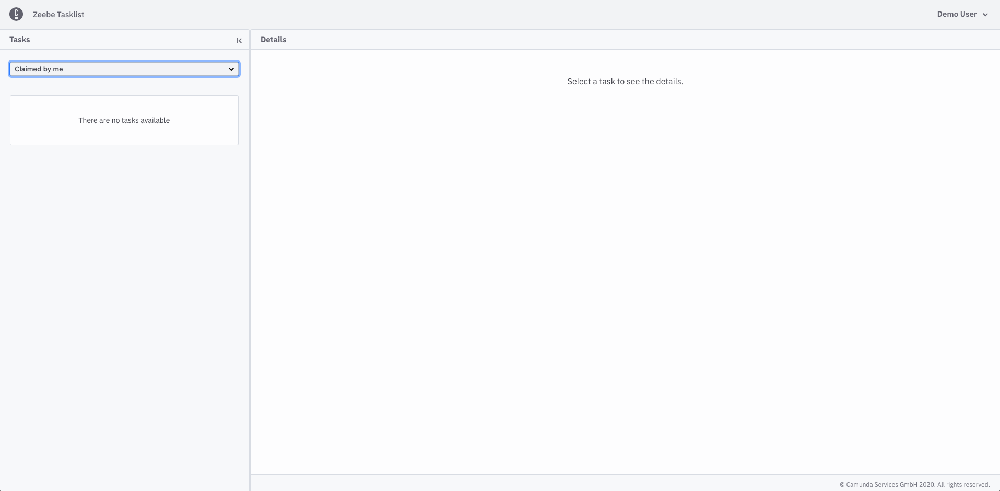
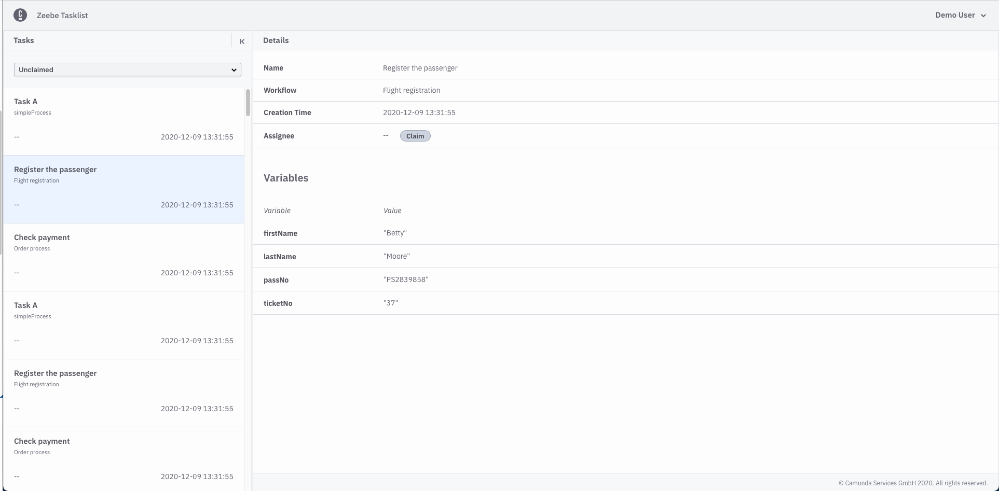
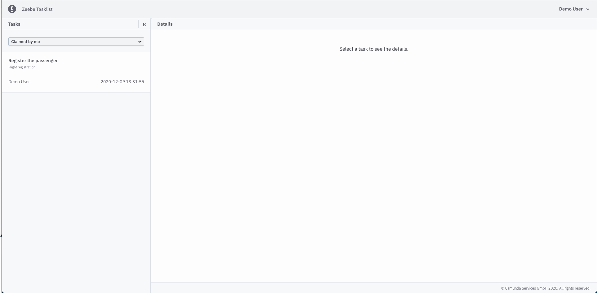
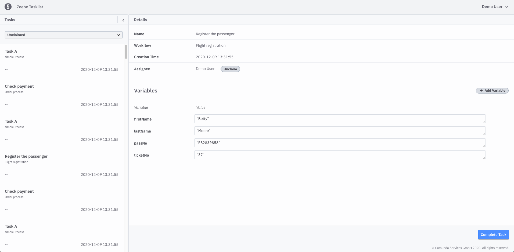
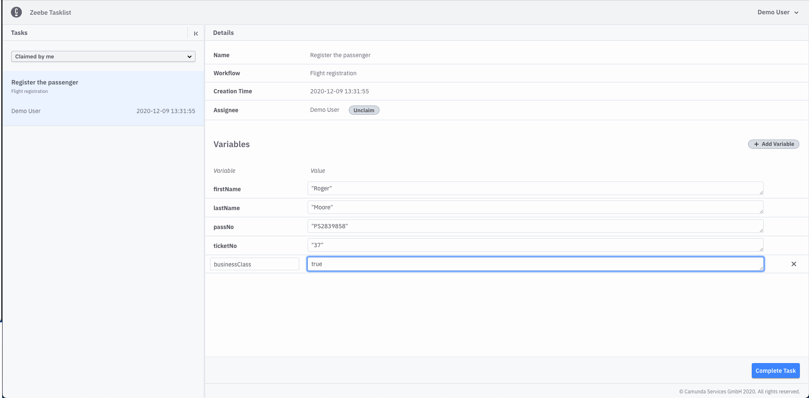
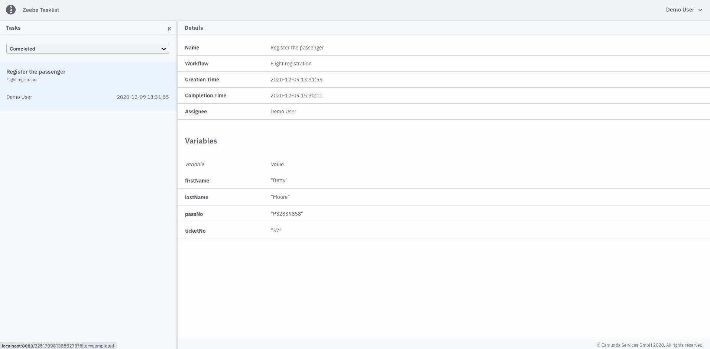

## What can I do with Tasklist?
Tasklist shows you all user tasks that appeared in processes. Those processes are running in Zeebe.

User tasks needs an interaction from the user - that can be updating, adding variables, filling out a Camunda Form or just completion of the task. The user needs to claim a task first or even unclaim an already claimed task.
If the user has claimed a task, then the task is completable. Different task status filters help the user
to choose the desired task.

## Example use case 
If you have successfully logged in you can see a screen like this:

On the left side you can see tasks and on the right side details of the current selected task.
You can change the list of tasks by applying filters. You can collapse and expand the task list.

You can choose which tasks you want to see: 

* All open
* Claimed by me
* Unclaimed
* Completed

At the begin we have no **Claimed by me** tasks.

### Claimed by me tasks

We select the **Unclaimed** list and claim a task by using the **Claim** button on the details panel:

### Claim a task 

Now select the **Claimed by me** list to see whether you have the task claimed:

### Complete a task
Only then you can complete the task by adding and updating variables and finally using the **Complete Task** button:

You always choose a list of tasks with a specified status and then select the task you want to work on.

Now we complete the task and check if it will be shown in **Completed** list. 
Change and variables as needed and start the completion with **Complete Task**.

#### Add and update variables

### Completed tasks
If everything went fine you can see the completed task by selecting the **Completed** task list:

