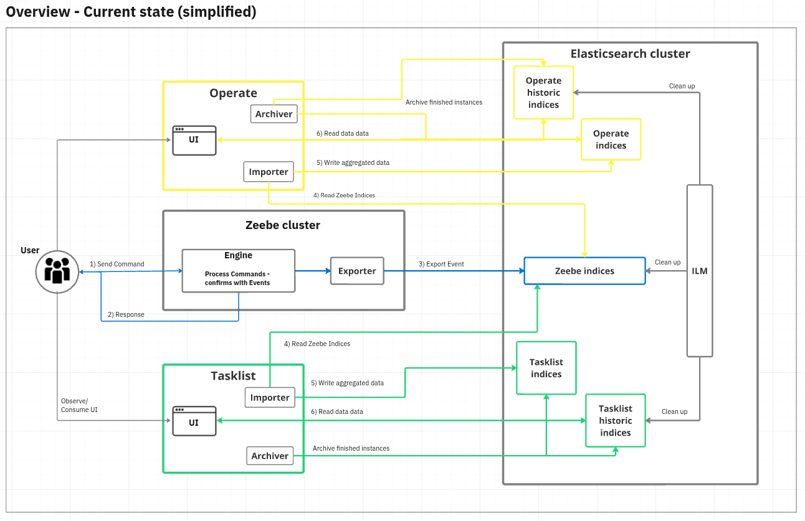
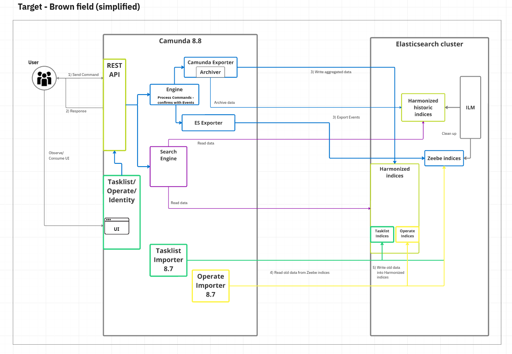

import DeployDiagramImg from '../../img/deploy-diagram-modal.png';

Supported environment changes and breaking changes or deprecations for the Camunda 8.8 release are summarized below.

| Scheduled release date | Scheduled end of maintenance | Release notes | Blog |
| :--------------------- | :--------------------------- | :------------ | :--- |
| 14 October 2025        | 13 April 2027                | -             | -    |

:::info 8.8 resources

- See [release notes](/reference/announcements-release-notes/880/880-release-notes.md) to learn more about new features and enhancements.
- See [What's new in Camunda 8.8](/components/whats-new-in-88.md) for important changes to consider when planning your upgrade from Camunda 8.7.
- Refer to the [quality board](https://github.com/orgs/camunda/projects/187/views/15) for an overview of known bugs by component and severity.

:::

## Changes in supported environments

### Elasticsearch and OpenSearch minimal supported versions updated to 8.16+ and 2.17+

Camunda now supports Elasticsearch 8.16+ and OpenSearch 2.17+ as minimal versions, ensuring users can benefit from the latest, most stable database releases.

### Zeebe, Operate, Tasklist, and Identity must run on exact same minor and patch levels

From version `8.8.0` forward, the following core [Orchestration Cluster](/self-managed/reference-architecture/reference-architecture.md#orchestration-cluster) components must run on the exact same `minor`and `patch` level to ensure compatibility: Zeebe, Operate, Tasklist, and Identity. See the [component version matrix](/reference/supported-environments.md#component-version-matrix) or the [Self-Managed reference architecture](/self-managed/reference-architecture/reference-architecture.md#orchestration-cluster) for an overview of components.

### Installation and deployment updates <span class="badge badge--long" title="This feature affects Self-Managed">Self-Managed</span>

Camunda 8.8 introduces a streamlined architecture, consolidating core components such as Zeebe, Operate, Tasklist, Optimize, and connectors into a single deployable unit. Enhanced deployment options are also included, such as new Kubernetes Helm guides, [deployment reference architectures](/self-managed/reference-architecture/reference-architecture.md), and improved support for local development with [Camunda 8 Run](/self-managed/quickstart/developer-quickstart/c8run.md).

You can download the alpha release of the unified package from the Camunda GitHub repository, either as an executable Java application (Camunda Orchestration Core) or a Docker image.

#### Identity and authentication limitations in 8.8.0-alpha2

The 13.0.0-alpha2 Helm chart released with Camunda 8.8.0-alpha2 establishes a new default setup to support 8.8 [Identity management updates](#identity-management-updates-saasself-managed). Currently, this setup is limited to the following components:

- The Orchestration core (Zeebe, Operate, Tasklist, and Orchestration Cluster Identity)
- Connectors

This temporary limitation will be resolved in subsequent alpha releases.

#### Helm charts

##### ExtraVolumeClaimTemplates

You can now add custom `extraVolumeClaimTemplates` to the Zeebe/Core StatefulSet by supplying an array of templates in your Helm values file. This allows you to attach additional persistent volumes to each Zeebe/Core pod for use cases such as custom storage or log directories.

:::info important
Kubernetes does not allow you to change the `volumeClaimTemplates` of an existing StatefulSet. If you add, remove, or modify `extraVolumeClaimTemplates` after initial deployment, you must delete and recreate the StatefulSet (which will also delete the pods) for the changes to take effect. This may require additional planning and data migration steps to avoid data loss.
:::

##### Common labels for Camunda resources

A new `commonLabels` value is now available and integrates with `camundaPlatform.labels`. This allows you to define mutable labels that are automatically applied to all Camunda resources. By setting `commonLabels`, you can ensure consistent labeling across deployments, making it easier to manage, organize, and identify resources within your Camunda environment.

##### Configure Web Modeler replicas

The number of replicas for the Web Modeler REST API and web app deployments can be set with new configuration properties: `webModeler.restapi.replicas` and `webModeler.webapp.replicas`, respectively.

##### External database for Web Modeler REST API

The configuration for the external database used by the Web Modeler REST API has been updated to align with the Identity component's database configuration. A new value, `webModeler.restapi.externalDatabase`, is now available and mirrors the structure of `identity.externalDatabase`. To ensure backward compatibility, the existing `webModeler.restapi.externalDatabase.url` field is retained and will take precedence if set.

##### Default username claim in Web Modeler

The default ID token claim that Web Modeler uses to assign usernames has changed from `name` to `preferred_username`. This change aligns the configuration with other Camunda 8 components for consistency across the platform.
To continue using the `name` claim, explicitly set `CAMUNDA_IDENTITY_USERNAMECLAIM=name` as an environment variable for the Web Modeler `webapp`. See [Identity / Keycloak](/self-managed/components/modeler/web-modeler/configuration/configuration.md#identity--keycloak-1).

#### Deprecation of Self-Managed AWS Marketplace offering

As of **October 2025**, the **Self-Managed AWS Marketplace** offering will be **deprecated** and no longer publicly available.  
Existing customers may continue to use the product until their contracts expire.

For future use, refer to our [new AWS Marketplace listing](https://aws.amazon.com/marketplace/pp/prodview-6y664fcnydiqg?sr=0-1&ref_=beagle&applicationId=AWSMPContessa) for more information.

#### Separated Ingress deprecation

The separated Ingress Helm configuration for Camunda 8 Self-Managed has been deprecated in 8.6, and will be removed from the Helm chart in 8.8. Only the combined Ingress configuration is officially supported. See the [Ingress guide](/self-managed/installation-methods/helm/configure/ingress-setup.md) for more information on configuring a combined Ingress setup.

If you are using the recommended Camunda 8 deployment option ([Helm charts](/self-managed/installation-methods/helm/install.md)), the upgrade path from version 8.7 to 8.8 will be straightforward by changing the values file to the new syntax.

New migration guides will also be provided to support you when migrating from a previous Camunda version.

:::caution
Additional upgrade considerations are necessary for deployments that use custom scripts, such as Docker containers, manual installations, or custom-developed Kubernetes deployments. For these deployments, customers can either continue to deploy with their original 8.7 topology and upgrade each component independently, or adopt our Helm chart approach for the upgrade, which allows for unifying the deployment into a single JAR or container executable.
:::

#### Alternative container images

<!-- https://github.com/camunda/product-hub/issues/2826 -->

Alternative container images to the previously used Bitnami open source images are added, to improve security, reliability, and support for Camunda 8 Self-Managed deployments. These images are hosted by Camunda on `registry.camunda.cloud`.

- Starting with version **8.8**, these images are considered the default supported option when deploying Camunda 8 via Helm charts, as they ensure faster delivery of security patches (including CVE fixes) and better alignment with supported environments.

- To adopt these images, update your Helm deployment to reference the `values-images-ee.yml` file. Full setup instructions are available in the [installation guide](/self-managed/installation-methods/helm/install.md).

#### Single Elasticsearch/OpenSearch instance

Using more than one isolated Elasticsearch/OpenSearch instance for exported Zeebe, Operate, and Tasklist data is no longer supported. If your environment uses multiple Elasticsearch/OpenSearch instances, you must manually migrate the data from each to a single Elasticsearch/OpenSearch cluster before updating to Camunda 8.8. The migration should target Zeebe, Operate, and Tasklist indices, index templates, aliases, and ILM policies.

### Supported versions for Elasticsearch

As of the 8.8 release, Camunda is compatible with Elasticsearch 8.16+ and no longer supports older Elasticsearch versions. See [supported environments](/reference/supported-environments.md).

### Supported versions for Amazon OpenSearch

As of the 8.8 release, Camunda is compatible with Amazon OpenSearch 2.17+ and no longer supports older Amazon OpenSearch versions. See [supported environments](/reference/supported-environments.md).

## Key changes

### Connector SDK

#### Core SDK restructuring

The internal structure of the Connector SDK has been updated to make the Core SDK more lightweight, with **no dependency on the Camunda client**.

Some classes and interfaces have been relocated, which means external connectors may need to be **recompiled** before they can be used with Connector runtime **8.8**.

This change affects the following classes and interfaces previously located in the `io.camunda.document` package:

```
DocumentFactory
Document
DocumentLinkParameters
```

These classes and interfaces are now located in the `io.camunda.connector.api.document` package.

Additionally, the following classes and interfaces from the official Camunda Java client (`io.camunda.client.api.response`)  
have been **replicated** in the Connector SDK and are now located in the `io.camunda.connector.api.document` package:

```
DocumentMetadata
DocumentReference
```

#### Changes to activity logging in inbound connectors

Connector SDK **8.8** introduces a new way to [log activities](/components/console/manage-clusters/manage-connectors.md#activity-log) in inbound connectors.

Objects of the `InboundConnectorContext` class now provide a new overloaded method:

```java
void log(Consumer<ActivityBuilder> activityBuilderConsumer)
```

This method works with the new `ActivityBuilder` interface.

**Usage example:**

```json
connector.context()
    .log(
        activity ->
            activity
            .withSeverity(Severity.INFO)
            .withTag("Consumer")
            .withMessage("Successfully processed message")
            .andReportHealth(Health.up()));
```

The old builder pattern (`Activity.newBuilder()`) is **deprecated** and will be removed in upcoming releases.

The new `ActivityBuilder` interface provides a more flexible and fluent API for logging activities in inbound connectors.

### Removed: Starter plan <span class="badge badge--long" title="This feature affects SaaS">SaaS</span>

The Camunda SaaS Starter plan is no longer available.

- Existing customers using a Starter plan will need to either upgrade to the Enterprise plan, or move to the Free plan.
- To compare plan features and contact Camunda for advice and an Enterprise plan quote, refer to [Camunda 8 pricing](https://camunda.com/pricing/?utm_source=docs.camunda.io&utm_medium=referral).

### Public API definition for greater platform stability

To enhance predictability and offer a more stable experience for developers, we’ve introduced an official [public API definition for Camunda 8](/reference/public-api.md).

This document explicitly identifies the components and interfaces that are covered by our semantic versioning guarantees. By formally defining the public API, we commit to avoiding breaking changes in minor and patch releases for these areas—empowering you to build on Camunda 8 with greater confidence and reduced maintenance effort.

### API updates <span class="badge badge--long" title="This feature affects SaaS">SaaS</span><span class="badge badge--long" title="This feature affects Self-Managed">Self-Managed</span>

The 8.8 release includes API updates to support the move to an [Orchestration Cluster REST API](/apis-tools/orchestration-cluster-api-rest/orchestration-cluster-api-rest-overview.md) unified experience. See more details in the [release notes](/reference/announcements-release-notes/880/880-release-notes.md).

:::note
Starting with the Camunda 8.8 release, the Camunda 8 REST API is renamed to the **Orchestration Cluster REST API**.
:::

#### Deprecated: Operate and Tasklist v1 REST APIs

The deprecation process for the [Operate](/apis-tools/operate-api/overview.md) and [Tasklist](/apis-tools/tasklist-api-rest/tasklist-api-rest-overview.md) REST APIs starts with the 8.8 release. You can begin migrating to the [Orchestration Cluster REST API](/apis-tools/orchestration-cluster-api-rest/orchestration-cluster-api-rest-overview.md) for querying to prepare for this change.

- Version 8.9: These APIs are still available but deprecated, and so not recommended for new implementations.
- Version 8.10: These APIs will be removed.

#### Deprecated: Job-based user tasks querying

With the 8.8 release, the deprecation process for **job-based** user tasks starts. As job-based user tasks will not be supported for querying and task management with Camunda 8.10, Camunda recommends using **Camunda user task** type (formerly known as **Zeebe user task**) in your process definitions. Note that you may still see references to **Zeebe user task** in your XML, but this is the same thing as Camunda user task.

- Version 8.9: **Job-based** user tasks are available for querying, but Camunda Modeler automatically applies the **Camunda user task** and shows a warning message for each job-based user task.
- Version 8.10: With the removal of the Tasklist REST API, **job-based** user tasks will no longer be supported for querying and task management. With Camunda 8.9+, customers can still use the **job-based** user tasks as standard jobs with headers to enable open architecture and composable solutions. For customers who require task lifecycle support and task querying, we recommend using the Camunda User Task type.

#### Deprecated: Zeebe gRPC API endpoints

With the 8.8 release, Camunda announces the deprecation of several [Zeebe gRPC](/apis-tools/zeebe-api/grpc.md) endpoints for removal in 8.9.

- Key gRPC endpoints necessary for high-throughput and low-latency applications will remain available in the product to ensure peak performance for specific use cases
- The final list of retained gRPC endpoints will be confirmed with the 8.8 release.
- Selected endpoints will remain active, with others scheduled for removal in the 8.10 release.

#### Deprecated: Zeebe Client job worker metrics

With the **8.8 release**, Camunda announces the **deprecation of Zeebe client job worker metrics**.

These metrics are **scheduled for removal in the 8.10 release**.

For more information, refer to:

- [Zeebe client job worker](/apis-tools/java-client/job-worker.md)
- [Zeebe client job worker concept](/components/concepts/job-workers.md)

#### Removed: Tasklist GraphQL API

With the 8.8 release, the deprecated Tasklist GraphQL API will be removed from the product.

<!-- :::info
Learn more about these updates in Upcoming API Changes in Camunda 8.
::: -->

#### Removed: Deprecated OpenAPI objects

:::warning
With the Camunda 8.8 release, deprecated API objects containing number keys have been removed, including the
corresponding `application/vnd.camunda.api.keys.number+json` content type header.
:::

In previous releases, entity keys were transitioned from `integer (int64)` to `string` types, and deprecated
`integer (int64)` keys were still supported. As of the 8.8 release, support for `integer (int64)` keys has been removed.

To update to Camunda 8.8, API objects using `integer (int64)` keys must be updated to use `string` keys and the
`application/json` header.

For more information about the key attribute type change, see
the [8.7 API key attributes overview][camunda8-api-overview].

[camunda8-api-overview]: /versioned_docs/version-8.7/apis-tools/camunda-api-rest/camunda-api-rest-overview.md#api-key-attributes

#### Deprecated: Web Modeler API milestone endpoints

With the 8.8 release, the [Web Modeler API](/apis-tools/web-modeler-api/index.md) endpoints under `/api/v1/milestones` are deprecated and scheduled for removal in 8.9.
Use the corresponding endpoints under `/api/v1/versions` instead.

#### Deprecated: File type `connector_template` in Web Modeler API

With the 8.8 release, the `connector_template` file type in the [Web Modeler API](/apis-tools/web-modeler-api/index.md) endpoint for file creation (`POST /api/v1/files`) is deprecated and will be removed in version 8.10.
Please use `element_template` instead, which provides equivalent functionality.

#### Removed: Optimize Index Rollover

Prior to the 8.8 release, Optimize used the `externalVariable.variableIndexRollover.maxIndexSizeGB` and `externalVariable.variableIndexRollover.scheduleIntervalInMinutes` configuration properties to apply index rollover to its External Variable Indices. These properties have been deleted in 8.8, and External Variables will now be stored in a single index.

### Camunda Exporter <span class="badge badge--long" title="This feature affects Self-Managed">Self-Managed</span>

Camunda web applications used importers and archivers to consume, aggregate, and archive historical data provided by the Elasticsearch (ES) or OpenSearch (OS) exporters.



With the Camunda 8.8 release, a new Camunda Exporter is introduced. That brings the importing and archiving logic of web components (Tasklist and Operate) closer to the distributed platform (Zeebe). This simplifies the installation, enables scalability for the web applications, reduces latency when showing runtime and historical data, and reduces data duplication (resource consumption).



The new Camunda Exporter helps us achieve a more streamlined architecture, better performance, and improved stability (especially concerning ES/OS).
For more details about this project, see the related [blog post](https://camunda.com/blog/2025/02/one-exporter-to-rule-them-all-exploring-camunda-exporter/).

### Harmonized index schema

The existing data schema in the secondary storage has been harmonized, to be used by all Camunda components.

- This removes unnecessary duplications over multiple indices due to the previous architecture.
- With this change, several Operate indices can and will be used by Tasklist.
- New indices have been created to integrate Identity into the system.


<!-- :::info
Learn more about these updates in Streamlined Deployment with 8.7.
::: -->

### Camunda Java client and Camunda Spring Boot SDK

With the Camunda 8.8 release, Camunda Java Client and Camunda Spring Boot SDK replace the Zeebe Java client and Spring Zeebe SDK. This allows you to use a single consolidated client to interact with Camunda orchestration clusters.

The `CamundaClient` replaces the `ZeebeClient`, offering the same functionality and adding new capabilities.

The Camunda Spring Boot SDK is based on Spring Boot 3.5, see [version compatibility matrix](/apis-tools/spring-zeebe-sdk/getting-started.md#version-compatibility).

:::note

- If you need to continue using the old `ZeebeClient`, you can use the new version 8.8 `CamundaClient` artifact without issues, as it still contains the related `ZeebeClient` classes. Those classes are marked as deprecated, so you can easily spot code you need to adjust to the `CamundaClient`.
- The old `zeebe-client-java` artifact is now relocation-only, so your build system is redirected to the new `camunda-client-java` artifact. We will discontinue the old artifact in version 8.10 and recommend using the new one.
- The Zeebe Java client will not be developed further and will only receive bug fixes while version 8.7 is officially supported.

:::

For details on how to migrate to the Camunda Java client, see the [migration guide](/apis-tools/migration-manuals/migrate-to-camunda-java-client.md).

### Deprecated: Zeebe Process Test

With the **8.8 release**, Camunda announces the **deprecation of [Zeebe Process Test](../../../apis-tools/java-client/zeebe-process-test.md)**.

It is superseded by [Camunda Process Test](../../../apis-tools/testing/getting-started.md) going forward.

Zeebe Process Test is **scheduled for removal in the 8.10 release**.

For more information, refer to:

- [Migrate to Camunda Process Test](../../../apis-tools/migration-manuals/migrate-to-camunda-process-test.md)
- [Introducing Camunda Process Test—The Next Generation Testing Library](https://camunda.com/blog/2025/04/camunda-process-test-the-next-generation-testing-library/)

### Deprecated: Operate & Tasklist usage metrics endpoints

With the **8.8 release**, Camunda announces the **deprecation of usage metrics endpoints in Operate and Tasklist**.

- [Deprecated Operate endpoints](/self-managed/components/orchestration-cluster/operate/usage-metrics.md)
- [Deprecated Tasklist endpoint](/self-managed/components/orchestration-cluster/tasklist/usage-metrics.md).

:::warning Breaking change
Assignees list removed from response.
:::

These endpoints are superseded by [usage metrics endpoint](../../../apis-tools/orchestration-cluster-api-rest/specifications/get-usage-metrics.api.mdx).

Operate and Tasklist usage metrics endpoints are **scheduled for removal in the 8.9 release**.
