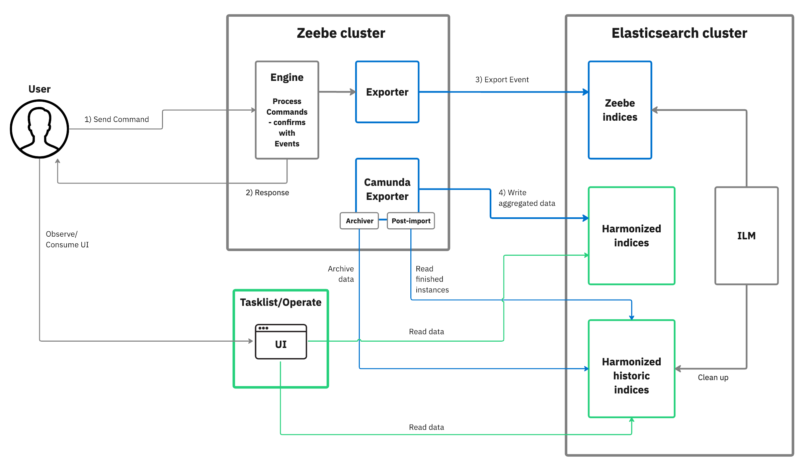
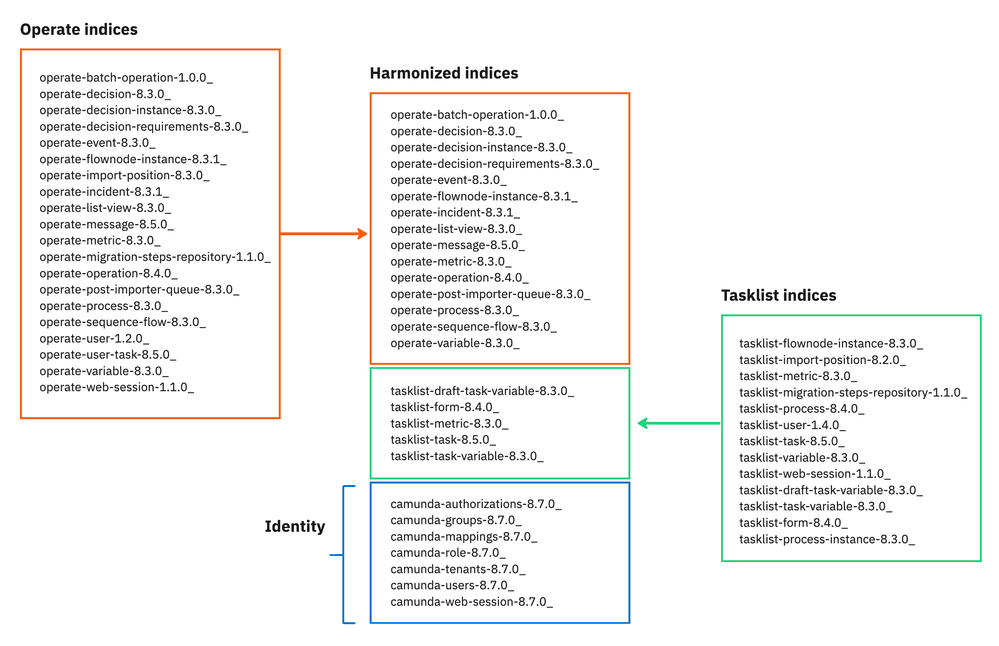

import DeployDiagramImg from '../img/deploy-diagram-modal.png';

Important changes and updates for the Camunda 8.8 release are summarized below.

| Scheduled release date | Scheduled end of maintenance | Release notes | Blog |
| :--------------------- | :--------------------------- | :------------ | :--- |
| 14 October 2025        | 13 April 2027                | -             | -    |

- [API updates](#api-updates-saasself-managed)
- [Identity management updates](#identity-management-updates-saasself-managed)
- [Installation and deployment updates](#installation-and-deployment-updates-self-managed)
- [Camunda Exporter](#camunda-exporter-self-managed)
- [Camunda Java client and Camunda Spring SDK](#camunda-java-client-and-camunda-spring-sdk-self-managed)

## API updates SaaSSelf-Managed

The 8.8 release includes API updates to support the move to a [Camunda 8 REST API](/apis-tools/camunda-api-rest/camunda-api-rest-overview.md) unified experience.

### Camunda 8 REST API updates

- New Query endpoints (with advanced search filtering) will be added for process entities (processes, decisions, user tasks, and forms). These will replace the component APIs (Tasklist, Operate) going forward.
- New endpoints will allow you to manage and query users and resource permissions in an orchestration cluster.
- All the Camunda 8 REST API endpoints will support resource-based authorizations to enable fine-grained permissions.
- API terminology is aligned so technical assets have an identical, easily-understood, descriptive property name.

### Deprecated: Operate and Tasklist v1 REST APIs

The deprecation process for the [Operate](/apis-tools/operate-api/overview.md) and [Tasklist](/apis-tools/tasklist-api-rest/tasklist-api-rest-overview.md) REST APIs starts with the 8.8 release. You can begin migrating to the [Camunda 8 REST API](/apis-tools/camunda-api-rest/camunda-api-rest-overview.md) for querying to prepare for this change.

- Version 8.9: These APIs are still available but deprecated, and so not recommended for new implementations.
- Version 8.10: These APIs will be removed.

### Deprecated: Job-based user tasks querying

With the 8.8 release, the deprecation process for **job-based** user tasks starts. As job-based user tasks will not be supported for querying and task management with Camunda 8.10, Camunda recommends using **Camunda user task** type (formerly known as **Zeebe user task**) in your process definitions. Note that you may still see references to **Zeebe user task** in your XML, but this is the same thing as Camunda user task.

- Version 8.9: **Job-based** user tasks are available for querying, but Camunda Modeler automatically applies the **Camunda user task** and shows a warning message for each job-based user task.
- Version 8.10: With the removal of the Tasklist REST API, **job-based** user tasks will no longer be supported for querying and task management. With Camunda 8.9+, customers can still use the **job-based** user tasks as standard jobs with headers to enable open architecture and composable solutions. For customers who require task lifecycle support and task querying, we recommend using the Camunda User Task type.

### Deprecated: Zeebe gRPC API endpoints

With the 8.8 release, Camunda announces the deprecation of several [Zeebe gRPC](/apis-tools/zeebe-api/grpc.md) endpoints for removal in 8.9.

- Key gRPC endpoints necessary for high-throughput and low-latency applications will remain available in the product to ensure peak performance for specific use cases
- The final list of retained gRPC endpoints will be confirmed with the 8.8 release.
- Selected endpoints will remain active, with others scheduled for removal in the 8.10 release.

### Removed: Tasklist GraphQL API

With the 8.8 release, the deprecated Tasklist GraphQL API will be removed from the product.

<!-- :::info
Learn more about these updates in Upcoming API Changes in Camunda 8.
::: -->

### Removed: Deprecated OpenAPI objects

:::warning
With the Camunda 8.8 release, deprecated API objects containing number keys have been removed, including the
corresponding `application/vnd.camunda.api.keys.number+json` content type header.
:::

In previous releases, entity keys were transitioned from `integer (int64)` to `string` types, and deprecated
`integer (int64)` keys were still supported. As of the 8.8 release, support for `integer (int64)` keys has been removed.

To update to Camunda 8.8, API objects using `integer (int64)` keys must be updated to use `string` keys and the
`application/json` header.

For more information about the key attribute type change, see
the [8.7 API key attributes overview][camunda8-api-overview].

[camunda8-api-overview]: /versioned_docs/version-8.7/apis-tools/camunda-api-rest/camunda-api-rest-overview.md#api-key-attributes

## Identity management updates SaaSSelf-Managed

The [Identity service](/self-managed/identity/what-is-identity.md) is enhanced to deliver greater flexibility, control, and security for both Self-Managed and SaaS users. These updates are part of our broader effort to streamline the platform’s architecture.

### Cluster-level identity management

Identity settings will be configured at the orchestration cluster level, allowing each cluster to have unique OIDC configurations. This cluster-specific setup empowers organizations to assign different identity providers (IdPs) across clusters, offering improved control over permissions and user group mappings, resulting in a more streamlined and efficient configuration experience.

For SaaS customers, identity management in Camunda 8.8 remains consistent with Camunda 8.7, allowing the attachment of a single IdP per organization. However, cluster-level identity capabilities are provided for SaaS as well as Self-Managed. This means that user groups, roles, and access permissions can now be managed at the cluster level, giving SaaS customers the same granular access control as in Self-Managed environments.

### Decoupling from Keycloak Self-Managed

Built-in Keycloak integration in Self-Managed is removed, allowing customers to use any compatible IdP.

- Keycloak remains fully supported as an external option. For cluster-level identity management it must be connected as an external OIDC provider moving forward.
- OpenID Connect (OIDC) remains the standard for seamless integration with chosen IdPs.

### Resource-based permissions

Resource-level permissions are introduced to control read and write permissions per specific resource.

- Admin users retain full access, but regular users must be granted specific permissions to perform operations or view resources.
- For organizations that build custom front-ends and access Camunda via API, users or Clients with API permissions can still access data through the V2 API, respecting their resource permissions.

<!-- :::info
Learn more about these updates in Introducing Enhanced Identity Management in Camunda 8.8.
::: -->

## Zeebe, Operate, Tasklist, and Identity must run on exact same minor and patch levels

From version `8.8.0` forward, the following core [Orchestration cluster](../../self-managed/reference-architecture/reference-architecture.md#orchestration-cluster) components must run on the exact same `minor`and `patch` level to ensure compatibility: Zeebe, Operate, Tasklist, and Identity. See the [component version matrix](../supported-environments.md#component-version-matrix) or the [Self-Managed reference architecture](../../self-managed/reference-architecture/reference-architecture.md#orchestration-cluster) for an overview of components.

## Installation and deployment updates Self-Managed

Camunda 8.8 introduces a streamlined architecture, consolidating core components such as Zeebe, Operate, Tasklist, Optimize, and Connectors into a single deployable unit. Enhanced deployment options are also included, such as new Kubernetes Helm guides, [deployment reference architectures](/self-managed/reference-architecture/reference-architecture.md), and improved support for local development with [Camunda 8 Run](/self-managed/setup/deploy/local/c8run.md).

You can download the alpha release of the unified package from the Camunda GitHub repository, either as an executable Java application (Camunda Orchestration Core) or a Docker image.

### Helm charts

If you are using the recommended Camunda 8 deployment option ([Helm charts](/self-managed/setup/install.md)), the upgrade path from version 8.7 to 8.8 will be straightforward by changing the values file to the new syntax.

New migration guides will also be provided to support you when migrating from a previous Camunda version.

:::caution
Additional upgrade considerations are necessary for deployments that use custom scripts, such as Docker containers, manual installations, or custom-developed Kubernetes deployments. For these deployments, customers can either continue to deploy with their original 8.7 topology and upgrade each component independently, or adopt our Helm chart approach for the upgrade, which allows for unifying the deployment into a single JAR or container executable.
:::

## Camunda Exporter Self-Managed

A new Camunda Exporter brings the importer and archiving logic of web components (Tasklist and Operate) closer to the distributed platform (Zeebe). The index schema is also being harmonized.

The exporter can consume Zeebe records (mostly events created by the engine), aggregate data, and store the related data into shared and harmonized indices.

- Data is archived in the background, coupled to the exporter but without blocking the exporter's progress.
- Indices can be located in either Elasticsearch (ES) or OpenSearch (OS). Our web components (Tasklist and Operate) then use the new harmonized indices to show data to the user.

The following diagram shows a simplified version of this work.

- For example, Tasklist and Operate Importers are still required for old data to be imported, but the Camunda exporter writes all new data into ES/OS. After old indices are drained, importers can be turned off.
- The archiver, which takes care of the archiving of completed process instances, will be moved into the Zeebe system as well, to reduce the installation complexity and provide a better scaling and replication factor (based on partitions).
- This helps achieve a streamlined architecture, and improves platform performance and stability (especially regarding ES/OS).
- A new separate component covers the migration, which will be part of the single application but can also deployed separately. It will adjust the previous Operate indices to make them more harmonized and usable by Tasklist.

### Harmonized index schema

Camunda is harmonizing our index structure and usage.

- This removes unnecessary duplications over multiple indices due to the previous architecture.
- With this change, several Operate indices can and will be used by Tasklist.
- New indices have been created to integrate Identity into the system.

<!-- :::info
Learn more about these updates in Streamlined Deployment with 8.7.
::: -->

## Camunda Java client and Camunda Spring SDK

With the Camunda 8.8 release, Camunda Java Client and Camunda Spring SDK replace the Zeebe Java client and Spring Zeebe SDK. This allows you to use a single consolidated client to interact with Camunda orchestration clusters.

The `CamundaClient` replaces the `ZeebeClient`, offering the same functionality and adding new capabilities.

:::note

- If you need to continue using the old `ZeebeClient`, you can use the version 8.6 artifact without any issues with newer cluster versions as the client is forward-compatible.
- The Zeebe Java client will not be developed further and only receives bug fixes while version 8.7 is officially supported.

:::

### Key changes

| Change                                          | Description                                                                                                                                                                                                                                                                                                        |
| :---------------------------------------------- | :----------------------------------------------------------------------------------------------------------------------------------------------------------------------------------------------------------------------------------------------------------------------------------------------------------------- |
| New package structure                           | Package `io.camunda.client`: Contains the new `CamundaClient` and all 8.7 features.                                                                                                                                                                                                                                |
| Refactored properties and environment variables | 
<ul><li>
All old Java client property names are refactored to more general ones. For example, `zeebe.client.tenantId` to `camunda.client.tenantId`.
</li><li>
Similarly, environment variables are renamed following the same concept: `ZEEBE_REST_ADDRESS` to `CAMUNDA_REST_ADDRESS`.
</li></ul>
 |
| Artifact ID change                              | The `artifactId` changes from `zeebe-client-java` to `camunda-client-java`.                                                                                                                                                                                                                                        |
