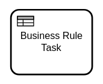

A business rule task is used to model the evaluation of a business rule; for example, a decision
modeled in [DMN](https://www.omg.org/dmn/) (Decision Model and Notation).



Business rule tasks behave **exactly** like [service tasks](../service-tasks/service-tasks.md). Both
task types are based on jobs and [job workers](../../../product-manuals/concepts/job-workers.md).
The differences between these task types are the visual representation (i.e. the task marker) and
the semantics for the model.

When a process instance enters a business rule task then it creates a corresponding job and wait for
its completion. A job worker should request jobs of this job type and process them. When the job is
completed then the process instance continues.

:::info 

Jobs for business rule tasks are not processed by Zeebe itself. In order to process them, you need
to provide a job worker.

:::

## Defining a task

A business rule task must define a [job type](../service-tasks/service-tasks#task-definition). It
specifies the type of job that workers should subscribe to (e.g. `DMN`).

Use [task headers](../service-tasks/service-tasks#task-headers) to pass static parameters to the job
worker (e.g. the key of the decision to evaluate).

Define [variable mappings](../service-tasks/service-tasks#variable-mappings) to transform the
variables that are passed to the job worker, or to customize how the variables of the job are merged
in the process instance.

## Additional resources


:::tip Community Extension

Have a look at the [Zeebe DMN Worker](https://github.com/camunda-community-hub/zeebe-dmn-worker).
It's a community extension that provides a job worker to evaluate DMN decisions. You can run it, or
use it as a blueprint for your own job worker.

:::

### XML Representation
A business rule task with a custom header:

```xml
<bpmn:businessRuleTask id="calculate-risk" name="Calculate risk">
  <bpmn:extensionElements>
    <zeebe:taskDefinition type="DMN" />
    <zeebe:taskHeaders>
      <zeebe:header key="decisionRef" value="risk" />
    </zeebe:taskHeaders>
  </bpmn:extensionElements>
</bpmn:businessRuleTask>
```

### References

- [Job handling](/product-manuals/concepts/job-workers.md)
- [Variable mappings](/product-manuals/concepts/variables.md#inputoutput-variable-mappings)
