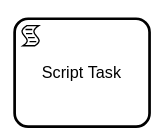

A script task is used to model the evaluation of a script, for example, a script written in Groovy,
JavaScript, or Python.



Script tasks behave **exactly** like [service tasks](../service-tasks/service-tasks.md). Both task
types are based on jobs and [job workers](../../../product-manuals/concepts/job-workers.md). The
differences between these task types are the visual representation (i.e. the task marker) and the
semantics for the model.

When a process instance enters a script task then it creates a corresponding job and wait for its
completion. A job worker should request jobs of this job type and process them. When the job is
completed then the process instance continues.

:::info 

Jobs for script tasks are not processed by Zeebe itself. In order to process them, you need to
provide a job worker.

:::

## Defining a task

A script task must define a [job type](../service-tasks/service-tasks#task-definition). It specifies
the type of job that workers should subscribe to (e.g. `script`).

Use [task headers](../service-tasks/service-tasks#task-headers) to pass static parameters to the job
worker (e.g. the script to evaluate).

Define [variable mappings](../service-tasks/service-tasks#variable-mappings) to transform the
variables that are passed to the job worker, or to customize how the variables of the job are merged
in the process instance.

## Additional resources


:::tip Community Extension

Have a look at
the [Zeebe Script Worker](https://github.com/camunda-community-hub/zeebe-script-worker). It's a
community extension that provides a job worker to evaluate scripts. You can run it, or use it as a
blueprint for your own job worker.

:::

### XML Representation
A script task with a custom header:

```xml
<bpmn:scriptTask id="calculate-sum" name="Calculate sum">
  <bpmn:extensionElements>
    <zeebe:taskDefinition type="script" />
    <zeebe:taskHeaders>
      <zeebe:header key="language" value="javascript" />
      <zeebe:header key="script" value="a + b" />
    </zeebe:taskHeaders>
  </bpmn:extensionElements>
</bpmn:scriptTask>
```

### References

- [Job handling](/product-manuals/concepts/job-workers.md)
- [Variable mappings](/product-manuals/concepts/variables.md#inputoutput-variable-mappings)
