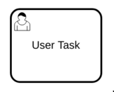

A user task is used to model work that needs to be done by a human actor. When
the process execution arrives at such a user task, a new job similar to a
[service task](../service-tasks/service-tasks) is created. The process instance
stops at this point and waits until the job is completed.



Applications like [Tasklist] can be used by humans to complete these tasks.
Alternatively, a job worker can subscribe to the job type
`io.camunda.zeebe:userTask` to complete the job manually.

When the job is completed, the user task gets completed and the process
instance continues.

## User Task Forms

User tasks support specifying a `formKey` attribute, using the
`zeebe:formDefinition` extension element. The form key can be used to specify
an identifier to associate a form to the user task. [Tasklist] supports
embedded [Camunda Forms](/product-manuals/tasklist/userguide/camunda-forms.md),
these can be embedded into the BPMN process XML as an `zeeb:UserTaskForm`
extension element of the process element.

## Variable mappings

By default, all job variables are merged into the process instance. This
behavior can be customized by defining an output mapping at the service task.

Input mappings can be used to transform the variables into a format that is
accepted by the job worker.

## Task headers

A user task can define an arbitrary number of `taskHeaders`. They are static
metadata that are handed to workers along with the job. The headers can be used
as configuration parameters for the worker.


## Additional resources

### XML Representation
A user task with a user task form:

```xml
<bpmn:process id="controlProcess" name="Control Process" isExecutable="true">
  <bpmn:extensionElements>
    <zeebe:userTaskForm id="userTaskForm_2g7iho6">
      <!-- Task Form Content -->
    </zeebe:userTaskForm>
  </bpmn:extensionElements>
  <bpmn:userTask id="Activity_025dulo" name="Configure">
    <bpmn:extensionElements>
      <zeebe:formDefinition formKey="camunda-forms:bpmn:userTaskForm_2g7iho6" />
    </bpmn:extensionElements>
  </bpmn:userTask>
</bpmn:process>
```

### References

- [Tasklist]
- [Job handling](/product-manuals/concepts/job-workers.md)
- [Expressions](/product-manuals/concepts/expressions.md)
- [Variable mappings](/product-manuals/concepts/variables.md#inputoutput-variable-mappings)
- [Incidents](/product-manuals/concepts/incidents.md)


[Tasklist]: /product-manuals/tasklist/introduction.md
