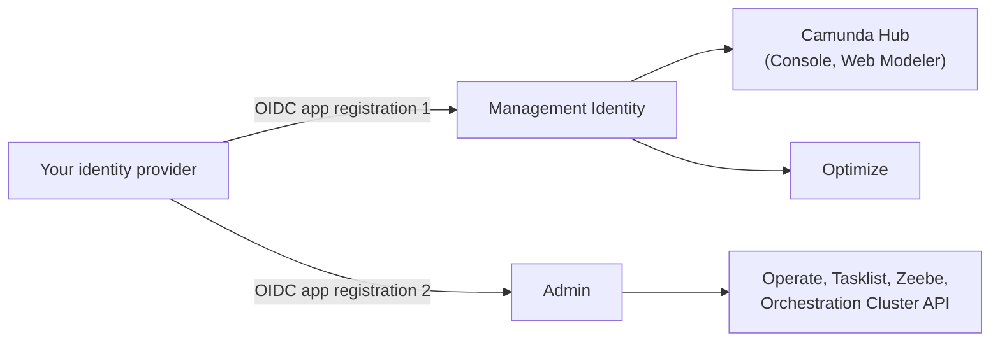
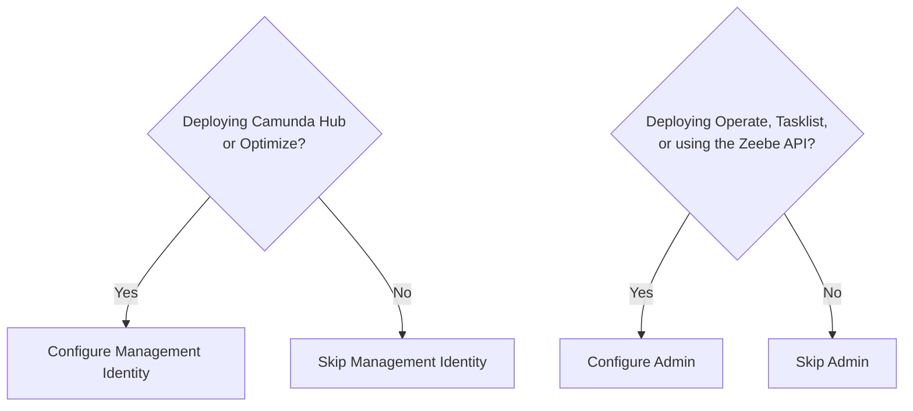

import DocCardList from '@theme/DocCardList';

Camunda Self-Managed uses two separate identity subsystems.

Understanding which one controls what will save you from a common class of misconfiguration — connecting your identity provider (IdP) to one system but not the other, then wondering why some components authenticate but others don't.

## The two identity subsystems

| Subsystem                                                                           | Governs                                                                                                                                | Controls                                                                                                                                                                 |
| :---------------------------------------------------------------------------------- | :------------------------------------------------------------------------------------------------------------------------------------- | :----------------------------------------------------------------------------------------------------------------------------------------------------------------------- |
| **[Management Identity](/self-managed/components/management-identity/overview.md)** | [Camunda Hub](/self-managed/components/hub/index.md) (Console, Web Modeler), [Optimize](/self-managed/components/optimize/overview.md) | Who can log in, organization/project membership, role assignments                                                                                                        |
| **[Admin](/self-managed/components/orchestration-cluster/admin/overview.md)**       | Operate, Tasklist, Zeebe, Orchestration Cluster API (per cluster)                                                                      | Who can log in, role assignments, M2M credentials, fine-grained resource-level authorizations (for example, access to specific process definitions, decisions, or tasks) |

For the full breakdown, see [Admin vs Management Identity](/self-managed/reference-architecture/reference-architecture.md#admin-vs-management-identity).

In most deployments, both subsystems share the same IdP — you create a separate OIDC application registration for each subsystem, but manage users in one place at the IdP level.

## Background: the 8.8 identity split

Before Camunda 8.8, [Management Identity](/self-managed/components/management-identity/overview.md) (then called just "Identity") managed access for every component, including Zeebe, Operate, and Tasklist. That release split it in two: the [Orchestration Cluster](/self-managed/reference-architecture/reference-architecture.md#orchestration-cluster) began managing its own authentication and authorization internally, through [Admin](/self-managed/components/orchestration-cluster/admin/overview.md) (formerly called Orchestration Cluster Identity). See [Identity, authentication, and authorization](/reference/announcements-release-notes/880/whats-new-in-88.md#identity) for the full migration details.

:::note Console role changes stop working after upgrade
This split is the root cause behind one of the most common sources of post-upgrade confusion: role and authorization changes made in Console no longer affect an already-migrated cluster. Existing roles and authorizations are migrated automatically during the upgrade, but from that point on, the cluster's authorizations live in Admin — not in Management Identity or Console. If you change a role in Console expecting it to affect Operate or Tasklist access, it won't. Make that change in Admin instead.
:::

## What you need to configure

If you are deploying the full Camunda Self-Managed stack, you configure both subsystems, in this order:

1. **Management Identity first** — configure your IdP connection and verify users can log in to Camunda Hub.
2. **Admin second** — configure a separate IdP application registration and verify users can log in to Operate and Tasklist.

If you are deploying only the Orchestration Cluster (Operate, Tasklist, Zeebe) without the management plane, you only need to configure Admin.

Most full deployments configure both.

## Key terms

| Term          | Meaning                                                                                                                                   |
| :------------ | :---------------------------------------------------------------------------------------------------------------------------------------- |
| Client ID     | The identifier your IdP assigns to an OIDC application registration. Camunda needs one per subsystem.                                     |
| Client secret | The credential your IdP issues alongside the client ID. Treat it as a password.                                                           |
| Issuer URL    | The base URL of your IdP's OIDC authorization server. Camunda uses this to discover token and JWKS endpoints.                             |
| Redirect URI  | The URL Camunda registers with your IdP so the IdP knows where to send users after authentication.                                        |
| Scopes        | The OIDC permission sets Camunda requests from your IdP (typically `openid profile email`).                                               |
| Claims        | The fields in the ID token your IdP returns. Camunda reads specific claims (like `sub`, `email`, `preferred_username`) to identify users. |
| JWKS endpoint | The URL your IdP exposes to publish its public signing keys. Camunda uses this to validate token signatures.                              |

## Next steps

<DocCardList items={[
{
type: "link",
href: "../../management-identity/configuration/connect-to-an-oidc-provider",
label: "Connect Management Identity to an identity provider",
description: "Configure OIDC for Camunda Hub and Optimize.",
},
{
type: "link",
href: "../../orchestration-cluster/admin/connect-external-identity-provider",
label: "Connect Admin to an identity provider",
description: "Configure OIDC for Operate, Tasklist, and the Zeebe API.",
}
]}/>
