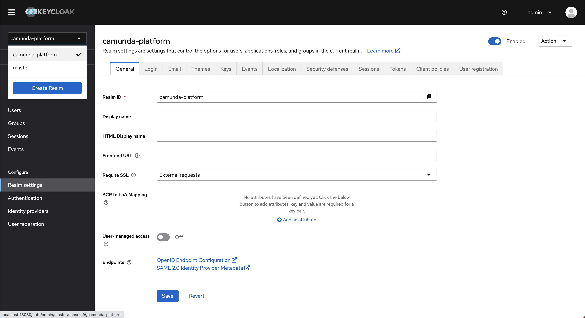
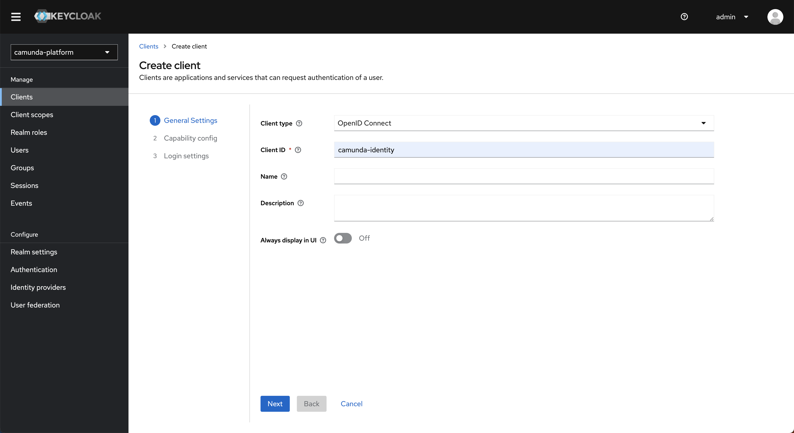
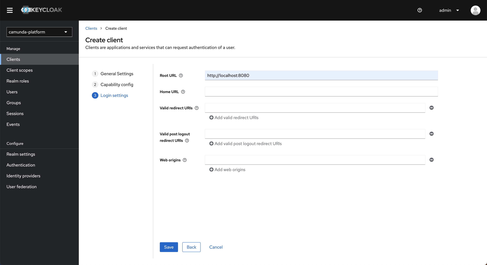

import Tabs from "@theme/Tabs";
import TabItem from "@theme/TabItem";

This guide describes how to connect Management Identity to your existing Keycloak instance.

## Prerequisites

- Access to your [Keycloak Admin Console](https://www.keycloak.org/docs/latest/server_admin/#using-the-admin-console)
- A basic understanding of [administering realms and clients](https://www.keycloak.org/docs/latest/server_admin/#assembly-managing-clients_server_administration_guide) in Keycloak

:::note
Clients in Camunda 8 SaaS and applications in Camunda 8 Self-Managed serve a similar purpose. One key difference is that for Camunda 8 SaaS, you can set up specific [client connection credentials](/components/console/manage-clusters/manage-api-clients.md#create-a-client), whereas in Management Identity, an application is created with credentials automatically assigned.
:::

## Steps

:::caution Keycloak URLs
As of version 8.5.3, Management Identity uses the Keycloak frontend URL instead of the backend URL. This change may affect you if the frontend URL is blocked from other services (including Camunda applications) and could impact Management Identity functionality.

To avoid connectivity issues, ensure your Keycloak frontend URL is accessible by adjusting your network, firewall, or security settings as needed. This adjustment is crucial to maintain the integration with Keycloak and ensure compatibility.
:::

To connect Management Identity to an existing Keycloak instance, take the following steps for your Camunda installation.

### Prepare an existing Keycloak realm

Management Identity can either create a Keycloak realm called `camunda-platform` with all settings from scratch, or it can use an already existing Keycloak realm. If you would like to use an existing Keycloak realm, prepare following the steps below. Otherwise you can skip this section.

1. Log in to your Keycloak Admin Console.
1. Select the realm you want to connect Management Identity to (for example, **camunda-platform**).  
   
   :::warning
   Management Identity only supports Keycloak realms where the realm name and realm ID are the same value.  
   This is not the case for realms created through the Keycloak UI (where the ID becomes a generated value).  
   You can specify both name and ID when using [Keycloak's JSON import feature](https://www.keycloak.org/server/importExport).
   :::
1. In the navigation menu, select **Clients**, then click **Create**.
1. Enter a client ID and click **Next**.
   :::note What client ID should I use?
   By default, Management Identity uses the client ID `camunda-identity`.  
   If you use a different ID, set it in the Management Identity application [environment variables](/self-managed/components/management-identity/miscellaneous/configuration-variables.md).
   :::
   
1. Turn **Client authentication** on, select **Service accounts roles**, and click **Next**.
   
1. In the **Root URL** field, enter the URL where your Management Identity instance will be hosted, then click **Save**.
   
1. Open the created client, then select the **Service account roles** tab.
   
1. Click **Assign role**, then change the filter to **Filter by clients**.
   
1. Select the `manage-clients`, `manage-realm`, and `manage-users` roles, then click **Assign**.
   :::note Why does Management Identity need these roles?
   Management Identity allows users to manage entities related to Camunda.  
   These roles provide the necessary access to the Keycloak realm.
   :::
1. Open the **Credentials** tab and copy the client secret.

### Configure and start the application

Configure Management Identity with the following environment variables:

1. `IDENTITY_CLIENT_ID`: The ID of the client you created (or `camunda-identity` if you let Management Identity create it automatically).
1. `KEYCLOAK_REALM`: The realm name you want to use (or `camunda-platform` if using the default).
1. `KEYCLOAK_SETUP_USER`: The username of an administrative Keycloak user.
1. `KEYCLOAK_SETUP_PASSWORD`: The password for the administrative user.

:::tip
If you use a non-default realm, you need to set additional Keycloak-specific variables.  
See [environment variables](/self-managed/components/management-identity/miscellaneous/configuration-variables.md) for details.
:::

Start the Management Identity application.

:::note What does Management Identity create when starting?
When starting, Management Identity creates a base configuration required for operation.  
See [starting configuration](/self-managed/components/management-identity/miscellaneous/starting-configuration.md) for details.
:::

:::tip Helm chart setup
To run a full Camunda cluster with an existing Keycloak instance, see  
[Helm chart setup for existing Keycloak](/self-managed/deployment/helm/configure/authentication-and-authorization/external-keycloak.md#create-a-secret).
:::

## Considerations

When connecting Management Identity to a shared realm, accurately determining what clients should and should not be displayed in the UI is not possible. Therefore, the clients in the realm you connect Management Identity to will be shown in the UI and can have their secrets viewed and updated. Users with access to Management Identity should be considered as having administrator-level access to the system.
