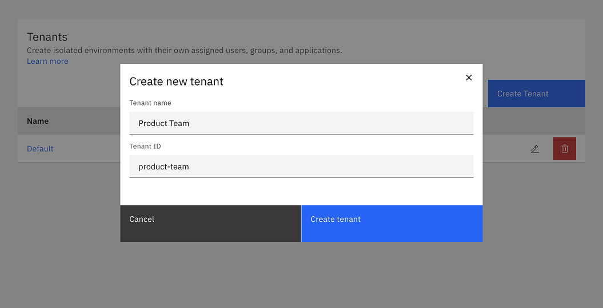
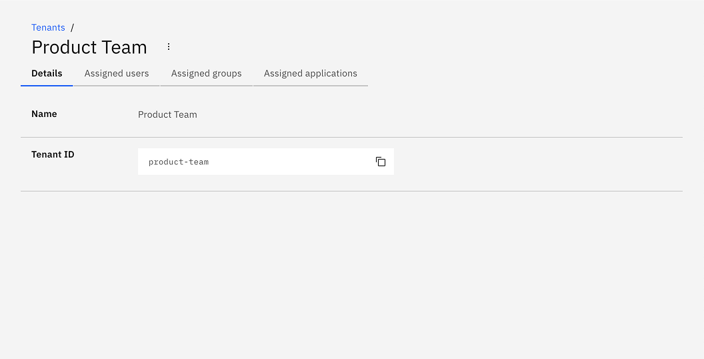
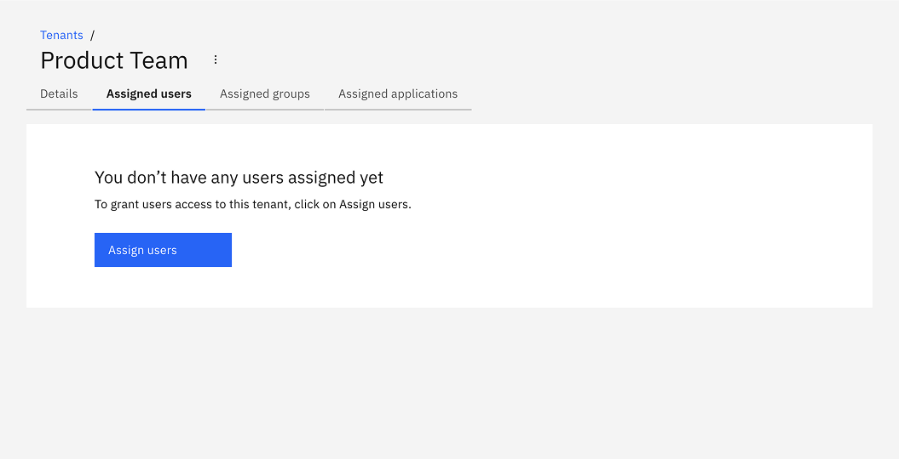
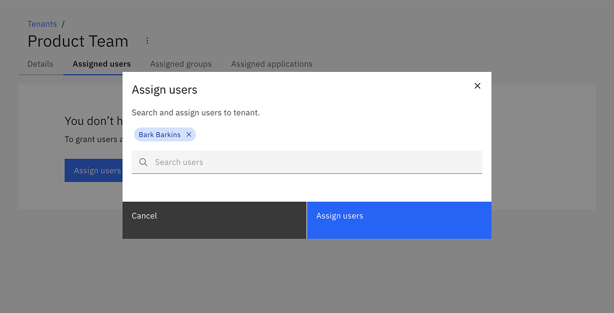
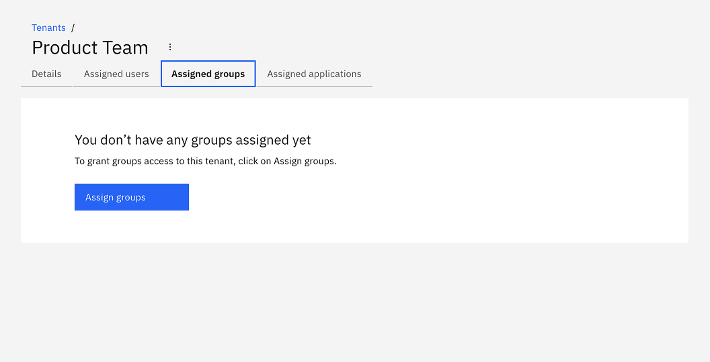
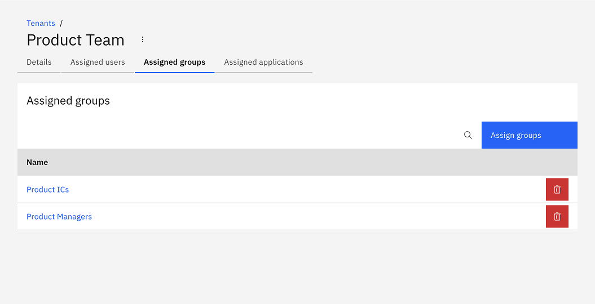
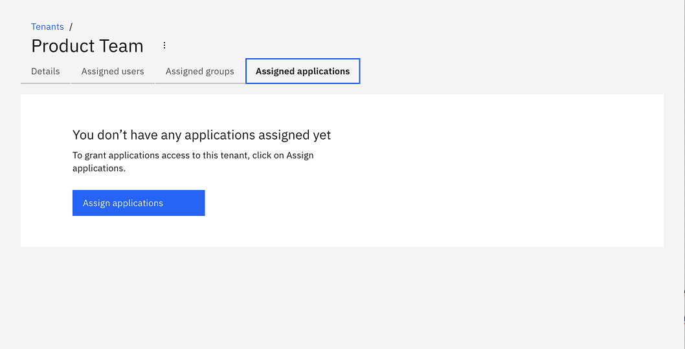
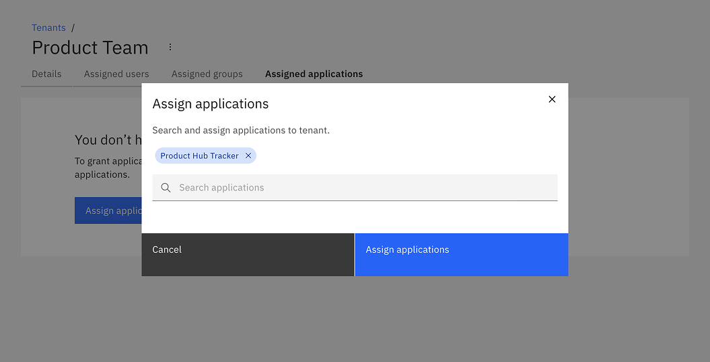
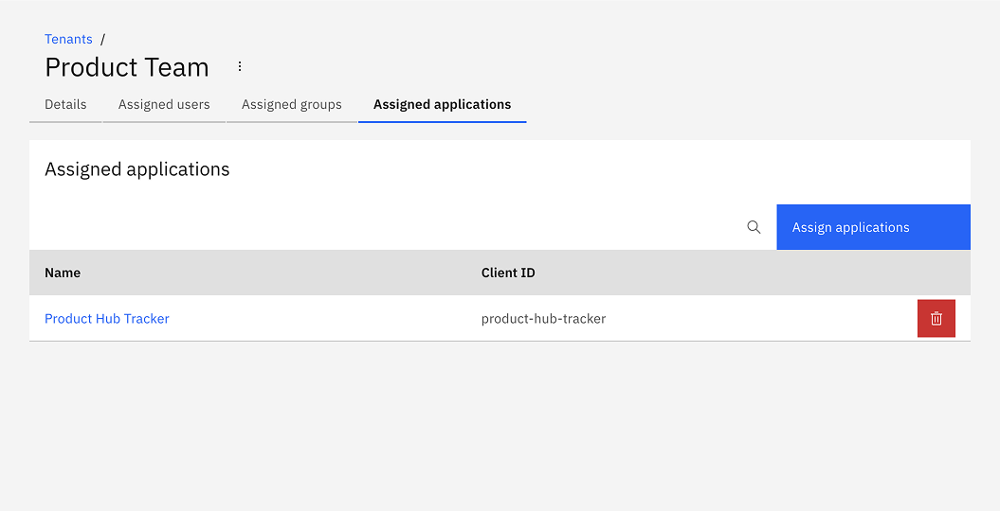

Multi-tenancy in Camunda 8 allows a single installation to host multiple tenants — such as departments, teams, or external clients — while maintaining per-tenant isolation of data and processes in a shared environment. To learn more, refer to the [multi-tenancy concepts](/components/concepts/multi-tenancy.md).

Tenants managed within Management Identity apply **only to Optimize**, allowing you to isolate data access for reports and dashboards.

If you are using multi-tenancy for an Orchestration Cluster, you can also enable and configure tenants in Management Identity to ensure data isolation in Optimize. For information on managing tenants for the Orchestration Cluster, see the [Orchestration Cluster tenants documentation](/components/identity/tenant.md).

## Enabling multi-tenancy for Optimize

**Precondition**: Multi-tenancy is disabled by default. To enable multi-tenancy for Optimize, you must:

1. Enable [`MULTITENANCY_ENABLED` feature flag](/self-managed/components/management-identity/miscellaneous/configuration-variables.md#feature-flags).
2. [Configure a database](/self-managed/components/management-identity/miscellaneous/configuration-variables.md#database-configuration).

## Create a tenant

:::note
A `<default>` tenant is automatically created during Identity startup.
:::

1. Log in to Management Identity and navigate to the **Tenants** tab.

   

2. Click **Create Tenant** and a modal will open.

3. Enter a name and ID for the tenant, and click **Create tenant**:

   

   On creation, the modal closes and the table updates with your new tenant.

4. Click on your new tenant to view the details:

   

## Tenant assignments

You can assign [users, groups and applications](./application-user-group-role-management/identity-application-user-group-role-management-overview.md) to a tenant as follows:

### Assign users to a tenant

1. Click **Assigned users** to view the users assigned to the tenant, and click **Assign users**:

   

1. Search and select the users to assign to the tenant. After selecting the users, click **Assign users**:

   

   On confirmation, the modal closes, the table updates, and the assigned users are shown:

   

### Assign groups to a tenant

1. Click **Assigned groups** to view the groups assigned to the tenant, and click **Assign groups**:

   

1. Search and select the groups to assign to the tenant. After selecting the groups, click **Assign groups**:

   

   On confirmation, the modal closes, the table updates, and the assigned groups are shown:

   

### Assign applications to a tenant

1. Click **Assigned applications** to view the applications assigned to the tenant, and click **Assign applications**:

   

1. Search and select the applications to assign to the tenant. After selecting the applications, click **Assign applications**:

   

   On confirmation, the modal closes, the table updates, and the assigned applications are shown:

   
