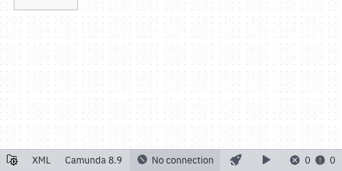
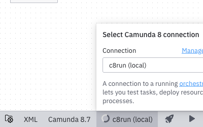
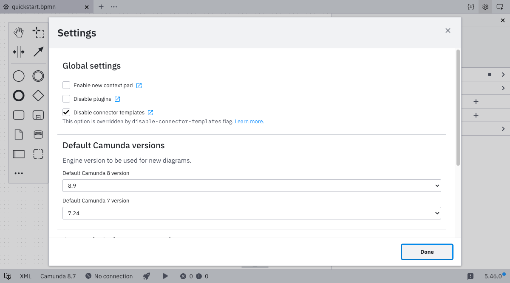
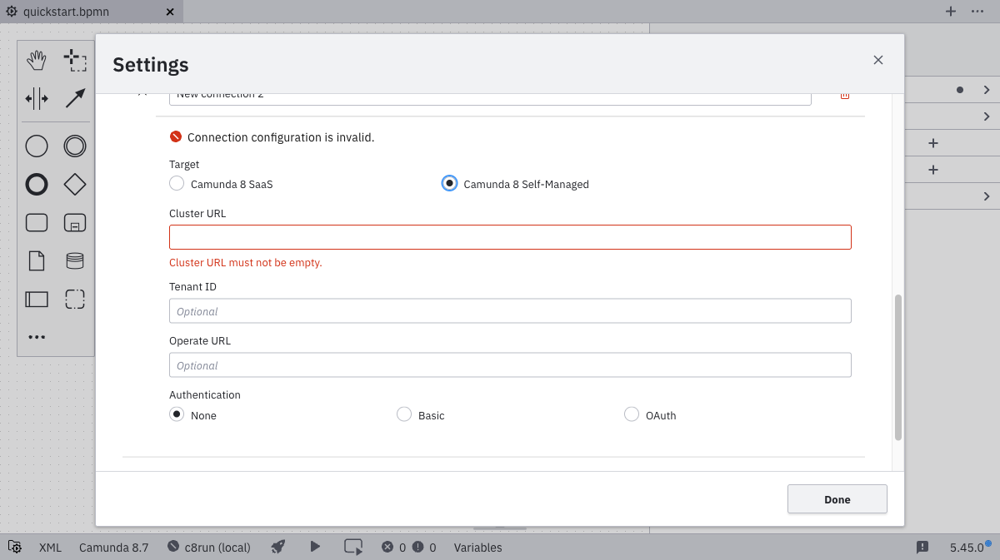
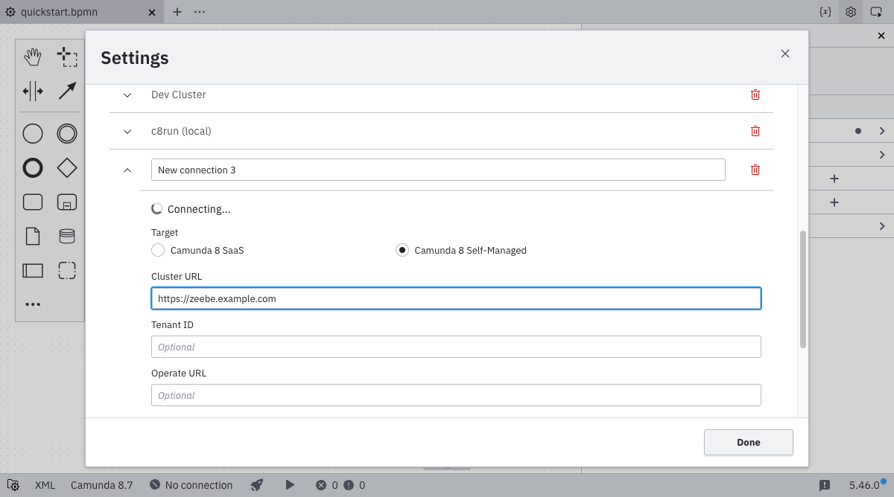
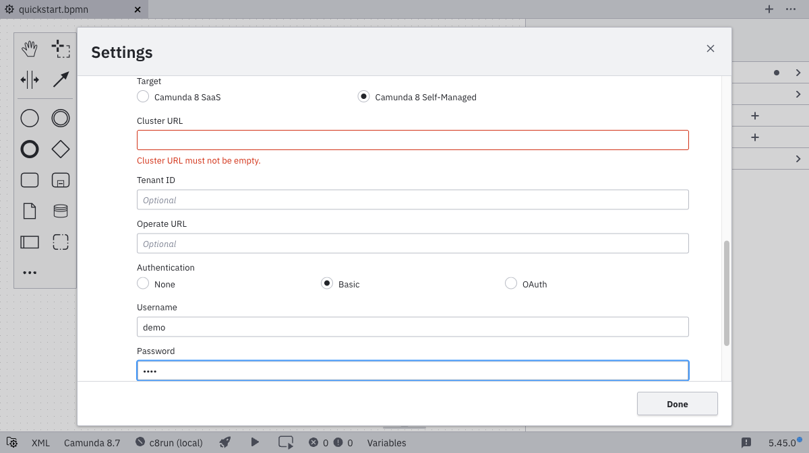
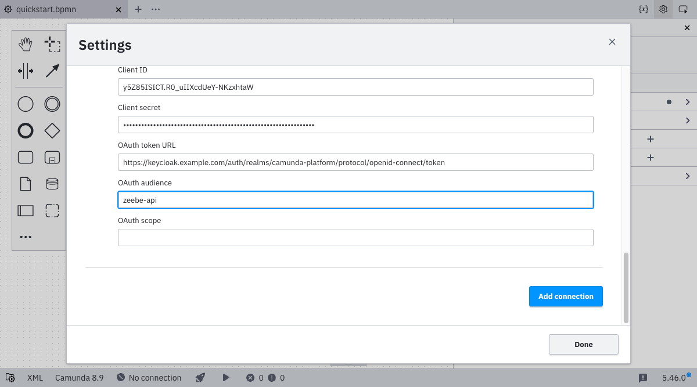
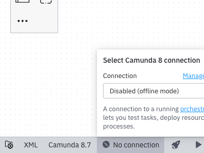

import Tabs from "@theme/Tabs";
import TabItem from "@theme/TabItem";

Desktop Modeler can directly deploy diagrams and start process instances in Camunda 8 Self-Managed. Follow the steps below to set up a connection.

1. Click on the **connection manager**. For new installations, this will show **No connection**. If you have previously selected a connection, it will show the name of that connection.

   

2. To add a new connection, go to settings. You can either open the connection manager and click **Manage connections** or open the settings directly (`Cmd/Ctrl + ,`).

   By default, a local c8run connection is already configured. If you have previously used Desktop Modeler to deploy a diagram, that connection will also be available as **Unnamed Connection**. You can rename this connection to something more descriptive in the connection manager settings.

   

3. Click **Add connection**.
   

4. Select **Camunda 8 Self-Managed** as the target.

   

5. Input the **Cluster URL**, and optionally the **Tenant ID** and **Operate URL**.
   :::note
   You can connect to Camunda 8 both securely and insecurely through the `https` and `http` protocols.

   Secured connections to a remote endpoint will only be established if the remote server certificate is trusted by the app. Ensure that root and intermediate certificates you trust are [are known to the app](/components/modeler/desktop-modeler/flags/flags.md#zeebe-ssl-certificate).
   :::

   :::caution

   Multi-tenancy is only available with authentication enabled through [Orchestration Cluster Identity](../../orchestration-cluster/identity/overview.md).

   :::

   

6. Select your authentication method, and input the required credentials.

   <Tabs groupId="auth" defaultValue="basic" queryString values={
   [
   {label: 'Basic', value: 'basic' },
   {label: 'OAuth', value: 'oauth' }
   ]}>

   <TabItem value='basic'>

   For **basic authentication**, input your username and password.

   

   </TabItem>

   <TabItem value='oauth'>

   For **OAuth**, input the credentials for your OAuth provider. These are configured as part of the default [Helm installation](/self-managed/deployment/helm/install/quick-install.md) and can be discovered in [Orchestration Cluster Identity](/self-managed/components/orchestration-cluster/identity/overview.md), or are set by Zeebe [environment variables](/self-managed/components/orchestration-cluster/zeebe/security/client-authorization.md#environment-variables).

   :::note
   When using Modeler to deploy a process model or start a process instance, you may run into issues with [resource authorizations](/components/concepts/access-control/authorizations.md). Make sure your [client](/components/identity/client.md) has the right authorizations assigned to it.
   :::

   

   | Name            | Description                             | Example value                                                                            |
   | --------------- | --------------------------------------- | ---------------------------------------------------------------------------------------- |
   | Client ID       | The name of your Zeebe client.          | `zeebe`                                                                                  |
   | Client secret   | The password of your Zeebe client.      | `zecret`                                                                                 |
   | OAuth token URL | The full path to the token endpoint.    | `https://<keycloak base url>/auth/realms/camunda-platform/protocol/openid-connect/token` |
   | OAuth audience  | The permission name for Zeebe.          | `zeebe.example.com`                                                                      |
   | OAuth scope     | The permissions available to the token. | `Zeebe,Tasklist,Operate`                                                                 |

   </TabItem>
   </Tabs>

   If the connection is established successfully, you can leave the settings and go back to the **connection manager**, where your new connection is now available.

7. Select the connection you just created to use it for [deployment](./deploy-to-self-managed.md) or other tools like [task testing](../../../../components/modeler/desktop-modeler/task-testing.md) or [starting a new process instance](../../../../components/modeler/desktop-modeler/start-instance.md):

   
   :::note
   As a next step, [deploy your diagram](./deploy-to-self-managed.md).
   :::
