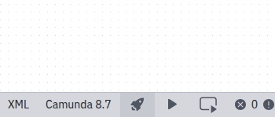
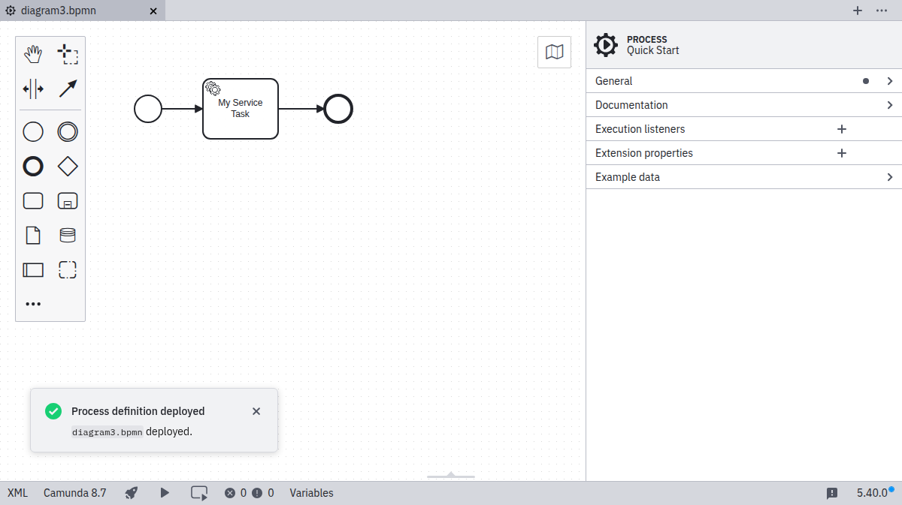

import Tabs from "@theme/Tabs";
import TabItem from "@theme/TabItem";

Desktop Modeler can directly deploy diagrams and start process instances in Camunda 8 Self-Managed. Follow the steps below to deploy a diagram:

1. Ensure you have already [set up a connection](./connect-to-self-managed.md) and selected it.

   

2. Click the **Deploy** icon:

   

3. Click **Deploy** to perform the actual deployment:

   

4. If the deployment is successful, you will see a confirmation message:

   
