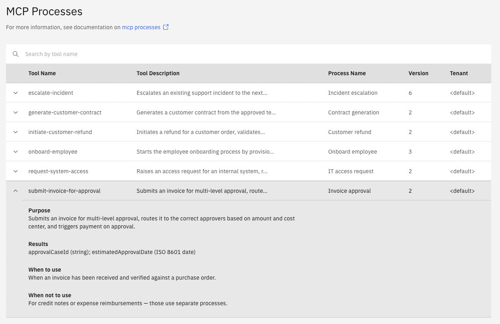

The Orchestration Cluster admin UI provides an overview of the processes currently registered as MCP tools in the [Processes MCP Server](/apis-tools/processes-mcp/processes-mcp-overview.md).

## View registered MCP processes

Navigate to **MCP Processes** in the Orchestration Cluster admin UI to see all processes currently exposed as MCP tools.

The following information is displayed for each registered process:

| Column               | Description                                                                                       |
| :------------------- | :------------------------------------------------------------------------------------------------ |
| **Tool name**        | The MCP tool identifier configured in the MCP start event element template.                       |
| **Tool Description** | The plain-language description of the tool's function, as configured in the MCP start event.      |
| **Process Name**     | The name of the BPMN process registered as an MCP tool.                                           |
| **Version**          | The process definition version currently registered. Only the latest deployed version is exposed. |
| **Tenant**           | The tenant the process belongs to.                                                                |

## Troubleshoot

- **A process is not appearing after deployment**: Verify that the process was deployed successfully and that the MCP start event element template is applied to the start event. Check for deployment errors in Operate.
- **A process shows an unexpected version:** The Processes MCP Server always exposes the latest deployed version. If a previous version is showing, a newer deployment may have failed. See [version binding](/apis-tools/processes-mcp/processes-mcp-version-binding.md) for more details.
