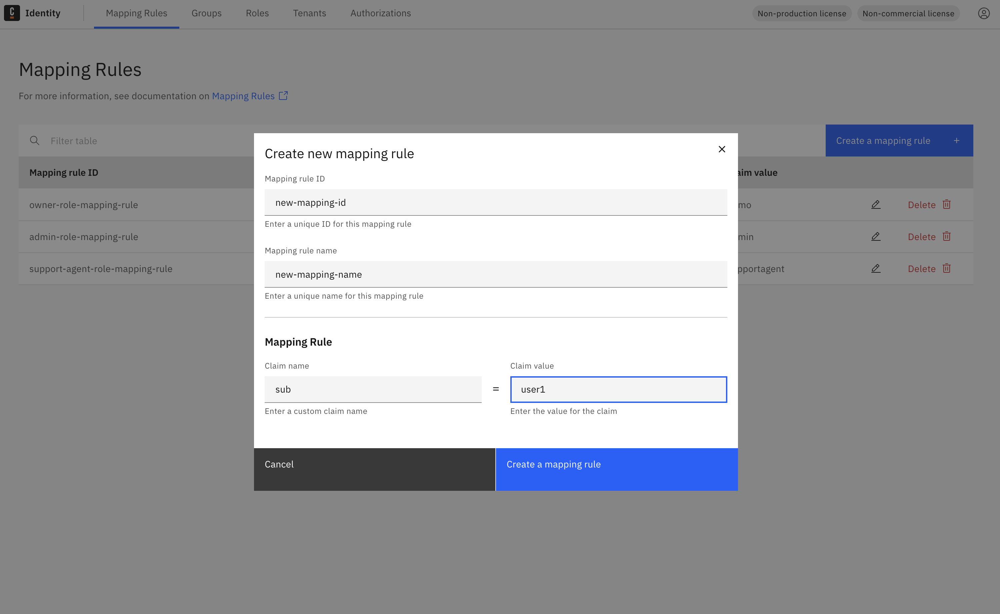
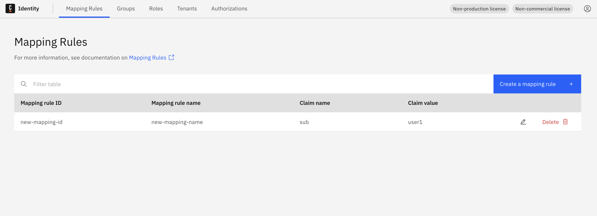
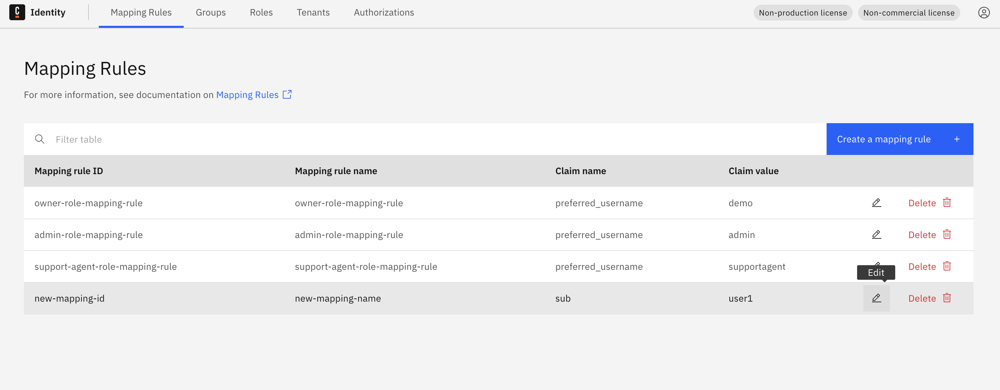
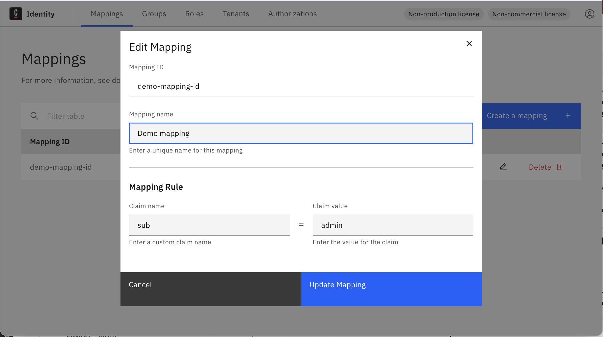
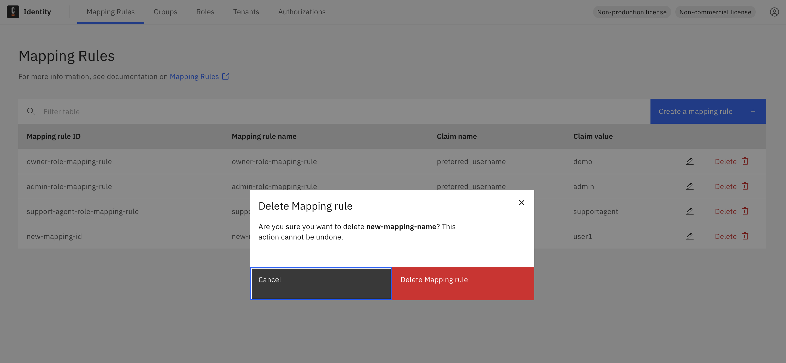

import Tabs from "@theme/Tabs";
import TabItem from "@theme/TabItem";

In this guide, you will learn how to manage mapping rules in Identity and how to control the Camunda entities related to them.

:::tip
To learn more about the concept of mapping rules, see the [mapping rules documentation](../../../../concepts/mapping-rules.md).
:::

1. Log in to the Identity UI and navigate to the **Mapping Rules** tab.

<Tabs groupId="mappingRuleAction" defaultValue="add" queryString values={[
{label: 'Add', value: 'add'},
{label: 'Update', value: 'update'},
{label: 'Delete', value: 'delete'}
]}>

<TabItem value="add">

1. Click the **Create a mapping rule** button.

2. Fill in the required fields:

- **Mapping Rule ID**: A unique identifier for the mapping rule.
- **Mapping Rule name**: A user-friendly name.
- **Claim name** and **Claim value**: These define the JWT claim rule to match.

3. Click **Create a mapping rule** to save.

The new mapping rule will appear in the list.

</TabItem>

<TabItem value="update">

1. Click the **pencil** icon in the mapping rule row you want to edit.

2. Update the desired fields and click **Update Mapping Rule**.

</TabItem>

<TabItem value="delete">

1. Click the **trash can** icon on the row of the mapping rule you want to delete.

2. Confirm the deletion in the pop-up.

After confirming, the rule is deleted and disappears from the table.

</TabItem>

</Tabs>
