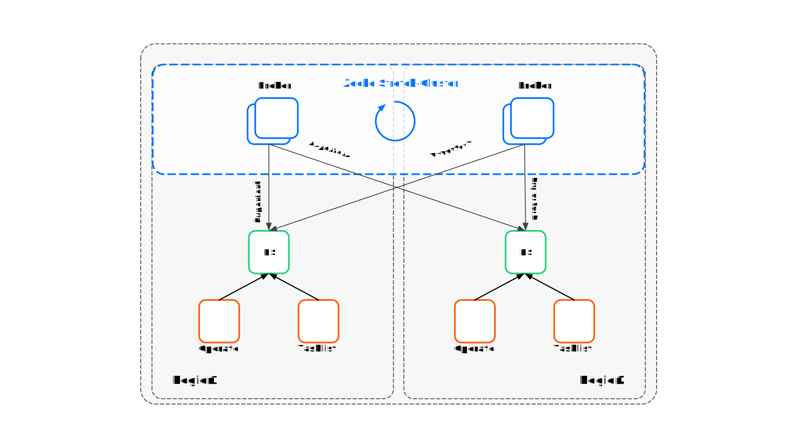

## Introduction

Camunda introduced compatibility with a dual-region setup. This allows the Camunda Platform to run in a mix of active-active and active-passive setups. The following will explore the setup, benefits, limitations, and how to proceed in the unfortunate event of a total region loss, focusing on a dual-region setup.

## Disclaimer

:::danger

- Customers must develop and test operational procedures in non-production environments based on the framework steps outlined by Camunda.
- Before advancing to production go-live, it is essential for customers to validate these procedures with Camunda.

:::

## Architecture

<!--

-->

When discussing a dual-region setup, we must consider that not every component can be active-active.
When looking at the Camunda Platform, we have the following components:

- Zeebe (Workflow Engine)
- ElasticSearch (Database)
- Operate
- Tasklist
- Connectors

### Definitions

Active-active and active-passive are common setups used in dual region configurations to ensure that applications remain available and operational in case of failures.

In an active-active setup, multiple application instances run simultaneously in different regions, actively handling user requests. This allows for better load balancing and fault tolerance, as traffic can spread across regions. If one region fails, the workload can shift to another without causing disruptions.

In contrast, an active-passive setup designates one region as the main or active region where all user requests are processed. The other region remains on standby until needed, only becoming active if the primary region fails. This setup is easier to manage but may result in higher delays during failover events.

### Zeebe

Zeebe, as a workflow engine, is fully active-active and replicates data between its brokers. Due to its replication logic, it can handle an entire region failure without data loss. Requiring a proper partition and replication setup.

### ElasticSearch

We treat ElasticSearch as an active-passive component. While it may be possible to deploy it in active-active mode and stretch across regions, it's not officially documented by ElasticSearch. Such a setup generally brings its own challenges along that we can't control and may negatively impact the performance of Zeebe.

We go with the approach of keeping an ElasticSearch per region and populating the data directly from the Zeebe exporter in each region.

### WebApps

WebApps are an active-passive component and in its current state also not highly available since we're limited by the included exporters that would cause data issues when running multiple instances at the same time.

Per region, one WebApp instance is required for the exporter to run.

This means that one instance will be actively serving traffic, while the other one is on standby.

#### Operate

In the event of a total primary region loss, following data would be lost:

- Batch Operations <!-- Do we have a docs link for this? -->

#### Tasklist

In the event of a total primary region loss, following data would be lost:

- Assignments of tasks

### Connectors

Connectors are not storing data and a region loss does not affect this component.

### Requirements

- Camunda 8 Platform
  - Minimum [helm chart version](https://github.com/camunda/camunda-platform-helm) 8.3.8+ | 9.1.0+
- Two Kubernetes Clusters
- Maximum latency of 100ms
- Open Ports
  - 0 for x
  - 0 for y
  - 0 for z

### Limitations

- Camunda 8 must be installed with the [Camunda Helm chart](https://github.com/camunda/camunda-platform-helm)
  - e.g., plain docker installation is not supported
- Looking at the whole Camunda Platform, it's active-passive, while some key components are active-active
  - meaning there's always one primary and one secondary region
- The user is responsible for detecting a regional failure and executing the operational procedure
- Currently, there is no support for Identity and Optimize
  - Multi-tenancy does not work
  - Role Based Access Control (RBAC) does not work
- Only a maximum latency of 100 ms between the regions is supported
- During the failback there’s a small chance that some data will be lost for the WebApps
  - Due to the difference in sequence position tracking for exporters to different ElasticSearch locations

### Supported Components

- Zeebe (8.5.x+)
- Zeebe Gateway (8.5.x+)
- Operate (8.5.x+)
- Tasklist (8.5.x+)
- Connectors (8.5.x+)

### Considerations

Multi-region setups in itself bring their own complexity

- managing multiple Kubernetes clusters and their deployments across regions
- monitoring and alerting
- increased costs of multiple clusters and traffic
- data consistency and synchronization challenges
  - bursts of increased latency can already have an impact
- managing DNS and incoming traffic
