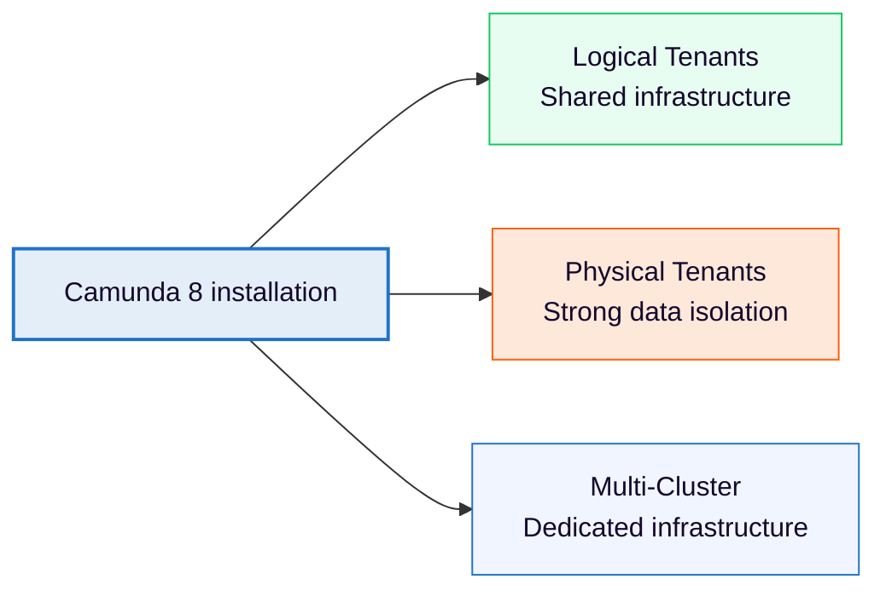

import AoGrid from "../../../components/react-components/_ao-card";
import IconConsoleImg from "../../../components/assets/icon-console.png";
import IconOrchClusterImg from "../../../components/assets/icon-orchcluster.png";
import IconOperateImg from "../../../components/assets/icon-operate.png";

Learn how to choose a multi-tenancy model for your Camunda 8 installation.

Camunda 8 supports three models with different isolation levels and operational characteristics: Logical Tenants, Physical Tenants, and Multi-Cluster.

[Choose a multi-tenancy model](#choose-a-multi-tenancy-model)

## Three models of multi-tenancy

Choose the model that best fits your isolation requirements and operational constraints:

| Aspect                     | Logical Tenant                   | Physical Tenant                         | Multi-Cluster                             |
| -------------------------- | -------------------------------- | --------------------------------------- | ----------------------------------------- |
| **Availability**           | Self-Managed and SaaS            | Self-Managed only                       | Self-Managed only                         |
| **Isolation**              | Logical only                     | Strong physical data isolation          | Full physical isolation                   |
| **Data sharing**           | Single shared database           | Separate data per tenant                | Separate per cluster                      |
| **Backup/restore**         | Cluster-level only               | Independent per tenant                  | Independent per cluster                   |
| **Cost**                   | Most efficient                   | Balanced                                | Most expensive                            |
| **Operational complexity** | Low                              | Medium                                  | High                                      |
| **Use case**               | Small teams, low-risk separation | Multiple teams, strong isolation needed | Separate organizations, maximum isolation |

## Choose a multi-tenancy model {#choose-a-multi-tenancy-model}

Use the model that matches your required isolation, cost, and operating model.

<AoGrid columns={3} ao={[
{
link: "./logical-tenants/",
title: "Logical Tenants",
image: IconConsoleImg,
description: "Use tenant IDs to separate departments or teams while sharing the same infrastructure.",
},
{
link: "./physical-tenants/",
title: "Physical Tenants",
image: IconOrchClusterImg,
description: "Isolate execution and storage for teams that need stronger separation within one cluster.",
},
{
link: "#multi-cluster",
title: "Multi-Cluster",
image: IconOperateImg,
description: "Run dedicated clusters when you need maximum operational and infrastructure isolation.",
},
]} />

## Logical Tenants

Use Logical Tenants for cost-efficient subdivision within a single cluster. They share infrastructure while isolating data, configuration, and access through tenant identifiers.

Logical Tenants work well for departments or teams within the same organization with low-risk separation needs.

## Physical Tenants

Use Physical Tenants for strong physical data isolation within a single cluster. Each tenant has separate data storage and independent operations, while cluster compute resources such as CPU and memory remain shared.

Physical Tenants work well for multiple teams or organizations that need strong isolation without the cost and complexity of separate clusters.

Physical Tenants and Logical Tenants can be used together. Each Physical Tenant can contain its own set of Logical Tenants, providing two independent layers of isolation: physical separation between top-level tenant groups, and logical separation within each group.

See [Physical Tenants](physical-tenants.md) for the technical model and configuration paths.

## Multi-Cluster {#multi-cluster}

Use Multi-Cluster for full isolation through dedicated infrastructure. Each tenant has a separate cluster, which provides maximum operational independence at the highest infrastructure cost and complexity.

Multi-Cluster works well for separate organizations with maximum isolation requirements or strict data residency needs.

## Continue with multi-tenancy

<AoGrid columns={3} ao={[
{
link: "../../deployment/helm/configure/configure-multi-tenancy/",
title: "Configure Logical Tenants",
image: IconConsoleImg,
description: "Set up lightweight tenant-ID isolation in a Self-Managed deployment.",
},
{
link: "./physical-tenants/",
title: "Configure Physical Tenants",
image: IconOrchClusterImg,
description: "Plan stronger isolation and continue to the Physical Tenants documentation.",
},
{
link: "../../components/management-identity/manage-tenants/",
title: "Manage tenants in Identity",
image: IconOperateImg,
description: "Create, view, and manage tenants through the Identity user interface.",
},
]} />
