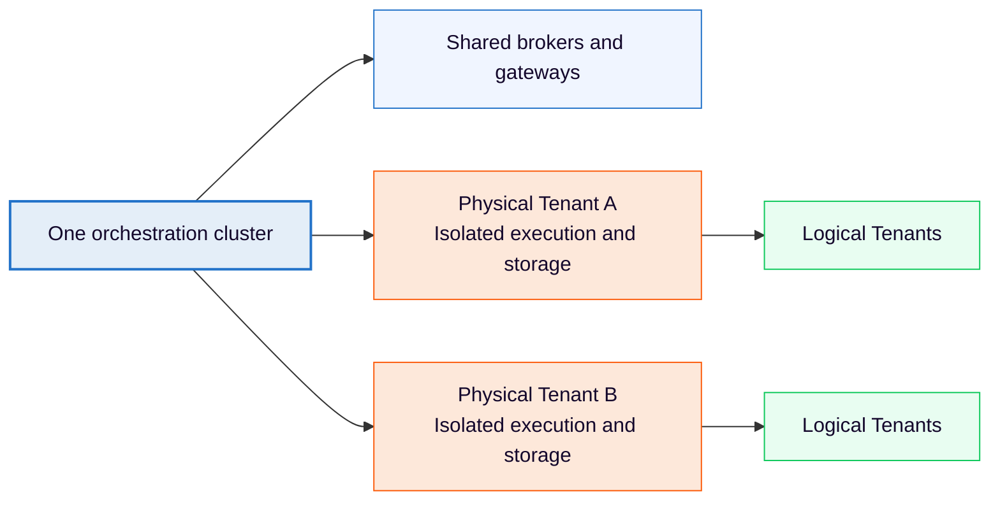

import AoGrid from "../../../components/react-components/_ao-card";
import IconConfigImg from "../../../components/assets/icon-config.png";
import IconOrchClusterImg from "../../../components/assets/icon-orchcluster.png";
import IconReferenceApiImg from "../../../components/assets/icon-reference-api.png";
import IconOperateImg from "../../../components/assets/icon-operate.png";

Learn how Physical Tenants provide strong data isolation and independent operations within one Orchestration Cluster.

Each Physical Tenant is an isolated execution unit with separate primary and secondary storage, plus independent lifecycle management while sharing cluster infrastructure.

Physical Tenants provide a balanced approach to multi-tenancy. They offer strong isolation without the operational complexity and cost of running separate clusters. See the [multi-tenancy overview](index.md) to compare isolation models.

[Configure Physical Tenants](/self-managed/concepts/physical-tenants/configuration-reference.md)

## Why Physical Tenants

**Strong isolation without complexity:** Run multiple teams or organizations on one cluster with complete data separation and independent operations, without the overhead of managing multiple orchestration clusters.

**Independent operations:** Back up, restore, scale, and manage each Physical Tenant independently. Shared gateways and brokers can still introduce noisy-neighbor effects.

**Cost efficiency:** Share infrastructure while maintaining tenant autonomy, reducing operational overhead compared to multi-cluster deployments.

## Terminology

### Physical Tenant

An isolated execution unit within an Orchestration Cluster. Each Physical Tenant has separate data storage, independent lifecycle management, and API access scoped to that tenant.

### Default Physical Tenant

Every Orchestration Cluster automatically includes a default Physical Tenant created at provisioning time. In Camunda 8.10, the default Physical Tenant is immutable and cannot be renamed, disabled, or deleted. For backward compatibility, traffic not explicitly scoped to a Physical Tenant is internally routed to the default Physical Tenant.

### Cluster-wide operation

An operation that affects the entire Orchestration Cluster, such as cluster configuration updates, cluster-level health checks, or cluster backups. Cluster-wide management operations are protected by the cluster-admin role and are not scoped to a specific Physical Tenant.

### Tenant-scoped operation

An operation that targets a specific Physical Tenant, such as deploying a process to a tenant, backing up a tenant's data, or querying a tenant's process instances.

## API and access patterns

**Tenant-scoped APIs** are accessible at `/physical-tenants/{physicalTenantId}/v2/`:

- REST API: `POST /physical-tenants/mytenant/v2/process-definitions`
- Webapps: `https://your-cluster/physical-tenants/mytenant/operate`

**Cluster-wide APIs** use the dedicated `/cluster/v2/...` path prefix. Cluster-wide management endpoints require cluster-admin access. `/cluster/v2/status` remains public for health checks. Endpoints at the standard `/v2/...` paths, including `/v2/topology`, are scoped to a Physical Tenant, not the cluster.

**gRPC clients** specify the Physical Tenant using the `Camunda-Physical-Tenant` custom header.

## Logical and Physical Tenants together

Logical Tenants remain available within each Physical Tenant as a lightweight subdivision mechanism. You can use Logical Tenants for cost-efficient sub-division (for example, multiple departments within a team) while relying on Physical Tenants for strong isolation (for example, separate teams within an organization).

See [Logical Tenants](logical-tenants.md) for details on the lightweight tenant-ID based model.

**Important:** There is no migration path from Logical Tenants to Physical Tenants. Logical Tenants created in a Physical Tenant remain associated with that tenant and cannot be migrated to another Physical Tenant.

## Wording conventions

When referencing Physical Tenants and Logical Tenants in documentation and code:

- Use **`physicalTenantId`** when referencing Physical Tenant API parameters, configuration keys, or system identifiers.
- Use **`tenantId`** only when referencing Logical Tenants (backward-compatible with existing API).
- Existing API keys remain unchanged.
- Use **Physical Tenant** and **Logical Tenant** (capitalized) as the canonical terms.

## Explore Physical Tenants

Use these guides to plan, configure, and operate Physical Tenants.

<AoGrid columns={2} ao={[
{
link: "../../physical-tenants/",
title: "Understand the isolation model",
image: IconOrchClusterImg,
description: "Review shared infrastructure, storage boundaries, routing, and health checks.",
},
{
link: "../../physical-tenants/configuration-reference/",
title: "Configure Physical Tenants",
image: IconConfigImg,
description: "Define root defaults, tenant overrides, storage, identity providers, and validation rules.",
},
{
link: "../../physical-tenants/provisioning-and-lifecycle/",
title: "Provision and manage tenants",
image: IconOperateImg,
description: "Add tenants, apply configuration changes, and understand disable and re-enable behavior.",
},
{
link: "../../physical-tenants/api-routing/",
title: "Route API requests",
image: IconReferenceApiImg,
description: "Target tenants through REST paths, gRPC metadata, web app URLs, and cluster-wide routes.",
},
]} />

## Related capabilities

Continue with the pages that cover identity, storage, web apps, authorization, and connectors.

<AoGrid columns={2} ao={[
{
link: "../../physical-tenants/authentication-authorization/",
title: "Authenticate and authorize tenants",
image: IconConfigImg,
description: "Assign identity providers, map token claims, and isolate sessions and permissions.",
},
{
link: "../../physical-tenants/authorization-model/",
title: "Understand authorization scopes",
image: IconReferenceApiImg,
description: "Distinguish tenant-local permissions from cluster-wide management access.",
},
{
link: "../../physical-tenants/storage-isolation/",
title: "Isolate tenant storage",
image: IconOrchClusterImg,
description: "Configure RDBMS, Elasticsearch/OpenSearch, and document-store boundaries.",
},
{
link: "../../physical-tenants/api-routing/#webapp-routing",
title: "Use tenant-scoped web apps",
image: IconOperateImg,
description: "Open Operate, Tasklist, and Admin with tenant-scoped URLs and sessions.",
},
]} />

For how authorization is divided between cluster-wide and tenant-local operations, see [authorization model](/self-managed/concepts/physical-tenants/authorization-model.md).

For how Physical Tenant storage isolation works across primary storage, secondary storage, and document stores, see [storage isolation](/self-managed/concepts/physical-tenants/storage-isolation.md).
