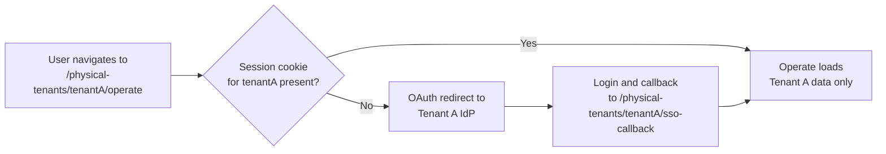

Learn how Camunda 8.10 routes REST API requests to Physical Tenants.

## Tenant-scoped REST API routing

To target a specific Physical Tenant, use the tenant-prefixed path format:

```
/physical-tenants/{physicalTenantId}/v2/{resource}
```

For example:

```
GET  /physical-tenants/riskproduction/v2/process-definitions/search
POST /physical-tenants/riskproduction/v2/process-instances
```

The `physicalTenantId` in the path must match a configured Physical Tenant. The tenant segment comes **before** `/v2/`. Tenant-facing endpoints available at the standard `/v2/...` paths are also available at their tenant-prefixed equivalents.

## Default tenant routing

Requests that omit the Physical Tenant prefix are routed to the `default` Physical Tenant:

```
/v2/{resource}  →  /physical-tenants/default/v2/{resource}
```

This means existing integrations that do not use the tenant-prefixed paths continue to work without modification. They interact with the default Physical Tenant.

You can also use `default` explicitly as the `physicalTenantId`:

```
GET /physical-tenants/default/v2/process-definitions/search
```

## Cluster-wide endpoints

A cluster-wide endpoint applies to the whole cluster rather than a single Physical Tenant. The cluster-wide topology is exposed under a dedicated `/cluster/v2/...` path prefix, at `/cluster/v2/topology`.

The legacy `/v2/status` endpoint is deprecated. It continues to serve the default Physical Tenant only for backward compatibility. Use `/cluster/v2/status` for overall cluster status or `/physical-tenants/{id}/v2/topology` for per-tenant status.

Most other endpoints are scoped to a Physical Tenant, even when they are not tenant-specific in nature. A plain `/v2/...` request targets the `default` tenant. For example:

- `/v2/topology` returns the topology for the targeted Physical Tenant (the `default` tenant when no tenant prefix is used), not a cluster-wide view. For the cluster-wide topology, use `/cluster/v2/topology`.
- `/v2/license` returns the license status and is available per Physical Tenant, including on the default path (`/v2/license`). It is not a separate cluster-wide endpoint.

### Exception: /v2/status

The `/v2/status` endpoint is a deliberate exception to the general routing rule. It remains cluster-wide and unauthenticated for backward compatibility, so operators and load balancers can check overall cluster health without credentials. It is **not** exposed under the Physical Tenant prefix (`/physical-tenants/{id}/v2/status` is not a valid path).

For per-tenant health information, use the `/v2/topology` endpoint, which includes partition health state per tenant.

## HTTP status codes

| Scenario                                                           | HTTP status        |
| ------------------------------------------------------------------ | ------------------ |
| Request to a configured tenant with valid credentials              | `2xx`              |
| Request to a configured tenant with missing or invalid credentials | `401 Unauthorized` |
| Request to an unknown or unconfigured tenant                       | `404 Not Found`    |

A `404` for an unknown tenant does not indicate an authorization failure. The tenant does not exist in the cluster configuration, so authentication has not yet been attempted.

## Per-tenant endpoint reference

There is no separate API specification for Physical Tenants. All endpoints in the [Orchestration Cluster REST API](/apis-tools/orchestration-cluster-api-rest/orchestration-cluster-api-rest-overview.md) are available per Physical Tenant. To target a specific tenant, prepend `/physical-tenants/{physicalTenantId}` to the standard `/v2/...` path.

For example, the standard `/v2/process-definitions/search` endpoint is available per tenant at `/physical-tenants/{physicalTenantId}/v2/process-definitions/search`. Replace `{physicalTenantId}` with the configured tenant ID (for example, `tenanta` or `default`).

## Cross-tenant queries

Each API call targets exactly one Physical Tenant via the path prefix. There is no cross-tenant query in a single request. If you need data from multiple tenants, you must make separate calls per tenant.

This is the core isolation guarantee of Physical Tenants: no operation can read or write across tenant boundaries in a single request.

## Webapp routing

Camunda web applications (Operate, Tasklist, and Admin) follow the same path convention:

| Web app  | URL pattern                                     | Example                                                         |
| :------- | :---------------------------------------------- | :-------------------------------------------------------------- |
| Operate  | `/physical-tenants/{physicalTenantId}/operate`  | `https://your-cluster/physical-tenants/riskproduction/operate`  |
| Tasklist | `/physical-tenants/{physicalTenantId}/tasklist` | `https://your-cluster/physical-tenants/riskproduction/tasklist` |
| Admin    | `/physical-tenants/{physicalTenantId}/admin`    | `https://your-cluster/physical-tenants/riskproduction/admin`    |

All data shown is scoped to that one Physical Tenant. No cross-tenant data appears within a single web app session. There is no global tenant switcher dropdown. To switch Physical Tenants, navigate to the target tenant's URL. Each tenant loads its own isolated session.

### Access flow



### Session behavior

Each Physical Tenant has its own path-scoped session cookie, so sessions from different tenants do not interfere. See [session isolation](./authentication-authorization.md#session-isolation) for the cookie-scoping details.

- **Simultaneous access**: users can be logged into multiple Physical Tenants at once using different browser tabs.
- **Logout**: completes per Physical Tenant. Navigate to the target tenant's logout endpoint to end that tenant's session.
- **Role changes mid-session:** Changing a user's roles does not invalidate their Operate or Tasklist session or log them out. The resolved authentication context, including role, group, and tenant membership, is cached in the HTTP session and re-resolved after `camunda.security.authentication.authentication-refresh-interval` (default `PT30S`) elapses. Permission changes are evaluated per request and take effect as soon as they reach secondary storage. Role or group changes sourced from IdP token claims are only picked up after the access token refreshes or the user logs in again.

:::note
Deploy Optimize separately for each Physical Tenant and configure each instance to use that tenant's cluster connection. Native multi-tenant Helm support does not manage multiple Optimize instances.
:::

<!-- TODO: Optimize documentation for Physical Tenants is being written by the Optimize team. Coordinate with Hamza and Immi before publishing any Optimize-specific configuration or setup content for Physical Tenants. -->

## MCP routing

MCP server endpoints follow the same path convention as the REST API and webapps:

```
/physical-tenants/{physicalTenantId}/mcp/...
```

There is no cluster-wide MCP endpoint planned for 8.10.

## Tenant discovery

There is no cross-tenant discovery endpoint. A client cannot request a list of Physical Tenants it has access to in a single call. If you need to enumerate accessible tenants, probe each tenant's endpoint individually.

## gRPC routing

gRPC clients specify the target Physical Tenant using the `Camunda-Physical-Tenant` request header (metadata in gRPC terms). Requests that omit the header route to the `default` Physical Tenant.

## Backward compatibility and migration

Physical Tenants are designed to be backward-compatible for single-tenant and existing multi-tenant deployments:

- All existing `/v2/...` calls continue to work without modification. They route to the `default` Physical Tenant.
- There is no breaking change for single-tenant users upgrading to 8.10.
- To access a non-default Physical Tenant, update your clients to use the tenant-prefixed path.

For users migrating from Logical Tenants, the `tenantId` parameter in existing API calls remains unchanged and continues to refer to Logical Tenants within a Physical Tenant.
