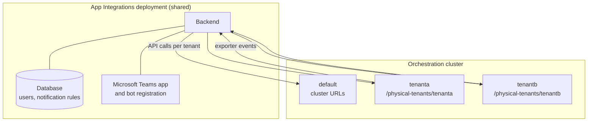

A single App Integrations deployment can serve every Physical Tenant of an orchestration cluster. Each tenant gets its own API endpoint, web app links, and notification rules, while the backend, its database, and the Microsoft Teams app registration stay shared.

:::note
Physical Tenant support in App Integrations is available in Camunda 8.10 Self-Managed only. It is not available on SaaS.
:::

:::note Related pages

- **[Physical Tenant isolation model](/self-managed/concepts/physical-tenants/index.md)** — How Physical Tenants isolate execution and storage
- **[Authentication and authorization](/self-managed/concepts/physical-tenants/authentication-authorization.md)** — Identity deployment models and token routing
- **[Microsoft Teams installation](/components/camunda-integrations/ms-teams/ms-teams-installation.md)** — The full `config.yaml` reference
  :::

## Terminology

Three different concepts on this page use the word "tenant". Keep them apart:

| Term                   | Identifier         | What it is                                                                                           |
| :--------------------- | :----------------- | :--------------------------------------------------------------------------------------------------- |
| **Physical Tenant**    | `physicalTenantId` | An isolated execution unit inside one orchestration cluster. This is what the page describes.        |
| **Logical Tenant**     | `tenantId`         | Camunda's multi-tenancy within a single Physical Tenant. App Integrations does not route on it.      |
| Microsoft Entra tenant | `teams.tenantId`   | The Entra directory hosting the Teams app registration. Unrelated to Camunda tenancy of either kind. |

## How App Integrations resolves the Physical Tenant

App Integrations resolves a tenant independently on each of its four paths.



**Outbound API calls** are issued against the tenant's own orchestration URL, derived as `<cluster-url>/physical-tenants/<physicalTenantId>` unless the tenant configures an explicit one. The `default` tenant uses the cluster URL unchanged.

**Inbound exporter events** carry their tenant in the `X-Physical-Tenant-Id` header. When the header is absent, App Integrations falls back to the tenant whose `exporter.apiKey` authenticated the request, and finally to `default`. See [event routing](#event-routing-and-notifications).

**Inbound connector calls** carry the same header. The App Integrations connector reads the tenant from the job it is executing, so a linked form is fetched from that tenant's orchestration endpoint. See [connector calls](#connector-calls).

**User context** is the `(organization, cluster, Physical Tenant)` triple stored per user. It determines which tenant a chat command reads from, and which tenant a new notification rule is scoped to.

## Configuration

Declare the tenants of a cluster in the `physicalTenants` array of your `config.yaml`:

```yaml
flavor: self-managed

clusters:
  - uuid: <unique-cluster-uuid>
    name: <cluster-display-name>
    urls:
      orchestration: https://<your-camunda-host>
      tasklist: https://<your-camunda-host>/tasklist
      operate: https://<your-camunda-host>/operate
    exporter:
      apiKey: <cluster-exporter-api-key>
    physicalTenants:
      - id: tenanta
        name: Tenant A
        urls:
          tasklist: https://<your-camunda-host>/physical-tenants/tenanta/tasklist
          operate: https://<your-camunda-host>/physical-tenants/tenanta/operate
      - id: tenantb
        name: Tenant B
        exporter:
          apiKey: <tenant-b-exporter-api-key>
        auth:
          audiences:
            zeebe: <tenant-b-audience>
        urls:
          tasklist: https://<your-camunda-host>/physical-tenants/tenantb/tasklist
          operate: https://<your-camunda-host>/physical-tenants/tenantb/operate
```

| Field                                | Required | Description                                                                                                                                                                                                         |
| :----------------------------------- | :------- | :------------------------------------------------------------------------------------------------------------------------------------------------------------------------------------------------------------------ |
| `id`                                 | Yes      | The `physicalTenantId`, matching the tenant configured on the orchestration cluster.                                                                                                                                |
| `name`                               | Yes      | Display name shown in the Teams cluster selector.                                                                                                                                                                   |
| `urls.tasklist`                      | Yes      | The tenant's Tasklist URL. Accepts a plain URL or the `{ base, task }` object described in the [installation guide](/components/camunda-integrations/ms-teams/ms-teams-installation.md#example-configuration-file). |
| `urls.operate`                       | Yes      | The tenant's Operate URL.                                                                                                                                                                                           |
| `urls.orchestration`                 | No       | Overrides the tenant's API base URL. Defaults to `<cluster orchestration URL>/physical-tenants/<id>`. Specify it without the `/v2` suffix, as at cluster level.                                                     |
| `exporter.apiKey`                    | No       | Identifies this tenant on an inbound exporter request that carries no `X-Physical-Tenant-Id` header.                                                                                                                |
| `connector.apiKey`                   | No       | A separate key for the App Integrations connector endpoints. Rotates independently of `exporter.apiKey`.                                                                                                            |
| `auth.audiences.zeebe`               | No       | Overrides the audience requested for this tenant's API calls. See [authentication](#authentication).                                                                                                                |
| `exposeDefaultTenant` _(on cluster)_ | No       | Whether the `default` tenant is selectable alongside the configured ones. Defaults to `false`.                                                                                                                      |

Note that `urls.tasklist` and `urls.operate` are required on every tenant: a tenant never inherits the cluster's web app URLs, because those point at the cluster's own `default` tenant.

### The default tenant

The `default` Physical Tenant represents the cluster itself and always uses the cluster's own URLs, never a `/physical-tenants/default/…` path.

- **No `physicalTenants` configured** — App Integrations synthesizes a single `default` tenant that takes the cluster's name and URLs. This is the behavior of every cluster configured before 8.10, and it needs no migration.
- **`physicalTenants` configured** — only the tenants you declare are offered. The `default` tenant is hidden, so users cannot accidentally read from the cluster-wide endpoint.
- **`physicalTenants` configured with `exposeDefaultTenant: true`** — the `default` tenant is added at the top of the list, in addition to the configured tenants.

## Authentication

App Integrations defines **one** identity provider for the whole deployment: a single `auth.issuer` and `auth.kind`, and one M2M/SPA client pair. Tenants are distinguished by **audience**, configured per tenant under `auth.audiences.zeebe`.

This implements [Model B: single IdP, multiple role-level clients](./authentication-authorization.md#model-b-single-idp-multiple-role-level-clients). [Model C](./authentication-authorization.md#model-c-multiple-idps-advanced), a separate identity provider per Physical Tenant, is **not supported** — App Integrations cannot hold more than one issuer.

The audience for an outbound call is resolved in this order, first match wins:

1. `clusters[].physicalTenants[].auth.audiences.zeebe`
2. `clusters[].auth.audiences.zeebe`
3. `auth.audiences.zeebe` (the deployment-wide value)

Only the resource audience can be overridden per tenant. `auth.audiences.global` and `auth.audiences.app_integrations` are deployment-wide and are rejected inside a per-cluster or per-tenant `auth` block.

:::note
The shapes differ from the orchestration cluster's own configuration: Camunda's identity provider takes a list of allowed audiences, whereas App Integrations sends a single audience string per tenant. The value you set here must be one of the audiences the tenant's client registration accepts.
:::

User sign-in is deployment-wide. A user links their Camunda identity once, not per Physical Tenant, so the OIDC redirect URIs registered for App Integrations are not tenant-scoped. See [IdP redirect URI registration](./authentication-authorization.md#idp-redirect-uri-registration).

## Event routing and notifications

Each tenant's exporter posts its events to the same App Integrations endpoint. The tenant is resolved per request:

1. **The `X-Physical-Tenant-Id` header**, if present. It must name a tenant configured for that cluster, or the request is rejected with `400 Invalid X-Physical-Tenant-Id header`.
2. **The authenticating API key**, if it is a tenant's `exporter.apiKey`.
3. **`default`**, otherwise.

:::warning
A request authenticated with the **cluster-level** `exporter.apiKey` never resolves to a named tenant, because the cluster key is matched before the per-tenant keys. If such a request omits the header, its events are attributed to `default` and silently match no rule on a cluster whose `default` tenant is hidden. Give every tenant its own `exporter.apiKey`, send the header, or both.
:::

Notification rules are scoped to the `(organization, cluster, Physical Tenant)` triple, and the tenant is matched on exact equality. Unlike the process and element filters, it has no wildcard: a rule scoped to `default` never receives a named tenant's events.

## Connector calls

The App Integrations connector posts to the same deployment, and its tenant is resolved the same way as an exporter event's: the `X-Physical-Tenant-Id` header first, then the tenant whose `connector.apiKey` authenticated the request, then `default`.

The connector reads the tenant from the job it is executing and sends it on every call, so there is nothing to configure on the connector task or in the process model. What matters is that the connector runtime knows its own tenant. Set `physical-tenant-id` on each client entry, as described in [Connectors runtime](./connectors-runtime.md#how-the-runtime-identifies-the-physical-tenant). A client without it produces jobs that carry no tenant, so the connector omits the header and the call resolves to `default`.

Because the tenant reaches the backend, a form referenced by the connector is fetched from that tenant's own orchestration endpoint using that tenant's audience, and notification rule matching is scoped to the same tenant.

A call naming a tenant that is not configured for the cluster is rejected with `400 Invalid X-Physical-Tenant-Id header` rather than delivered to `default`. Keep the tenant IDs in `physicalTenants` and the runtime's `physical-tenant-id` values in sync.

## User experience in Microsoft Teams

A Physical Tenant is not a separate selector. The Teams cluster picker lists one row per `(cluster, tenant)` pair, and choosing a row sets both at once:

- A row for the `default` tenant is labeled with the **cluster's** name.
- A row for a named tenant is labeled with the **tenant's** name.
- The cluster's health and support status is appended to every one of its rows.
- When exactly one pair is available, it is selected automatically.

Users switch tenants the same way they switch clusters, and all task lists, process starts, and deep links follow the selected pair.

## Migrate an existing cluster

Adding `physicalTenants` to a cluster that already runs App Integrations changes which tenant its traffic is attributed to. Plan for the following:

1. **Existing notification rules stop matching.** Rules created before the change are scoped to `default`. Once events arrive tagged with a named tenant, those rules no longer match and deliver nothing. Recreate them per tenant.
2. **Users must reselect their cluster.** A stored context pointing at a tenant that is no longer offered is not migrated.
3. **The `default` tenant disappears from the picker** unless you set `exposeDefaultTenant: true`.
4. **Give each tenant's exporter its own credentials.** Configure a per-tenant `exporter.apiKey`, and confirm the exporter sends `X-Physical-Tenant-Id`.

To keep the cluster-wide view available during a migration, set `exposeDefaultTenant: true` and remove it once every rule has been recreated.

## Known limitations in 8.10

- A separate identity provider per Physical Tenant ([Model C](./authentication-authorization.md#model-c-multiple-idps-advanced)) is not supported.
- Identity linking and sign-in are deployment-wide, not per tenant.
- Cluster health and version are reported per cluster, not per Physical Tenant.
- Physical Tenants are a Self-Managed feature; App Integrations on SaaS is single-tenant.

<p class="link-arrow">[Physical Tenant isolation model](./index.md)</p>
