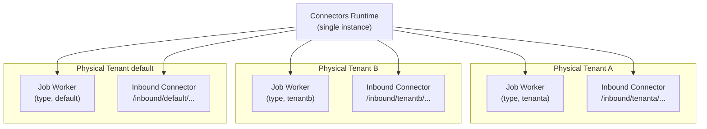

One Connectors runtime instance can register job workers and serve inbound connectors for multiple Physical Tenants. No separate runtime deployment per tenant is required.

:::note Related pages

- **[Configuration reference](/self-managed/concepts/physical-tenants/configuration-reference.md)** — General tenant configuration
- **[Authorization model](/self-managed/concepts/physical-tenants/authorization-model.md)** — Roles and permissions per tenant
- **[API routing](/self-managed/concepts/physical-tenants/api-routing.md)** — How requests route to Physical Tenants

:::

## Architecture



## How the runtime identifies the Physical Tenant

The activated job record carries the `physicalTenantId`, propagated through the broker request. The runtime uses this value to determine which Physical Tenant a job belongs to.

- The runtime registers one job worker per configured client per connector type, so each Physical Tenant gets its own worker for each job type.
- Registration covers **statically configured** `camunda.clients.*` entries only. A Physical Tenant only gets a job worker if it is explicitly configured as a client.
- Always set `physical-tenant-id` explicitly on each client entry. If it is omitted, the runtime falls back to a derived value and per-tenant attribution in metrics and the connector instance listing becomes unreliable.

## Configuration

Use the `camunda.clients.*` multi-client configuration to connect the runtime to multiple Physical Tenants. The shared `camunda.client.*` block sets base connection details inherited by all entries; per-client entries override only what differs (typically `physical-tenant-id` and `auth.*`).

```yaml
camunda:
  client:
    # Shared base — inherited by all client entries
    grpc-address: https://your-cluster.example.com:26500
    rest-address: https://your-cluster.example.com
  clients:
    default:
      mode: self-managed
      physical-tenant-id: default
      auth:
        client-id: connector-default
        client-secret: ${SECRET_DEFAULT}
      primary: true # resolves the default @Autowired CamundaClient
    tenanta:
      mode: self-managed
      physical-tenant-id: tenanta
      auth:
        client-id: connector-tenanta
        client-secret: ${SECRET_TENANTA}
    tenantb:
      mode: self-managed
      physical-tenant-id: tenantb
      auth:
        client-id: connector-tenantb
        client-secret: ${SECRET_TENANTB}
```

- The client name (`tenanta`) is a free-form label and does not have to match the `physical-tenant-id`.
- `physical-tenant-id` must be lowercase alphanumeric, maximum 64 characters.
- Mark one entry `primary: true` when configuring multiple clients. With a single client, it is the primary implicitly.
- Existing single-client deployments using `camunda.client.*` are unaffected — `camunda.client.*` transparently maps to `camunda.clients.default.*` at startup.

## Outbound connectors

### Tenant context propagation

The runtime resolves each job's Physical Tenant from the activated job record and uses it to select the per-tenant secret provider, document store, and metrics attribution for that job.

The `physicalTenantId` is not exposed as a process variable, so it cannot be referenced directly from a FEEL expression in a connector's element template. To route a connector to a tenant-specific endpoint, set a variable at process start and reference that variable instead.

### Per-tenant secret access

Per-tenant secret isolation is **opt-in and disabled by default**. Enable it explicitly in any multi-tenant deployment:

```yaml
camunda:
  connector:
    secretprovider:
      environment:
        physicaltenantaware: true
```

Equivalent environment variable: `CAMUNDA_CONNECTOR_SECRETPROVIDER_ENVIRONMENT_PHYSICALTENANTAWARE`.

With this enabled, the runtime resolves each secret against a name scoped to the job's Physical Tenant: `${prefix}${physicalTenantId}_${name}`. With the default secret prefix `SECRET_`, a reference to `MY_SECRET` from a job on `tenanta` resolves the environment variable `SECRET_tenanta_MY_SECRET`.

:::warning Secrets are shared across tenants by default
With `physicaltenantaware` left at its default of `false`, all configured clients resolve secrets from a single flat namespace. A reference to `{{secrets.MY_SECRET}}` resolves the same `SECRET_MY_SECRET` value regardless of which Physical Tenant the job belongs to. Enable `physicaltenantaware` in any deployment where tenants must not share secret values.
:::

Reference secrets in connector properties using `{{secrets.MY_SECRET}}`. The runtime replaces references when it binds the job's variables, and does not write resolved values back to the variable store, Operate, Tasklist, or logs.

Independently of tenant scoping, `camunda.connector.secret-resolver.secret-filter.mode` controls whether a connector element may reference secret keys it has not declared. It defaults to `DISABLED`, meaning no key-level restriction is enforced. Set it to `LAX` or `STRICT` to restrict each element to the secret keys declared in its process definition.

## Inbound connectors

The runtime polls each configured Physical Tenant for process definitions using that tenant's own client, and tracks inbound connector state per tenant, so inbound executables and their state stay isolated across tenants.

### Webhook path routing

Set `camunda.connector.webhook.append-physical-tenant-and-tenant-to-path: true` to activate namespaced paths:

```
/inbound/<physicalTenantId>/<tenantId>/<path>
```

Equivalent environment variable: `CAMUNDA_CONNECTOR_WEBHOOK_APPEND_PHYSICAL_TENANT_AND_TENANT_TO_PATH`.

If unset, the property is inferred automatically: multi-client configurations default to `true`, single-client configurations default to `false`. An explicit value always overrides inference.

Without namespaced paths, the first registered inbound connector matching a path claims the request regardless of Physical Tenant — enable namespaced paths in any multi-tenant deployment.

:::warning Isolation relies on path uniqueness, not tenant-scoped credentials
The routing layer performs pure path-segment matching on `physicalTenantId/tenantId/path` — no credential or signature check happens at the routing layer. HMAC and signature verification is handled per-connector downstream, inside each webhook element's own logic, and has no awareness of `physicalTenantId`. Tenant isolation depends entirely on each tenant's webhook paths being distinct and unguessable.
:::

### Known limitations

- Each inbound request targets exactly one Physical Tenant. Routing a single webhook event to multiple tenants is not supported.
- Cross-tenant inbound routing is not supported.

## Authorization

Each `camunda.clients.*` entry authenticates independently using its own `auth.*` credentials, so grant permissions per Physical Tenant to the identity configured for that client.

Each client's identity needs the standard permissions to activate, complete, and fail jobs for the process definitions it serves, plus read access to process definitions for inbound connector polling. See [Authorization model](/self-managed/concepts/physical-tenants/authorization-model.md) for how permissions are scoped per Physical Tenant.

## Operational considerations

### Scaling

One runtime instance per cluster is standard. Deploy multiple instances only when you need runtime-layer resource isolation (for example, performance SLA separation) — Physical Tenants already isolate data structurally.

### Monitoring

Every connector metric is tagged with `physicalTenantId`, so outbound and inbound activity can be filtered and grouped per Physical Tenant. Two tenants running the same connector type report separately rather than collapsing into one series.

Tagged metrics include outbound invocation counts and execution times, the last-completed and last-failed timestamps, and inbound activation and trigger counts. Jobs handled by a single-client deployment that configures no `physical-tenant-id` are reported under the tag value `default`.

### Secret rotation

Secrets resolved through the environment secret provider are read from the runtime's environment, so rotating a value requires updating the environment variable and restarting the runtime.

Because a single runtime instance serves all configured Physical Tenants, rotating one tenant's secret restarts the shared runtime and therefore briefly interrupts every configured tenant. Plan rotations accordingly.

### Failure handling

A failure in one tenant's job workers does not affect workers registered for other tenants.

On the inbound side, a polling failure for one Physical Tenant is logged and does not stop the other tenants from completing their imports in the same cycle. The runtime's readiness signal is shared across tenants, however, so a persistent polling failure for a single tenant marks the whole runtime instance as not ready.

:::note App integrations (MS Teams and similar)
App integrations with Physical Tenant support are implemented and will be documented in a follow-up section once the configuration details are finalized. Multiple Keycloak (separate IdP per tenant in the connector context) is not supported in 8.10.
:::

<p class="link-arrow">[Physical Tenant isolation model](/self-managed/concepts/physical-tenants/index.md)</p>
