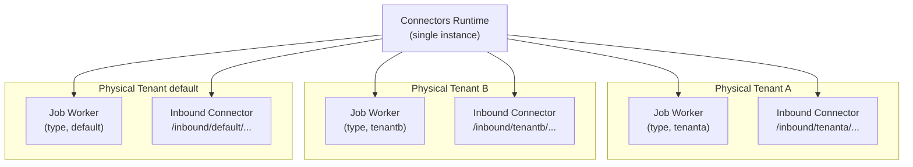

One Connectors runtime instance can register job workers and serve inbound connectors for multiple Physical Tenants. No separate runtime deployment per tenant is required.

:::note Related pages

- **[Configuration reference](/self-managed/concepts/physical-tenants/configuration-reference.md)** — General tenant configuration
- **[Authorization model](/self-managed/concepts/physical-tenants/authorization-model.md)** — Roles and permissions per tenant
- **[API routing](/self-managed/concepts/physical-tenants/api-routing.md)** — How requests route to Physical Tenants

:::

## Architecture



## How the runtime identifies the Physical Tenant

The activated job record carries the `physicalTenantId` propagated through the broker request. The runtime uses this value to determine which Physical Tenant a job belongs to.

- `@JobWorker`-annotated methods fan out to **all configured clients** automatically — there is no `client` attribute to bind a worker to one tenant.
- Workers are keyed by `(client, type)`, so each Physical Tenant gets its own registered worker per job type.
- Fan-out is over **statically configured** `camunda.clients.*` entries only. A Physical Tenant only gets a job worker if it is explicitly configured as a client.
- gRPC requests use the `Camunda-Physical-Tenant` header to target the correct tenant.

## Configuration

Use the `camunda.clients.*` multi-client configuration to connect the runtime to multiple Physical Tenants. The shared `camunda.client.*` block sets base connection details inherited by all entries; per-client entries override only what differs (typically `physical-tenant-id` and `auth.*`).

```yaml
camunda:
  client:
    # Shared base — inherited by all client entries
    grpc-address: https://your-cluster.example.com:26500
    rest-address: https://your-cluster.example.com
  clients:
    default:
      physical-tenant-id: default
      auth:
        client-id: connector-default
        client-secret: ${SECRET_DEFAULT}
      primary: true # resolves @Autowired CamundaClient and the default @JobWorker target
    tenanta:
      physical-tenant-id: tenanta
      auth:
        client-id: connector-tenanta
        client-secret: ${SECRET_TENANTA}
    tenantb:
      physical-tenant-id: tenantb
      auth:
        client-id: connector-tenantb
        client-secret: ${SECRET_TENANTB}
```

- The client name (`tenanta`) is a free-form label and does not have to match the `physical-tenant-id`.
- `physical-tenant-id` must be lowercase alphanumeric, maximum 64 characters.
- Mark one entry `primary: true` when configuring multiple clients. With a single client, it is the primary implicitly.
- Existing single-client deployments using `camunda.client.*` are unaffected — `camunda.client.*` transparently maps to `camunda.clients.default.*` at startup.

## Outbound connectors

### Tenant context propagation

The `physicalTenantId` is available in the activated job context. Use it to route requests to tenant-specific endpoints or apply tenant-specific configuration.

**Example — HTTP connector with per-tenant routing:**

Set the HTTP connector URL as a FEEL expression referencing the `physicalTenantId` process variable:

```
= "https://api.example.com/" + physicalTenantId + "/orders"
```

Tenant A's jobs call `.../tenanta/orders`; tenant B's jobs call `.../tenantb/orders`. The URL resolves dynamically — no per-tenant connector configuration needed.

### Per-tenant secret access

Secrets are scoped per Physical Tenant. The `SecretContext` includes the `physicalTenantId`, so the gateway resolves secrets against the correct tenant's store. One tenant's secrets cannot be accessed from another tenant's job context.

Secret references:

- **Canonical:** `camunda.secrets.MY_SECRET` — FEEL expression form
- **Legacy:** `{{secrets.MY_SECRET}}` — string template, supported indefinitely

Resolved values are never written to the variable store, Operate, Tasklist, logs, or the command log. Only the reference name appears in exports — the reference is a pointer, not the value.

Secret resolution requires `SECRETS:REVEAL` on the `SECRET` resource type, scoped per Physical Tenant.

<!-- TODO: Confirm connector-specific behavior with Berkay Canbolat before publishing: does the runtime call POST /v2/secrets/resolve per PT, and is transparent resolution available in the connector context in alpha5? (#3040) -->

## Inbound connectors

Each Physical Tenant gets its own `ImportSchedulers` instance with a dedicated `CamundaClient`, so inbound connector events and state are isolated per tenant.

### Webhook path routing

Enable the `APPEND_ENGINE_AND_TENANT_TO_WEBHOOK_PATH` flag to activate namespaced paths:

```
/inbound/<physicalTenantId>/<tenantId>/<path>
```

Without this flag, the first registered inbound connector matching a path claims the request regardless of Physical Tenant — enable namespaced paths in any multi-tenant deployment.

<!-- TODO: Confirm with Nic Puppa: exact mechanism to enable this flag (env var, Spring property, or Helm value), whether per-tenant webhook authentication is enforced at the routing layer, and whether the inbound routing strategy is final for alpha5. -->

### Known limitations

- Each inbound request targets exactly one Physical Tenant. Routing a single webhook event to multiple tenants is not supported.
- Cross-tenant inbound routing is not supported.

## Authorization

| Permission                      | Resource            | Required for                   |
| ------------------------------- | ------------------- | ------------------------------ |
| `SECRETS:REVEAL`                | `SECRET`            | Resolving secret references    |
| Standard job worker permissions | Process definitions | Activating and completing jobs |

Permissions are scoped per Physical Tenant. Grant `SECRETS:REVEAL:*` (wildcard) to the Connectors runtime service account to preserve the pre-8.10 implicit-trust scope while keeping authorization explicit.

## Operational considerations

### Scaling

One runtime instance per cluster is standard. Deploy multiple instances only when you need runtime-layer resource isolation (for example, performance SLA separation) — Physical Tenants already isolate data structurally.

### Monitoring

Per-tenant job execution metrics are not available in 8.10. Micrometer metrics are tagged by job type and action only — no `physicalTenantId` or client dimension. Per-tenant filtering is a planned follow-up.

### Secret rotation

When a secret is rotated, the gateway cache expires within the configured TTL (default 20 seconds). No restart required. New job activations after the TTL receive the updated value.

### Failure handling

A failure in one tenant's job workers does not affect workers registered for other tenants.

:::note App integrations (MS Teams and similar)
App integrations with Physical Tenant support are implemented and will be documented in a follow-up section once the configuration details are finalized. Multiple Keycloak (separate IdP per tenant in the connector context) is not supported in 8.10.
:::

<p class="link-arrow">[Physical Tenant isolation model](/self-managed/concepts/physical-tenants/index.md)</p>
