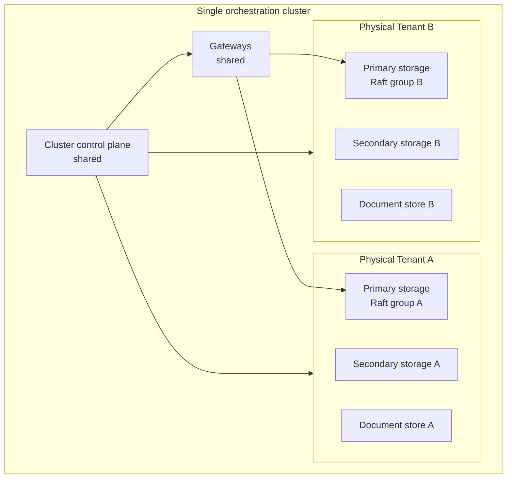

:::info
This is the detailed technical documentation for Physical Tenants. For an overview and key concepts, see [Physical Tenants](/self-managed/concepts/multi-tenancy/physical-tenants.md).
:::

Physical Tenants provide strong isolation within a single orchestration cluster. This page assumes one orchestration cluster with multiple Physical Tenants. Multi-region and multi-cluster topologies are separate topics.

## Isolation model

A Physical Tenant is an isolated execution unit inside one orchestration cluster.

| Layer             | Isolation model                                                                                          | Shared or isolated    |
| ----------------- | -------------------------------------------------------------------------------------------------------- | --------------------- |
| Primary storage   | Dedicated Raft groups per Physical Tenant. A single tenant can span multiple brokers.                    | Isolated              |
| Brokers           | Brokers are co-located and can host more than one Physical Tenant.                                       | Shared infrastructure |
| Gateways          | Gateways route requests to the targeted tenant.                                                          | Shared                |
| Secondary storage | Use a tenant-specific schema, index prefix, or separate backend, depending on the storage type.          | Isolated              |
| Document store    | Use a tenant-specific bucket, container, or subpath. The exact convention depends on the cloud provider. | Isolated              |

## Architecture

The diagram shows one orchestration cluster boundary with shared control-plane components and tenant-specific execution and storage boundaries.

## API routing

Use tenant-scoped routes for tenant-specific requests:

- REST: `/physical-tenants/{physicalTenantId}/v2/...`
- gRPC: `Camunda-Physical-Tenant` header (routes to `default` when omitted)
- Default tenant compatibility: plain `/v2/...` requests route to the default Physical Tenant

Cluster-wide endpoints are not available yet. When added, they will be exposed under a dedicated `/cluster/v2/...` path prefix. Endpoints at the standard `/v2/...` paths, including `/v2/topology`, are scoped to a Physical Tenant.

## Configure and provision Physical Tenants

To configure tenant defaults, per-tenant overrides, validation expectations, and property examples, see [configuration reference](./configuration-reference.md).

To provision new tenants and understand lifecycle behavior in 8.10, including rolling restart expectations and unsupported operations, see [provisioning and lifecycle](./provisioning-and-lifecycle.md).

## What is not isolated in 8.10

- Gateways are shared between tenants, so a saturated gateway can still affect multiple tenants.
- Brokers are co-located and shared infrastructure remains part of the deployment.
- Full performance isolation is out of scope for the first version.
- Future versions may reduce sharing further, for example through more isolated actor-thread or runtime placement, but that is not part of 8.10.

## Storage validation

Configuration validation should fail fast when two tenants point to the same backend location or another unsupported path. For document store, the final naming convention depends on the provider, so validate uniqueness at startup rather than relying on a hard-coded path format.

## Health and status endpoints

Physical Tenants expose three distinct endpoints for health and status:

| Endpoint                             | Scope   | Use when                                                                                                            |
| :----------------------------------- | :------ | :------------------------------------------------------------------------------------------------------------------ |
| `/actuator/health`                   | Node    | Checking whether the individual broker or gateway node is healthy, ready, or live (for example, Kubernetes probes). |
| `/cluster/v2/status`                 | Cluster | Determining whether the cluster as a whole is operational.                                                          |
| `/physical-tenants/{id}/v2/topology` | Tenant  | Checking whether a specific Physical Tenant can accept work and which of its partitions are available.              |

The legacy `/v2/status` endpoint is deprecated. It remains available for the default Physical Tenant only to preserve backward compatibility. Switch to `/cluster/v2/status` for overall cluster status or `/physical-tenants/{id}/v2/topology` for per-tenant status.

## Readiness

:::note Known limitation
In 8.10, readiness failure propagates across all tenants co-located on a broker pod:

- If one tenant's RDBMS schema is unreachable at broker startup, the entire Spring context fails and all tenants on that pod go offline.
- If secondary storage becomes unavailable after startup, Kubernetes removes the broker pod from traffic, affecting all tenants co-located on that pod.

This is the highest-impact noisy-neighbor limitation in 8.10. A fix is tracked in [camunda/camunda#54299](https://github.com/camunda/camunda/issues/54299).
:::

The intended long-term model is broker-scoped readiness that isolates per-tenant data-layer failures from other tenants. Until the fix lands, use `/physical-tenants/{id}/v2/topology` to inspect per-tenant partition availability and determine whether a specific tenant can accept work.

When configuring Kubernetes readiness probes, point the probe at `/actuator/health/readiness` for node-level readiness. To check whether a specific Physical Tenant can accept work independently of the node probe, poll `/physical-tenants/{id}/v2/topology` from your own health-check logic.

## Document store details

Document stores are declared once in the root `camunda.document.*` catalog. Each Physical Tenant inherits the catalog and overrides only the fields it needs — typically the bucket path or prefix — to ensure its data is written to a distinct location.

Isolation is enforced by validating the resolved `provider, bucket/container, path` tuple at startup. If two tenants resolve to the same tuple, Camunda fails startup and names the conflicting tenants in the error.

For configuration examples covering shared buckets with per-tenant paths, dedicated buckets per tenant, and GCP prefix isolation, see [document store isolation](./configuration-reference.md#document-store-isolation) in the configuration reference.

For the storage backends used by tenant-scoped data, see [secondary storage](../secondary-storage/index.md) and [document handling configuration](../document-handling/configuration/index.md).
