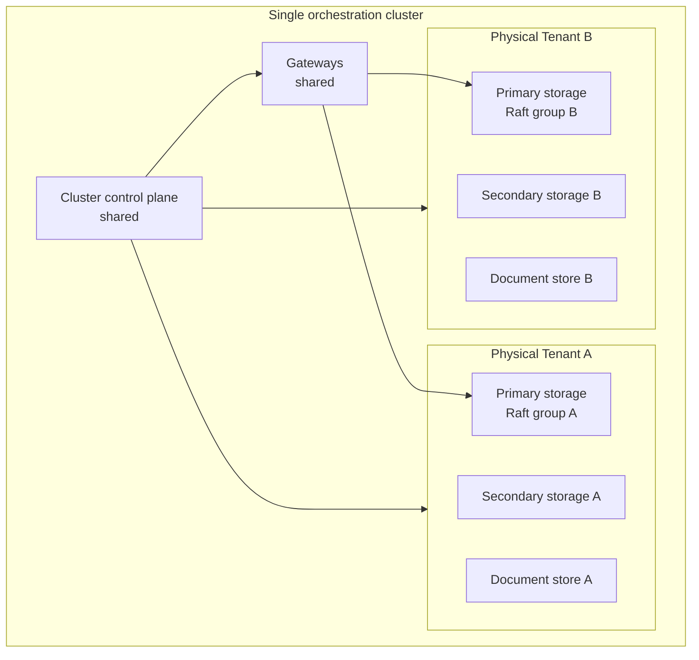
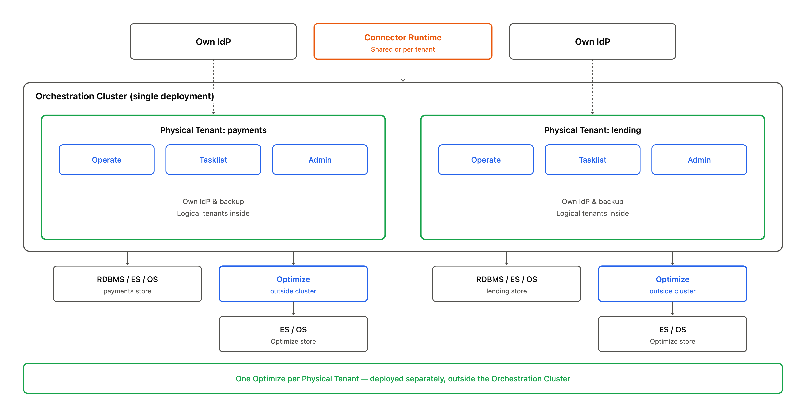

import DocCardList from '@theme/DocCardList';

A Physical Tenant is an isolated execution unit inside one orchestration cluster, with its own storage, identity, and backups.

:::info
New to Physical Tenants? Start with the [Physical Tenants overview](/self-managed/concepts/multi-tenancy/physical-tenants.md) to compare tenancy models, or jump straight to [set up two isolated Physical Tenants](./getting-started.md) for a hands-on walkthrough.
:::

This page covers one orchestration cluster with multiple Physical Tenants. Multi-region and multi-cluster topologies are separate topics.

## Isolation model

Isolation applies differently at each layer of the stack:

| Layer             | Isolation model                                                                                          | Shared or isolated    |
| ----------------- | -------------------------------------------------------------------------------------------------------- | --------------------- |
| Primary storage   | Dedicated Raft groups per Physical Tenant. A single tenant can span multiple brokers.                    | Isolated              |
| Brokers           | Brokers are co-located and can host more than one Physical Tenant.                                       | Shared infrastructure |
| Gateways          | Gateways route requests to the targeted tenant.                                                          | Shared                |
| Secondary storage | Use a tenant-specific schema, index prefix, or separate backend, depending on the storage type.          | Isolated              |
| Document store    | Use a tenant-specific bucket, container, or subpath. The exact convention depends on the cloud provider. | Isolated              |

## Architecture

```mermaid
graph TD
    subgraph cluster["Single orchestration cluster"]
        cp["Cluster control plane\nshared"]
        gw["Gateways\nshared"]

        subgraph tenantA["Physical Tenant A"]
            raftA["Primary storage\nRaft group A"]
            secA["Secondary storage A"]
            docA["Document store A"]
        end

        subgraph tenantB["Physical Tenant B"]
            raftB["Primary storage\nRaft group B"]
            secB["Secondary storage B"]
            docB["Document store B"]
        end

        cp --> gw
        gw --> raftA
        gw --> raftB
        cp --> tenantA
        cp --> tenantB
    end
```

The diagram shows one orchestration cluster boundary with shared control-plane components and tenant-specific execution and storage boundaries.

The same isolation extends to identity, web apps, and Optimize. Each Physical Tenant authenticates through its own identity provider, gets its own Operate, Tasklist, and Admin, and its own backup and restore, while Logical Tenants remain available for lightweight subdivision inside each one:

## API routing

Use tenant-scoped routes for tenant-specific requests:

- REST: `/physical-tenants/{physicalTenantId}/v2/...`
- gRPC: `Camunda-Physical-Tenant` header (routes to `default` when omitted)
- Default tenant compatibility: plain `/v2/...` requests route to the default Physical Tenant

Cluster-wide management endpoints use a dedicated `/cluster/v2/...` path prefix and require the cluster-admin role. Tenant-scoped endpoints use `/physical-tenants/{physicalTenantId}/v2/...`; endpoints at the standard `/v2/...` paths, including `/v2/topology`, are scoped to the default Physical Tenant. See [cluster admin](/components/admin/cluster-admin.md) for the operations served under this prefix.

## Day-2 operations

Once tenants are running, these pages cover operating them: [back up and restore](/self-managed/operational-guides/backup-restore/backup-and-restore.md#back-up-a-cluster-with-multiple-physical-tenants), [in-process restore](/self-managed/operational-guides/backup-restore/in-process-restore.md#restore-a-cluster-with-multiple-physical-tenants), and [cluster scaling](/self-managed/components/orchestration-cluster/zeebe/operations/cluster-scaling.md#scale-a-cluster-with-multiple-physical-tenants).

## What is not isolated

- Gateways are shared between tenants, so a saturated gateway can still affect multiple tenants.
- Brokers are co-located and shared infrastructure remains part of the deployment.
- Full performance isolation is out of scope for the first version.
- Future versions may reduce sharing further, for example through more isolated actor-thread or runtime placement, but that is not part of 8.10.

## Storage validation

Camunda validates storage configuration at startup. If two tenants resolve to the same backend location, startup fails and the error names the conflicting tenants. For document stores, uniqueness is validated against the resolved provider, bucket or container, and path tuple.

## Health and status endpoints

Physical Tenants expose three distinct endpoints for health and status:

| Endpoint                             | Scope   | Use when                                                                                                                                                                                                                                                      |
| :----------------------------------- | :------ | :------------------------------------------------------------------------------------------------------------------------------------------------------------------------------------------------------------------------------------------------------------ |
| `/actuator/health`                   | Node    | Checking whether the individual broker or gateway node is healthy, ready, or live (for example, Kubernetes probes). Exposed on port 9600 by default (brokers and gateways); the other endpoints below are exposed on the Gateway REST port (8080 by default). |
| `/cluster/v2/status`                 | Cluster | Determining whether the cluster as a whole is operational.                                                                                                                                                                                                    |
| `/physical-tenants/{id}/v2/topology` | Tenant  | Checking whether a specific Physical Tenant can accept work and which of its partitions are available.                                                                                                                                                        |

The legacy `/v2/status` endpoint is deprecated. It remains available for the default Physical Tenant only to preserve backward compatibility. Switch to `/cluster/v2/status` for overall cluster status or `/physical-tenants/{id}/v2/topology` for per-tenant status.

## Readiness

When configuring Kubernetes readiness probes, point the probe at `/actuator/health/readiness` for node-level readiness. To check whether a specific Physical Tenant can accept work independently of the node probe, poll `/physical-tenants/{id}/v2/topology` from your own health-check logic.

A node reports ready while at least one of its Physical Tenants is serviceable. If one tenant's secondary storage is unusable, that tenant is degraded on its own: its storage-dependent REST endpoints return `503` with a `Retry-After` header while every other tenant continues to serve traffic. Camunda retries the degraded tenant in the background, so it recovers without a restart once you repair the underlying cause.

Per-tenant isolation of this kind applies to nodes serving two or more Physical Tenants. A node configured with a single tenant keeps the original fail-fast startup behavior. For diagnosis steps, see [troubleshooting](./troubleshooting.md).

## Document store details

Document stores are declared once in the root `camunda.document.*` catalog. Each Physical Tenant inherits the catalog and overrides only the fields it needs, typically the bucket path or prefix, to ensure its data is written to a distinct location.

Isolation is enforced by validating the resolved `provider, bucket/container, path` tuple at startup. If two tenants resolve to the same tuple, Camunda fails startup and names the conflicting tenants in the error.

For configuration examples covering shared buckets with per-tenant paths, dedicated buckets per tenant, and GCP prefix isolation, see [document store storage](./storage-isolation.md#document-store-storage).

For the storage backends used by tenant-scoped data, see [secondary storage](../secondary-storage/index.md) and [document handling configuration](../document-handling/configuration/index.md).

## Explore the docs

<DocCardList />
