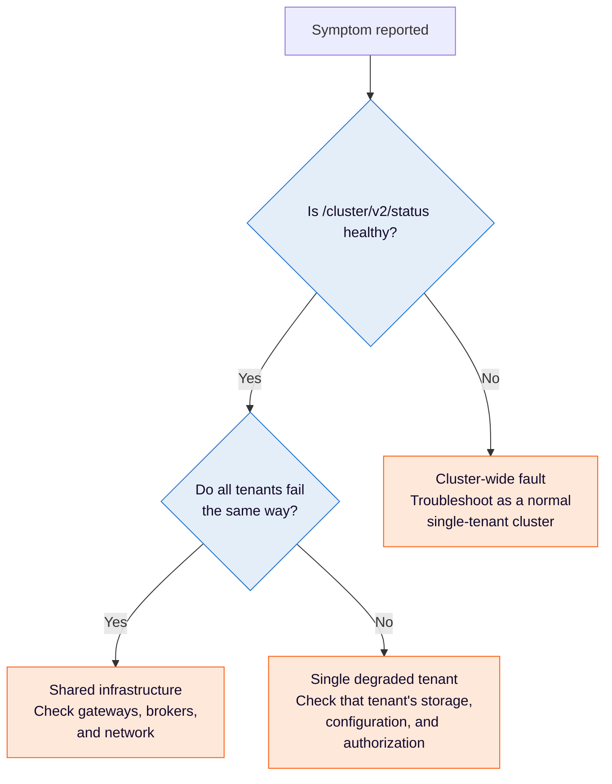

Diagnose problems specific to running multiple Physical Tenants in one Orchestration Cluster, and separate them from general cluster faults.

Most symptoms in a multi-tenant cluster fall into one of two categories: the whole cluster is unhealthy, or a single Physical Tenant is degraded while its peers keep serving traffic. Start by determining which one you have, because the two have different causes and different fixes.

## Determine the scope of the problem



Use these endpoints to answer the questions above:

| Endpoint                             | Scope   | Tells you                                                                                      |
| :----------------------------------- | :------ | :--------------------------------------------------------------------------------------------- |
| `/cluster/v2/status`                 | Cluster | Whether the cluster as a whole is operational. Requires no credentials.                        |
| `/cluster/v2/topology`               | Cluster | Physical Tenant topology and per-tenant status. Requires cluster-admin.                        |
| `/physical-tenants/{id}/v2/topology` | Tenant  | Whether one tenant can accept work, and which partitions are available.                        |
| `/actuator/cluster`                  | Cluster | Cluster topology, plus `pendingChange` and `lastChange` for configuration changes in progress. |
| `/actuator/health`                   | Node    | Whether an individual broker or gateway node is healthy.                                       |

The `/cluster/v2/...` and `/physical-tenants/...` endpoints are served on the Gateway REST port, 8080 by default. The `/actuator/...` endpoints are served on the management port, 9600 by default.

If `/cluster/v2/status` is healthy but one tenant is failing, the problem is scoped to that tenant. Troubleshoot it with the sections below rather than treating it as a cluster outage.

## Degraded tenants

A Physical Tenant becomes **degraded** when its secondary storage is unusable, most often because its schema could not be initialized or its database is unreachable.

### What you observe

- Storage-dependent `/v2/...` REST endpoints for that tenant return `503 Service Unavailable` with a `Retry-After` header and a problem-detail body.
- Other Physical Tenants continue serving requests normally.
- The node stays in the load balancer as long as at least one tenant is serviceable.
- The per-tenant readiness gauge `camunda.physical.tenant.secondary.storage.ready` reports `0` for the affected tenant.
- Per-tenant transition logs name the tenant and state whether an operator needs to act.

### How recovery works

Camunda retries initialization for each degraded tenant in the background, with exponential backoff starting at 500 ms and climbing to 10 seconds. By default the retries are effectively unbounded.

When you repair the underlying cause, such as restoring network access to the database, the tenant recovers on its own. **No restart is required.**

If you have capped the retry count in your retry configuration, a tenant that exhausts the cap stays degraded until you restart the node, rather than recovering on its own.

:::note
Request rejection for degraded tenants applies to REST endpoints. gRPC and MCP requests are not rejected on this basis.
:::

### When a degraded tenant still takes the node down

Two cases fall outside per-tenant isolation:

- **Nodes with a single Physical Tenant.** A node configured with only one tenant keeps the original synchronous fail-fast startup behavior. Per-tenant isolation applies to nodes serving two or more tenants.
- **A database vendor that cannot be resolved from configuration.** Camunda resolves each tenant's database vendor from an explicit `database-vendor-id`, or from the JDBC URL prefix. If neither resolves, startup fails for the whole node. This is a static configuration error rather than a statement about tenant health.

If a tenant's JDBC URL uses a prefix Camunda does not recognize, such as jTDS or a driver proxy, Camunda falls back to opening one connection at startup to identify the vendor. That tenant is no longer isolated from an unreachable database, and the startup log warns and names the property that removes the fallback. Set `database-vendor-id` explicitly for these tenants.

## Startup and configuration errors

Camunda validates Physical Tenant configuration at startup and fails fast with an error that names the offending tenant.

| Symptom                                                         | Cause                                                                                 | Resolution                                                                                                          |
| :-------------------------------------------------------------- | :------------------------------------------------------------------------------------ | :------------------------------------------------------------------------------------------------------------------ |
| Startup fails naming two tenants that share a storage location  | Two tenants resolve to the same schema, index prefix, or document store path          | Give each tenant a distinct location. See [storage isolation](./storage-isolation.md).                              |
| Startup fails on provider selection for a non-default tenant    | A configured tenant does not declare `providers.assigned`                             | Assign at least one cluster OIDC provider to the tenant.                                                            |
| Startup fails naming an unresolvable database vendor            | The JDBC URL prefix is unrecognized and no `database-vendor-id` is set                | Set `database-vendor-id` explicitly for that tenant.                                                                |
| Schema migration fails on an identifier                         | The RDBMS table prefix is not a valid SQL identifier                                  | Remove hyphens, spaces, and leading digits from the prefix.                                                         |
| Startup reports an Oracle storage conflict for distinct tenants | Oracle tenants isolated by schema-per-user share one JDBC URL, so they look identical | Set `data.secondary-storage.rdbms.database-vendor-id: oracle` on each tenant. The startup error includes this hint. |
| Per-tenant exporter settings appear to be ignored               | The exporter is declared only for the tenant and not at the root                      | Declare the exporter at the root as well, then override it per tenant.                                              |

The provider selection error names the exact property path it expects:

```text
Invalid physical-tenant provider selection: non-default physical tenant '<tenantId>' must declare a
non-empty 'camunda.physical-tenants.<tenantId>.security.authentication.providers.assigned' selecting
which cluster OIDC providers apply to it
```

The one exception is the implicit default tenant. When no `camunda.physical-tenants.*` configuration is present at all, the default tenant inherits the full cluster provider set. Once you configure `camunda.physical-tenants.default` explicitly, it must declare its assigned providers like any other tenant.

## API routing problems

### Requests reach the wrong tenant

A request without a tenant prefix routes to the `default` Physical Tenant. If calls you expect to reach `tenanta` are returning `default` tenant data, the tenant segment is missing from the path or the gRPC header.

Check the following:

- REST calls use the `/physical-tenants/{id}/v2/...` form. The tenant segment comes **before** `/v2/`.
- gRPC calls send the `Camunda-Physical-Tenant` metadata header.
- If you use the Java client, `physicalTenantId` is set on the client. A single client instance targets exactly one tenant.
- If your REST address already contains a `/physical-tenants/{id}` segment, for example behind a reverse proxy, `prefixPhysicalTenantPath(false)` is set so the client does not insert the segment twice.

For client-side configuration, see [Physical Tenants in the Java client](/apis-tools/java-client/physical-tenants.md).

### Interpret the status code

| Status                    | Meaning                                                                                                                      |
| :------------------------ | :--------------------------------------------------------------------------------------------------------------------------- |
| `401 Unauthorized`        | The tenant exists, but credentials are missing or invalid, or the token was issued by a provider the tenant does not assign. |
| `403 Forbidden`           | The caller authenticated but lacks authorization within that tenant.                                                         |
| `404 Not Found`           | The tenant is not configured in the cluster, or has been removed from configuration and is disabled.                         |
| `503 Service Unavailable` | The tenant exists but its secondary storage is degraded. Retry after the interval in `Retry-After`.                          |

A `404` for a tenant path is not an authorization failure. The tenant does not exist in the cluster configuration, so authentication was never attempted. A tenant that was removed from configuration is disabled and also returns `404`, with its data retained.

:::note
When no Physical Tenant is explicitly configured, requests to `/physical-tenants/default/...` can return `404` even though the implicit default tenant is addressable at the unprefixed path. Configure the default tenant explicitly if you need the prefixed form to resolve.
:::

### Existing integrations after upgrading

Unprefixed paths continue to work in 8.10 and route to the default Physical Tenant. When Physical Tenants are configured, `/operate` and `/physical-tenants/default/operate` address the same application, and the same holds for Tasklist. Upgrading a single-tenant cluster does not require client changes.

## Authentication and authorization problems

### Browser login fails for a non-default tenant

When a user logs in to a non-default tenant through the browser, the OAuth redirect URI includes the tenant path prefix, such as `/physical-tenants/tenanta/sso-callback`. If your identity provider does not have that URI registered, the redirect fails.

Register the redirect URI for every Physical Tenant you add. Some identity providers support wildcard matching, which avoids a change per tenant.

### A user cannot access a tenant they should have access to

Each Physical Tenant applies its own mapping rules independently. The same token claim can grant a role in one tenant and nothing in another. Confirm the following for the specific tenant:

- The tenant assigns the identity provider that issued the token, through `providers.assigned`.
- The tenant's mapping rules cover the claim present in the token.
- The user's authorizations are defined within that tenant, not only in the default tenant.

### Cluster-wide operations are rejected

Endpoints under `/cluster/v2/...` require the cluster-admin role. Brokers start successfully when the role is not configured, so a missing cluster-admin configuration only surfaces when someone calls a cluster-wide endpoint.

Configure cluster-admin access under `camunda.security.cluster-admin.oidc.*` for OIDC, or `camunda.security.cluster-admin.basic.users` for Basic authentication.

### Backup or exporting requests are rejected

Per-tenant backup and exporting endpoints are governed by two resource types, described in the [authorization model](./authorization-model.md): `BACKUP` (`CREATE`, `READ`, `DELETE`, `RESTORE`) and `EXPORTER` (`PAUSE`).

An Elasticsearch or OpenSearch history backup needs **both** `BACKUP:CREATE` and `EXPORTER:PAUSE`, because exporting is paused for the duration of the backup. A role granted only `BACKUP:CREATE` fails partway through. The default **admin** role holds both; **readonly-admin** holds only `BACKUP:READ`.

A `403` on a history backup endpoint has two possible causes, and the problem detail states which one applies:

- The caller lacks the required `BACKUP` permission.
- The tenant's secondary storage is neither Elasticsearch nor OpenSearch, so it cannot serve history backups at all. Granting permissions will not resolve this one.

Permissions apply to the whole resource type. There is no per-backup-ID or per-exporter grant, so only the `*` resource ID is supported.

### Sessions behave unexpectedly across tenants

Each tenant has its own path-scoped session cookie, scoped to `/physical-tenants/<id>`. A session established for one tenant is not sent to another. Logging in to a second tenant in the same browser creates a second, independent session rather than replacing the first.

For the full model, see [authentication and authorization](./authentication-authorization.md).

## Storage problems

### Index or schema not found for a specific tenant

Confirm the tenant's resolved storage location matches what exists in the backend:

- **RDBMS**: the schema or table prefix in the tenant's configuration exists and the tenant's credentials can reach it.
- **Elasticsearch or OpenSearch**: the tenant's `index-prefix` matches the indices actually present.
- **Document store**: the resolved provider, bucket or container, and path tuple points where you expect.

Startup validation catches two tenants resolving to the _same_ location, but it does not catch a tenant pointing at a location that does not exist yet.

### Overlapping index prefixes

Startup validation only rejects prefixes that are exactly identical. Prefixes where one is the leading substring of another, such as `eu` and `eu-west`, pass validation but cause `eu*` wildcard queries to match both tenants' indices. Use full tenant IDs as prefixes.

### Verify isolation

To confirm two tenants are genuinely isolated:

- Inspect the backend directly and confirm each tenant's schema, index prefix, or document path contains only that tenant's data.
- Call the same search endpoint under two different tenant prefixes and confirm the result sets do not overlap.
- Confirm no single API call returns data from more than one tenant. Every request targets exactly one Physical Tenant, so cross-tenant results indicate a shared storage location rather than a query problem.

## Performance and noisy neighbors

Full performance isolation is out of scope. Some infrastructure is shared, so heavy load in one tenant can affect others.

| Shared resource | Effect under load                                                                 |
| :-------------- | :-------------------------------------------------------------------------------- |
| Gateways        | A saturated gateway affects requests for every tenant it serves.                  |
| Brokers         | Brokers are co-located and host partitions for more than one tenant.              |
| Actor threads   | Partition processing threads are shared. There is no per-tenant thread isolation. |

To identify a noisy neighbor, compare per-tenant throughput and latency over the same window and look for one tenant's load rising as others degrade. Scope every panel by the `physicalTenant` label so a single tenant's behavior is visible on its own.

## Monitor per tenant

Camunda tags tenant-scoped metrics with a `physicalTenant` label. Filter by this label, and by `partition`, to isolate one tenant's behavior.

<!-- TODO: Two claims in the table below are unverified against a tracked issue and came from alpha testing notes only. 1) Hikari connection pool metrics carry the `physicalTenant` label. 2) The Zeebe dashboard aggregates over `(physicalTenant, partition)` - confirm this is a user-facing dashboard rather than an internal Grafana board before leaving it in public docs. Review with Deepthi Devaki or Lena Schoenburg. -->

| Metric or label                                   | Use for                                                            |
| :------------------------------------------------ | :----------------------------------------------------------------- |
| `physicalTenant` label                            | Scoping any tenant-aware metric to a single tenant.                |
| `camunda.physical.tenant.secondary.storage.ready` | Detecting a degraded tenant. Reports `0` when storage is unusable. |
| `camunda.schema.init.time`                        | Diagnosing slow or stuck schema initialization per tenant.         |
| Hikari connection pool metrics                    | Spotting per-tenant connection pool exhaustion on RDBMS backends.  |

The Zeebe dashboard aggregates over `(physicalTenant, partition)`, so you can filter it to one tenant without changing the queries.

Metric names above are given in their Micrometer form. When scraping through the Prometheus endpoint, dots become underscores, so `camunda.physical.tenant.secondary.storage.ready` is scraped as `camunda_physical_tenant_secondary_storage_ready`.

Recommended alerts:

- `camunda.physical.tenant.secondary.storage.ready` at `0` for longer than your expected recovery window.
- Sustained `503` responses on a single tenant's REST endpoints.
- Connection pool saturation for one tenant while others are idle.

## Known limitations

<!-- TODO: The "Mixed secondary storage backends are not supported" row came from alpha testing notes only, with no tracked issue. Confirm the Query API still cannot span mixed backends in 8.10 GA. Review with Deepthi Devaki and Houssain Barouni. -->

| Limitation                                         | Impact                                                                                                                                                                                                                                                                                                                                                                                                                                                                               |
| :------------------------------------------------- | :----------------------------------------------------------------------------------------------------------------------------------------------------------------------------------------------------------------------------------------------------------------------------------------------------------------------------------------------------------------------------------------------------------------------------------------------------------------------------------- |
| Mixed secondary storage backends are not supported | All Physical Tenants in a cluster must use the same secondary storage type. You cannot combine RDBMS and Elasticsearch or OpenSearch across tenants.                                                                                                                                                                                                                                                                                                                                 |
| Deterministic schema mismatches retry indefinitely | A schema mismatch that cannot succeed on retry is treated as retryable, so the tenant stays degraded instead of failing clearly. See [camunda/camunda#61063](https://github.com/camunda/camunda/issues/61063).                                                                                                                                                                                                                                                                       |
| Per-tenant exporter configuration                  | Custom exporters declared under `camunda.data.exporters.*` must be declared at the root before a tenant can override them. This doesn't apply to the built-in Camunda and RDBMS exporters, which are configured separately under `camunda.data.secondary-storage.*` and don't support per-tenant arguments.                                                                                                                                                                          |
| Tenant deletion                                    | Removing a tenant from configuration disables it and retains its data. There's no single API that removes a tenant's configuration and its data together. To delete its data, [purge](/self-managed/operational-guides/data-purge.md) the tenant (`POST /actuator/cluster/purge?physicalTenant={physicalTenantId}`) before removing it from configuration, then [logically remove](./provisioning-and-lifecycle.md#logically-remove-a-disabled-tenant) it from the cluster topology. |
| Full performance isolation                         | Gateways, brokers, and actor threads remain shared.                                                                                                                                                                                                                                                                                                                                                                                                                                  |

## Related pages

- [Physical Tenant isolation model](./index.md)
- [Storage isolation](./storage-isolation.md)
- [API routing](./api-routing.md)
- [Authentication and authorization](./authentication-authorization.md)
- [Provisioning and lifecycle](./provisioning-and-lifecycle.md)
