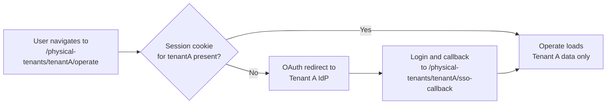

Operate and Tasklist serve data scoped to one Physical Tenant at a time. No cross-tenant data is displayed within a single web app session.

## Accessing web apps

Web apps are served at tenant-scoped URLs. To access a Physical Tenant's web app, navigate to its path directly:

| Web app  | URL pattern                                     | Example                                                         |
| :------- | :---------------------------------------------- | :-------------------------------------------------------------- |
| Operate  | `/physical-tenants/{physicalTenantId}/operate`  | `https://your-cluster/physical-tenants/riskproduction/operate`  |
| Tasklist | `/physical-tenants/{physicalTenantId}/tasklist` | `https://your-cluster/physical-tenants/riskproduction/tasklist` |

There is no global tenant switcher dropdown. To switch Physical Tenants, navigate to the target tenant's URL. Each tenant loads its own isolated session.

<!-- TODO: is a global tenant switcher dropdown on the roadmap? If yes, maybe add: "This may change in a future release." If no, will remove the hedge entirely. -->

### Access flow

For session isolation details, including path-scoped cookies and simultaneous multi-tenant browser tabs, see [session isolation](/self-managed/concepts/physical-tenants/authentication-authorization.md#session-isolation).

## Operate

When you access Operate at a Physical Tenant's URL, all data is scoped to that tenant. The following applies:

| Area                | Behavior                                                                                                    |
| :------------------ | :---------------------------------------------------------------------------------------------------------- |
| Process definitions | Only definitions deployed to this Physical Tenant are visible.                                              |
| Process instances   | Only instances running in this Physical Tenant are shown.                                                   |
| Variables           | Variable values displayed are scoped to this tenant's instances.                                            |
| Incidents           | Only incidents raised within this tenant are shown and can be resolved.                                     |
| Audit log           | Operation history is scoped to this tenant.                                                                 |
| Deployments         | Deployments and imports target this Physical Tenant's execution context.                                    |
| Cross-tenant data   | No cross-tenant data is displayed. Operate cannot query across Physical Tenant boundaries in a single view. |

## Tasklist

When you access Tasklist at a Physical Tenant's URL, all user tasks are scoped to that tenant:

| Area              | Behavior                                                                                                         |
| :---------------- | :--------------------------------------------------------------------------------------------------------------- |
| Task list         | Only user tasks belonging to this Physical Tenant are visible.                                                   |
| Variables         | Variable values shown on tasks are scoped to this tenant's process instances.                                    |
| Claim / release   | Claim, release, and reassign actions apply only to tasks in this tenant.                                         |
| Complete          | Completing a task submits variables back to this tenant's process instance.                                      |
| Cross-tenant data | No cross-tenant tasks are shown. Users cannot act on tasks from a different Physical Tenant in the same session. |

## Session behavior

### Simultaneous access to multiple tenants

Users can be logged into multiple Physical Tenants simultaneously using different browser tabs. Each tenant's session cookie is scoped to that tenant's URL path (`/physical-tenants/<id>`), so sessions do not interfere. See [session isolation](/self-managed/concepts/physical-tenants/authentication-authorization.md#session-isolation).

### Logout

Logout completes correctly per Physical Tenant. Navigate to the target tenant's logout endpoint to end that tenant's session.

:::note
A broken logout flow on Physical Tenant path chains was fixed in 8.10-alpha4. If you are running an earlier snapshot, upgrade to alpha4 or later.
:::

### Role changes mid-session

If a user's roles change while they are logged in to Operate or Tasklist, updated permissions apply on subsequent requests — the session is not immediately invalidated.

<!-- TODO: does the session token invalidate, or do permissions refresh on the next API call? Is there a maximum delay or a configurable refresh interval? -->

## Optimize

Each Physical Tenant runs Optimize as a separate Helm release, scoped to that tenant's cluster connection. Multiple Optimize instances are not managed through native Helm multi-tenant support.

:::note
Optimize documentation for Physical Tenants is being written by the Optimize team. Coordinate with Hamza and Immi before publishing any Optimize-specific configuration or setup content for Physical Tenants.
:::
