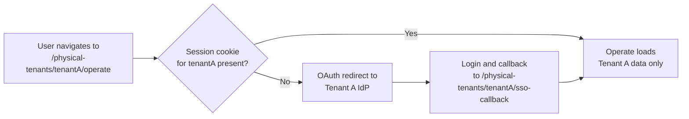

Operate, Tasklist, and Admin serve data scoped to one Physical Tenant at a time. No cross-tenant data is displayed within a single web app session.

## Accessing web apps

Web apps are served at tenant-scoped URLs. To access a Physical Tenant's web app, navigate to its path directly:

| Web app  | URL pattern                                     | Example                                                         |
| :------- | :---------------------------------------------- | :-------------------------------------------------------------- |
| Operate  | `/physical-tenants/{physicalTenantId}/operate`  | `https://your-cluster/physical-tenants/riskproduction/operate`  |
| Tasklist | `/physical-tenants/{physicalTenantId}/tasklist` | `https://your-cluster/physical-tenants/riskproduction/tasklist` |
| Admin    | `/physical-tenants/{physicalTenantId}/admin`    | `https://your-cluster/physical-tenants/riskproduction/admin`    |

There is no global tenant switcher dropdown. To switch Physical Tenants, navigate to the target tenant's URL. Each tenant loads its own isolated session.

### Access flow

```mermaid
flowchart LR
    A[User navigates to\n/physical-tenants/tenantA/operate] --> B{Session cookie\nfor tenantA present?}
    B -- Yes --> C[Operate loads\nTenant A data only]
    B -- No --> D[OAuth redirect to\nTenant A IdP]
    D --> E[Login and callback\nto /physical-tenants/tenantA/sso-callback]
    E --> C
```

For session isolation details, including path-scoped cookies and simultaneous multi-tenant browser tabs, see [session isolation](/self-managed/concepts/physical-tenants/authentication-authorization.md#session-isolation).

## Operate

When you access Operate at a Physical Tenant's URL, all data is scoped to that tenant.

## Tasklist

When you access Tasklist at a Physical Tenant's URL, all user tasks are scoped to that tenant.

## Session behavior

### Simultaneous access to multiple tenants

Users can be logged into multiple Physical Tenants simultaneously using different browser tabs. Each tenant's session cookie is scoped to that tenant's URL path (`/physical-tenants/<id>`), so sessions do not interfere. See [session isolation](/self-managed/concepts/physical-tenants/authentication-authorization.md#session-isolation).

### Logout

Logout completes correctly per Physical Tenant. Navigate to the target tenant's logout endpoint to end that tenant's session.

### Role changes mid-session

Changing a user's roles does not invalidate their Operate or Tasklist session, and does not log them out.

The resolved authentication context — including role, group, and tenant membership — is cached in the user's HTTP session and re-resolved after `camunda.security.authentication.authentication-refresh-interval` (default `PT30S`) has elapsed. Membership changes take effect on the first request after that interval.

Permissions granted to or revoked from a role are evaluated per request and take effect as soon as the change reaches secondary storage.

When roles or groups are sourced from identity-provider token claims (OIDC), changes at the identity provider are only picked up after the access token is refreshed or the user logs in again.

## Optimize

Each Physical Tenant runs Optimize as a separate Helm release, scoped to that tenant's cluster connection. Multiple Optimize instances are not managed through native Helm multi-tenant support.

<!-- TODO: Optimize documentation for Physical Tenants is being written by the Optimize team. Coordinate with Hamza and Immi before publishing any Optimize-specific configuration or setup content for Physical Tenants. -->
