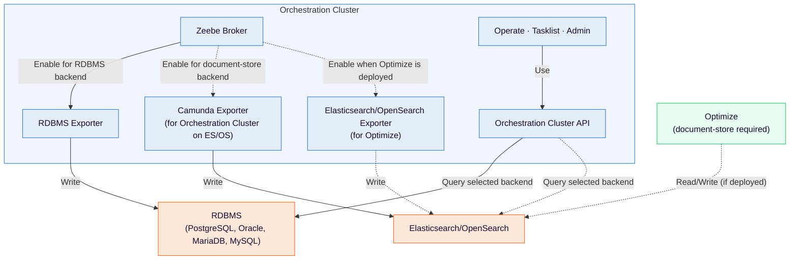

Camunda uses a layered storage model that separates workflow execution data from data used by web applications and APIs.

## About secondary storage

Secondary storage is one of the two complementary layers in Camunda’s data model:

| Layer             | Purpose                                                                                                                           | Technologies you can use    |
| :---------------- | :-------------------------------------------------------------------------------------------------------------------------------- | :-------------------------- |
| Primary storage   | Persists real-time workflow execution state managed by [Zeebe](/self-managed/components/orchestration-cluster/zeebe/overview.md). | RocksDB (embedded in Zeebe) |
| Secondary storage | Stores workflow, decision, and task data for querying, visualization, and API access.                                             | Document-store or RDBMS     |

:::note
Secondary storage is not a duplicate of primary data. It represents exported workflow and decision data optimized for querying and visualization.
:::

### Supported storage options

Camunda supports multiple secondary storage backends.  
For the latest list of supported database versions, see the  
[RDBMS version support policy](/self-managed/concepts/databases/relational-db/rdbms-support-policy.md).

Both document-store and RDBMS backends are valid secondary storage choices in Self-Managed deployments. Support maturity can vary by product area and version (for example, the Orchestration Cluster API, Operate, Tasklist, Admin, or Optimize), so confirm current compatibility details before choosing a backend.

| Database type          | Availability         | Use case                                                                                                                                                                                          |
| :--------------------- | :------------------- | :------------------------------------------------------------------------------------------------------------------------------------------------------------------------------------------------ |
| Document-store (ES/OS) | General availability | Secondary storage for indexing, search, and analytics.                                                                                                                                            |
| RDBMS                  | 8.9+                 | Secondary storage for relational database deployments. See the [RDBMS support policy](/self-managed/concepts/databases/relational-db/rdbms-support-policy.md) for supported vendors and versions. |

:::info OpenSearch support
Camunda 8 supports both [Amazon OpenSearch](https://aws.amazon.com/opensearch-service) and the open-source [OpenSearch](https://opensearch.org/) distribution.
:::

:::note
Starting in 8.9, Camunda 8 Run and default lightweight installs use H2 as the default secondary storage. Elasticsearch remains a supported alternative in Camunda 8 Run. OpenSearch and RDBMS-based secondary storage are supported in Self-Managed deployments. Enable the backend you need explicitly when required.

H2 is a convenience default for local development, testing, and evaluation. It is not a production reference architecture and is not a valid backend for multi-broker Helm clusters.
:::

1. The Zeebe broker executes workflow instances and stores state in primary storage.
1. Exporters, running as part of Zeebe, write orchestration data to the configured secondary storage backend and can write to multiple targets when needed.
1. Operate, Tasklist, and Admin use the Orchestration Cluster API, which reads data from the configured secondary storage backend.

## Choosing a secondary storage backend

Camunda supports multiple secondary storage backends, and the right choice depends on your workload and operational constraints.

For guidance on supported vendors, versions, and configuration, see:

- [Secondary storage configuration](/self-managed/concepts/secondary-storage/configuring-secondary-storage.md)
- [RDBMS configuration](/self-managed/deployment/helm/configure/database/rdbms.md)
- [RDBMS version support policy](/self-managed/concepts/databases/relational-db/rdbms-support-policy.md)
- [RDBMS benchmark results](./rdbms-benchmark-results.md)

:::note
The documentation is intentionally descriptive rather than prescriptive. Use benchmarking and sizing based on your own workload to choose the secondary storage backend that best meets your requirements.
:::

Learn how to configure secondary storage in Self-Managed environments using Helm, Docker, or manual deployment.

<a href="./configuring-secondary-storage" class="link-arrow">Configure secondary storage</a>

:::note
Although you should use secondary storage in nearly all production environments, you can choose to disable secondary storage in limited scenarios, such as lightweight development environments, specialized technical use cases, or resource-constrained deployments. See [run without secondary storage](no-secondary-storage.md).
:::

## Manage secondary storage

Learn about best practices for data management, backups, and monitoring to ensure data integrity and performance.

Effective secondary storage management ensures stability, scalability, and data integrity across your Camunda environment. By following Camunda best practices, you can avoid data corruption, maintain compliance, and ensure your orchestration environment remains performant and reliable.

<a href="./managing-secondary-storage" class="link-arrow">Manage secondary storage</a>

## Benchmark results

Review current benchmark results and caveats for PostgreSQL-based secondary storage.

<a href="./rdbms-benchmark-results" class="link-arrow">RDBMS benchmark results</a>

