This guide walks you through deploying Camunda 8 Self-Managed in an active-active dual-region setup on AWS ECS Fargate using Terraform.

## What you'll deploy

The reference architecture creates two symmetric ECS Fargate clusters, one per AWS region, with Zeebe brokers distributed across both regions to provide active-active resilience.

**What gets deployed:**

- Eight Zeebe brokers (four per region), replication factor 4, eight partitions. Zone-aware placement ensures every partition has replicas in both regions (`CAMUNDA_CLUSTER_PARTITIONING_ZONEAWARE_ZONES_*`).
- Two Connector tasks (one per region).
- Seconday Storage: 
   - One Aurora Global Database with a writer in region 0 and a cross-region reader in region 1, 
   - or two independent OpenSearch domains (one per region).
- Cross-region connectivity via: 
   - AWS Transit Gateway,
   - or VPC Peering.
- Application Load Balancers (ALB) for HTTP and metrics traffic, and Network Load Balancers (NLB) for gRPC and Zeebe inter-broker communication.

```mermaid

architecture-beta
    group regions(cloud)["Camunda dual region"]
    group r0(cloud)["Region 0 · us-east-1"] in regions
    group r1(cloud)["Region 1 · us-east-2"] in regions
    group aurora_global(logos:aws-rds)["Aurora Global Database"] in regions

    service ingress0(logos:aws-elb)["ALB and NLB ingress"] in r0
    service tasks0(logos:aws-ecs)["ECS Fargate workloads"] in r0
    service s3id0(logos:aws-s3)["S3 broker-ID lease"] in r0
    service s3bk0(logos:aws-s3)["S3 backup repository"] in r0
    service peer0(internet)["VPC Peering endpoint"] in r0

    service ingress1(logos:aws-elb)["ALB and NLB ingress"] in r1
    service tasks1(logos:aws-ecs)["ECS Fargate workloads"] in r1
    service s3id1(logos:aws-s3)["S3 broker-ID lease"] in r1
    service s3bk1(logos:aws-s3)["S3 backup repository"] in r1
    service peer1(internet)["VPC Peering endpoint"] in r1

    service db_primary(logos:aws-rds)["Primary writer · us-east-1"] in aurora_global
    service db_secondary(logos:aws-rds)["Secondary reader · us-east-2"] in aurora_global
    db_primary:R --> L:db_secondary

    ingress0:B -- T:tasks0
    tasks0:L -- R:s3id0
    tasks0:B -- T:s3bk0
    tasks0:R -- L:peer0


    peer0{group}:R <--> L:peer1{group}
    peer0{group}:B --> T:db_primary{group}
    peer1{group}:B --> T:db_secondary{group}

    ingress1:B -- T:tasks1
    tasks1:R -- L:s3id1
    tasks1:B -- T:s3bk1
    tasks1:L -- R:peer1
```



:::warning
Reference architectures provided in this guide are not turnkey modules. Camunda recommends cloning the repository and modifying it locally. You're responsible for operating and maintaining the infrastructure. Camunda updates the reference architecture over time, and changes may not be backward compatible.
:::

## Prerequisites

### AWS permissions

Your AWS IAM principal needs permissions for the following services:

- ECS (clusters, task definitions, services)
- RDS (Aurora Global, DB clusters, parameter groups)
- EC2 (VPCs, subnets, security groups, Transit Gateway or VPC Peering)
- ELB (ALB, NLB, target groups)
- IAM (roles, policies, instance profiles)
- KMS (key creation and grants)
- S3 (bucket creation and policy)
- CloudWatch (log groups and metrics)
- Secrets Manager (secret creation)
- Route 53 Resolver — required only if you enable `enable_cross_region_dns_resolver` in the VPC layer to resolve service discovery DNS across regions: `route53resolver:CreateResolverEndpoint`, `route53resolver:CreateResolverRule`, `route53resolver:AssociateResolverRule`

### AWS service quotas

Dual-region deployments may require quota increases. Before deploying, verify service quotas and request increases as needed.

- Aurora Global Database (some accounts require a support request to enable Aurora Global).
- Elastic IPs (NAT gateways consume one per AZ per region).
- Transit Gateway attachments (default limit per account).
- Fargate vCPU quota per region.
- VPC count per region.

### Tooling

| Tool              | Purpose                                                                                                                                                   |
| ----------------- | --------------------------------------------------------------------------------------------------------------------------------------------------------- |
| `terraform`       | Infrastructure provisioning — pin to the version in [`.tool-versions`](https://github.com/camunda/camunda-deployment-references/blob/main/.tool-versions) |
| `aws` CLI v2      | AWS resource inspection and authentication                                                                                                                |
| `just` (optional) | Task runner for common operations                                                                                                                         |
| `asdf` (optional) | Tool version management                                                                                                                                   |

Configure valid AWS credentials before starting. The [AWS Terraform provider](https://registry.terraform.io/providers/hashicorp/aws/latest/docs#authentication-and-configuration) supports several authentication methods:

- For development or testing, configure the AWS CLI — Terraform will detect and use those credentials automatically:

  ```bash
  aws configure
  ```

- For production, export credentials as environment variables: `AWS_ACCESS_KEY_ID` and `AWS_SECRET_ACCESS_KEY`.

### Obtain a copy of the reference architecture

Start by downloading a copy of the reference architecture from the GitHub repository. This content will be used throughout the rest of the guide. The reference architectures are versioned according to Camunda releases (for example, `stable/8.x`).

The reference architecture repository lets you reuse and extend the provided Terraform examples. This flexible implementation avoids the constraints of relying on third-party-maintained Terraform modules:

```bash reference
https://github.com/camunda/camunda-deployment-references/blob/main/aws/containers/ecs-dual-region-fargate/procedure/get-your-copy.sh
```

With the reference architecture in place, you can proceed with the remaining steps. Make sure you're in the correct directory before continuing.

## Architecture decisions

Make these decisions before running any `terraform apply`. They affect every layer of the deployment.

### Networking mode

| Option                    | `networking_mode` value | When to use                                                                                                         |
| ------------------------- | ----------------------- | ------------------------------------------------------------------------------------------------------------------- |
| Transit Gateway (default) | `transit_gateway`       | Production, existing TGW deployments, or anticipated future multi-VPC topologies. Incurs hourly and per-GB charges. |
| VPC Peering               | `vpc_peering`           | Development or proof-of-concept. Simpler to manage; limited to a direct 1:1 connection between the two regions.     |

:::note
Neither Transit Gateway nor VPC Peering encrypts traffic at the network layer. Raft replication between Zeebe brokers crosses the AWS backbone in cleartext unless you add an encryption layer (for example, IPsec on the TGW attachment, or application-layer TLS on the Zeebe broker channel). Regulated workloads should evaluate this before choosing.
:::

### VPC source

| Option     | `byo_vpc` value   | When to use                                                                                                                              |
| ---------- | ----------------- | ---------------------------------------------------------------------------------------------------------------------------------------- |
| Greenfield | `false` (default) | Terraform creates two VPCs, subnets across three availability zones, NAT gateways, internet gateways, and the cross-region link.         |
| BYO-VPC    | `true`            | You supply existing VPCs and subnets. Terraform skips VPC creation but still provisions the cross-region link and optional DNS resolver. |

**BYO-VPC requirements:** supply the following per region (replace `N` with `0` or `1`):

| Variable                           | Constraint                                                                                    |
| ---------------------------------- | --------------------------------------------------------------------------------------------- |
| `region_N_vpc_id`                  | Existing VPC ID (`vpc-xxxxxxxx`)                                                              |
| `region_N_vpc_cidr`                | CIDR of the existing VPC                                                                      |
| `region_N_private_subnet_ids`      | At least three private subnet IDs in distinct AZs (used by ECS tasks and Aurora)              |
| `region_N_public_subnet_ids`       | At least three public subnet IDs in distinct AZs with an internet gateway route (used by ALB) |
| `region_N_private_route_table_ids` | At least one private route table ID per region (for cross-region routes)                      |

### Secondary storage

| Option                | `secondary_storage_type` value | When to use                                                                                                                                                                                |
| --------------------- | ------------------------------ | ------------------------------------------------------------------------------------------------------------------------------------------------------------------------------------------ |
| Aurora Global (RDBMS) | `rdbms`                        | Default and recommended for new deployments. Single global database with built-in cross-region replication and managed failover. Does not support Optimize.                                |
| OpenSearch            | `opensearch`                   | Required if you need Optimize. One independent OpenSearch domain per region; brokers export to both. No native cross-region replication — you're responsible for replication and failover. |

:::warning
`secondary_storage_type` is a one-way decision. Switching after deployment requires a full export and re-import of runtime data; the reference architecture does not include an in-place migration path. Pick the storage type that matches your long-term needs before running `terraform apply`.
:::

## Terraform layout

The reference architecture splits infrastructure into three independent state layers, deployed in order:

| Layer | Directory          | Contents                                                                                | Change frequency |
| ----- | ------------------ | --------------------------------------------------------------------------------------- | ---------------- |
| VPC   | `terraform/vpc/`   | VPCs, subnets, NAT gateways, Transit Gateway or VPC Peering, optional Route 53 Resolver | Low              |
| Infra | `terraform/infra/` | Aurora Global or OpenSearch, ECS clusters, ALB, NLB, KMS, S3, Secrets Manager, IAM      | Low              |
| App   | `terraform/app/`   | Camunda orchestration cluster and Connector task definitions and ECS services           | High             |

Each layer reads the previous layer's outputs via `terraform_remote_state`. By default, the paths are relative:

- `terraform/infra/` reads `../vpc/terraform.tfstate`
- `terraform/app/` reads `../infra/terraform.tfstate`

If you use S3 remote backends, override `vpc_state_path` in `terraform/infra/terraform.tfvars` and `infra_state_path` in `terraform/app/terraform.tfvars` to point to the correct S3 URIs.

## Deployment walkthrough

### Step 1 — Configure

Create a `terraform.tfvars` file in each of the three Terraform directories before running `apply`.

#### `terraform/vpc/terraform.tfvars`

Required variables for a greenfield deployment:

```hcl
cluster_name       = "<your-cluster-name>"
aws_profile        = "<your-aws-profile>" # optional; omit when authenticating via AWS_ACCESS_KEY_ID / AWS_SECRET_ACCESS_KEY
region_0           = "<primary-region>"         # for example, us-east-1
region_1           = "<secondary-region>"       # for example, us-east-2
networking_mode    = "transit_gateway"           # or "vpc_peering"
region_0_cidr      = "10.192.0.0/16"
region_1_cidr      = "10.202.0.0/16"
single_nat_gateway = false                       # set true to reduce NAT costs in non-production
```

For BYO-VPC, add:

```hcl
byo_vpc = true

region_0_vpc_id                  = "vpc-<your-vpc-id>"
region_0_vpc_cidr                = "10.192.0.0/16"
region_0_private_subnet_ids      = ["subnet-aaa", "subnet-bbb", "subnet-ccc"]
region_0_public_subnet_ids       = ["subnet-ddd", "subnet-eee", "subnet-fff"]
region_0_private_route_table_ids = ["rtb-xxx"]

region_1_vpc_id                  = "vpc-<your-vpc-id>"
region_1_vpc_cidr                = "10.202.0.0/16"
region_1_private_subnet_ids      = ["subnet-ggg", "subnet-hhh", "subnet-iii"]
region_1_public_subnet_ids       = ["subnet-jjj", "subnet-kkk", "subnet-lll"]
region_1_private_route_table_ids = ["rtb-yyy"]
```

#### `terraform/infra/terraform.tfvars`

:::warning
The infra layer takes the `registry_username` and `registry_password` for `registry.camunda.cloud`. Do not commit `terraform.tfvars` to source control. Add `*.tfvars` to your `.gitignore`, or supply secrets via `TF_VAR_registry_username` / `TF_VAR_registry_password` environment variables or a secrets backend such as HashiCorp Vault.
:::

```hcl
cluster_name           = "<your-cluster-name>"   # must match vpc layer
aws_profile            = "<your-aws-profile>" # optional; omit when authenticating via env vars
region_0               = "<primary-region>"
region_1               = "<secondary-region>"
secondary_storage_type = "rdbms"                  # or "opensearch"
s3_force_destroy       = false                    # set true only if you need to destroy non-empty S3 buckets
limit_access_to_cidrs  = ["<your-source-cidr>"]   # required; restrict to the CIDR range that should reach the ALB
registry_username      = "<your-registry-user>"   # Camunda registry credentials for registry.camunda.cloud
registry_password      = "<your-registry-pass>"
```

#### `terraform/app/terraform.tfvars`

```hcl
aws_profile      = "<your-aws-profile>" # optional; omit when authenticating via env vars
camunda_image    = "registry.camunda.cloud/camunda/camunda:<camunda-version>"      # for example, 8.9.0
connectors_image = "camunda/connectors-bundle:<connectors-bundle-version>"          # for example, 8.10.0-alpha2
default_tags     = { Environment = "production", Team = "<your-team>" }
```

### Step 2 — Deploy VPC

```bash
cd terraform/vpc
terraform init
terraform plan
terraform apply
```

- **Greenfield:** creates two VPCs, six subnets (three private and three public per region), NAT gateways, internet gateways, and the cross-region link. Expect **3–5 minutes**.
- **BYO-VPC:** creates only the cross-region link and optional DNS resolver. Expect under **1 minute**.

### Step 3 — Deploy infra

```bash
cd ../infra
terraform init
terraform plan
terraform apply
```

This layer creates the Aurora Global Database or OpenSearch domains, ECS clusters, load balancers, KMS keys, S3 buckets, Secrets Manager secrets, and IAM roles.

:::note
Aurora Global Database creation takes 15–20 minutes. If Terraform reports a timeout, first check the Aurora cluster status in the AWS console or with `aws rds describe-global-clusters` before re-running `terraform apply`. A real failure (quota exceeded, KMS grant failure, IAM permission gap) does not resolve by re-running and will repeat each cycle. Only re-run when the cluster status is `creating` or `available`.
:::

After `apply` completes, a one-time `db_seed` ECS task runs automatically to create an IAM-authenticated `camunda` database user. The orchestration cluster connects to Aurora as this user using its ECS task role (no password). Monitor the seed task in CloudWatch Logs at `/ecs/<cluster_name>-r0-db-seed`. A successful run ends with the task exiting with status code `0`; if the task fails, re-running `terraform apply` re-triggers it.

### Step 4 — Deploy app

```bash
cd ../app
terraform init
terraform plan
terraform apply
```

`terraform apply` itself completes in approximately 30 seconds. The actual wait is ECS reaching steady state and the eight Zeebe brokers forming a Raft quorum, which can take up to 20 minutes on a cold start in a dual-region setup. If the cluster has not stabilized after 30 minutes, treat it as a real failure rather than continued patience and investigate (see below).

:::note
The `wait_for_steady_state` provider timeout may expire before all brokers stabilize. Before concluding success, verify cluster health with two checks:

1. In the ECS console for each region, confirm both the orchestration cluster and Connectors services show **steady state** with the expected running task count (four orchestration tasks per region, one Connectors task per region) and no recent task failures in the **Events** tab.
2. Run the `/v2/topology` check from Step 5 and confirm eight brokers are visible with healthy partitions.

If either check fails, do not proceed to verification. Inspect CloudWatch Logs for the orchestration-cluster log group and the ECS service event stream; the most common causes are image pull failures, IAM/Secrets Manager misconfiguration, and cross-region security group rules blocking ports 26500–26502.
:::

### Step 5 — Verify

Run the following checks after the app layer reaches steady state. Retrieve the ALB endpoints from `terraform output` in `terraform/app/`.

:::warning
The commands below use `http://` for first-deployment verification. HTTP transmits Basic auth credentials and process data in cleartext. Before exposing the cluster to any non-trusted network, attach a TLS certificate to the ALB (see [Next steps](#next-steps)) and rerun the verification over `https://`.
:::

**Zeebe topology:**

```bash
curl http://<region_0_alb_endpoint>/v2/topology
```

Confirm the response shows:

- Eight brokers in `brokers`
- Eight partitions across the cluster
- `replicationFactor` equal to 4
- All partition roles are `"leader"` or `"follower"` (all lowercase; no `null` entries)
- Zero unhealthy partitions

Both regional ALBs must return HTTP 200 on `/v2/topology`:

```bash
curl -o /dev/null -s -w "%{http_code}" http://<region_0_alb_endpoint>/v2/topology
curl -o /dev/null -s -w "%{http_code}" http://<region_1_alb_endpoint>/v2/topology
```

**Aurora Global Database status:**

```bash
aws rds describe-global-clusters \
  --query "GlobalClusters[*].{Status:Status,Members:GlobalClusterMembers[*].IsWriter}" \
  --output table
```

The output must show `Status=available` with two members (one writer, one reader).

**Process definition API** (when `secondary_storage_type = rdbms`):

```bash
curl -u admin:<admin-password> http://<region_0_alb_endpoint>/v2/process-definitions/search
```

Retrieve the admin password from AWS Secrets Manager (recommended). `terraform output` reads the secret from Terraform state in cleartext, so use it only for local development and ensure the state backend is protected.

Expect HTTP 200.

### Step 6 — Cleanup

Destroy resources in reverse order to respect layer dependencies:

```bash
cd terraform/app && terraform destroy
cd ../infra && terraform destroy
cd ../vpc && terraform destroy
```

:::warning
Set `s3_force_destroy = true` in `terraform/infra/terraform.tfvars` and re-run `terraform apply` on the infra layer before destroying it if the S3 backup buckets contain objects. Aurora Global backups write to S3, so non-empty buckets block destruction without this flag.
:::

## Next steps

After successfully deploying Camunda 8 in a dual-region setup, consider the following next steps:

- [Connect to an identity provider](/self-managed/components/orchestration-cluster/admin/connect-external-identity-provider.md) — integrate with an external identity system for authentication.
- Add TLS by attaching an [AWS Certificate Manager (ACM) certificate](https://docs.aws.amazon.com/elasticloadbalancing/latest/application/create-https-listener.html) to the Application Load Balancers.
- Review the [dual-region concept documentation](/self-managed/concepts/multi-region/dual-region.md) for current limitations and operational considerations.
- For failover and failback procedures, see the procedure scripts under `aws/containers/ecs-dual-region-fargate/procedure/` in the reference repository.
