This reference architecture deploys Camunda 8 Self-Managed across two AWS regions on ECS Fargate in an active-active configuration, with Aurora Global Database as secondary storage and Camunda 8.10 unified `/v2/*` REST API.

:::note Reference architecture
This guide covers the **Orchestration Cluster** and Connectors.
:::

## What you get

The reference architecture creates two identically configured ECS Fargate clusters, one per AWS region, with Zeebe brokers distributed across both regions.

- Active-active deployment across two AWS regions (default `eu-west-2` and `eu-west-3`; pick your own pair).
- Eight Zeebe brokers (four per region) with `cluster_size=8`, `replication_factor=4`, and `partition_count=8`. Asymmetric initial contact points use ECS Service Connect locally and the cross-region NLB for inter-region traffic.
- Aurora Global Database with a single writer endpoint per cluster, and with the [AWS JDBC Wrapper](https://github.com/aws/aws-advanced-jdbc-wrapper) `failover` plugin enabled for automatic reconnection after a writer change. PostgreSQL is the default engine; MySQL is available through [`db_engine`](#secondary-storage-engine).
- A zone-aware Zeebe cluster: each AWS region is a zone, and broker IDs take the form `<region>_<n>` (for example, `eu-west-2_0`). Failover and failback add or remove a whole zone through the [Zones API](/self-managed/components/orchestration-cluster/zeebe/operations/management-api.md#zones-api).
- Cross-region connectivity via [VPC peering](https://docs.aws.amazon.com/vpc/latest/peering/what-is-vpc-peering.html) (recommended default) or [AWS Transit Gateway](https://aws.amazon.com/transit-gateway/) for Enterprise scenarios.
- [Route 53 Resolver](https://docs.aws.amazon.com/Route53/latest/DeveloperGuide/resolver.html) endpoints to forward Cloud Map service-discovery DNS queries across regions.
- Camunda 8.10 or later. The unified Orchestration Cluster `/v2/*` REST API requires Basic authentication; see [Verify connectivity to Camunda 8](#verify-connectivity-to-camunda-8).

:::note Active-active scope
Active-active in this guide refers to the Zeebe data plane: one stretched cluster whose brokers and partitions live in both regions, accepting and processing work concurrently from either region. The Aurora-backed secondary storage tier is active-standby: region 0 hosts the writer and region 1 hosts a cross-region reader. Promoting region 1 to writer is an explicit operator step during failover, not an automatic property of the deployment. See [Promote the Aurora writer](#promote-the-aurora-writer).
:::



```mermaid

architecture-beta
    group regions(cloud)["Camunda dual region"]
    group r0(cloud)["Region 0 · eu-west-2"] in regions
    group r1(cloud)["Region 1 · eu-west-3"] in regions
    group aurora_global(logos:aws-rds)["Aurora Global Database"] in regions

    service ingress0(logos:aws-elb)["ALB and NLB ingress"] in r0
    service tasks0(logos:aws-ecs)["ECS Fargate workloads"] in r0
    service s3id0(logos:aws-s3)["S3 broker-ID lease"] in r0
    service s3bk0(logos:aws-s3)["S3 backup repository (shared)"] in r0
    service peer0(internet)["Cross-region link"] in r0

    service ingress1(logos:aws-elb)["ALB and NLB ingress"] in r1
    service tasks1(logos:aws-ecs)["ECS Fargate workloads"] in r1
    service s3id1(logos:aws-s3)["S3 broker-ID lease"] in r1
    service peer1(internet)["Cross-region link"] in r1

    service db_primary(logos:aws-rds)["Primary writer · eu-west-2"] in aurora_global
    service db_secondary(logos:aws-rds)["Secondary reader · eu-west-3"] in aurora_global
    db_primary:R --> L:db_secondary

    ingress0:B -- T:tasks0
    tasks0:L -- R:s3id0
    tasks0:B -- T:s3bk0
    tasks0:R -- L:peer0


    peer0{group}:R <--> L:peer1{group}
    peer0{group}:B --> T:db_primary{group}
    peer1{group}:B --> T:db_secondary{group}

    ingress1:B -- T:tasks1
    tasks1:R -- L:s3id1
    tasks1:L -- R:peer1
```

Both regions write backups to the single S3 backup bucket in region 0. Each region keeps its own S3 bucket for the broker-ID lease.

:::note
This reference architecture is not a turnkey module. Clone the repository and adapt it to your environment — you are responsible for operating and maintaining the resulting infrastructure.
:::

## Prerequisites

### AWS permissions

Your AWS IAM principal needs permissions for the following services in both target regions:

- ECS (clusters, task definitions, services)
- RDS (Aurora Global, DB clusters, parameter groups)
- EC2 (VPCs, subnets, security groups, Transit Gateway or VPC peering)
- ELB (ALB, NLB, target groups)
- IAM (roles, policies, instance profiles)
- KMS (key creation and grants)
- S3 (bucket creation and policy)
- EFS (file systems, mount targets)
- CloudWatch Logs (log groups)
- Secrets Manager (secret creation)
- Systems Manager Session Manager (`ssmmessages:*`), required for the [Session Manager access path](#method-b--session-manager-port-forward) and the [failover and failback scripts](#failover-and-failback)
- Route 53 Resolver — required only when `enable_cross_region_dns_resolver = true`: `route53resolver:CreateResolverEndpoint`, `route53resolver:CreateResolverRule`, `route53resolver:AssociateResolverRule`

### AWS service quotas

Dual-region deployments may require quota increases. Before deploying, verify the following quotas in both regions and request increases as needed:

- Aurora Global Database (some accounts require a support request to enable Aurora Global).
- Elastic IPs (NAT gateways consume one per AZ per region).
- Transit Gateway attachments (default account limit).
- Fargate vCPU quota per region.
- VPC count per region.

### Tooling

| Tool                     | Purpose                                                                                                                                                                                                                                                           |
| ------------------------ | ----------------------------------------------------------------------------------------------------------------------------------------------------------------------------------------------------------------------------------------------------------------- |
| `terraform`              | Infrastructure provisioning. The infra layer requires Terraform 1.9 or later. Pin to the version in [`.tool-versions`](https://github.com/camunda/camunda-deployment-references/blob/main/.tool-versions).                                                        |
| `aws` CLI v2             | AWS resource inspection and authentication.                                                                                                                                                                                                                       |
| `jq`                     | JSON parsing in verification commands and the failover and failback scripts.                                                                                                                                                                                      |
| `session-manager-plugin` | Required for the [Session Manager access path](#method-b--session-manager-port-forward) and for the [failover and failback scripts](#failover-and-failback). Install with `brew install --cask session-manager-plugin` on macOS or follow the [AWS instructions]. |
| `just` (optional)        | Task runner for common operations in the reference repository.                                                                                                                                                                                                    |
| `asdf` (optional)        | Tool version management.                                                                                                                                                                                                                                          |

[AWS instructions]: https://docs.aws.amazon.com/systems-manager/latest/userguide/session-manager-working-with-install-plugin.html

Configure valid AWS credentials before starting. The [AWS Terraform provider](https://registry.terraform.io/providers/hashicorp/aws/latest/docs#authentication-and-configuration) supports several authentication methods:

- For development or testing, configure the AWS CLI — Terraform automatically detects and uses those credentials:

  ```bash
  aws configure
  ```

- For production, export credentials as environment variables: `AWS_ACCESS_KEY_ID` and `AWS_SECRET_ACCESS_KEY`.

### Obtain a copy of the reference architecture

Download a copy of the reference architecture from the [GitHub repository](https://github.com/camunda/camunda-deployment-references). The reference architectures are versioned according to Camunda releases (for example, `stable/8.x`). The copy lets you reuse and extend the provided Terraform examples without the constraints of a third-party-maintained module:

```bash reference
https://github.com/camunda/camunda-deployment-references/blob/main/aws/containers/ecs-dual-region-fargate/procedure/get-your-copy.sh
```

With the reference architecture in place, you can proceed with the remaining steps. Make sure you're in the correct directory before continuing.

## Terraform layout

The reference architecture splits infrastructure into three independent state layers. Deploy them in order; each layer reads the previous layer's outputs via `terraform_remote_state`.

```
terraform/
├── vpc/    ← VPCs + cross-region networking. Supports BYO-VPC.
├── infra/  ← Aurora Global, ECS clusters, ALB/NLBs, KMS, S3, secrets, IAM.
└── app/    ← Camunda task definitions + ECS services.
```

| Layer | Directory          | Contents                                                                                      | Change frequency |
| ----- | ------------------ | --------------------------------------------------------------------------------------------- | ---------------- |
| VPC   | `terraform/vpc/`   | VPCs, subnets, NAT gateways, Transit Gateway or VPC peering, optional Route 53 Resolver       | Low              |
| Infra | `terraform/infra/` | Aurora Global Database, ECS clusters, ALB, NLB, KMS, S3, EFS, Secrets Manager, IAM            | Low              |
| App   | `terraform/app/`   | Camunda orchestration cluster and Connectors task definitions, plus the matching ECS services | High             |

### Terraform state backend

All three layers store their state in an S3 backend (`backend "s3"` with encryption enabled), so you need an existing S3 bucket for Terraform state before you start. The bucket can live in a different region from the deployment.

The infra and app layers read the previous layer's state from the same bucket through `terraform_remote_state`. Keep one key prefix for all three layers so each layer finds the others:

| Layer | State key                                               |
| ----- | ------------------------------------------------------- |
| VPC   | `<terraform_backend_key_prefix>vpc/terraform.tfstate`   |
| Infra | `<terraform_backend_key_prefix>infra/terraform.tfstate` |
| App   | `<terraform_backend_key_prefix>app/terraform.tfstate`   |

Supply the backend settings to `terraform init` with `-backend-config` in each layer (see [Step 2](#step-2--deploy-vpc)). Set the same values in the `terraform_backend_bucket`, `terraform_backend_key_prefix`, and `terraform_backend_region` variables of the infra and app layers (see [Step 1](#step-1--configure)).

## Deploy time and cost

Wall-clock time for a greenfield deploy to a first healthy `/v2/topology` response with eight brokers:

| Phase          | Wall clock             | What's slow                                                                                |
| -------------- | ---------------------- | ------------------------------------------------------------------------------------------ |
| `vpc/ apply`   | 3–5 min                | VPC creation plus cross-region peering or Transit Gateway attachment.                      |
| `infra/ apply` | 15–20 min              | Aurora Global Database creation (primary first, then secondary attaches).                  |
| `app/ apply`   | ~30 s plan + 15–20 min | ECS service rollout waits for steady state; first cross-region Raft quorum takes the most. |
| **Total**      | **35–45 min**          |                                                                                            |

`terraform destroy` is faster: about 15–20 minutes end-to-end, with Aurora teardown again the bottleneck.

Actual costs depend on region, instance sizing, commit discounts, and cross-region data egress. Use the [AWS Pricing Calculator](https://calculator.aws/#/) to estimate for your configuration.

## Architecture decisions

Make these decisions before running any `terraform apply`. They affect every layer of the deployment.

### Networking mode

| Option                | `networking_mode` value | When to use                                                                                                                                                                                                           |
| --------------------- | ----------------------- | --------------------------------------------------------------------------------------------------------------------------------------------------------------------------------------------------------------------- |
| VPC peering (default) | `vpc_peering`           | Simpler to manage. Start here if you don't have a cross-region network in place.                                                                                                                                      |
| Transit Gateway       | `transit_gateway`       | Enterprise scenarios — existing Transit Gateway deployments or hub-and-spoke topologies that need to integrate this cluster. Choose this only when you actually need it and understand the hourly and per-GB charges. |

:::note
Neither Transit Gateway nor VPC peering encrypts traffic at the network layer. Raft replication between Zeebe brokers crosses the AWS backbone in cleartext unless you add an encryption layer (for example, IPsec on the TGW attachment, or application-layer TLS on the Zeebe broker channel). Regulated workloads should evaluate this before choosing.
:::

### VPC source

| Option     | `byo_vpc` value   | When to use                                                                                                                              |
| ---------- | ----------------- | ---------------------------------------------------------------------------------------------------------------------------------------- |
| Greenfield | `false` (default) | Terraform creates two VPCs, subnets across three availability zones, NAT gateways, internet gateways, and the cross-region link.         |
| BYO-VPC    | `true`            | You supply existing VPCs and subnets. Terraform skips VPC creation but still provisions the cross-region link and optional DNS resolver. |

BYO-VPC is the preferred path for customers integrating with an existing AWS landing zone. Supply the following per region (replace `N` with `0` or `1`):

| Variable                           | Constraint                                                                                     |
| ---------------------------------- | ---------------------------------------------------------------------------------------------- |
| `region_N_vpc_id`                  | Existing VPC ID (`vpc-xxxxxxxx`).                                                              |
| `region_N_vpc_cidr`                | CIDR of the existing VPC.                                                                      |
| `region_N_private_subnet_ids`      | At least three private subnet IDs in distinct AZs (used by ECS tasks and Aurora).              |
| `region_N_public_subnet_ids`       | At least three public subnet IDs in distinct AZs with an internet gateway route (used by ALB). |
| `region_N_private_route_table_ids` | At least one private route table ID per region (for cross-region routes).                      |

The full validation contract — including the plan-time checks that fail with a descriptive error when a constraint is missing — lives in [`terraform/vpc/README.md`](https://github.com/camunda/camunda-deployment-references/blob/main/aws/containers/ecs-dual-region-fargate/terraform/vpc/README.md) in the reference repository.

### Secondary storage engine

The `db_engine` variable in `terraform/infra/terraform.tfvars` selects the Aurora engine for RDBMS secondary storage. It drives the Aurora clusters, the security group rules, the IAM database user seeding, and the generated JDBC URL. Choose the engine before the first `terraform apply`. Camunda doesn't support in-place migration between secondary storage backends, so switching engines later means creating a new deployment.

| `db_engine` value      | Aurora engine       | Port |
| ---------------------- | ------------------- | ---- |
| `postgresql` (default) | `aurora-postgresql` | 5432 |
| `mysql`                | `aurora-mysql`      | 3306 |

:::warning
Changing `db_engine` on an existing deployment replaces the global cluster and both regional clusters without a final snapshot. All secondary storage data is permanently lost.
:::

The published Camunda image doesn't include the MySQL JDBC driver. To use `db_engine = "mysql"`, build a custom image that adds it. See [user-supplied drivers](/self-managed/deployment/manual/rdbms/configuration.md#user-supplied-drivers-oracle-mysql).

### Secondary storage replication lag

Aurora Global Database replicates asynchronously, so promoting a new writer can leave it missing whatever had not reached it yet. Camunda retains the source records needed to recover that gap; Aurora replication alone does not prevent it.

Exporting and acknowledging are separate steps. The RDBMS exporter writes a record to the Aurora writer, then tells the broker the record is safe only after the required replica quorum confirms the flush marker. This architecture sets `min-sync-replicas` to one, so the single Aurora reader must confirm the marker before the exporter acknowledges the position. Until then, the record continues to occupy the Zeebe log. Holding that position back is enough to keep segments on disk; releasing them is not this exporter's decision alone, since [compaction](/self-managed/concepts/exporters.md) tracks the slowest consumer on the partition.

If the required replica falls behind, acknowledgement is held back and the Zeebe log grows. The replica catches up from the writer, not from Zeebe. The retained records matter when the writer itself is lost: the promoted reader resumes from its own position, and Zeebe replays the gap.

The reference architecture pins four properties under `camunda.data.secondary-storage.rdbms.`, shortened in the table below. [Multi-region support](/self-managed/concepts/databases/relational-db/configuration.md#multi-region-support) documents what each one does, including which vendors support `LOG_SEQ` and how the `DELAY` alternative behaves. The table records only which values this architecture picks and why.

| Setting                                       | Value     | Why this value here                                                                                                                                            |
| --------------------------------------------- | --------- | -------------------------------------------------------------------------------------------------------------------------------------------------------------- |
| `async-replication.enabled`                   | `true`    | Off by default. This architecture delegates replication to Aurora and treats a writer failover as routine, so the monitoring is not optional.                  |
| `async-replication.type`                      | `LOG_SEQ` | The preferred strategy, and Aurora Global Database with PostgreSQL supports it. The `DELAY` fallback would add a static wait to every acknowledgement instead. |
| `async-replication.max-lag`                   | `PT1H`    | Sized for a cross-region promotion under load, which runs past the `PT15M` default.                                                                            |
| `async-replication.pause-on-max-lag-exceeded` | `false`   | The engine default, kept deliberately.                                                                                                                         |

`max-lag` is pinned even though pausing is off, so the budget is already sized if you turn pausing on later, which is then a one-line change. Under `LOG_SEQ`, this value is compared with the age of the oldest exporter position still waiting for confirmation, not with a lag figure reported by Aurora. Turn pausing on only once you have alerting on replication lag. It makes a stall loud, because the exporter logs a warning and every later export raises an `ExporterException`, but writes to Aurora stop, so secondary storage stays stale until replication recovers. It protects nothing that acknowledgement does not already protect, since a record is reported safe to the broker only after confirmed replication either way.

EFS is elastic rather than a fixed-size volume, but a long outage still increases stored data, throughput use, and cost. Monitor EFS storage growth and throughput, and alert on replication lag.

An unsupported vendor or a non-global Aurora instance fails while the exporter is starting, and the message names the reason, so the deployment never comes up quietly without the replication signal. Later failures differ by where they happen. A replication status read that fails is logged and retried at the next poll. A failure to capture the replication marker while flushing pauses exporting instead, until the periodic checks recover. On the Aurora path the database privileges are exercised by those reads rather than checked at startup.

## Deployment walkthrough

### Step 1 — Configure

Create a `terraform.tfvars` file in each of the three Terraform directories before running `apply`.

#### `terraform/vpc/terraform.tfvars`

Required variables for a greenfield deployment:

```hcl
cluster_name       = "<your-cluster-name>"
aws_profile        = "<your-aws-profile>" # optional; omit when authenticating via AWS_ACCESS_KEY_ID / AWS_SECRET_ACCESS_KEY
region_0           = "<primary-region>"         # for example, eu-west-2
region_1           = "<secondary-region>"       # for example, eu-west-3
networking_mode    = "vpc_peering"              # default; set to "transit_gateway" only for Enterprise scenarios
region_0_cidr      = "10.192.0.0/16"
region_1_cidr      = "10.202.0.0/16"
single_nat_gateway = false                      # set to true to reduce NAT costs in non-production
```

For BYO-VPC, add:

```hcl
byo_vpc = true

region_0_vpc_id                  = "vpc-<your-vpc-id>"
region_0_vpc_cidr                = "<your-vpc-CIDR>"
region_0_private_subnet_ids      = ["subnet-aaa", "subnet-bbb", "subnet-ccc"]
region_0_public_subnet_ids       = ["subnet-ddd", "subnet-eee", "subnet-fff"]
region_0_private_route_table_ids = ["rtb-xxx"]

region_1_vpc_id                  = "vpc-<your-vpc-id>"
region_1_vpc_cidr                = "<your-vpc-CIDR>"
region_1_private_subnet_ids      = ["subnet-ggg", "subnet-hhh", "subnet-iii"]
region_1_public_subnet_ids       = ["subnet-jjj", "subnet-kkk", "subnet-lll"]
region_1_private_route_table_ids = ["rtb-yyy"]
```

#### `terraform/infra/terraform.tfvars`

:::warning
If you pull the Camunda image from `registry.camunda.cloud`, the infra layer takes your `registry_username` and `registry_password`. Do not commit `terraform.tfvars` to source control. Add `*.tfvars` to your `.gitignore`, or supply secrets via `TF_VAR_registry_username` / `TF_VAR_registry_password` environment variables or a secrets backend such as HashiCorp Vault.
:::

```hcl
cluster_name                 = "<your-cluster-name>"   # must match vpc layer
aws_profile                  = "<your-aws-profile>"    # optional; omit when authenticating via env vars
region_0                     = "<primary-region>"
region_1                     = "<secondary-region>"
terraform_backend_bucket     = "<your-tf-state-bucket>"
terraform_backend_key_prefix = "<your-key-prefix>/"    # same prefix for all three layers
terraform_backend_region     = "<tf-state-bucket-region>" # defaults to eu-central-1
db_engine                    = "postgresql"            # default; see Secondary storage engine
s3_force_destroy             = true                    # default; flip to false before running real workloads (see Cleanup)
limit_access_to_cidrs        = ["<your-source-cidr>"]  # defaults to 0.0.0.0/0; restrict to the CIDR range that should reach the load balancers
registry_username            = "<your-registry-user>"  # optional; only needed for images from registry.camunda.cloud
registry_password            = "<your-registry-pass>"
```

#### `terraform/app/terraform.tfvars`

```hcl
aws_profile                  = "<your-aws-profile>" # optional; omit when authenticating via env vars
region_0                     = "<primary-region>"   # must match the vpc and infra layers
region_1                     = "<secondary-region>"
terraform_backend_bucket     = "<your-tf-state-bucket>"
terraform_backend_key_prefix = "<your-key-prefix>/"
terraform_backend_region     = "<tf-state-bucket-region>"
camunda_image                = "registry.camunda.cloud/camunda/camunda:<camunda-version>" # 8.10 or later
connectors_image             = "camunda/connectors-bundle:<connectors-bundle-version>"     # pulled from Docker Hub without registry credentials
default_tags                 = { Environment = "reference", Team = "<your-team>" }
```

### Step 2 — Deploy VPC

Initialize each layer with the S3 backend settings from [Terraform state backend](#terraform-state-backend). The key changes per layer (`vpc/`, `infra/`, `app/`); the bucket, region, and prefix stay the same:

```bash
cd terraform/vpc
terraform init \
  -backend-config="bucket=<your-tf-state-bucket>" \
  -backend-config="key=<your-key-prefix>/vpc/terraform.tfstate" \
  -backend-config="region=<tf-state-bucket-region>"
terraform plan
terraform apply
```

- **Greenfield:** creates two VPCs, six subnets (three private and three public per region), NAT gateways, internet gateways, and the cross-region link. Expect 3–5 minutes.
- **BYO-VPC:** creates only the cross-region link and optional DNS resolver. Expect under 1 minute.

### Step 3 — Deploy infra

```bash
cd ../infra
terraform init \
  -backend-config="bucket=<your-tf-state-bucket>" \
  -backend-config="key=<your-key-prefix>/infra/terraform.tfstate" \
  -backend-config="region=<tf-state-bucket-region>"
terraform plan
terraform apply
```

This layer creates the Aurora Global Database, ECS clusters, load balancers, KMS keys, S3 buckets, EFS file systems, Secrets Manager secrets, and IAM roles.

:::note
Aurora Global Database creation takes 15–20 minutes. If Terraform reports a timeout, first check the Aurora cluster status in the AWS console or with `aws rds describe-global-clusters` before re-running `terraform apply`. A real failure (quota exceeded, KMS grant failure, IAM permission gap) does not resolve by re-running and will repeat each cycle. Only re-run when the cluster status is `creating` or `available`.
:::

After `apply` completes, a one-time `db_seed` ECS task runs automatically to create an IAM-authenticated `camunda` database user. The orchestration cluster connects to Aurora as this user using its ECS task role (no password). Monitor the seed task in CloudWatch Logs at `/ecs/<cluster_name>-r0-db-seed`. A successful run ends with the task exiting with status code `0`; if the task fails, re-running `terraform apply` re-triggers it.

### Step 4 — Deploy app

```bash
cd ../app
terraform init \
  -backend-config="bucket=<your-tf-state-bucket>" \
  -backend-config="key=<your-key-prefix>/app/terraform.tfstate" \
  -backend-config="region=<tf-state-bucket-region>"
terraform plan
terraform apply
```

`terraform apply` itself completes in approximately 30 seconds. The actual wait is ECS reaching steady state and the eight Zeebe brokers forming a Raft quorum, which can take up to 20 minutes on a cold start in a dual-region setup. If the cluster has not stabilized after 30 minutes, treat it as a real failure rather than continued patience and investigate (see below).

:::note
The `wait_for_steady_state` provider timeout may expire before all brokers stabilize. Before concluding success, verify cluster health with two checks:

1. In the ECS console for each region, confirm both the orchestration cluster and Connectors services show **steady state** with the expected running task count (four orchestration tasks per region, one Connectors task per region) and no recent task failures in the **Events** tab.
2. Run the `/v2/topology` check from Step 5 and confirm eight brokers are visible with healthy partitions.

If either check fails, do not proceed to verification. Inspect CloudWatch Logs for the orchestration-cluster log group and the ECS service event stream. The most common causes are image pull failures, IAM or Secrets Manager misconfiguration, and cross-region security group rules blocking ports 26500–26502.
:::

### Step 5 — Verify

Run the helper script from the reference repository to validate that the deployment is healthy in both regions. The script checks ECS service counts, the Zeebe topology, and Aurora Global Database status. It sources `procedure/export_environment_prerequisites.sh` automatically to read the Terraform outputs:

```bash
cd ../../  # back to aws/containers/ecs-dual-region-fargate
./procedure/verify_dual_region.sh
```

When `enable_cross_region_dns_resolver = true`, also confirm that cross-region service-discovery DNS works:

```bash
source ./procedure/export_environment_prerequisites.sh
./procedure/test_cross_region_dns.sh
```

To check the cluster yourself, retrieve the admin password and ALB endpoint from the infra layer, then call `/v2/topology` — Camunda 8.10 requires Basic authentication on all `/v2/*` endpoints:

```bash
cd terraform/infra
ALB_R0=$(terraform output -raw region_0_alb_endpoint)
ADMIN_PASS=$(terraform output -raw admin_user_password)
curl -s -u "admin:${ADMIN_PASS}" "http://${ALB_R0}/v2/topology" | jq '.brokers | length'
# Expected: 8 once Raft has settled
```

Confirm the full topology response shows:

- Eight brokers in `brokers`.
- Eight partitions across the cluster.
- `replicationFactor` equal to 4.
- All partition roles are `leader` or `follower` (all lowercase; no `null` entries).
- Zero unhealthy partitions.

Also verify Aurora Global health:

```bash
aws rds describe-global-clusters \
  --query "GlobalClusters[*].{Status:Status,Members:GlobalClusterMembers[*].IsWriter}" \
  --output table
```

The output must show `Status=available` with two members, one writer and one reader.

:::warning
The verification commands use `http://` because TLS is not configured by default. HTTP transmits Basic authentication credentials and process data in cleartext. Before exposing the cluster to any non-trusted network, attach a TLS certificate to the ALB (see [Next steps](#next-steps)) and rerun the verification over `https://`.
:::

### Step 6 — Cleanup

Destroy resources in reverse order to respect layer dependencies:

```bash
cd terraform/app && terraform destroy
cd ../infra && terraform destroy
cd ../vpc && terraform destroy
```

:::warning Cleanup caveat
The reference architecture sets `s3_force_destroy = true` by default so `terraform destroy` removes backup S3 buckets without manual emptying. Flip `s3_force_destroy` to `false` in `terraform/infra/terraform.tfvars` and re-apply the infra layer before running any real workload through the stack. Otherwise, `terraform destroy` will delete backup data permanently.
:::

#### Tear down after the Aurora writer moved

If the Aurora writer moved away from region 0, `terraform destroy` on the infra layer can hang on the Aurora resources. The writer moves when you [promote the Aurora writer](#promote-the-aurora-writer) during a failover, or when you run `failback.sh --switch-writer`. Terraform still expects the original topology. Remove the Aurora resources manually, then drop them from the Terraform state:

```bash
# 1. Remove both clusters from the global cluster
aws rds remove-from-global-cluster \
  --global-cluster-identifier <global-id> \
  --db-cluster-identifier <region-0-cluster-arn>

# 2. Delete the instances in both regions (skip the final snapshot only for non-production)
aws rds delete-db-instance --db-instance-identifier <r0-instance> --skip-final-snapshot --region <region-0>
aws rds delete-db-instance --db-instance-identifier <r1-instance> --skip-final-snapshot --region <region-1>

# 3. Wait for the instances to be deleted, then delete the clusters
aws rds delete-db-cluster --db-cluster-identifier <r0-cluster> --skip-final-snapshot --region <region-0>
aws rds delete-db-cluster --db-cluster-identifier <r1-cluster> --skip-final-snapshot --region <region-1>

# 4. Delete the global cluster
aws rds delete-global-cluster --global-cluster-identifier <global-id>

# 5. Remove the Aurora resources from the Terraform state and continue the destroy
terraform -chdir=terraform/infra state rm 'module.aurora_global[0].aws_rds_cluster_instance.primary[0]'
terraform -chdir=terraform/infra state rm 'module.aurora_global[0].aws_rds_cluster_instance.secondary[0]'
terraform -chdir=terraform/infra state rm 'module.aurora_global[0].aws_rds_cluster.primary'
terraform -chdir=terraform/infra state rm 'module.aurora_global[0].aws_rds_cluster.secondary'
terraform -chdir=terraform/infra state rm 'module.aurora_global[0].aws_rds_global_cluster.this'
terraform -chdir=terraform/infra destroy
```

## Verify connectivity to Camunda 8

Using Terraform, you can obtain the HTTP endpoint of each Application Load Balancer and interact with Camunda through the [Orchestration Cluster REST API](/apis-tools/orchestration-cluster-api-rest/orchestration-cluster-api-rest-overview.md).

:::warning HTTPS
To keep dependencies minimal and non-blocking for a quick start, this reference architecture omits a custom domain and TLS configuration.

You can add TLS by attaching an AWS Certificate Manager (ACM) certificate to each Application Load Balancer. For details, see the AWS documentation on [creating an HTTPS listener](https://docs.aws.amazon.com/elasticloadbalancing/latest/application/create-https-listener.html). Information on configuring a custom domain is available in the [Application Load Balancer documentation](https://docs.aws.amazon.com/elasticloadbalancing/latest/application/application-load-balancers.html#dns-name).

Without these additions, traffic is transmitted in cleartext and is therefore insecure.
:::

1. Navigate to the infra Terraform folder:

   ```bash
   cd terraform/infra
   ```

2. Retrieve an ALB endpoint. The dual-region setup is active-active, so either region's ALB works:

   ```bash
   terraform output -raw region_0_alb_endpoint
   terraform output -raw region_1_alb_endpoint
   ```

   Both ALBs expose the Orchestration Cluster and Connectors through the same port and use listener rules to determine the path they're on:
   - ALB:80
     - `/*` routes to the Orchestration Cluster UI and REST API.
     - `/connectors*` routes to the Connectors.
   - ALB:9600
     - The listener exists but only returns a fixed empty response. No rule forwards it to the Orchestration Cluster, because the app layer sets `enable_alb_http_management_listener_rule = false` in `terraform/app/camunda.tf`. The management API (`/actuator/*`) isn't reachable through the ALB. Use a [Session Manager port-forward](#method-b--session-manager-port-forward) to port `9600` instead.
     - Connectors combines the management port with the web server by default.
   - NLB:26500 (TCP)
     - Exposes the Orchestration Cluster Zeebe Gateway over gRPC. Retrieve the endpoint with `terraform output -raw region_0_nlb_grpc_endpoint` or `terraform output -raw region_1_nlb_grpc_endpoint`.

3. Access the URL of `region_0_alb_endpoint` (or `region_1_alb_endpoint`), which presents a login screen.

   The admin user is `admin`. The password is randomly generated and shared between regions. Retrieve it with:

   ```bash
   terraform output -raw admin_user_password
   ```

4. Use the [Orchestration Cluster REST API](/apis-tools/orchestration-cluster-api-rest/orchestration-cluster-api-rest-overview.md) to communicate with Camunda. Follow the [authentication example](/apis-tools/orchestration-cluster-api-rest/orchestration-cluster-api-rest-authentication.md) to authenticate and retrieve the cluster topology.

### Seeded users

Camunda 8.10 requires Basic authentication on the unified `/v2/*` REST API. Two users are seeded at first boot:

- `admin` — full access; use this user to log into Operate, Tasklist, and other Web UIs.
- `connectors` — used by the Connectors bundle to call the orchestration cluster.

Both passwords are auto-generated (32 random characters) and stored in AWS Secrets Manager. They are not `demo:demo`, matching the single-region ECS Terraform reference.

### Retrieve credentials

The admin password is generated once during the infra layer apply and shared by both regions:

```bash
cd terraform/infra
ADMIN_PASS=$(terraform output -raw admin_user_password)
echo "admin / $ADMIN_PASS"
```

The Connectors password is also stored in Secrets Manager. Retrieve it with the AWS CLI:

```bash
SECRET_ARN=$(terraform output -raw connectors_password_secret_region_0_arn)
CONNECTORS_PASS=$(aws secretsmanager get-secret-value \
  --secret-id "$SECRET_ARN" \
  --query SecretString --output text)
```

You can also locate the secrets in the AWS console at **Secrets Manager > `<cluster_name>-r0-oc-admin-user-password-*`**.

### Method A — direct via ALB

Use the ALB when your source IP is in `limit_access_to_cidrs`. This is the easiest path for an internet-facing demo.

```bash
ALB_R0=$(terraform output -raw region_0_alb_endpoint)

# Topology (auth required on 8.10+)
curl -s -u "admin:${ADMIN_PASS}" "http://${ALB_R0}/v2/topology" | jq '.brokers | length'
# Expected: 8 (four brokers per region once Raft has settled)

# Open Operate in a browser
open "http://${ALB_R0}/operate"
```

If `limit_access_to_cidrs` is restricted to a corporate CIDR your laptop is not in, use [Method B](#method-b--session-manager-port-forward).

### Method B — Session Manager port-forward

Use this method when the ALB is not reachable from your machine — for example, a private deployment, a locked-down CIDR allow-list, or a customer audit requirement that forbids opening a public endpoint. The session piggybacks on the ECS Exec channel; no bastion host is needed.

Requirements:

- `task_enable_execute_command = true` on the orchestration cluster module. The reference architecture sets this to `true` by default — see [`terraform/app/camunda.tf`](https://github.com/camunda/camunda-deployment-references/blob/main/aws/containers/ecs-dual-region-fargate/terraform/app/camunda.tf).
- The task IAM role must allow `ssmmessages:CreateControlChannel`, `ssmmessages:CreateDataChannel`, `ssmmessages:OpenControlChannel`, and `ssmmessages:OpenDataChannel`. The `ecs_exec_policy` in the orchestration-cluster module already grants these.
- [AWS Session Manager plugin](https://docs.aws.amazon.com/systems-manager/latest/userguide/session-manager-working-with-install-plugin.html) installed locally (`brew install --cask session-manager-plugin` on macOS).

Start the port-forwarding session:

```bash
# 1. Pick a running orchestration-cluster task in region 0
CLUSTER=$(cd terraform/infra && terraform output -raw cluster_name)
TASK_ARN=$(aws ecs list-tasks \
  --cluster "${CLUSTER}-r0-cluster" \
  --service-name "${CLUSTER}-r0-oc-orchestration-cluster" \
  --query 'taskArns[0]' --output text)
TASK_ID=${TASK_ARN##*/}

# 2. Resolve the ECS-managed runtime ID (Session Manager target)
RUNTIME_ID=$(aws ecs describe-tasks \
  --cluster "${CLUSTER}-r0-cluster" \
  --tasks "$TASK_ID" \
  --query 'tasks[0].containers[?name==`orchestration-cluster`].runtimeId' \
  --output text)

# 3. Start a port-forwarding session: localhost:8080 → container 8080
aws ssm start-session \
  --target "ecs:${CLUSTER}-r0-cluster_${TASK_ID}_${RUNTIME_ID}" \
  --document-name AWS-StartPortForwardingSession \
  --parameters '{"portNumber":["8080"],"localPortNumber":["8080"]}'
```

In another shell, open the UI and log in as `admin` with `$ADMIN_PASS`:

```bash
open http://localhost:8080
```

To reach the [management API](/self-managed/components/orchestration-cluster/zeebe/operations/management-api.md) on port 9600, start the same session with `{"portNumber":["9600"],"localPortNumber":["9600"]}`, then call `http://localhost:9600/actuator/...`. The [failover and failback scripts](#failover-and-failback) open this tunnel for you.

### Endpoint reference

| Endpoint                  | Port  | Protocol | Purpose                                                                               |
| ------------------------- | ----- | -------- | ------------------------------------------------------------------------------------- |
| ALB (region 0/1)          | 80    | HTTP     | Camunda REST API and Web UI (routes to container 8080).                               |
| ALB (region 0/1)          | 9600  | HTTP     | Listener with a fixed empty response. Not forwarded to the management API by default. |
| NLB external (region 0/1) | 26500 | TCP      | Zeebe gRPC for clients.                                                               |
| NLB internal (region 0/1) | 26502 | TCP      | Zeebe Raft, cross-region, private.                                                    |

## Operations

### Backup and restore

The general [backup and restore procedure](/self-managed/operational-guides/backup-restore/backup-and-restore.md) applies, with two dual-region specifics to keep in mind:

- **Backups share one bucket.** The infra layer creates a single S3 backup bucket in region 0, exposed as the `backup_bucket_region_0_name` output. Both orchestration clusters write to it through `CAMUNDA_DATA_BACKUP_S3_BUCKETNAME`, and region 1 brokers set `CAMUNDA_DATA_BACKUP_S3_REGION` to region 0 so they reach the bucket cross-region. All backup data stays in one place, whichever region you trigger the backup from. If you lose region 0, you lose access to the backup bucket until the region recovers, so plan S3 replication yourself if you need the backups in both regions.
- **Restore is not exposed by the dual-region app layer.** The underlying orchestration-cluster module supports an init-container restore (`restore_enabled`, `restore_backup_id` — see [restore options when using RDBMS](/self-managed/operational-guides/backup-restore/rdbms/restore.md#restore-options)), but these variables are not surfaced in `terraform/app/camunda.tf` in this reference. Enabling restore for a dual-region deployment requires customizing the app layer to pass the restore variables to both regional module invocations and to coordinate broker IDs that span both regions. Treat dual-region restore as an advanced scenario; validate it against your specific topology before relying on it.

:::note
Camunda recommends restoring to a fresh cluster rather than reusing an existing one. A newly created cluster has empty S3 backup buckets and EFS volumes, so no additional cleanup is needed. If you restore into an existing cluster, manually empty the S3 bucket configured for the node ID provider and fully clear the EFS volumes in both regions before starting the restore.
:::

### Failover and failback

The reference repository ships two scripts under `procedure/`, [`failover.sh`](https://github.com/camunda/camunda-deployment-references/blob/main/aws/containers/ecs-dual-region-fargate/procedure/failover.sh) and [`failback.sh`](https://github.com/camunda/camunda-deployment-references/blob/main/aws/containers/ecs-dual-region-fargate/procedure/failback.sh). They remove a lost region from the Zeebe cluster and add it back once it recovers. Failover is manual. No automated, health-check-driven failover is included.

#### Understand zone-based failover

The Zeebe cluster in this reference architecture is [zone-aware](/self-managed/components/orchestration-cluster/zeebe/configuration/zone-aware-clusters.md) (`CAMUNDA_CLUSTER_PARTITIONING_SCHEME=ZONE_AWARE`). Each AWS region is a zone, and the zone name is the region name, set by `CAMUNDA_CLUSTER_PARTITIONING_ZONEAWARE_ZONES_*_NAME` in `terraform/app/locals.tf`. Brokers name themselves `<zone>_<n>`, for example `eu-west-2_0` through `eu-west-2_3`.

With `replicationFactor = 4` across two zones, every partition keeps two replicas in each zone. When a region is lost, each partition is left with two of four replicas. That isn't a majority, so the partitions have no quorum until the lost zone is removed from the cluster. Removing the zone is what restores availability.

The scripts use the [Zones API](/self-managed/components/orchestration-cluster/zeebe/operations/management-api.md#zones-api) of the management API:

| Operation | Request                                              | Result                                                                               |
| --------- | ---------------------------------------------------- | ------------------------------------------------------------------------------------ |
| Failover  | `DELETE /actuator/cluster/zones/{zoneId}?force=true` | Removes the lost zone and its brokers from the partition distribution in one change. |
| Failback  | `POST /actuator/cluster/zones/{zoneId}`              | Adds the recovered zone back and redistributes partition replicas to its brokers.    |

Both operations are asynchronous. The scripts poll `GET /actuator/cluster/changes/{changeId}` until the change reaches `COMPLETED`, and fail if it ends as `FAILED` or `CANCELLED`.

#### Prepare to run the scripts

The management API listens on port 9600, which the ALB doesn't forward (see [Endpoint reference](#endpoint-reference)). The scripts therefore open an ECS Exec / Session Manager port-forward to a running orchestration cluster task in the surviving region. The shared helper [`procedure/zeebe_management_api.sh`](https://github.com/camunda/camunda-deployment-references/blob/main/aws/containers/ecs-dual-region-fargate/procedure/zeebe_management_api.sh) handles the tunnel, and no bastion host or public endpoint is needed.

Before you run either script:

1. Install `jq` and the `session-manager-plugin` (see [Tooling](#tooling)). ECS Exec is already enabled on the orchestration cluster services (`task_enable_execute_command = true`).
1. From `aws/containers/ecs-dual-region-fargate`, export the environment variables the scripts read from the Terraform outputs:

   ```bash
   source ./procedure/export_environment_prerequisites.sh
   ```

   The script exports `REGION_0`, `REGION_1`, `CLUSTER_0`, `CLUSTER_1`, `ALB_ENDPOINT_0`, `ALB_ENDPOINT_1`, `ADMIN_USER`, `ADMIN_PASS`, `AURORA_GLOBAL_CLUSTER_ID`, and `AURORA_ENGINE`, among others. Set `AWS_PROFILE` if you don't use the default credential chain.

Both scripts take `--failed-region 0|1` to name the region being failed away from and restored. The default is `0`.

#### Fail over to the surviving region

Run `failover.sh` against the region you lost:

```bash
# Scale region 0's ECS services to zero, then force-remove its zone
./procedure/failover.sh --failed-region 0
```

The script:

1. Checks that the surviving region's gateway answers on `/v2/topology`, and prints the topology before the change.
1. Scales every ECS service in the failed region to zero tasks, then waits 30 seconds for its brokers to drop out of cluster membership.
1. Sends `DELETE /actuator/cluster/zones/<failed-region>?force=true` through the tunnel and waits for the change to complete.
1. Confirms the zone is gone from the partition distribution and that every partition has a leader.

After a successful failover, the cluster runs on the four brokers of the surviving region, with `clusterSize` 4 and `replicationFactor` 2.

| Option         | Effect                                                                                                       |
| -------------- | ------------------------------------------------------------------------------------------------------------ |
| `--dry-run`    | Sends the request with `dryRun=true` and prints the planned operations. ECS and the cluster aren't changed.  |
| `--keep-tasks` | Skips the ECS scale-down. Use this when the region is already unreachable and its services can't be updated. |

The script passes `force=true` on purpose. By default, the Zones API [removes a zone](/self-managed/components/orchestration-cluster/zeebe/operations/management-api.md#remove-a-zone) with `force=false`, which gracefully drains the zone and needs its brokers to still be running. A failover is the opposite situation. Run `failover.sh` only when the region is actually lost or you've stopped its brokers, because forcing the removal of reachable brokers can cause data loss.

#### Promote the Aurora writer

`failover.sh` doesn't touch Aurora, so a failover doesn't change the Aurora writer. If the lost region hosted the writer (region 0 by default), secondary storage has no writer until you promote the Aurora cluster in the surviving region. Promote it with [`aws rds failover-global-cluster`](https://docs.aws.amazon.com/AmazonRDS/latest/AuroraUserGuide/aurora-global-database-disaster-recovery.html), then check the new writer:

```bash
aws rds describe-global-clusters \
  --global-cluster-identifier "${AURORA_GLOBAL_CLUSTER_ID}" \
  --query "GlobalClusters[0].GlobalClusterMembers[*].{Cluster:DBClusterArn,Writer:IsWriter}" \
  --output table
```

The Orchestration Cluster connects through the global writer endpoint, and the AWS JDBC Wrapper `failover` plugin reconnects to the new writer once the promotion completes. As described in [Secondary storage replication lag](#secondary-storage-replication-lag), the promoted cluster may be missing records that hadn't replicated yet. Zeebe replays that gap from its log.

If the lost region hosted only the Aurora reader, no promotion is needed.

#### Fail back to both regions

When the lost region is available again, run `failback.sh` against it:

```bash
# Restore region 0 and re-add its zone
./procedure/failback.sh --failed-region 0

# Restore region 0 and also move the Aurora writer back to region 0
./procedure/failback.sh --failed-region 0 --switch-writer
```

The script:

1. Prints the topology before the change.
1. Makes sure the recovered region's Aurora cluster is a member of the Aurora Global Database. If an unplanned failover left it detached but intact, the script reattaches it. If the cluster was destroyed, recreate it with `terraform apply` in `terraform/infra` and run the script again.
1. Scales the recovered region's ECS services back up, to four orchestration cluster tasks and one Connectors task.
1. Waits for the recovered brokers to rejoin cluster membership.
1. Sends `POST /actuator/cluster/zones/<recovered-region>` with `numberOfReplicas`, `priority`, and `numberOfBrokers`, then waits for the partition redistribution to complete.
1. Verifies the expected broker count, that every partition has a leader, and that none of the recovered brokers is idle.
1. With `--switch-writer`, moves the Aurora writer back to the recovered region with `aws rds failover-global-cluster`.

Re-adding the zone is required. The failover removed the zone from the persisted partition distribution. Restarted brokers rejoin cluster membership, but they don't host partitions until the zone is added back through the Zones API. Eight brokers in `/v2/topology` don't prove the failback worked on their own. Without the re-add, the four restored brokers sit idle with no replicas.

| Option            | Default                                 | Effect                                                                                                                                                |
| ----------------- | --------------------------------------- | ----------------------------------------------------------------------------------------------------------------------------------------------------- |
| `--switch-writer` | Off                                     | Moves the Aurora writer back to the recovered region after the zone is restored.                                                                      |
| `--dry-run`       | Off                                     | Sends the zone request with `dryRun=true` and prints the planned operations. ECS, the cluster, and Aurora aren't changed.                             |
| `--replicas N`    | `2`                                     | `numberOfReplicas` for the zone. Matches `replication_factor / 2` in `terraform/app/locals.tf`.                                                       |
| `--brokers N`     | `4`                                     | `numberOfBrokers` for the zone, which derives broker IDs `<zone>_0` to `<zone>_<N-1>`. Also sets the task count of the orchestration cluster service. |
| `--priority N`    | `1000` for region 0, `500` for region 1 | Zone `priority`. Matches `CAMUNDA_CLUSTER_PARTITIONING_ZONEAWARE_ZONES_*_PRIORITY` in `terraform/app/locals.tf`.                                      |

Keep the defaults unless you changed the cluster sizing in `terraform/app/locals.tf`.

After the failback, confirm the deployment is healthy in both regions:

```bash
./procedure/verify_dual_region.sh
```

After a successful failback, the topology summary that `failback.sh` prints shows eight brokers, eight partitions, 32 partition replicas, and a leader for every partition.

## Troubleshooting

### Logs

ECS task logs are exported to CloudWatch by default unless you configure otherwise. They are visible in the CloudWatch console and inline in the ECS service view alongside each task.

Retrieve the log group names from the app layer output:

```bash
cd terraform/app
terraform output -raw region_0_log_group_name
terraform output -raw region_1_log_group_name
```

### Accessing task or management API

ECS tasks are not reachable from outside the VPC without a workaround. Options include:

- Use the [Session Manager port-forward method](#method-b--session-manager-port-forward) to reach a running orchestration cluster task without a public IP. The reference architecture sets `task_enable_execute_command = true` by default, so the channel is already available.
- Run an EC2 or ECS debug task inside the same VPC and call the [management API](/self-managed/components/orchestration-cluster/zeebe/operations/management-api.md) over the private network.
- Connect via an [AWS Client VPN](https://aws.amazon.com/vpn/client-vpn/) attached to the VPC.
- Use Lambda or Step Functions to invoke the API.
- Temporarily expose the management API on the ALB by setting `enable_alb_http_management_listener_rule = true` for both orchestration cluster modules in `terraform/app/camunda.tf` (not recommended for production).

To open an interactive shell on a running task via [AWS ECS Exec](https://docs.aws.amazon.com/AmazonECS/latest/developerguide/ecs-exec-run.html):

```bash
CLUSTER=$(cd terraform/infra && terraform output -raw cluster_name)
TASK_ARN=$(aws ecs list-tasks \
  --cluster "${CLUSTER}-r0-cluster" \
  --service-name "${CLUSTER}-r0-oc-orchestration-cluster" \
  --query 'taskArns[0]' --output text)

aws ecs execute-command \
  --cluster "${CLUSTER}-r0-cluster" \
  --task "${TASK_ARN##*/}" \
  --container orchestration-cluster \
  --command "/bin/sh" \
  --interactive
```

For general troubleshooting, see the [operational guides troubleshooting documentation](/self-managed/operational-guides/troubleshooting.md).

## Known limitations

- **Experimental.** This reference architecture is intended for learning and validation. Validate it against your own requirements before you run production workloads on it.
- **Manual failover only.** No automated health-check-driven failover is included. Run the [failover and failback scripts](#failover-and-failback) yourself.
- **Components.** Only the Orchestration Cluster and Connectors are deployed. Management Identity (Keycloak), Web Modeler, and Console aren't included, and Optimize isn't available with RDBMS secondary storage.
- **ECS deployment circuit breaker disabled.** The circuit breaker is off for both orchestration cluster services. On a first deploy, brokers fail ECS health checks for a while as Aurora IAM authentication warms up and the cross-region Raft quorum forms, which takes about 20 minutes. The circuit breaker would roll the deployment back before the cluster recovers. With the breaker off, ECS keeps retrying until the 30-minute `service_timeouts.create` deadline. Once the cluster is stable, you can re-enable it for later deployments.

## Next steps

After you have a working dual-region deployment, consider the following:

- [Connect to an identity provider](/self-managed/components/orchestration-cluster/admin/connect-external-identity-provider.md) to integrate with an external identity system.
- Add TLS by attaching an [AWS Certificate Manager (ACM) certificate](https://docs.aws.amazon.com/elasticloadbalancing/latest/application/create-https-listener.html) to the Application Load Balancers.
- Review the [dual-region concept documentation](/self-managed/concepts/multi-region/dual-region.md) for current limitations and operational considerations.
- Browse the [single-region ECS Fargate guide](/self-managed/deployment/containers/cloud-providers/amazon/aws-ecs.md) for a comparison with the simpler single-region pattern.
