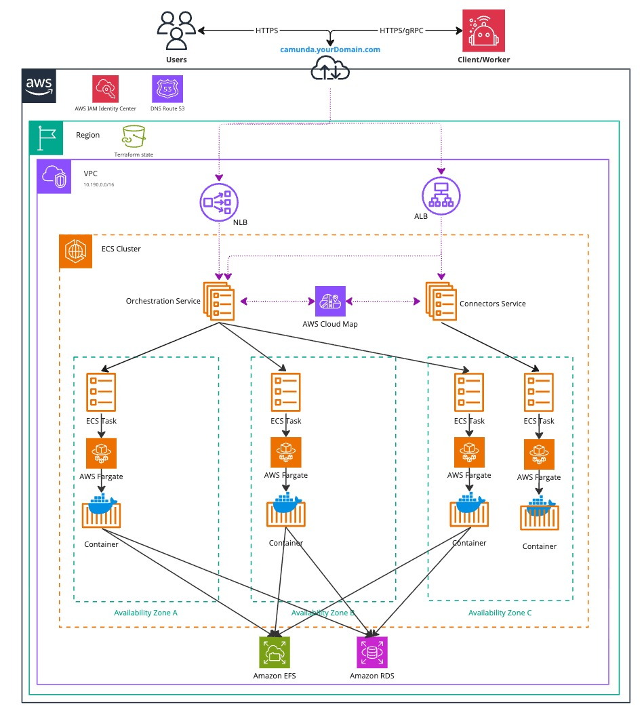

This guide shows you how to install the [Camunda 8 Orchestration Cluster](/reference/glossary.md#orchestration-cluster) on AWS Elastic Container Service (ECS) using Fargate and Aurora
PostgreSQL. You deploy a Self-Managed Camunda 8 environment using AWS managed services and then verify that all required components and connections are working.

This guide focuses on setting up the [Orchestration Cluster](/self-managed/reference-architecture/reference-architecture.md#orchestration-cluster-vs-web-modeler-and-console) and Connectors for Camunda 8. Web Modeler, Optimize, and Console are currently not covered.

## Considerations

:::warning Experimental release (8.9.0-alpha3)
This guide is based on an experimental release. Content and results may change before the final 8.9.0 release.
:::

Running this guide incurs costs on your AWS account, primarily for ECS and Aurora. Use the AWS [pricing calculator](https://calculator.aws/#/) to estimate costs for your region.

If you want a simpler setup, consider using [Camunda 8 SaaS](https://accounts.camunda.io/signup).

- Unlike our other guides, which usually separate infrastructure setup from the deployment of Camunda 8, this is not the case with ECS. Since the infrastructure is largely managed by AWS, deploying Camunda 8 and provisioning the required AWS resources happens in a single step.
- This work focuses on AWS ECS with Fargate.
- This work relies on a shared [multi-AZ replicated](https://docs.aws.amazon.com/efs/latest/ug/efs-replication.html) EFS network disk
  - Cost and performance may differ from a related Kubernetes setup with block storage
  - The EFS volume is shared among all brokers to support the native ECS Service capabilities
- AWS does not support block storage options in combination with ECS Services and Fargate. For a detailed overview, have a look at the [AWS documentation](https://docs.aws.amazon.com/AmazonECS/latest/developerguide/using_data_volumes.html).
- Scaling is a manual process as it requires invoking the [cluster scaling API](/self-managed/components/orchestration-cluster/zeebe/operations/cluster-scaling.md) for joining and removing a Zeebe broker. Autoscaling may not have effects as the brokers have to be explicitly joined into the Zeebe Cluster or when removed result in partitions or data becoming inaccessible.
- An extra developed node-id provider is integrated into Zeebe that assigns an available node-id based on Zeebe cluster information, whereas this is typically provided statically.
- This guide focuses on Aurora PostgreSQL for the secondary datastorage as it is a newly supported offering by Camunda 8 and potentially more familiar for customers.

## Outcome

The result is a fully functioning Camunda Orchestration Cluster deployed in a high-availability setup using AWS ECS with Fargate and a managed Aurora PostgreSQL instance using IAM authentication. All ECS tasks share a single EFS volume dedicated to Camunda.

### Architecture

The architecture outlined below describes a standard Zeebe three-node deployment, distributed across three [availability zones](https://aws.amazon.com/about-aws/global-infrastructure/regions_az/) within a single AWS region. It includes a managed Aurora PostgreSQL instance deployed under the same conditions. This approach ensures high availability and redundancy in case of a zone failure.

<!-- The following diagram should be exported as an image and as a PDF from the sources https://miro.com/app/board/uXjVL-6SrPc=/ -->
<!-- To export: click on the frame > "Export Image" > as PDF and as JPG (low res), then save it in the ./assets/ folder -->

_Infrastructure diagram for a 3 Zeebe Broker ECS architecture (click the image to view the PDF version)_

[](./assets/architecture.pdf)

After completing this guide, you will have:

- A [Virtual Private Cloud](https://docs.aws.amazon.com/vpc/latest/userguide/what-is-amazon-vpc.html) (VPC), which is a logically isolated virtual network.
  - _For simplification the private and public were not visualized in the diagram above._
  - A [Private Subnet](https://docs.aws.amazon.com/vpc/latest/userguide/configure-subnets.html), which does not have direct internet access.
  - [Elastic Container Service (ECS) Cluster](https://docs.aws.amazon.com/AmazonECS/latest/developerguide/clusters.html)
    - ECS Services for the Orchestration Cluster and Connectors
      - These spawn ECS tasks running on [Fargate](https://aws.amazon.com/fargate/)
    - [Elastic File System (EFS)](https://aws.amazon.com/efs/) as primary datastore for the Zeebe cluster
    - [Aurora PostgreSQL](https://aws.amazon.com/rds/aurora/) as secondary datastore
  - A [Public Subnet](https://docs.aws.amazon.com/vpc/latest/userguide/configure-subnets.html), which has internet access via an [Internet Gateway](https://docs.aws.amazon.com/vpc/latest/userguide/VPC_Internet_Gateway.html).
    - An [Application Load Balancer](https://docs.aws.amazon.com/elasticloadbalancing/latest/application/introduction.html) (ALB) to expose web interfaces such as Operate, Tasklist, Connectors, and the Orchestration Cluster REST API. This uses sticky sessions, as requests are otherwise distributed round-robin across ECS instances.
    - A [Network Load Balancer](https://docs.aws.amazon.com/elasticloadbalancing/latest/network/introduction.html) (NLB) to expose the gRPC endpoint of the Zeebe Gateway, if external applications need to connect.
- [Security Groups](https://docs.aws.amazon.com/vpc/latest/userguide/vpc-security-groups.html) to control network traffic to and from the ECS instances.
- An [Internet Gateway](https://docs.aws.amazon.com/vpc/latest/userguide/VPC_Internet_Gateway.html) to route traffic between the VPC and the internet.
- A [S3 bucket](https://aws.amazon.com/s3/) used by the Orchestration Cluster’s ECS-specific node-id provider.
- [AWS Secrets Manager](https://aws.amazon.com/secrets-manager/) for application credentials and optional container registry credentials.
- [AWS CloudWatch](https://aws.amazon.com/cloudwatch/) for logs.
- [ECS Service Connect](https://docs.aws.amazon.com/AmazonECS/latest/developerguide/service-connect.html) to connect ECS services directly with each other.
- [IAM authentication](https://docs.aws.amazon.com/AmazonRDS/latest/UserGuide/UsingWithRDS.IAMDBAuth.html) to connect the Orchestration Cluster with the Aurora PostgreSQL cluster.

Both subnet types are distributed across three availability zones in a single AWS region, supporting a high-availability architecture.

## Prerequisites

- **AWS account** – An AWS account to provision resources with permissions for **ecs**, **iam**, **elasticloadbalancing**, **kms**, **logs**, and **rds** services.
  - The user who creates AWS resources retains administrative access to them. Therefore, to ensure the resources are properly managed and owned by a single identity, Camunda recommends you use a dedicated AWS IAM user for Terraform to ensure better control and security.
  - For detailed permissions, refer to this [example policy](https://github.com/camunda/camunda-deployment-references/tree/main/aws/containers/ecs-single-region-fargate/example/policy.json).
- **Terraform** – Infrastructure as code tool (v1.7 or later). [Install Terraform](https://developer.hashicorp.com/terraform/install).
- **AWS CLI** – Command-line tool to manage AWS resources, used for `local-exec` to trigger the initial Aurora PostgreSQL user seeding. [Install AWS CLI](https://docs.aws.amazon.com/cli/latest/userguide/getting-started-install.html).

For the exact tool versions used during testing, refer to the repository's [.tool-versions](https://github.com/camunda/camunda-deployment-references/blob/main/.tool-versions) file.

## Set AWS credentials

1. Create [access keys](https://docs.aws.amazon.com/IAM/latest/UserGuide/id_credentials_access-keys.html) for your Terraform user via the AWS console.
2. Set the [AWS credentials](https://docs.aws.amazon.com/cli/latest/userguide/cli-chap-getting-started.html):

   ```bash
   export AWS_ACCESS_KEY_ID=<your-access-key-id>
   export AWS_SECRET_ACCESS_KEY=<your-secret-access-key>
   ```

   Both the AWS CLI and Terraform will use those credentials.

3. Ensure your credentials are correct:

   ```bash
   aws sts get-caller-identity
   ```

## Create an S3 bucket

Create an S3 bucket to store the Terraform state file. This is essential for collaborative work and helps prevent issues such as state file corruption.

1. Set your preferred AWS region as an environment variable:

   ```bash
   export AWS_REGION=<your-region>  # For example: eu-central-1
   ```

2. Create an S3 bucket:

   ```bash reference
   https://github.com/camunda/camunda-deployment-references/blob/main/aws/common/procedure/s3-bucket/s3-bucket-creation.sh
   ```

3. Enable versioning on the S3 bucket to track changes and protect the state file from accidental deletions or overwrites:

   ```bash reference
   https://github.com/camunda/camunda-deployment-references/blob/main/aws/common/procedure/s3-bucket/s3-bucket-versioning.sh
   ```

4. Secure the bucket by blocking public access:

   ```bash reference
   https://github.com/camunda/camunda-deployment-references/blob/main/aws/common/procedure/s3-bucket/s3-bucket-private.sh
   ```

5. Verify versioning is enabled on the bucket:

   ```bash reference
   https://github.com/camunda/camunda-deployment-references/blob/main/aws/common/procedure/s3-bucket/s3-bucket-verify.sh
   ```

The S3 bucket is now ready to securely store your Terraform state files.

## Clone the reference architecture

```bash reference
https://github.com/camunda/camunda-deployment-references/tree/main/aws/containers/ecs-single-region-fargate/procedure/get-your-copy.sh
```

To use another version of the reference architecture, change the branch. For example, `BRANCH="stable/8.8"`.

With the reference architecture, you can reuse and extend the provided Terraform examples. This flexible implementation avoids the constraints of relying on Terraform modules maintained by third-party developers.

You'll run all commands in the following steps from `camunda-deployment-references/aws/containers/ecs-single-region-fargate/`.

## Initialize Terraform

:::note Terraform infrastructure example
We do not recommend using the following Terraform-based infrastructure as a module, since we cannot guarantee compatibility.

Instead, we suggest reusing or extending components of the Terraform example to ensure alignment with your environment.
:::

To manage Camunda 8 infrastructure on AWS using Terraform, you need to configure Terraform's backend to store the state file remotely in an S3 bucket. This provides secure, persistent primary storage for your infrastructure.

Once authentication is configured, you can initialize your Terraform project. Earlier, you created a dedicated S3 bucket (`S3_TF_BUCKET_NAME`) for storing the state file. In this step, Terraform will use that bucket along with a specific key to manage your infrastructure state.

Initialize the backend and download the required provider plugins:

:::note
Make sure you are in the `terraform/cluster` subfolder: `camunda-deployment-references/aws/containers/ecs-single-region-fargate/terraform/cluster`.
:::

```bash reference
https://github.com/camunda/camunda-deployment-references/blob/main/aws/common/procedure/s3-bucket/s3-bucket-tf-init.sh
```

Terraform will now use the S3 bucket to manage the state file, ensuring remote and persistent storage.

Read about the [Terraform implementation](./about/terraform-implementation.md) to learn more.

## 2. Execution

:::note Secret management

We strongly recommend managing sensitive information using a secure secrets management tool such as HashiCorp Vault. For guidance on injecting secrets into Terraform via Vault, refer to the [Terraform Vault Secrets Injection Guide](https://developer.hashicorp.com/terraform/tutorials/secrets/secrets-vault).
:::

:::info Terraform Flow
Due to the `postgres_seed.tf` it is required that the machine executing it has the `AWS CLI` installed and configured to be able to start and wait for the seeding task to have finished.
:::

1. Open a terminal in the reference directory containing `config.tf` and the other `.tf` files.

2. Perform a final initialization to apply any changes made throughout this guide:

   ```bash reference
   https://github.com/camunda/camunda-deployment-references/blob/main/aws/common/procedure/s3-bucket/s3-bucket-tf-init.sh#L7
   ```

3. Plan the configuration files:

   ```bash
   terraform plan -out cluster.plan # describe what will be created
   ```

4. After reviewing the plan, you can confirm and apply the changes:

   ```bash
   terraform apply cluster.plan     # apply the creation
   ```

Terraform will now provision the Amazon ECS resources and the Aurora PostgreSQL cluster with all necessary configurations. This process may take approximately 20–30 minutes to complete.

The Terraform flow is as follows:

- Creation of the VPC and related resources, among that IAM roles
- Creation of the Aurora Postgres Cluster within the VPC
- Creation of the temporary Aurora Postgres seeding task and wait for it to finish
- Creation of the Orchestration Cluster and wait for it to be ready
- Creation of the Connectors and wait for it to be ready

## 4. Verify connectivity to Camunda 8

Using Terraform, you can obtain the HTTP endpoint of the Application Load Balancer and interact with Camunda through the [Orchestration Cluster REST API](/apis-tools/orchestration-cluster-api-rest/orchestration-cluster-api-rest-overview.md).

:::warning HTTPS

To keep dependencies minimal and non-blocking for a quick start, this reference architecture omits a custom domain and TLS configuration.

You can easily add TLS by attaching an AWS Certificate Manager (ACM) certificate to the Application Load Balancer (ALB). For details, see the AWS documentation on [creating an HTTPS listener](https://docs.aws.amazon.com/elasticloadbalancing/latest/application/create-https-listener.html).

Information on configuring a custom domain and understanding the ALB DNS name is available in the [Application Load Balancer documentation](https://docs.aws.amazon.com/elasticloadbalancing/latest/application/application-load-balancers.html#dns-name).

Without these additions, information is transmitted in plaintext and is therefore insecure.

:::

1. Navigate to the Terraform folder:

```sh
cd camunda-deployment-references-main/aws/containers/ecs-single-region-fargate/terraform
```

2. Retrieve the Application Load Balancer output:

```sh
terraform output -raw alb_endpoint
```

The ALB exposes both the Orchestration and Connectors through the same port and uses listener rules with weights to determine the path they're on.

- ALB:80
  - `/*` routes to the Orchestration Cluster UI/REST API
  - `/connectors*` routes to the Connectors
- ALB:9600 (optional - not recommended to be exposed publicly)
  - `/*` routes to the Orchestration Cluster
  - Connectors has the management port with the web server combined by default
- NLB:26500 (TCP)
  - Exposes the Orchestration Cluster - Zeebe Gateway with gRPC

3. Access the URL of `alb_endpoint` which should present you a login screen.

   The admin user name as pre-configured in `camunda.tf` is `admin` and the password is randomly generated and can be retrieved via:

   ```sh
   terraform output -raw admin_user_password
   ```

4. Use the [Orchestration Cluster REST API](/apis-tools/orchestration-cluster-api-rest/orchestration-cluster-api-rest-overview.md) to communicate with Camunda:

   Follow the example in the [Orchestration Cluster REST API documentation](/apis-tools/orchestration-cluster-api-rest/orchestration-cluster-api-rest-authentication.md) to authenticate and retrieve the cluster topology.

## Troubleshooting

### Logs

Logs are by default exported to CloudWatch unless configured otherwise by you. Those are both visible in the CloudWatch dashboard and the ECS Service alongside each task.

### Accessing task or management API

ECS tasks are not easily accessible without workarounds, some options are the following:

- EC2 / ECS debug instance / task within the same VPC to try to ping and use the [management API](/self-managed/components/orchestration-cluster/zeebe/operations/management-api.md)
- AWS VPN connected to the VPC
- Lambda functions
- Step functions
- Temporarily exposing the management API
- Temporarily set `task_enable_execute_command` to `true` and redeploy to allow accessing the running container

```sh
aws ecs execute-command \
  --cluster $ECS_CLUSTER \
  --task $ECS_TASK_ID \
  --container orchestration-cluster \
  --command "/bin/sh" \
  --interactive
```

You can find more information about `AWS ECS Exec` within the [AWS documentation](https://docs.aws.amazon.com/AmazonECS/latest/developerguide/ecs-exec-run.html).

For general troubleshooting assistance, consult the [operational guides troubleshooting documentation](/self-managed/operational-guides/troubleshooting.md).

## Next steps

After setting up your cluster, many users typically do the following:

- [Connect to an identity provider](/self-managed/components/orchestration-cluster/identity/connect-external-identity-provider.md) – integrate with an external identity system for authentication.
- [Add TLS](https://docs.aws.amazon.com/elasticloadbalancing/latest/application/create-https-listener.html) and configure a [custom domain](https://docs.aws.amazon.com/elasticloadbalancing/latest/application/application-load-balancers.html#dns-name) for the Application Load Balancer (ALB).
