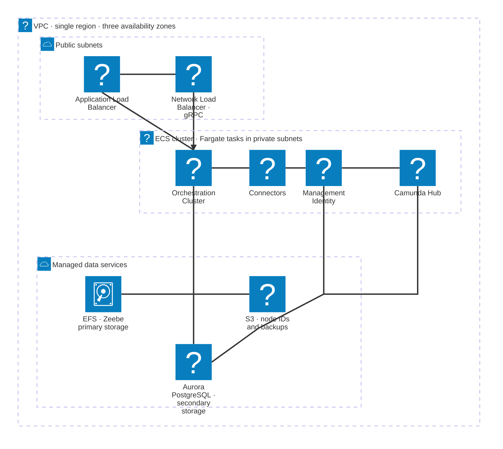

import Tabs from "@theme/Tabs";
import TabItem from "@theme/TabItem";

This guide walks you through deploying the [Camunda 8 Orchestration Cluster](/reference/glossary.md#orchestration-cluster) and Connectors on AWS Elastic Container Service (ECS) using Fargate and Aurora PostgreSQL, and verifying that all components are working.

:::tip New to AWS ECS?
If you are new to AWS ECS or Terraform, consider reviewing the [AWS ECS documentation](https://docs.aws.amazon.com/ecs/) and [Terraform documentation](https://developer.hashicorp.com/terraform/docs) before proceeding with this guide.
:::

## Prerequisites

- **AWS account** – An AWS account to provision resources with permissions for **ecs**, **iam**, **elasticloadbalancing**, **kms**, **logs**, and **rds** services.
  - For detailed permissions, refer to this [example policy](https://github.com/camunda/camunda-deployment-references/tree/main/aws/containers/ecs-single-region-fargate/example/policy.json).
- **Terraform** – Infrastructure as code tool (v1.7 or later). [Install Terraform](https://developer.hashicorp.com/terraform/install).
- **AWS CLI** – Command-line tool to manage AWS resources, used for `local-exec` to trigger the initial Aurora PostgreSQL user seeding. [Install AWS CLI](https://docs.aws.amazon.com/cli/latest/userguide/getting-started-install.html).

For the exact tool versions used during testing, refer to the repository's [.tool-versions](https://github.com/camunda/camunda-deployment-references/blob/main/.tool-versions) file.

### Considerations

:::warning
Running this guide incurs costs on your AWS account, primarily for ECS and Aurora. Use the AWS [pricing calculator](https://calculator.aws/#/) to estimate costs for your region.
:::

If you want a simpler setup, consider using [Camunda 8 SaaS](https://accounts.camunda.io/signup).

- Unlike our other guides, which usually separate infrastructure setup from the deployment of Camunda 8, this is not the case with ECS. Since the infrastructure is largely managed by AWS, deploying Camunda 8 and provisioning the required AWS resources happens in a single step.
- This guide focuses on AWS ECS with Fargate but can work with managed instances for more predictable performance. You can find more information about how to migrate from Fargate to managed instances from the [AWS migration guide](https://docs.aws.amazon.com/AmazonECS/latest/developerguide/migrate-fargate-to-managed-instances.html).
- This guide relies on a shared [multi-AZ replicated](https://docs.aws.amazon.com/efs/latest/ug/efs-replication.html) EFS network disk.
  - Cost and performance may differ from a related Kubernetes setup with block storage.
  - The EFS volume is shared among all brokers to support the native ECS Service capabilities.
- AWS does not support block storage options in combination with ECS Services and Fargate. For a detailed overview, have a look at the [AWS documentation](https://docs.aws.amazon.com/AmazonECS/latest/developerguide/using_data_volumes.html).
- Scaling is a manual process as it requires invoking the [cluster scaling API](/self-managed/components/orchestration-cluster/zeebe/operations/cluster-scaling.md) for joining and removing a [Zeebe Broker](../../../../../components/zeebe/technical-concepts/architecture.md#brokers). Autoscaling may not have effects as the brokers have to be explicitly joined into the [Zeebe cluster](../../../../../components/zeebe/technical-concepts/clustering.md) or when removed result in partitions or data becoming inaccessible.
- A node-id provider is integrated into Zeebe that assigns an available node-id based on Zeebe cluster information, instead of relying on a statically-configured node-id.
- This guide focuses on Aurora PostgreSQL for the secondary datastorage as it is a newly supported offering by Camunda 8 and potentially more familiar for customers.
  - You may still use Elasticsearch or OpenSearch but need to adjust the required configuration. More information about the configuration can be found in [our documentation](/self-managed/components/orchestration-cluster/core-settings/configuration/properties.md#data---secondary-storage).
  - Examples for how to deploy AWS OpenSearch can be found in other existing reference architectures for AWS.

:::warning
Reference architectures and examples provided in this guide are not turnkey modules. Camunda recommends cloning the repository and modifying it locally.

You are responsible for operating and maintaining the infrastructure. Camunda updates the reference architecture over time, and changes may not be backward compatible. You can use these updates to upgrade your customized codebase as needed.
:::

### Outcome

The result is a fully functioning Camunda Orchestration Cluster deployed in a high-availability setup using AWS ECS with Fargate and a managed Aurora PostgreSQL instance using IAM authentication. All ECS tasks share a single EFS volume dedicated to Camunda.

#### Architecture

The architecture outlined below describes a standard Zeebe three-node deployment, distributed across three [availability zones](https://aws.amazon.com/about-aws/global-infrastructure/regions_az/) within a single AWS region. It includes a managed Aurora PostgreSQL instance deployed under the same conditions. This approach ensures high availability and redundancy in case of a zone failure.


```mermaid

architecture-beta
    group vpc(logos:aws-vpc)["VPC · single region · three availability zones"]
    group public(cloud)["Public subnets"] in vpc
    group ecs(logos:aws-ecs)["ECS cluster · Fargate tasks in private subnets"] in vpc
    group data(cloud)["Managed data services"] in vpc

    service alb(logos:aws-elb)["Application Load Balancer"] in public
    service nlb(logos:aws-elb)["Network Load Balancer · gRPC"] in public

    service oc(logos:aws-fargate)["Orchestration Cluster"] in ecs
    service connectors(logos:aws-fargate)["Connectors"] in ecs
    service identity(logos:aws-fargate)["Management Identity"] in ecs
    service hub(logos:aws-fargate)["Camunda Hub"] in ecs

    service efs(disk)["EFS · Zeebe primary storage"] in data
    service s3(logos:aws-s3)["S3 · node IDs and backups"] in data
    service aurora(logos:aws-aurora)["Aurora PostgreSQL · secondary storage"] in data

    junction jstore in data
    junction japp in data

    alb:R -- L:nlb
    alb:B --> T:oc
    nlb:B --> T:oc

    oc:R -- L:connectors
    connectors:R -- L:identity
    identity:R -- L:hub

    oc:B -- T:jstore
    jstore:L -- R:efs
    jstore:R -- L:s3
    jstore:B -- T:aurora

    identity:B -- T:japp
    hub:B -- R:japp
    japp:L -- R:aurora
```

_Infrastructure diagram for the single-region ECS architecture. Management Identity and Camunda Hub are optional and are only deployed when you enable OIDC authentication._

Horizontal links between ECS services represent internal [ECS Service Connect](https://docs.aws.amazon.com/AmazonECS/latest/developerguide/service-connect.html) reachability within the cluster. Every component also reads its credentials from AWS Secrets Manager and writes logs to Amazon CloudWatch, which are omitted from the diagram to keep it readable.

After completing this guide, you will have:

- A [Virtual Private Cloud](https://docs.aws.amazon.com/vpc/latest/userguide/what-is-amazon-vpc.html) (VPC), which is a logically isolated virtual network.
  - _For simplification the private and public were not visualized in the diagram above._
  - A [Private Subnet](https://docs.aws.amazon.com/vpc/latest/userguide/configure-subnets.html), which does not have direct internet access.
  - [Elastic Container Service (ECS) Cluster](https://docs.aws.amazon.com/AmazonECS/latest/developerguide/clusters.html)
    - ECS Services for the Orchestration Cluster and Connectors, and optionally for Management Identity and Camunda Hub
      - These spawn ECS tasks running on [Fargate](https://aws.amazon.com/fargate/)
    - [Elastic File System (EFS)](https://aws.amazon.com/efs/) as primary datastore for the Zeebe cluster
    - [Aurora PostgreSQL](https://aws.amazon.com/rds/aurora/) as secondary datastore
  - A [Public Subnet](https://docs.aws.amazon.com/vpc/latest/userguide/configure-subnets.html), which has internet access via an [Internet Gateway](https://docs.aws.amazon.com/vpc/latest/userguide/VPC_Internet_Gateway.html).
    - (Optional) An [Application Load Balancer](https://docs.aws.amazon.com/elasticloadbalancing/latest/application/introduction.html) (ALB) to expose web interfaces such as Operate, Tasklist, Connectors, and the Orchestration Cluster REST API. This uses sticky sessions, as requests are otherwise distributed round-robin across ECS instances.
    - (Optional) A [Network Load Balancer](https://docs.aws.amazon.com/elasticloadbalancing/latest/network/introduction.html) (NLB) to expose the gRPC endpoint of the Zeebe Gateway, if external applications need to connect.
- [Security Groups](https://docs.aws.amazon.com/vpc/latest/userguide/vpc-security-groups.html) to control network traffic to and from the ECS instances.
- An [Internet Gateway](https://docs.aws.amazon.com/vpc/latest/userguide/VPC_Internet_Gateway.html) to route traffic between the VPC and the internet.
- An [S3 bucket](https://aws.amazon.com/s3/) used by the Orchestration Cluster’s ECS-specific node-id provider.
- A versioning-enabled [S3 bucket](https://aws.amazon.com/s3/) for backups.
  - Use a separate bucket for backups. The node-id bucket has versioning disabled because frequent metadata changes would incur additional cost without any benefit.
- [AWS Secrets Manager](https://aws.amazon.com/secrets-manager/) for application credentials and optional container registry credentials.
- [AWS CloudWatch](https://aws.amazon.com/cloudwatch/) for logs.
- [ECS Service Connect](https://docs.aws.amazon.com/AmazonECS/latest/developerguide/service-connect.html) to connect ECS services directly with each other.
- [IAM authentication](https://docs.aws.amazon.com/AmazonRDS/latest/UserGuide/UsingWithRDS.IAMDBAuth.html) to connect the Orchestration Cluster with the Aurora PostgreSQL cluster.

Both subnet types are distributed across three availability zones in a single AWS region, supporting a high-availability architecture.

You can also scale this setup to a single ECS task. In that case, a zone failure makes the environment unavailable.

## Configure AWS and initialize Terraform

:::note Terraform infrastructure example
We do not recommend using the following Terraform-based infrastructure as a module, since we cannot guarantee compatibility.

Instead, we suggest reusing or extending components of the Terraform example to ensure alignment with your environment.
:::

### Obtain a copy of the reference architecture

Start by downloading a copy of the reference architecture from the GitHub repository. This content will be used throughout the rest of the guide. The reference architectures are versioned according to Camunda releases (e.g., stable/8.x).

The reference architecture repository allows you to reuse and extend the provided Terraform examples. This flexible implementation avoids the constraints of relying on third-party-maintained Terraform modules:

```bash reference
https://github.com/camunda/camunda-deployment-references/tree/main/aws/containers/ecs-single-region-fargate/procedure/get-your-copy.sh
```

With the reference architecture in place, you can proceed with the remaining steps in this documentation. Make sure you're in the correct directory before continuing with the instructions.

### Terraform prerequisites

To manage Camunda 8 infrastructure on AWS using Terraform, you need to configure Terraform's backend to store the state file remotely in an S3 bucket. This provides secure, persistent primary storage for your infrastructure.

:::note
Advanced users may choose to configure a different backend. The setup described here is a recommended starting point for new users.
:::

#### Set up AWS authentication

The [AWS Terraform provider](https://registry.terraform.io/providers/hashicorp/aws/latest/docs) is required to provision resources in AWS. Before using the provider, you must authenticate it with your AWS credentials.

:::caution Ownership of the created resources

Any user who creates AWS resources retains administrative access to them. For better control and security, it is recommended to create a dedicated [AWS IAM user](https://docs.aws.amazon.com/IAM/latest/UserGuide/id_users.html) specifically for Terraform. This ensures the resources are properly managed and owned by a single identity.

:::

You can customize the region and authentication settings as needed. Terraform supports multiple [authentication methods](https://registry.terraform.io/providers/hashicorp/aws/latest/docs#authentication-and-configuration), including:

- For development or testing, you can use the [AWS CLI](https://docs.aws.amazon.com/cli/latest/userguide/cli-chap-getting-started.html). If your AWS CLI is already configured, Terraform will automatically detect and use those credentials.

To configure the AWS CLI:

```bash
aws configure
```

Enter your `AWS_ACCESS_KEY_ID`, `AWS_SECRET_ACCESS_KEY`, region, and output format. These can be retrieved from the [AWS Console](https://docs.aws.amazon.com/IAM/latest/UserGuide/id_credentials_access-keys.html).

- For production environments, it is recommended to use a dedicated IAM user. Create [access keys](https://docs.aws.amazon.com/IAM/latest/UserGuide/id_credentials_access-keys.html) for that user via the AWS console, and export them as environment variables: `AWS_ACCESS_KEY_ID` and `AWS_SECRET_ACCESS_KEY`.

#### Create an S3 bucket for Terraform state management

Before initializing Terraform, you must create an S3 bucket to store the state file. This is essential for collaborative work and helps prevent issues such as state file corruption.

Begin by setting your preferred AWS region as an environment variable to avoid repeating it in every command:

```bash
export AWS_REGION=<your-region>
```

Replace `<your-region>` with your chosen AWS region (e.g., `eu-central-1`).

Next, follow these steps to create an S3 bucket with versioning enabled:

1. Open your terminal and ensure that the AWS CLI is installed and properly configured.

2. Run the following command to create an S3 bucket for storing your Terraform state. Be sure to choose a unique bucket name, and ensure that the `AWS_REGION` environment variable is already set:

   ```bash reference
   https://github.com/camunda/camunda-deployment-references/blob/main/aws/common/procedure/s3-bucket/s3-bucket-creation.sh
   ```

3. Enable versioning on the S3 bucket to track changes and protect the state file from accidental deletions or overwrites:

   ```bash reference
   https://github.com/camunda/camunda-deployment-references/blob/main/aws/common/procedure/s3-bucket/s3-bucket-versioning.sh
   ```

4. Secure the bucket by blocking public access:

   ```bash reference
   https://github.com/camunda/camunda-deployment-references/blob/main/aws/common/procedure/s3-bucket/s3-bucket-private.sh
   ```

5. Verify versioning is enabled on the bucket:

   ```bash reference
   https://github.com/camunda/camunda-deployment-references/blob/main/aws/common/procedure/s3-bucket/s3-bucket-verify.sh
   ```

The S3 bucket is now ready to securely store your Terraform state files, with versioning enabled for added protection.

#### Initialize Terraform

Once authentication is configured, you can initialize your Terraform project. Earlier, you created a dedicated S3 bucket (`S3_TF_BUCKET_NAME`) for storing the state file. In this step, Terraform will use that bucket along with a specific key to manage your infrastructure state.

Initialize the backend and download the required provider plugins:

:::note
Make sure you are in the `terraform/cluster` subfolder: `camunda-deployment-references/aws/containers/ecs-single-region-fargate/terraform/cluster`.
:::

```bash reference
https://github.com/camunda/camunda-deployment-references/blob/main/aws/common/procedure/s3-bucket/s3-bucket-tf-init.sh
```

Terraform will now use the S3 bucket to manage the state file, ensuring remote and persistent storage.

## Terraform setup

The root workspace houses the overall implementation to keep things configurable and interchangeable as needed.

While each Camunda component is kept as a separate module to abstract the need of each component as it's required with their base setup.

If wanting to deploy multiple Camunda 8 setups, it may make sense to abstract the root workspace to a common module as well to allow easier scaling.

If not otherwise indicated, the `.tf` file is corresponding to the [root workspace path](https://github.com/camunda/camunda-deployment-references/tree/main/aws/containers/ecs-single-region-fargate/terraform/cluster).

### Elastic Container Service

`ecs.tf` contains the ECS cluster, which is just a logical component to group ECS resources.

`../../modules/ecs/fargate/orchestration-cluster` is the main component `Orchestration Cluster` of Camunda and contains the definitions for:

- ECS Service and task definition
  - Defines the base setup for the Orchestration Cluster, including the node ID provider, EFS configuration, and initial cluster endpoints.
  - Automatically sets the Zeebe cluster size based on the task count.
  - Resolves initial contact points using DNS with multiple A records instead of requiring explicit Zeebe Broker addresses.

- Task-specific IAM role
  - Grants access to AWS services required by this component, such as the S3 bucket and Aurora PostgreSQL.

- S3 bucket
  - Used by the ECS-specific node ID provider.

- CloudWatch log group
  - Used for Orchestration Cluster logs.
  - Can be shared with other Camunda components that have a one-to-one relationship with the Orchestration Cluster, such as Connectors.

- Networking configuration
  - Integrates with ECS Service Connect and Amazon Route 53 to enable access from within the VPC, including from resources outside the ECS cluster (for example, EC2 instances or Kubernetes clusters).

- Load balancer configuration
  - Adds listener rules to a shared load balancer for the Orchestration Cluster and Connectors.

- EFS file system

The base terraform documentation for this module can be found [alongside the repository](https://github.com/camunda/camunda-deployment-references/tree/main/aws/modules/ecs/fargate/orchestration-cluster).

`../../modules/ecs/fargate/connectors` is a secondary component `Connectors` and contains the definitions for:

- ECS Service and Task definition
- Task specific IAM role to allow access to AWS services isolated to this component
- Load Balancer related configurations to add listener rules to a shared Load Balancer between Orchestration Cluster and Connectors

The base terraform documentation for this module can be found [alongside the repository](https://github.com/camunda/camunda-deployment-references/tree/main/aws/modules/ecs/fargate/connectors).

`camunda.tf` contains the module invocations with an example base configuration for the Orchestration Cluster and Connectors:

- Aurora PostgreSQL configuration with the [AWS JDBC Wrapper](https://github.com/aws/aws-advanced-jdbc-wrapper) that comes as part of the Camunda distribution
- Basic authentication Admin setup
  - Admin user with random password
  - Connectors user with random password configured and pre-configured for Connectors to consume to connect to the Orchestration Cluster

In `camunda.tf` you can pass in any configuration adjustment required for the component or increase the resources. A few configuration options as mentioned above are kept as part of the modules to ensure the user can't interfere with the base setup. If you need to adjust those, then you have to adjust those in your copy of the modules.

### Aurora PostgreSQL

:::info Optional module

If you do not want to use this module, you can skip this section. However, you will need to adjust the remaining steps to remove any references to it.

If you choose not to use this module, you must provide your own PostgreSQL, Elasticsearch or OpenSearch instance and make required config adjustments.

Additionally, be sure to delete the `postgres.tf` and `postgres_seed.tf` file in your reference copy—otherwise, the resources defined in it will still be created. Additionally, remove the references for the IAM access in `iam.tf` following the `RDS IAM Auth Support` section.
:::

`postgres.tf` provisions an Aurora PostgreSQL cluster with a pre-created `camunda` database and admin credentials saved in the AWS Secrets Manager. This Aurora PostgreSQL cluster is used as secondary storage for the Orchestration Cluster.

`postgres_seed.tf` provisions a temporary ECS task to pre-seed the database for IAM authentication to work. The Aurora PostgreSQL cluster is not easily accessible from the outside as we don't expose it, therefore a workaround is required to do the initial user creation for the IAM authentication to work instead of using hard-coded username/password combinations.

If you're fine with username/password, you can remove the `postgres_seed.tf` and reuse the admin user that was created on creation to configure the Orchestration Cluster to consume said user.

### Miscellaneous Resources

`registry-auth.tf` contains the basics to create a secret via the AWS Secrets Manager for any kind of registry to access the Camunda images or bypass rate limitations.

`lb.tf` contains the creation of the main Network Load Balancer (NLB) and the Application Load Balancer (ALB).

`iam.tf` contains various IAM roles and policies.

`secrets.tf` contains the creation of random passwords and storage in AWS Secrets Manager.

`s3.tf` contains a bucket for backup purposes with versioning and encryption enabled. Access is handled through IAM role policies.

### Advanced Topics

#### Camunda components configuration

The Terraform implementation does not abstract any configuration and anything you need to configure for the Camunda components can be found within their own documentation.

Camunda components can be configured for example via environment variables or an application YAML.

##### Environment Variables

The base configuration is done via environment variables and defined directly as is in the invocation of the module.

An alternative approach, still with environment variables, could be to load them from an external file.

Example:

```bash title="orchestration-cluster-env"
KEY=VALUE
KEY2=VALUE2
KEY3=${template}
```

The file `orchestration-cluster-env` could then be loaded in Terraform via:

```hcl
locals {
  # Combine with templatefile to replace dynamic values derived from Terraform
  env_lines = split("\n", templatefile("orchestration-cluster-env", {
    template = "SOME_TF_VALUE"
  }))

  # Splits KEY=VALUE into expected JSON
  env_kv_pairs = [
    for line in local.env_lines : {
      name  = trim(split("=", line)[0], " ")
      value = trim(join("=", slice(split("=", line), 1, length(split("=", line)))), " ")
    }
    if length(split("=", line)) > 1  # Filter out lines without '='
  ]
}
```

This can then be passed to the module invocation

```hcl
environment_variables = local.env_kv_pairs # or mixed with the concat function
```

##### Application YAML

1. This can either be baked into a custom image permanently by you
2. Pull application YAML on startup via init container from external store or integrate in Terraform

Example:

```hcl
init_container_enabled = true
init_container_image   = "public.ecr.aws/amazonlinux/amazonlinux:minimal"
init_container_command = ["sh", "-c", "curl -fsSL https://example.com/additional-properties.yaml -o /config/additional-properties.yaml"]
```

Add this as part of your module environment usages to let Spring know to load the additional file.

```hcl
{
  name  = "SPRING_CONFIG_IMPORT"
  value = "file:./config/additional-properties.yaml"
}
```

`/config` is a shared ephemeral volume between the init container and the running container.

#### Terraform Configuration

The base terraform documentation for the Orchestration can be found [alongside the repository](https://github.com/camunda/camunda-deployment-references/tree/main/aws/modules/ecs/fargate/orchestration-cluster) as well as for [Connectors](https://github.com/camunda/camunda-deployment-references/tree/main/aws/modules/ecs/fargate/connectors).

Some common topics to potentially change:

##### Resources

```hcl
# both modules

task_cpu              = 4096
task_cpu_architecture = "X86_64"
task_memory           = 8192
```

The EFS file system uses the `elastic` throughput mode by default. This mode automatically scales for most workloads. If you need a fixed throughput configuration, adjust the `efs_throughput_mode` and `efs_provisioned_throughput_in_mibps` variables.

Example:

```hcl
# Orchestration Cluster

efs_throughput_mode                    = "provisioned"
efs_provisioned_throughput_in_mibps    = 50
```

##### Camunda

###### Image

```hcl
# both modules

image = "camunda/camunda:VERSION" # "camunda/connectors-bundle:VERSION"
```

You could supply your custom registry and version this way like:

```hcl
image = "ghcr.io/NAMESPACE/IMAGE_NAME:VERSION"
```

###### Sizing

```hcl
# both modules

task_desired_count = X
# in case of Orchestration Cluster automatically changes the `camunda.cluster.size`
```

###### Wait for ready

This flag ensures that Terraform waits until the ECS service is successfully deployed.

It is useful when other components, such as Connectors, depend on the Orchestration Cluster, because it prevents them from being deployed before the cluster is ready.

If you disable this flag, Terraform deploys all resources at once without waiting for service readiness.

```hcl
# both modules
wait_for_steady_state = true
```

#### Aurora PostgreSQL initial user seeding

When wanting to use IAM authentication to simplify the authentication between Orchestration Cluster and Aurora PostgreSQL cluster then an initial seeding of the database is required to have a passwordless user with the `rds_iam` role assigned. More information about IAM authentication with Aurora can be found in the [AWS documentation](https://docs.aws.amazon.com/AmazonRDS/latest/UserGuide/UsingWithRDS.IAMDBAuth.DBAccounts.html#UsingWithRDS.IAMDBAuth.DBAccounts.PostgreSQL).

Terraform itself can't do this initial seeding as the Aurora PostgreSQL is not publicly exposed, so a workaround is needed. In our reference architecture to keep things simple and working ideally immediately, a local execution was used that triggers a one time seeding job to do the required steps as the ECS has access to Aurora PostgreSQL cluster.

As previously mentioned, if you don't want to do this local execution, you can delete the `postgres_seed.tf` and remove the `depends_on` in `camunda.tf`.

Alternatives are for example:

- Externally supplied PostgreSQL
- Rely on username / password of e.g. admin user
- Manual seeding via an EC2 instance or ECS task in the same VPC or a connected VPN
- Temporarily exposing the Aurora PostgreSQL cluster (not recommended)
- AWS Lambda function that does the seeding
- AWS Step function that does the seeding

It was implemented as a `local exec` with an ECS task since we wanted to provide a fully working reference end-to-end while still relying on something like IAM authentication.

#### Rolling deployments

The Orchestration Cluster is stateful and overprovisioning will not help the deployment to reach a ready state quicker as we're limited by the Zeebe node-ids and brokers only becoming ready when successfully joining a cluster. Therefore, the Orchestration Cluster does a deployment of maximum `100%` of tasks and minimum `66%` to ensure quorum is kept. If using smaller task sizes, you may have to consider using `service_force_new_deployment = true` to force a new deployment as otherwise the minimum and maximum task size will block a successful update.

For the Connectors task, it's kept at a maximum of `200%` and minimum of `50%` as the application is stateless and can therefore scale above the initial target during upgrades.

## Deploy Management Identity with OIDC authentication

[Management Identity](/self-managed/components/management-identity/overview.md) is the Camunda 8 component responsible for authentication and authorization of the components outside the Orchestration Cluster, such as Camunda Hub. In this reference architecture, Management Identity is deployed as an additional ECS service and is only created when you switch the platform to OpenID Connect (OIDC) authentication.

Authentication is controlled by a single `authentication_mode` input in `terraform/cluster`:

| Mode              | Behavior                                                                                                                                                                                 |
| ----------------- | ---------------------------------------------------------------------------------------------------------------------------------------------------------------------------------------- |
| `basic` (default) | The Orchestration Cluster and Connectors use built-in users with generated passwords. No identity provider and no Management Identity are deployed.                                      |
| `oidc`            | The Orchestration Cluster, Connectors, and Management Identity authenticate through an OIDC provider. Management Identity is deployed, and Camunda Hub becomes available for deployment. |

To enable OIDC, set the following in your `terraform.tfvars` or pass it with `-var`:

```hcl
authentication_mode = "oidc"
```

### Choose an OIDC provider

The reference architecture ships a bundled OIDC provider so the stack runs end-to-end without an external dependency. Every Camunda component reads a single provider-agnostic OIDC interface, so the bundled provider and your own provider are wired the same way.

To use your own provider, such as Microsoft Entra ID or Okta, set the `external_oidc` object. The bundled provider is then skipped entirely.

| Field                             | Description                                                                |
| --------------------------------- | -------------------------------------------------------------------------- |
| `issuer_uri`                      | Issuer URI of your OIDC provider, used for discovery and token validation. |
| `token_uri`                       | Token endpoint used for machine-to-machine authentication.                 |
| `audience`                        | Audience expected in issued access tokens.                                 |
| `identity_client_id`              | Client ID registered for Management Identity.                              |
| `identity_client_secret_arn`      | Secrets Manager ARN holding the Management Identity client secret.         |
| `orchestration_client_id`         | Client ID registered for the Orchestration Cluster.                        |
| `orchestration_client_secret_arn` | Secrets Manager ARN holding the Orchestration Cluster client secret.       |
| `connectors_client_id`            | Client ID registered for Connectors.                                       |
| `connectors_client_secret_arn`    | Secrets Manager ARN holding the Connectors client secret.                  |

Register one client per component in your provider, store each client secret in AWS Secrets Manager, and reference the secrets by ARN. Terraform never accepts raw secret values here. All fields are required once `external_oidc` is set, and `external_oidc` is only valid together with `authentication_mode = "oidc"`. Both rules are enforced by plan-time preconditions.

```hcl
authentication_mode = "oidc"

external_oidc = {
  issuer_uri                      = "https://login.example.com/realms/camunda"
  token_uri                       = "https://login.example.com/realms/camunda/protocol/openid-connect/token"
  audience                        = "camunda-api"
  identity_client_id              = "camunda-identity"
  identity_client_secret_arn      = "arn:aws:secretsmanager:eu-central-1:123456789012:secret:identity-client-secret"
  orchestration_client_id         = "orchestration"
  orchestration_client_secret_arn = "arn:aws:secretsmanager:eu-central-1:123456789012:secret:orchestration-client-secret"
  connectors_client_id            = "connectors"
  connectors_client_secret_arn    = "arn:aws:secretsmanager:eu-central-1:123456789012:secret:connectors-client-secret"
}
```

:::warning
Browser-based OIDC login does not complete over plain HTTP. Set `alb_certificate_arn` to an AWS Certificate Manager (ACM) certificate ARN before enabling OIDC. The Application Load Balancer then serves an HTTPS listener on port 443, redirects port 80 to it, and forwards the `X-Forwarded-Proto` header so the login redirect succeeds. Use `alb_ssl_policy` to change the negotiated SSL policy.
:::

### Resources created for Management Identity

`../../modules/ecs/fargate/management-identity` is deployed when `authentication_mode = "oidc"` and contains the definitions for:

- ECS Service and task definition, running Management Identity in generic OIDC mode.
- Task-specific IAM role, isolated to this component.
- Load balancer configuration to add a listener rule to the shared Application Load Balancer. Exposure is opt-in and disabled by default through `enable_alb_http_webapp_listener_rule`.
- Networking configuration that registers Management Identity with ECS Service Connect, reachable inside the VPC as `identity` on port `8084`, with the management endpoint on port `8082`.

Management Identity uses a dedicated `identity` database on the shared Aurora PostgreSQL cluster with **password authentication**, not IAM database authentication. Unlike the Orchestration Cluster image, the Management Identity image does not include the AWS JDBC wrapper. The database name and role are configurable through `identity_db_name` and `identity_db_username`, and the generated password is stored in AWS Secrets Manager.

In generic OIDC mode, Management Identity validates tokens and handles login. The identity provider owns clients and users, and role-to-principal mapping is done on the Camunda side.

The base Terraform documentation for this module can be found [alongside the repository](https://github.com/camunda/camunda-deployment-references/tree/main/aws/modules/ecs/fargate/management-identity).

### How components authenticate in OIDC mode

| Component             | Flow                                                                                                                                                     |
| --------------------- | -------------------------------------------------------------------------------------------------------------------------------------------------------- |
| Orchestration Cluster | Authorization code flow for the web components. The user identifier is taken from the `preferred_username` claim, and `admin` is granted the admin role. |
| Connectors            | Client credentials (machine-to-machine) against the token endpoint, mapped to the Connectors role.                                                       |
| Management Identity   | Generic OIDC client against the same issuer, using its own client ID and audience.                                                                       |

For your own scripts and clients, retrieve the machine-to-machine values from the Terraform outputs:

```sh
terraform output -raw oidc_token_url
terraform output -raw orchestration_oidc_client_id
terraform output -raw orchestration_oidc_client_secret
terraform output -raw connectors_oidc_client_id
terraform output -raw connectors_oidc_client_secret
```

These outputs are empty in `basic` mode. The client secret outputs are only populated for the bundled provider, because an external provider issues and stores its own secrets.

### Retrieve the administrator sign-in credentials

In `oidc` mode, you sign in to Operate, Tasklist, and Camunda Hub as the `admin` user of the identity provider, not as the built-in `admin` user that Basic authentication creates. The two accounts have separate passwords, and `terraform output -raw admin_user_password` only returns the built-in one.

When you use the bundled provider, the identity provider password is generated at apply time and stored in AWS Secrets Manager under `<prefix>-oc1-realm-admin-user-password`. No Terraform output exposes it. For the command that reads it, see step 3 of [Verify connectivity to Camunda 8](#verify-connectivity-to-camunda-8).

## Deploy Camunda Hub

[Camunda Hub](/self-managed/components/hub/index.md) bundles Web Modeler and Console, and is deployed as one additional ECS task running two containers: the REST API with the web interface, and a websockets relay used for real-time collaboration.

Camunda Hub is optional and disabled by default. It authenticates through OIDC and cannot use Basic authentication, so it requires `authentication_mode = "oidc"`. If you enable Camunda Hub without OIDC, Terraform fails during `terraform plan` with a precondition error.

```hcl
authentication_mode = "oidc"
enable_camunda_hub  = true
```

The following inputs control the deployment:

| Input                          | Description                                                                                                                                            | Default                                          |
| ------------------------------ | ------------------------------------------------------------------------------------------------------------------------------------------------------ | ------------------------------------------------ |
| `enable_camunda_hub`           | Deploy the Camunda Hub ECS task. Requires `authentication_mode = "oidc"`.                                                                              | `false`                                          |
| `camunda_hub_restapi_image`    | Container image for the Camunda Hub REST API and web interface.                                                                                        | The matching `camunda/hub` 8.10 image            |
| `camunda_hub_websockets_image` | Container image for the Camunda Hub websockets relay.                                                                                                  | The matching `camunda/hub-websockets` 8.10 image |
| `camunda_license_key`          | Camunda license key. Leave empty to run Camunda Hub in trial mode. When set, it's stored in AWS Secrets Manager and injected as `CAMUNDA_LICENSE_KEY`. | `""`                                             |

### Resources created for Camunda Hub

`../../modules/ecs/fargate/camunda-hub` is deployed when `enable_camunda_hub = true` and contains the definitions for:

- ECS Service and task definition with both Camunda Hub containers sharing a task.
- Task-specific IAM role, isolated to this component.
- Load balancer configuration to add listener rules and target groups for the web interface and the websockets relay.

Alongside the module, the root workspace creates a dedicated `camunda-hub` database on the shared Aurora PostgreSQL cluster using IAM authentication, seeded by a one-time ECS task in the same way as the Orchestration Cluster database. It also generates the Pusher application key and secret shared by both containers, and an optional license secret, storing all of them in AWS Secrets Manager.

Camunda Hub connects to the Orchestration Cluster over ECS Service Connect using the signed-in user's bearer token, so no additional cluster credentials are required.

The base Terraform documentation for this module can be found [alongside the repository](https://github.com/camunda/camunda-deployment-references/tree/main/aws/modules/ecs/fargate/camunda-hub).

### Use the private Camunda registry

The default images pull from public Docker Hub and need no credentials. To use the private enterprise images, point `camunda_hub_restapi_image` and `camunda_hub_websockets_image` at `registry.camunda.cloud` and set `registry_username` and `registry_password`. Registry credentials are attached to the task only when an image targets that private registry.

### Access Camunda Hub

Camunda Hub is served through the shared Application Load Balancer, in addition to the paths documented in [Verify connectivity to Camunda 8](#verify-connectivity-to-camunda-8):

| Path       | Target                                 |
| ---------- | -------------------------------------- |
| `/hub*`    | Camunda Hub REST API and web interface |
| `/hub-ws*` | Camunda Hub websockets relay           |

Open `https://<alb_endpoint>/hub` and sign in with the identity provider `admin` user, using the password retrieved in step 3 of [Verify connectivity to Camunda 8](#verify-connectivity-to-camunda-8). To troubleshoot a task that doesn't reach a healthy state, use the [Camunda Hub health and metrics endpoints](/self-managed/components/hub/monitoring.md) and the CloudWatch logs of the ECS service.

:::note
The reference architecture configures a placeholder sender address and leaves the SMTP host unset, so Camunda Hub doesn't send user invitation emails. Configure your own SMTP server if you need email invitations.
:::

## Execution

:::note Secret management

We strongly recommend managing sensitive information using a secure secrets management tool such as HashiCorp Vault. For guidance on injecting secrets into Terraform via Vault, refer to the [Terraform Vault Secrets Injection Guide](https://developer.hashicorp.com/terraform/tutorials/secrets/secrets-vault).
:::

:::info Terraform Flow
Due to the `postgres_seed.tf` it is required that the machine executing it has the `AWS CLI` installed and configured to be able to start and wait for the seeding task to have finished.

If that is not wanted or can't be done then please either execute it as two steps with manual seeding, fallback to username/password or supply a pre-configured secondary storage as previously mentioned.
:::

1. Open a terminal in the reference directory containing `config.tf` and the other `.tf` files.

2. Perform a final initialization to apply any changes made throughout this guide:

   ```bash reference
   https://github.com/camunda/camunda-deployment-references/blob/main/aws/common/procedure/s3-bucket/s3-bucket-tf-init.sh#L7
   ```

3. Plan the configuration files:

   ```bash
   terraform plan -out cluster.plan # describe what will be created
   ```

4. After reviewing the plan, you can confirm and apply the changes:

   ```bash
   terraform apply cluster.plan     # apply the creation
   ```

Terraform will now provision the Amazon ECS resources and the Aurora PostgreSQL cluster with all necessary configurations. This process may take approximately 20–30 minutes to complete.

The Terraform flow is as follows:

- Creation of the VPC and related resources, among that IAM roles
- Creation of the Aurora Postgres Cluster within the VPC
- Creation of the temporary Aurora Postgres seeding task and wait for it to finish
- Creation of the Orchestration Cluster and wait for it to be ready
- Creation of the Connectors and wait for it to be ready

## Verify connectivity to Camunda 8

Using Terraform, you can obtain the HTTP endpoint of the Application Load Balancer and interact with Camunda through the [Orchestration Cluster REST API](/apis-tools/orchestration-cluster-api-rest/orchestration-cluster-api-rest-overview.md).

:::warning HTTPS

To keep dependencies minimal and non-blocking for a quick start, this reference architecture omits a custom domain and TLS configuration.

You can easily add TLS by attaching an AWS Certificate Manager (ACM) certificate to the Application Load Balancer (ALB). For details, see the AWS documentation on [creating an HTTPS listener](https://docs.aws.amazon.com/elasticloadbalancing/latest/application/create-https-listener.html).

Information on configuring a custom domain and understanding the ALB DNS name is available in the [Application Load Balancer documentation](https://docs.aws.amazon.com/elasticloadbalancing/latest/application/application-load-balancers.html#dns-name).

Without these additions, information is transmitted in plaintext and is therefore insecure.

:::

1. Navigate to the Terraform folder:

```sh
cd terraform
```

2. Retrieve the Application Load Balancer output:

```sh
terraform output -raw alb_endpoint
```

The ALB exposes both the Orchestration and Connectors through the same port and uses listener rules with weights to determine the path they're on.

- ALB:80 (ALB:443 when you set `alb_certificate_arn`)
  - `/*` routes to the Orchestration Cluster UI/REST API
  - `/connectors*` routes to the Connectors
  - `/hub*` routes to Camunda Hub and `/hub-ws*` to its websockets relay, when `enable_camunda_hub = true`
  - `/identity*` routes to Management Identity, when OIDC is enabled and you turn on its ALB exposure
- ALB:9600 (optional - not recommended to be exposed publicly)
  - `/*` routes to the Orchestration Cluster
  - Connectors has the management port with the web server combined by default
- NLB:26500 (TCP)
  - Exposes the Orchestration Cluster - Zeebe Gateway with gRPC

3. Access the URL of `alb_endpoint` which should present you a login screen.

   The administrator user name is `admin` in both authentication modes, but the password is stored in a different place. Select the mode you deployed:

   <Tabs groupId="ecs-authentication-mode">
   <TabItem value="basic" label="Basic authentication" default>

   The admin user name as pre-configured in `camunda.tf` is `admin` and the password is randomly generated and can be retrieved via:

   ```sh
   terraform output -raw admin_user_password
   ```

   </TabItem>
   <TabItem value="oidc" label="OIDC">

   You sign in as the `admin` user of the identity provider, which is a different account from the built-in user used in Basic authentication. The `admin_user_password` output does not return this password, and no Terraform output exposes it. Read it from AWS Secrets Manager instead, where `<prefix>` is the value of the `prefix` input (`camunda` by default):

   ```sh
   aws secretsmanager get-secret-value \
     --secret-id camunda-oc1-realm-admin-user-password \
     --query SecretString \
     --output text
   ```

   When you bring your own provider through `external_oidc`, this secret is not created. Sign in with an account from your provider instead, and make sure its `preferred_username` claim matches the administrator identifier configured for the Orchestration Cluster.

   </TabItem>
   </Tabs>

4. Use the [Orchestration Cluster REST API](/apis-tools/orchestration-cluster-api-rest/orchestration-cluster-api-rest-overview.md) to communicate with Camunda:

   Follow the example in the [Orchestration Cluster REST API documentation](/apis-tools/orchestration-cluster-api-rest/orchestration-cluster-api-rest-authentication.md) to authenticate and retrieve the cluster topology.

## Troubleshooting

### Logs

Logs are by default exported to CloudWatch unless configured otherwise by you. Those are both visible in the CloudWatch dashboard and the ECS Service alongside each task.

### Accessing task or management API

ECS tasks are not easily accessible without workarounds, some options are the following:

- EC2 / ECS debug instance / task within the same VPC to try to ping and use the [management API](/self-managed/components/orchestration-cluster/zeebe/operations/management-api.md)
- AWS VPN connected to the VPC
- Lambda functions
- Step functions
- Temporarily exposing the management API
- Temporarily set `task_enable_execute_command` to `true` and redeploy to allow accessing the running container

```sh
aws ecs execute-command \
  --cluster $ECS_CLUSTER \
  --task $ECS_TASK_ID \
  --container orchestration-cluster \
  --command "/bin/sh" \
  --interactive
```

You can find more information about `AWS ECS Exec` within the [AWS documentation](https://docs.aws.amazon.com/AmazonECS/latest/developerguide/ecs-exec-run.html).

For general troubleshooting assistance, consult the [operational guides troubleshooting documentation](/self-managed/operational-guides/troubleshooting.md).

## Operations

### Backup and restore

The general [backup and restore procedure](/self-managed/operational-guides/backup-restore/backup-and-restore.md) applies.

The backup process, itself, doesn't require changes.

Restoring, however, introduces additional complexity because each broker's data directory (persistent volume) must be restored in a coordinated manner. To support this, an init container is introduced as part of the Orchestration Cluster, responsible for restoring the data directory for the broker running in that task. This mechanism corresponds to the step of [restoring the Zeebe Cluster](/self-managed/operational-guides/backup-restore/rdbms/restore.md#step-1-restore-zeebe-from-its-primary-storage-backup).

This approach is implemented in the example module. Set the `restore_enabled` parameter to `true` to enable it. You can optionally provide the `restore_backup_id` parameter to target a specific backup (see [restore options when using RDBMS](/self-managed/operational-guides/backup-restore/rdbms/restore.md#restore-options)).

On startup, the init container leverages the node-id provider to determine its broker ID in alignment with the other tasks. It restores the partitions associated with that broker, then blocks execution until all brokers have completed their restore operations. Afterward, the init container exits, allowing the Orchestration Cluster container to start.

You must configure the init container and the Orchestration Cluster container identically. If you use environment variables, this requirement is automatically satisfied. If configuration is distributed through other mechanisms, those must also be explicitly applied to the init container.

As long as the `restore_enabled` parameter remains set to `true`, the init container remains part of the task definition. After the backup has been successfully restored, subsequent executions will effectively be no-ops until the parameter is removed.

:::note
Camunda recommends restoring to a fresh cluster rather than reusing an existing one. A newly created cluster already has an empty S3 bucket and EFS volume, so no additional cleanup is needed. If you choose to restore into an existing cluster instead, you must manually ensure the S3 bucket configured for the node ID provider is empty and the EFS volume is fully cleared before starting the restore.
:::

## Next steps

After setting up your cluster, many users typically do the following:

- [Connect to an identity provider](/self-managed/components/orchestration-cluster/admin/connect-external-identity-provider.md) – integrate with an external identity system for authentication.
- [Add TLS](https://docs.aws.amazon.com/elasticloadbalancing/latest/application/create-https-listener.html) and configure a [custom domain](https://docs.aws.amazon.com/elasticloadbalancing/latest/application/application-load-balancers.html#dns-name) for the Application Load Balancer (ALB).
