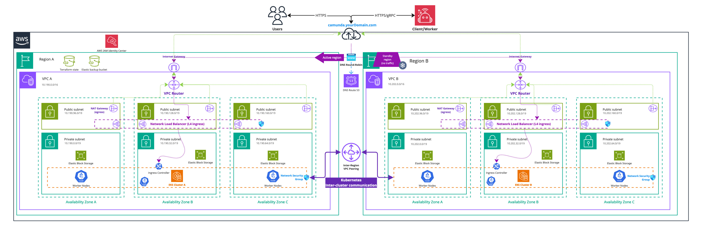

<!-- Image source: https://docs.google.com/presentation/d/1w1KUsvx4r6RS7DAozx6X65BtLJcIxU6ve_y3bYFcfYk/edit?usp=sharing -->

import CoreDNSKubeDNS from "./assets/core-dns-kube-dns.svg"
import Tabs from '@theme/Tabs';
import TabItem from '@theme/TabItem';

:::caution
Review our [dual-region concept documentation](/self-managed/concepts/multi-region/dual-region.md) before continuing to understand the current limitations and restrictions of this blueprint setup.
:::

This guide offers a detailed blueprint tutorial for deploying two Amazon Web Services (AWS) Elastic Kubernetes Service (EKS) clusters, tailored explicitly for deploying Camunda 8 and using Terraform, a popular Infrastructure as Code (IaC) tool.

:::note
This guide requires you to have previously completed or reviewed the steps taken in [deploying an EKS cluster with Terraform](./terraform-setup.md). If you have no experience with Terraform and Amazon EKS, review this content for the essentials of setting up an Amazon EKS cluster and configuring AWS IAM permissions. This content explains the process of using Terraform with AWS, making it accessible even to those new to Terraform or IaC concepts.
:::

:::info Repository Migration 8.9

The previous repository, [c8-multi-region](https://github.com/camunda/c8-multi-region), has been migrated to [camunda-deployment-references](https://github.com/camunda/camunda-deployment-references) to consolidate all reference architectures into a single repository.

The overall content remains unchanged, except for the required Helm chart updates for version 8.9 in the `camunda-values.yml` file.

:::

## Prerequisites

- An [AWS account](https://docs.aws.amazon.com/accounts/latest/reference/accounts-welcome.html) to create resources within AWS.
- [Helm](https://helm.sh/docs/intro/install/) for installing and upgrading the [Camunda Helm chart](https://artifacthub.io/packages/helm/camunda/camunda-platform).
- [Kubectl](https://kubernetes.io/docs/tasks/tools/#kubectl) to interact with the cluster.
- [Terraform](https://developer.hashicorp.com/terraform/downloads)

For the tool versions used, check the [.tool-versions](https://github.com/camunda/camunda-deployment-references/blob/main/.tool-versions) file in the repository. It contains an up-to-date list of versions that we also use for testing.

## Considerations

This setup provides an essential foundation for setting up Camunda 8 in a dual-region setup. Though it's not tailored for optimal performance, it's a good initial step for preparing a production environment by incorporating [IaC tooling](https://developer.hashicorp.com/terraform/tutorials/aws-get-started/infrastructure-as-code).

To try out Camunda 8 or develop against it, consider signing up for our [SaaS offering](https://camunda.com/platform/). If you already have two Amazon EKS clusters (peered together) and an S3 bucket, consider skipping to [deploy Camunda 8 to the clusters](#deploy-camunda-8-to-the-clusters).

For the simplicity of this guide, certain best practices will be provided with links to additional resources, enabling you to explore the topic in more detail.

:::caution
Following this guide will incur costs on your Cloud provider account, namely for the managed Kubernetes service, running Kubernetes nodes in EC2, Elastic Block Storage (EBS), traffic between regions, and S3. More information can be found on [AWS](https://aws.amazon.com/eks/pricing/) and their [pricing calculator](https://calculator.aws/#/) as the total cost varies per region.
:::

## Outcome

<!-- The following diagram should be exported as an image and as a PDF from the sources https://miro.com/app/board/uXjVL-6SrPc=/ --->
<!-- To export: click on the frame > "Export Image" > as PDF and as JPG (low res), then save it in the ./assets/ folder --->

_Infrastructure diagram for a dual-region EKS setup (click on the image to open the PDF version)_
[](./assets/eks-dual-region.pdf)

Completion of this tutorial will result in:

- Two Amazon EKS Kubernetes clusters in two different geographic regions with each four nodes ready for the Camunda 8 dual-region installation.
- The [EBS CSI driver](https://docs.aws.amazon.com/eks/latest/userguide/ebs-csi.html) installed and configured, which is used by the Camunda 8 Helm chart to create [persistent volumes](https://kubernetes.io/docs/concepts/storage/persistent-volumes/).
- A [VPC peering](https://docs.aws.amazon.com/vpc/latest/peering/what-is-vpc-peering.html) between the two EKS clusters, allowing cross-cluster communication between different regions.
- An [Amazon Simple Storage Service](https://docs.aws.amazon.com/AmazonS3/latest/userguide/Welcome.html) (S3) bucket for [Elasticsearch backups](https://www.elastic.co/guide/en/elasticsearch/reference/current/repository-s3.html).

## Environment prerequisites

There are two regions (`REGION_0` and `REGION_1`), each with its own Kubernetes cluster (`CLUSTER_0` and `CLUSTER_1`).

To streamline the execution of the subsequent commands, it is recommended to export multiple environment variables within your terminal.
Additionally, it is recommended to manifest those changes for future interactions with the dual-region setup.

1. Git clone or fork the repository [camunda-deployment-references](https://github.com/camunda/camunda-deployment-references):

```shell
git clone https://github.com/camunda/camunda-deployment-references.git
```

2. The cloned repository and folder `aws/kubernetes/eks-dual-region/procedure` provides a helper script [export_environment_prerequisites.sh](https://github.com/camunda/camunda-deployment-references/tree/main/aws/kubernetes/eks-dual-region/procedure/export_environment_prerequisites.sh) to export various environment variables to ease the interaction with a dual-region setup. Consider permanently changing this file for future interactions.
3. You must adjust these environment variable values within the script to your needs.

:::caution

You have to choose unique namespaces for Camunda 8 installations. The namespace for Camunda 8 installation in the cluster of region 0 (`CAMUNDA_NAMESPACE_0`), needs to have a different name from the namespace for Camunda 8 installation in the cluster of region 1 (`CAMUNDA_NAMESPACE_1`). This is required for proper traffic routing between the clusters.

For example, you can install Camunda 8 into `CAMUNDA_NAMESPACE_0` in `CLUSTER_0`, and `CAMUNDA_NAMESPACE_1` on the `CLUSTER_1`, where `CAMUNDA_NAMESPACE_0` != `CAMUNDA_NAMESPACE_1`.
Using the same namespace names on both clusters won't work as CoreDNS won't be able to distinguish between traffic targeted at the local and remote cluster.

:::

4. Execute the script via the following command:

```shell
. ./export_environment_prerequisites.sh
```

The dot is required to export those variables to your shell and not a spawned subshell.

```shell reference
https://github.com/camunda/camunda-deployment-references/tree/main/aws/kubernetes/eks-dual-region/procedure/export_environment_prerequisites.sh
```

## Installing Amazon EKS clusters with Terraform

### Prerequisites

1. From your cloned repository, navigate to `aws/kubernetes/eks-dual-region/terraform/clusters`. This contains the Terraform base configuration for the dual-region setup.

### Contents elaboration

#### config.tf

This file contains the [backend](https://developer.hashicorp.com/terraform/language/backend) and [provider](https://developer.hashicorp.com/terraform/language/providers/configuration) configuration, meaning where to store the [Terraform state](https://developer.hashicorp.com/terraform/language/state) and which providers to use, their versions, and potential credentials.

The important part of `config.tf` is the initialization of two AWS providers, as you need one per region and this is a limitation by AWS given everything is scoped to a region.

:::note

It's recommended to use a different backend than `local`. Find more information in the [Terraform documentation](https://developer.hashicorp.com/terraform/language/backend).

:::

:::caution

Do not store sensitive information (credentials) in your Terraform files.

:::

#### clusters.tf

This file is using [Terraform modules](https://developer.hashicorp.com/terraform/language/modules), which allows abstracting resources into reusable components.

The Terraform modules of [AWS EKS](https://github.com/camunda/camunda-deployment-references/tree/main/aws/modules/eks-cluster) are an example implementation and can be used for development purposes or as a starting reference.

This contains the declaration of the two clusters. One of them has an explicit provider declaration, as otherwise everything is deployed to the default AWS provider, which is limited to a single region.

#### vpc-peering.tf

For a multi-region setup, you need to have the [virtual private cloud (VPC)](https://aws.amazon.com/vpc/) peered to route traffic between regions using private IPv4 addresses and not publicly route the traffic and expose it. For more information, review the [AWS documentation on VPC peering](https://docs.aws.amazon.com/vpc/latest/peering/what-is-vpc-peering.html).

For dual- or tri-region setups, VPC peering is preferred over [transit gateways](https://aws.amazon.com/transit-gateway/) as it is simpler to manage and has fewer AWS limitations. Other AWS networking options remain valid - choose what best fits your environment. For a complete comparison, review the [AWS documentation](https://docs.aws.amazon.com/whitepapers/latest/building-scalable-secure-multi-vpc-network-infrastructure/transit-vpc-solution.html#peering-vs).

The previously mentioned [Camunda module](https://github.com/camunda/camunda-deployment-references/tree/main/aws/modules/eks-cluster) will automatically create a VPC per cluster.

This file covers the VPC peering between the two VPCs and allow any traffic between those two by adjusting each cluster's security groups.

#### s3.tf

For Elasticsearch, an S3 bucket is required to allow [creating and restoring snapshots](https://www.elastic.co/guide/en/elasticsearch/reference/current/repository-s3.html). There are [alternative ways](https://www.elastic.co/guide/en/elasticsearch/reference/current/snapshot-restore.html), but since this is focused on AWS, it makes sense to remain within the same cloud environment.

This file covers the declaration of an S3 bucket to use for the backups. Additionally, a service account with access to use within the Kubernetes cluster to configure Elasticsearch to access the S3 bucket.

#### output.tf

[Terraform outputs](https://developer.hashicorp.com/terraform/language/values/outputs) allow you to reuse generated values in future steps. For example, the access keys of the service account with S3 access.

#### variables.tf

This file contains various variable definitions for both [local](https://developer.hashicorp.com/terraform/language/values/locals) and [input](https://developer.hashicorp.com/terraform/language/values/variables) types. The difference is that input variables require you to define the value on execution. While local variables are permanently defined, they are namely for code duplication purposes and readability.

### Preparation

1. Adjust any values in the [variables.tf](https://github.com/camunda/camunda-deployment-references/tree/main/aws/kubernetes/eks-dual-region/terraform/clusters/variables.tf) file to your liking. For example, the target regions and their name or CIDR blocks of each cluster.
2. Make sure that any adjustments are reflected in your [environment prerequisites](#environment-prerequisites) to ease the [in-cluster setup](#in-cluster-setup).
3. Set up the authentication for the `AWS` provider.

:::note

The [AWS Terraform provider](https://registry.terraform.io/providers/hashicorp/aws/latest/docs) is required to create resources in AWS. You must configure the provider with the proper credentials before using it. You can further change the region and other preferences and explore different [authentication](https://registry.terraform.io/providers/hashicorp/aws/latest/docs#authentication-and-configuration) methods.

There are several ways to authenticate the `AWS` provider:

- (Recommended) Use the [AWS CLI](https://docs.aws.amazon.com/cli/latest/userguide/cli-chap-getting-started.html) to configure access. Terraform will automatically default to AWS CLI configuration when present.
- Set environment variables `AWS_ACCESS_KEY_ID` and `AWS_SECRET_ACCESS_KEY`, which can be retrieved from the [AWS Console](https://docs.aws.amazon.com/IAM/latest/UserGuide/id_credentials_access-keys.html).

:::

### Execution

:::caution

A user who creates resources in AWS will therefore own these resources. In this particular case, the user will always have admin access to the Kubernetes cluster until the cluster is deleted.

Therefore, it can make sense to create an extra [AWS IAM user](https://docs.aws.amazon.com/IAM/latest/UserGuide/id_users.html) which credentials are used for Terraform purposes.

:::

1. Open a terminal and navigate to `aws/kubernetes/eks-dual-region/terraform/clusters`.
2. Initialize the working directory:

```hcl
terraform init -upgrade
```

3. Apply the configuration files:

```hcl
terraform apply
```

If you have not set a default value for `cluster_name`, you will be asked to provide a suitable name.

4. After reviewing the plan, you can type `yes` to confirm and apply the changes.

At this point, Terraform will create the Amazon EKS clusters with all the necessary configurations. The completion of this process may require approximately 20-30 minutes.

## In-cluster setup

Now that you have created two peered Kubernetes clusters with Terraform, you will still have to configure various things to make the dual-region work:

### Cluster access

To ease working with two clusters, create or update your local `kubeconfig` to contain those new contexts. Using an alias for those new clusters allows you to directly use kubectl and Helm with a particular cluster.

Update or create your kubeconfig via the [AWS CLI](https://docs.aws.amazon.com/eks/latest/userguide/create-kubeconfig.html):

```shell
# the alias allows for easier context switching in kubectl
aws eks --region $REGION_0 update-kubeconfig --name $CLUSTER_0 --alias $CLUSTER_0
aws eks --region $REGION_1 update-kubeconfig --name $CLUSTER_1 --alias $CLUSTER_1
```

The region and name must align with the values you have defined in Terraform.

### DNS chaining

This allows for easier communication between the two clusters by forwarding DNS queries from the region 0 cluster to the region 1 cluster and vice versa.

<CoreDNSKubeDNS />

You are configuring the CoreDNS from the cluster in **Region 0** to resolve certain namespaces via **Region 1** instead of using the in-cluster DNS server. Camunda applications (e.g. Zeebe brokers) to resolve DNS record names of Camunda applications running in another cluster.

#### CoreDNS configuration

1. Expose `kube-dns`, the in-cluster DNS resolver via an internal load-balancer in each cluster:

```shell
kubectl --context $CLUSTER_0 apply -f https://raw.githubusercontent.com/camunda/camunda-deployment-references/refs/heads/main/aws/kubernetes/eks-dual-region/procedure/manifests/internal-dns-lb.yml
kubectl --context $CLUSTER_1 apply -f https://raw.githubusercontent.com/camunda/camunda-deployment-references/refs/heads/main/aws/kubernetes/eks-dual-region/procedure/manifests/internal-dns-lb.yml
```

2. Execute the script [generate_core_dns_entry.sh](https://github.com/camunda/camunda-deployment-references/tree/main/aws/kubernetes/eks-dual-region/procedure/generate_core_dns_entry.sh) in the folder `aws/kubernetes/eks-dual-region/procedure/` of the repository to help you generate the CoreDNS config. Make sure that you have previously exported the [environment prerequisites](#environment-prerequisites) since the script builds on top of it.

```shell
./generate_core_dns_entry.sh
```

3. The script will retrieve the IPs of the load balancer via the AWS CLI and return the required config change.
4. The script prints the `kubectl edit` commands to change the DNS settings of each cluster inline. Copy the statement between the placeholders to edit the CoreDNS configmap in cluster 0 and cluster 1, depending on the placeholder.  
   An alternative to inline editing is to create two copies of the file [./manifests/coredns.yml](https://github.com/camunda/camunda-deployment-references/blob/main/aws/kubernetes/eks-dual-region/procedure/manifests/coredns.yml), one for each cluster. Add the section generated by the script to each file. Apply the changes to each cluster with e.g. `kubectl --context cluster-london -n kube-system apply -f file.yml`. Replace the `context` parameter with your current values.

<details>
  <summary>Example output</summary>
  <summary>

:::caution
For illustration purposes only. These values will not work in your environment.
:::

```shell
./generate_core_dns_entry.sh
Please copy the following between
### Cluster 0 - Start ### and ### Cluster 0 - End ###
and insert it at the end of your CoreDNS configmap in Cluster 0

kubectl --context cluster-london -n kube-system edit configmap coredns

### Cluster 0 - Start ###
    camunda-paris.svc.cluster.local:53 {
        errors
        cache 30
        forward . 10.202.19.54 10.202.53.21 10.202.84.222 {
            force_tcp
        }
    }
### Cluster 0 - End ###

Please copy the following between
### Cluster 1 - Start ### and ### Cluster 1 - End ###
and insert it at the end of your CoreDNS configmap in Cluster 1

kubectl --context cluster-paris -n kube-system edit configmap coredns

### Cluster 1 - Start ###
    camunda-london.svc.cluster.local:53 {
        errors
        cache 30
        forward . 10.192.27.56 10.192.84.117 10.192.36.238 {
            force_tcp
        }
    }
### Cluster 1 - End ###
```

  </summary>
</details>

<details>
  <summary>Full configmap example</summary>
  <summary>

:::caution

For illustration purposes only. This file will not work in your environment.

:::

```yaml title="coredns-cm-london.yml"
apiVersion: v1
kind: ConfigMap
metadata:
  labels:
    eks.amazonaws.com/component: coredns
    k8s-app: kube-dns
  name: coredns
  namespace: kube-system
data:
  Corefile: |
    .:53 {
        errors
        health {
            lameduck 5s
          }
        ready
        kubernetes cluster.local in-addr.arpa ip6.arpa {
          pods insecure
          fallthrough in-addr.arpa ip6.arpa
        }
        prometheus :9153
        forward . /etc/resolv.conf
        cache 30
        loop
        reload
        loadbalance
    }
    camunda-paris.svc.cluster.local:53 {
        errors
        cache 30
        forward . 10.202.19.54 10.202.53.21 10.202.84.222 {
            force_tcp
        }
    }
```

  </summary>
</details>

5. Check that CoreDNS has reloaded for the changes to take effect before continuing. Make sure it contains `Reloading complete`:

```shell
kubectl --context $CLUSTER_0 logs -f deployment/coredns -n kube-system
kubectl --context $CLUSTER_1 logs -f deployment/coredns -n kube-system
```

### Test DNS chaining

The script [test_dns_chaining.sh](https://github.com/camunda/camunda-deployment-references/tree/main/aws/kubernetes/eks-dual-region/procedure/test_dns_chaining.sh) within the folder `aws/kubernetes/eks-dual-region/procedure/` of the repository will help to test that the DNS chaining is working by using nginx pods and services to ping each other.

1. Execute the [test_dns_chaining.sh](https://github.com/camunda/camunda-deployment-references/tree/main/aws/kubernetes/eks-dual-region/procedure/test_dns_chaining.sh). Make sure you have previously exported the [environment prerequisites](#environment-prerequisites) as the script builds on top of it.

```shell
./test_dns_chaining.sh
```

2. Watch how a nginx pod and service will be deployed per cluster. It will wait until the pods are ready and finally ping from nginx in cluster 0 the nginx in cluster 1 and vice versa. If it fails to contact the other nginx five times, it will fail.

### Configure a high-performance StorageClass

Camunda 8 requires high IOPS for performance-critical components such as Zeebe. To achieve this, use AWS `gp3` volumes instead of the default `gp2`.

This step defines a custom `StorageClass` that:

- Uses `gp3` EBS volumes with optimized IOPS and throughput.
- Sets a `Retain` reclaim policy.
- Uses `WaitForFirstConsumer` volume binding.
- Becomes the default `StorageClass` for the cluster.

#### Apply the StorageClass

Run the following script from the context of the `aws/kubernetes/eks-dual-region/procedure/` folder to apply the new [storage class](https://github.com/camunda/camunda-deployment-references/tree/main/aws/kubernetes/eks-dual-region/procedure/manifests/storage-class.yml) and set it as default:

```bash reference
https://github.com/camunda/camunda-deployment-references/tree/main/aws/kubernetes/eks-dual-region/procedure/storageclass-configure.sh
```

To verify completion of the operation, run:

```bash reference
https://github.com/camunda/camunda-deployment-references/tree/main/aws/kubernetes/eks-dual-region/procedure/storageclass-verify.sh
```

You must apply the custom `StorageClass` before installing the Camunda Helm chart so that PersistentVolumeClaims (PVCs) are provisioned with the correct performance characteristics.

## Deploy Camunda 8 to the clusters

### Create the secret for Elasticsearch

Elasticsearch will need an S3 bucket for data backup and restore procedure, required during a regional failback. For this, you will need to configure a Kubernetes secret to not expose those in cleartext.

You can pull the data from Terraform since you exposed those via `output.tf`.

1. From the Terraform code location `aws/kubernetes/eks-dual-region/terraform/clusters`, execute the following to export the access keys to environment variables. This will allow an easier creation of the Kubernetes secret via the command line:

```shell
export AWS_ACCESS_KEY_ES=$(terraform output -raw s3_aws_access_key)
export AWS_SECRET_ACCESS_KEY_ES=$(terraform output -raw s3_aws_secret_access_key)
```

2. From the folder `aws/kubernetes/eks-dual-region/procedure` of the repository, execute the script [create_elasticsearch_secrets.sh](https://github.com/camunda/camunda-deployment-references/tree/main/aws/kubernetes/eks-dual-region/procedure/create_elasticsearch_secrets.sh). This will use the exported environment variables from **Step 1** to create the required secret within the Camunda namespaces. Those have previously been defined and exported via the [environment prerequisites](#environment-prerequisites).

```shell
./create_elasticsearch_secrets.sh
```

3. Unset environment variables to reduce the risk of potential exposure. The script is spawned in a subshell and can't modify the environment variables without extra workarounds:

```shell
unset AWS_ACCESS_KEY_ES
unset AWS_SECRET_ACCESS_KEY_ES
```

:::caution Bucket vulnerable to region outages

The Elasticsearch backup [bucket is tied to a specific region](https://docs.aws.amazon.com/AmazonS3/latest/userguide/UsingBucket.html). If that region becomes unavailable and you want to restore to a different region or S3 services remain disrupted, you must create a new bucket in another region and reconfigure your Elasticsearch cluster to use the new bucket.

:::

### Camunda 8 Helm chart prerequisites

Within the cloned repository, navigate to `aws/kubernetes/eks-dual-region/helm-values`. This contains a dual-region example setup.

#### Content elaboration

Our approach is to work with layered Helm values files:

- Have a base `camunda-values.yml` that is generally applicable for both Camunda installations
- Two overlays that are for region 0 and region 1 installations

##### camunda-values.yml

This forms the base layer that contains the basic required setup, which applies to both regions.

Key changes of the dual-region setup:

- `global.multiregion.regions: 2`
  - Indicates the use for two regions
- `global.identity.auth.enabled: false`
  - Management Identity is not currently supported. For more details, see the [limitations section](/self-managed/concepts/multi-region/dual-region.md#limitations) on the dual-region concept page.
- `identity.enabled: false`
  - Management Identity is currently not supported.
- `optimize.enabled: false`
  - Optimize is not currently supported and depends on Management Identity.
- `orchestration.exporters.zeebe.enabled: false`
  - Disables the automatic Elasticsearch Exporter configuration in the Helm chart. This exporter was previously used with Optimize and earlier setups.
- `orchestration.exporters.camunda.enabled: false`
  - Disables the automatic Camunda Exporter configuration in the Helm chart. Values are supplied manually through environment variables.
- `orchestration.env`
  - `CAMUNDA_CLUSTER_INITIALCONTACTPOINTS`
    - These are the contact points for the brokers to know how to form the cluster. Find more information on what the variable means in [setting up a cluster](../../../../../components/orchestration-cluster/zeebe/operations/setting-up-a-cluster.md).
  - `ZEEBE_BROKER_EXPORTERS_CAMUNDAREGION0_ARGS_CONNECT_URL`
    - The Elasticsearch endpoint for region 0.
  - `ZEEBE_BROKER_EXPORTERS_CAMUNDAREGION1_ARGS_CONNECT_URL`
    - The Elasticsearch endpoint for region 1.
  - `ZEEBE_BROKER_EXPORTERS_CAMUNDAREGION0_CLASSNAME`
    - `io.camunda.exporter.CamundaExporter` explicitly creates the new Camunda Exporter.
  - `ZEEBE_BROKER_EXPORTERS_CAMUNDAREGION1_CLASSNAME`
    - `io.camunda.exporter.CamundaExporter` explicitly creates the new Camunda Exporter.
- A cluster of eight Zeebe brokers (four in each of the regions) is recommended for the dual-region setup
  - `orchestration.clusterSize: 8`
  - `orchestration.partitionCount: 8`
  - `orchestration.replicationFactor: 4`
- `elasticsearch.initScripts`
  - Configures the S3 bucket access via a predefined Kubernetes secret.

##### region0/camunda-values.yml

This overlay contains the multi-region identification for the cluster in region 0.

##### region1/camunda-values.yml

This overlay contains the multi-region identification for the cluster in region 1.

#### Preparation

:::caution
You must change the following environment variables for Zeebe. The default values will not work for you and are only for illustration.
:::

The base `camunda-values.yml` in `aws/kubernetes/eks-dual-region/helm-values` requires adjustments before installing the Helm chart:

- `CAMUNDA_CLUSTER_INITIALCONTACTPOINTS`
- `ZEEBE_BROKER_EXPORTERS_CAMUNDAREGION0_ARGS_CONNECT_URL`
- `ZEEBE_BROKER_EXPORTERS_CAMUNDAREGION1_ARGS_CONNECT_URL`

1. The bash script [generate_zeebe_helm_values.sh](https://github.com/camunda/camunda-deployment-references/tree/infraex-560/aws/kubernetes/eks-dual-region/procedure/generate_zeebe_helm_values.sh) in the repository folder `aws/kubernetes/eks-dual-region/procedure/` helps generate those values. You only have to copy and replace them within the base `camunda-values.yml`. It will use the exported environment variables of the [environment prerequisites](#environment-prerequisites) for namespaces and regions.

```shell
./generate_zeebe_helm_values.sh

# It will ask you to provide the following values
# Enter Zeebe cluster size (total number of Zeebe brokers in both Kubernetes clusters):
## For a dual-region setup we recommend eight, resulting in four brokers per region.
```

<details>
  <summary>Example output</summary>
  <summary>

:::danger
For illustration purposes only. These values will not work in your environment.
:::

```shell
./generate_zeebe_helm_values.sh
Enter Zeebe cluster size (total number of Zeebe brokers in both Kubernetes clusters): 8

Use the following to set the environment variable CAMUNDA_CLUSTER_INITIALCONTACTPOINTS in the base Camunda Helm chart values file for Zeebe:

- name: CAMUNDA_CLUSTER_INITIALCONTACTPOINTS
  value: camunda-zeebe-0.camunda-zeebe.camunda-london.svc.cluster.local:26502,camunda-zeebe-0.camunda-zeebe.camunda-paris.svc.cluster.local:26502,camunda-zeebe-1.camunda-zeebe.camunda-london.svc.cluster.local:26502,camunda-zeebe-1.camunda-zeebe.camunda-paris.svc.cluster.local:26502,camunda-zeebe-2.camunda-zeebe.camunda-london.svc.cluster.local:26502,camunda-zeebe-2.camunda-zeebe.camunda-paris.svc.cluster.local:26502,camunda-zeebe-3.camunda-zeebe.camunda-london.svc.cluster.local:26502,camunda-zeebe-3.camunda-zeebe.camunda-paris.svc.cluster.local:26502

Use the following to set the environment variable ZEEBE_BROKER_EXPORTERS_CAMUNDAREGION0_ARGS_CONNECT_URL in the base Camunda Helm chart values file for Zeebe:

- name: ZEEBE_BROKER_EXPORTERS_CAMUNDAREGION0_ARGS_CONNECT_URL
  value: http://camunda-elasticsearch-master-hl.camunda-london.svc.cluster.local:9200

Use the following to set the environment variable ZEEBE_BROKER_EXPORTERS_CAMUNDAREGION1_ARGS_CONNECT_URL in the base Camunda Helm chart values file for Zeebe.

- name: ZEEBE_BROKER_EXPORTERS_CAMUNDAREGION1_ARGS_CONNECT_URL
  value: http://camunda-elasticsearch-master-hl.camunda-paris.svc.cluster.local:9200
```

  </summary>
</details>

2. As the script suggests, replace the environment variables within `camunda-values.yml`.

### Deploy Camunda 8

From the terminal context of `aws/kubernetes/eks-dual-region/helm-values`, execute the following:

```shell
helm install $CAMUNDA_RELEASE_NAME camunda/camunda-platform \
  --version $HELM_CHART_VERSION \
  --kube-context $CLUSTER_0 \
  --namespace $CAMUNDA_NAMESPACE_0 \
  -f camunda-values.yml \
  -f region0/camunda-values.yml

helm install $CAMUNDA_RELEASE_NAME camunda/camunda-platform \
  --version $HELM_CHART_VERSION \
  --kube-context $CLUSTER_1 \
  --namespace $CAMUNDA_NAMESPACE_1 \
  -f camunda-values.yml \
  -f region1/camunda-values.yml
```

### Verify Camunda 8

:::info Authentication changes in 8.8+

Starting from version 8.8, the Orchestration Cluster is configured by default with [Identity](/self-managed/components/orchestration-cluster/identity/overview.md) and is protected by basic authentication using `demo:demo` as the default username and password.

:::

1. Open a terminal and port-forward the Zeebe Gateway via `kubectl` from one of your clusters. Zeebe is stretching over both clusters and is `active-active`, meaning it doesn't matter which Zeebe Gateway to use to interact with your Zeebe cluster.

```shell
kubectl --context "$CLUSTER_0" -n $CAMUNDA_NAMESPACE_0 port-forward services/$CAMUNDA_RELEASE_NAME-zeebe-gateway 8080:8080
```

2. Open another terminal and use e.g. `cURL` to print the Zeebe cluster topology:

```
# authentication may vary depending on your setup, the following is just an example call.
curl -u demo:demo -L -X GET 'http://localhost:8080/v2/topology' \
  -H 'Accept: application/json'
```

3. Make sure that your output contains all eight brokers from the two regions:

<details>
  <summary>Example output</summary>
  <summary>

```shell
{
  "brokers": [
    {
      "nodeId": 0,
      "host": "camunda-zeebe-0.camunda-zeebe.camunda-london",
      "port": 26501,
      "partitions": [
        {
          "partitionId": 1,
          "role": "follower",
          "health": "healthy"
        },
        {
          "partitionId": 6,
          "role": "follower",
          "health": "healthy"
        },
        {
          "partitionId": 7,
          "role": "follower",
          "health": "healthy"
        },
        {
          "partitionId": 8,
          "role": "follower",
          "health": "healthy"
        }
      ],
      "version": "8.8.0"
    },
    {
      "nodeId": 1,
      "host": "camunda-zeebe-0.camunda-zeebe.camunda-paris",
      "port": 26501,
      "partitions": [
        {
          "partitionId": 1,
          "role": "follower",
          "health": "healthy"
        },
        {
          "partitionId": 2,
          "role": "leader",
          "health": "healthy"
        },
        {
          "partitionId": 7,
          "role": "follower",
          "health": "healthy"
        },
        {
          "partitionId": 8,
          "role": "follower",
          "health": "healthy"
        }
      ],
      "version": "8.8.0"
    },
    {
      "nodeId": 2,
      "host": "camunda-zeebe-1.camunda-zeebe.camunda-london",
      "port": 26501,
      "partitions": [
        {
          "partitionId": 1,
          "role": "follower",
          "health": "healthy"
        },
        {
          "partitionId": 2,
          "role": "follower",
          "health": "healthy"
        },
        {
          "partitionId": 3,
          "role": "leader",
          "health": "healthy"
        },
        {
          "partitionId": 8,
          "role": "follower",
          "health": "healthy"
        }
      ],
      "version": "8.8.0"
    },
    {
      "nodeId": 3,
      "host": "camunda-zeebe-1.camunda-zeebe.camunda-paris",
      "port": 26501,
      "partitions": [
        {
          "partitionId": 1,
          "role": "follower",
          "health": "healthy"
        },
        {
          "partitionId": 2,
          "role": "follower",
          "health": "healthy"
        },
        {
          "partitionId": 3,
          "role": "follower",
          "health": "healthy"
        },
        {
          "partitionId": 4,
          "role": "leader",
          "health": "healthy"
        }
      ],
      "version": "8.8.0"
    },
    {
      "nodeId": 4,
      "host": "camunda-zeebe-2.camunda-zeebe.camunda-london",
      "port": 26501,
      "partitions": [
        {
          "partitionId": 2,
          "role": "follower",
          "health": "healthy"
        },
        {
          "partitionId": 3,
          "role": "follower",
          "health": "healthy"
        },
        {
          "partitionId": 4,
          "role": "follower",
          "health": "healthy"
        },
        {
          "partitionId": 5,
          "role": "leader",
          "health": "healthy"
        }
      ],
      "version": "8.8.0"
    },
    {
      "nodeId": 5,
      "host": "camunda-zeebe-2.camunda-zeebe.camunda-paris",
      "port": 26501,
      "partitions": [
        {
          "partitionId": 3,
          "role": "follower",
          "health": "healthy"
        },
        {
          "partitionId": 4,
          "role": "follower",
          "health": "healthy"
        },
        {
          "partitionId": 5,
          "role": "follower",
          "health": "healthy"
        },
        {
          "partitionId": 6,
          "role": "follower",
          "health": "healthy"
        }
      ],
      "version": "8.8.0"
    },
    {
      "nodeId": 6,
      "host": "camunda-zeebe-3.camunda-zeebe.camunda-london",
      "port": 26501,
      "partitions": [
        {
          "partitionId": 4,
          "role": "follower",
          "health": "healthy"
        },
        {
          "partitionId": 5,
          "role": "follower",
          "health": "healthy"
        },
        {
          "partitionId": 6,
          "role": "leader",
          "health": "healthy"
        },
        {
          "partitionId": 7,
          "role": "leader",
          "health": "healthy"
        }
      ],
      "version": "8.8.0"
    },
    {
      "nodeId": 7,
      "host": "camunda-zeebe-3.camunda-zeebe.camunda-paris",
      "port": 26501,
      "partitions": [
        {
          "partitionId": 5,
          "role": "follower",
          "health": "healthy"
        },
        {
          "partitionId": 6,
          "role": "follower",
          "health": "healthy"
        },
        {
          "partitionId": 7,
          "role": "follower",
          "health": "healthy"
        },
        {
          "partitionId": 8,
          "role": "leader",
          "health": "healthy"
        }
      ],
      "version": "8.8.0"
    }
  ],
  "clusterSize": 8,
  "partitionsCount": 8,
  "replicationFactor": 4,
  "gatewayVersion": "8.8.0",
  "lastCompletedChangeId": "-1"
}
```

  </summary>
</details>
