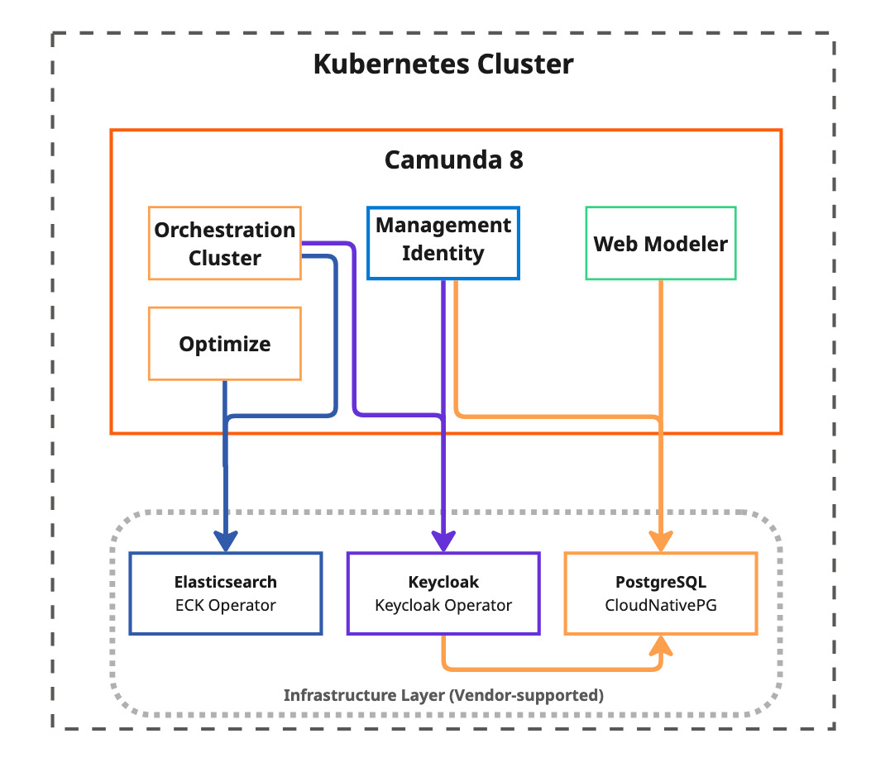

import Tabs from '@theme/Tabs';
import TabItem from '@theme/TabItem';

This guide explains how to deploy Camunda 8 infrastructure components using **vendor-supported deployment methods** as an alternative to the Bitnami subcharts. This approach provides production-grade, officially maintained deployment solutions for PostgreSQL, Elasticsearch, and Keycloak.

## Overview

:::info New in Camunda 8.8
Starting with Camunda 8.8, we continue to strengthen our commitment to robust, production-ready deployments based on solid foundations.
:::

As outlined in [our strategy](https://camunda.com/blog/2025/08/changes-to-camunda-helm-sub-charts-what-you-need-to-know/), Camunda reinforces building deployments on solid foundations—primarily managed PostgreSQL and Elasticsearch services, along with external OIDC providers. However, we understand that managed infrastructure components aren't always available in your organization's service catalog.

This guide demonstrates how to integrate these infrastructure components using official deployment methods that don't depend on Bitnami subcharts. Instead, we use vendor-supported deployment approaches—the recommended way to deploy and manage these services in production environments.

:::note Alternative: Bitnami Enterprise Images
If you prefer to continue using Bitnami subcharts, you can enable them by using Bitnami Enterprise images. See [Install Bitnami enterprise images](/self-managed/deployment/helm/configure/registry-and-images/install-bitnami-enterprise-images.md) for detailed instructions.
:::

## Why use vendor-supported deployment methods?

Using official vendor-supported methods provides several advantages over traditional subcharts:

- **Vendor maintenance**: Each deployment method is maintained by the respective project team (Elastic, CloudNativePG community, Keycloak team) with dedicated engineering resources
- **Production-grade features**: Built-in management, monitoring, and scaling capabilities designed for enterprise environments
- **Enterprise support**: Official support channels, dedicated vendor support teams, and comprehensive documentation
- **Security-focused**: Regular updates and CVE patches from upstream maintainers with specialized security teams
- **Advanced lifecycle management**: Automated upgrades, failover, and disaster recovery capabilities
- **Best practices implementation**: Following upstream recommended deployment patterns established by vendor experts
- **Vendor expertise**: Access to specialized knowledge and troubleshooting from the teams that build these technologies
- **Future-proof architecture**: Doesn't depend on deprecated Bitnami subcharts, ensuring long-term maintainability

## Prerequisites

Before proceeding with this guide, ensure you have:

- **Kubernetes cluster**: A functioning cluster with `kubectl` access and block-storage persistent volumes
- **Cluster admin privileges**: Required to install Custom Resource Definitions (CRDs) and operators
- **Command-line tools**:
  - `kubectl` configured to access your cluster
  - `helm` CLI for deploying Camunda Platform
  - `openssl` for generating random passwords
  - `envsubst` command (part of `gettext` package) for environment variable substitution

## Architecture overview

This deployment approach separates infrastructure management from application deployment:

<!-- Source: https://miro.com/app/board/uXjVL-6SrPc=/?moveToWidget=3458764643761312188&cot=14 -->



## Infrastructure components

This approach uses three vendor-supported infrastructure components, each maintained by their respective project teams:
| Component | Purpose | Official Documentation |
| ----------------------------------------------------------- | ------------------------------------------------------------------------------------------------- | --------------------------------------------------------------------------------- |
| **[PostgreSQL with CloudNativePG](#postgresql-deployment)** | Production-grade PostgreSQL clusters for Keycloak, Management Identity, and Web Modeler databases | [CloudNativePG Documentation](https://cloudnative-pg.io/documentation/current/) |
| **[Elasticsearch with ECK](#elasticsearch-deployment)** | Official Elasticsearch deployment for Zeebe records, Operate, Tasklist, and Optimize data storage | [ECK Guide](https://www.elastic.co/guide/en/cloud-on-k8s/current/index.html) |
| **[Keycloak with Keycloak Operator](#keycloak-deployment)** | Automated OIDC authentication provider for Management Identity | [Keycloak Operator Documentation](https://www.keycloak.org/operator/installation) |

## Quick start

### Step 1: Get deployment resources

All configuration files, deployment scripts, and automation tools referenced in this guide are available in the Camunda deployment references repository:

**Repository**: [camunda-deployment-references](https://github.com/camunda/camunda-deployment-references/tree/main/generic/kubernetes/operator-based)

<details>
<summary><strong>Quick deployment commands</strong></summary>

```bash reference
https://github.com/camunda/camunda-deployment-references/blob/main/camunda-deployment-references/generic/kubernetes/operator-based/get-your-copy.sh
```

Then execute:

```bash
# Set up environment (required for all deployments)
source ./0-set-environment.sh

# Review and deploy infrastructure components in order
# PostgreSQL deployment
cd postgresql/
cat deploy.sh  # Review the deployment script
./deploy.sh

# Elasticsearch deployment
cd ../elasticsearch/
cat deploy.sh  # Review the deployment script
./deploy.sh

# Keycloak deployment
cd ../keycloak/
cat deploy.sh  # Review the deployment script
./deploy.sh
```

</details>

The deployment scripts (`deploy.sh`) contain all the necessary steps to install each component. You can either execute them directly or use them as reference for manual deployment or GitOps integration.

### Step 2: Environment setup

All deployment scripts require environment variables to be set. This is a prerequisite for all subsequent steps:

```bash reference
https://github.com/camunda/camunda-deployment-references/blob/main/generic/kubernetes/operator-based/0-set-environment.sh
```

:::note
Ensure you source this environment setup before running any deployment scripts in the following sections.
:::

### Step 3: Deployment overview

Each infrastructure component should be deployed individually in the following order:

| Order | Component                                      | Dependencies | Purpose                                                              |
| ----- | ---------------------------------------------- | ------------ | -------------------------------------------------------------------- |
| 1     | **[PostgreSQL](#postgresql-deployment)**       | None         | Database clusters for Keycloak, Management Identity, and Web Modeler |
| 2     | **[Elasticsearch](#elasticsearch-deployment)** | None         | Secondary storage for orchestration cluster components               |
| 3     | **[Keycloak](#keycloak-deployment)**           | PostgreSQL   | Authentication and identity management                               |
| 4     | **[Camunda Platform](#camunda-deployment)**    | All above    | Deploy using Helm with vendor-supported infrastructure               |

:::tip Automation with GitOps
While this guide demonstrates manual deployment using command-line tools, these same configurations can be automated using GitOps solutions like ArgoCD, Flux, or other Kubernetes deployment pipelines. All configuration files referenced in this guide are designed to work seamlessly with declarative deployment approaches.
:::

## PostgreSQL deployment

### Overview

[CloudNativePG](https://cloudnative-pg.io/) is a CNCF project that provides the official Kubernetes deployment method for PostgreSQL. It's designed specifically for cloud-native environments with enterprise-grade features including automated backups, point-in-time recovery, and rolling updates.

**Official documentation**: [CloudNativePG Documentation](https://cloudnative-pg.io/documentation/current/)

### Architecture

Our setup provisions three separate PostgreSQL clusters for different Camunda components. Use the latest PostgreSQL version listed in our [supported environments matrix](/reference/supported-environments.md) that is compatible across the required components:

- **pg-identity**: Database for Camunda Identity component
- **pg-keycloak**: Database for Keycloak identity service
- **pg-webmodeler**: Database for Web Modeler component

:::note Component flexibility
If you don't plan to use certain components (for example, Web Modeler), you can simply remove the corresponding cluster definition from the configuration before deployment. This allows you to deploy only the PostgreSQL clusters you actually need, reducing resource consumption.
:::

### Installation

**Prerequisites**: Ensure environment variables are sourced (see [Environment setup](#step-2-environment-setup))

The PostgreSQL deployment follows these steps, automated via the `postgresql/deploy.sh` script:

```bash reference
https://github.com/camunda/camunda-deployment-references/blob/main/generic/kubernetes/operator-based/postgresql/deploy.sh
```

**Deployment steps performed by the script:**

- Install CloudNativePG operator to `cnpg-system` namespace
- Generate PostgreSQL authentication secrets using `./set-secrets.sh`
- Deploy three PostgreSQL clusters from `postgresql-clusters.yml`
- Wait for readiness validation of all clusters

#### Operator Custom Resources

<Tabs groupId="postgres-cr">
  <TabItem value="clusters" label="PostgreSQL Clusters" default>

This configuration creates three dedicated PostgreSQL clusters, each optimized for its specific use case.

**Save as** `postgresql-clusters.yml`:

```yaml reference
https://github.com/camunda/camunda-deployment-references/blob/main/generic/kubernetes/operator-based/postgresql/postgresql-clusters.yml
```

**Use cases:**

- `pg-keycloak`: Database for Keycloak authentication
- `pg-identity`: Database for Management Identity component
- `pg-webmodeler`: Database for Web Modeler component

</TabItem>
</Tabs>

#### Execution

<Tabs groupId="postgres-deployment">
  <TabItem value="standard" label="Kubernetes" default>

1. **Navigate to PostgreSQL directory**: `cd postgresql/`
2. **Review deployment script**: `cat deploy.sh` to understand the deployment steps
3. **Review cluster configuration**: `cat postgresql-clusters.yml` to verify PostgreSQL cluster settings
4. **Adapt configuration if needed**: Modify `postgresql-clusters.yml` for your specific requirements (resource limits, storage, etc.)
5. **Execute deployment**: `./deploy.sh`

  </TabItem>
  <TabItem value="openshift" label="OpenShift">

1. **Navigate to PostgreSQL directory**: `cd postgresql/`
2. **Review OpenShift deployment script**: `cat deploy-openshift.sh` to understand the OpenShift-specific deployment steps
3. **Review cluster configuration**: `cat postgresql-clusters.yml` to verify PostgreSQL cluster settings
4. **Adapt configuration if needed**: Modify `postgresql-clusters.yml` for your specific requirements (resource limits, storage, etc.)
5. **Execute OpenShift deployment**: `./deploy-openshift.sh`

:::note OpenShift Security Context Constraints
The `deploy-openshift.sh` script applies necessary Security Context Constraints (SCC) patches required for CloudNativePG to run properly on OpenShift platforms.
:::

  </TabItem>
</Tabs>

### Camunda Helm configuration

The following configuration files integrate PostgreSQL clusters with Camunda components.

**Save these files locally** and include them in your Helm installation command.

<Tabs groupId="postgres-config">
  <TabItem value="identity" label="Management Identity" default>

Configure Camunda Identity to use the PostgreSQL cluster.

**Save as** `camunda-identity-values.yml`:

```yaml reference
https://github.com/camunda/camunda-deployment-references/blob/main/generic/kubernetes/operator-based/postgresql/camunda-identity-values.yml
```

**Installation**: Add `-f camunda-identity-values.yml` to your Helm install command.

</TabItem>
  <TabItem value="webmodeler" label="Web Modeler">

Configure Web Modeler to use the PostgreSQL cluster.

**Save as** `camunda-webmodeler-values.yml`:

```yaml reference
https://github.com/camunda/camunda-deployment-references/blob/main/generic/kubernetes/operator-based/postgresql/camunda-webmodeler-values.yml
```

**Installation**: Add `-f camunda-webmodeler-values.yml` to your Helm install command.

</TabItem>
</Tabs>

## Elasticsearch deployment

### Overview

[Elastic Cloud on Kubernetes (ECK)](https://www.elastic.co/docs/deploy-manage/deploy/cloud-on-k8s) is the official Kubernetes deployment method for Elasticsearch, maintained by Elastic. ECK provides the vendor-recommended approach for deploying Elasticsearch in Kubernetes environments, automatically handling cluster deployment, scaling, upgrades, and security configuration.

Use the latest Elasticsearch version listed in our [supported environments matrix](../../../../reference/supported-environments.md) and verify compatibility there before deploying.

**Official documentation**: [ECK Guide](https://www.elastic.co/guide/en/cloud-on-k8s/current/index.html)

### Architecture

The ECK deployment creates an Elasticsearch cluster with:

- **Three multi-role nodes**: Each node is master-eligible and also serves data, ingest, and coordinating roles (no separate master-only tier)
- **Security configuration**: TLS disabled for internal communication (can be enabled for production)
- **Anti-affinity rules**: Ensures nodes are distributed across different Kubernetes nodes
- **Resource optimization**: Configured for Camunda's specific requirements

:::note Baseline
This topology is an opinionated minimal baseline. Adjust node count/roles (e.g., add dedicated ingest, coordinating, or hot/warm tiers), JVM heap, storage class/size, security (TLS & auth), and other settings to match your workload characteristics, retention, and compliance requirements.
:::

**Elasticsearch as the secondary storage for Camunda 8:**

Elasticsearch serves as the secondary storage for Camunda 8 orchestration cluster components, providing persistent storage and search capabilities.

[Learn more about the secondary storage](/self-managed/concepts/secondary-storage/index.md) and how it supports advanced features like web applications, search APIs, process monitoring, task management, and analytics.

### Installation

**Prerequisites**: Ensure environment variables are sourced (see [Environment setup](#step-2-environment-setup))

The Elasticsearch deployment follows these steps, automated via the `elasticsearch/deploy.sh` script:

```bash reference
https://github.com/camunda/camunda-deployment-references/blob/main/generic/kubernetes/operator-based/elasticsearch/deploy.sh
```

**Deployment steps performed by the script:**

- Install ECK Custom Resource Definition
- Deploy ECK operator to `elastic-system` namespace
- Create Elasticsearch cluster from `elasticsearch-cluster.yml`
- Wait for cluster health validation

#### Operator Custom Resources

<Tabs groupId="elasticsearch-cr">
  <TabItem value="cluster" label="Elasticsearch Cluster" default>

This configuration creates a production-ready Elasticsearch cluster with security enabled.

**Save as** `elasticsearch-cluster.yml`:

```yaml reference
https://github.com/camunda/camunda-deployment-references/blob/main/generic/kubernetes/operator-based/elasticsearch/elasticsearch-cluster.yml
```

</TabItem>
</Tabs>

#### Execution

1. **Navigate to Elasticsearch directory**: `cd ../elasticsearch/`
2. **Review deployment script**: `cat deploy.sh` to understand the deployment steps
3. **Review cluster configuration**: `cat elasticsearch-cluster.yml` to verify Elasticsearch cluster settings
4. **Adapt configuration if needed**: Modify `elasticsearch-cluster.yml` for your specific requirements (node count, resources, security settings, etc.)
5. **Execute deployment**: `./deploy.sh`

### Camunda Helm configuration

The following configuration integrates ECK-managed Elasticsearch with Camunda components.

**Save this file locally** and include it in your Helm installation command.

<Tabs groupId="elasticsearch-config">
  <TabItem value="camunda-values" label="Elasticsearch Integration" default>

Configure Camunda components to use the ECK-managed Elasticsearch.

**Save as** `camunda-elastic-values.yml`:

```yaml reference
https://github.com/camunda/camunda-deployment-references/blob/main/generic/kubernetes/operator-based/elasticsearch/camunda-elastic-values.yml
```

**Use case**: External Elasticsearch connection for all orchestration cluster components (Zeebe, Operate, Tasklist, Optimize).

**Installation**: Add `-f camunda-elastic-values.yml` to your Helm install command.

</TabItem>
</Tabs>

## Keycloak deployment

### Overview

The [Keycloak Operator](https://www.keycloak.org/operator/installation) provides the official vendor-supported way to deploy and manage Keycloak instances on Kubernetes. Maintained by the Keycloak team, it provides the recommended approach for automated deployment, configuration, and lifecycle management.

Use the latest Keycloak version listed in our [supported environments matrix](/reference/supported-environments.md).

We use the Camunda-maintained quay-optimized Keycloak image [camunda/keycloak:quay-optimized-version](https://github.com/camunda/keycloak) as it bundles the Camunda Identity login theme, the `/auth` base path, the AWS JDBC wrapper, and pre-baked configuration.

**Official documentation**: [Keycloak Operator Documentation](https://www.keycloak.org/operator/installation)

### Architecture

The Keycloak deployment provides:

- **Database integration**: Connects to CloudNativePG-managed PostgreSQL cluster
- **Authentication path**: Configured to serve under `/auth` path prefix
- **Flexible domain support**: Options for local development, [ingress-nginx](https://kubernetes.github.io/ingress-nginx/), or [OpenShift routes](https://docs.redhat.com/en/documentation/openshift_container_platform/4.11/html/networking/configuring-routes)
- **Resource optimization**: Sized appropriately for typical Camunda authentication loads
- **Custom Ingress management**: Uses dedicated Ingress manifests integrated within the operator configuration for subpath management constraints

### Ingress management

Due to subpath management constraints, the Keycloak operator's built-in Ingress configuration is disabled in favor of dedicated Ingress manifests. This approach provides better control over path routing and TLS certificate management when serving Keycloak under the `/auth` path prefix.

The dedicated Ingress configuration is integrated directly within the operator manifest to ensure proper deployment coordination and resource management.

### Installation

**Prerequisites**:

- Ensure environment variables are sourced (see [Environment setup](#step-2-environment-setup))
- PostgreSQL must be deployed first (Keycloak requires database)

The Keycloak deployment follows these steps, automated via the `keycloak/deploy.sh` script:

```bash reference
https://github.com/camunda/camunda-deployment-references/blob/main/generic/kubernetes/operator-based/keycloak/deploy.sh
```

**Deployment steps performed by the script:**

- Install Keycloak Custom Resource Definitions
- Deploy Keycloak operator to the target namespace
- Create Keycloak instance from the selected configuration file
- Wait for Keycloak readiness validation

#### Operator Custom Resources

<Tabs groupId="keycloak-cr">
  <TabItem value="no-domain" label="Local deployment" default>

Basic Keycloak instance for local development.

**Save as** `keycloak-instance-no-domain.yml`:

```yaml reference
https://github.com/camunda/camunda-deployment-references/blob/main/generic/kubernetes/operator-based/keycloak/keycloak-instance-no-domain.yml
```

**Use case**: Local development and testing without external domain.

:::note Local hostname configuration
In certain setups, Keycloak is configured to use its service name as the hostname, which may result in redirections. For local deployments, you need to add the Keycloak service name to your local hosts file (`/etc/hosts` on Linux and macOS) by adding the entry `127.0.0.1 keycloak-service` and use this hostname to access Keycloak.
:::

</TabItem>
  <TabItem value="domain-nginx" label="nginx-ingress">

Production Keycloak instance with nginx-ingress.

**Save as** `keycloak-instance-domain-nginx.yml`:

```yaml reference
https://github.com/camunda/camunda-deployment-references/blob/main/generic/kubernetes/operator-based/keycloak/keycloak-instance-domain-nginx.yml
```

**Use case**: Production deployment with external domain using [nginx-ingress controller](https://kubernetes.github.io/ingress-nginx/).

</TabItem>
  <TabItem value="domain-openshift" label="OpenShift Route">

Keycloak instance configured for OpenShift Routes.

**Save as** `keycloak-instance-domain-openshift.yml`:

```yaml reference
https://github.com/camunda/camunda-deployment-references/blob/main/generic/kubernetes/operator-based/keycloak/keycloak-instance-domain-openshift.yml
```

**Use case**: [OpenShift](https://docs.redhat.com/en/documentation/openshift_container_platform/4.11/html/networking/configuring-routes) deployment using native Route resources.

</TabItem>
</Tabs>

#### Execution

1. **Navigate to Keycloak directory**: `cd ../keycloak/`
2. **Review deployment script**: `cat deploy.sh` to understand the deployment steps
3. **Review instance configuration**: `cat keycloak-instance-no-domain.yml` to verify Keycloak instance settings
4. **Adapt configuration if needed**: Choose appropriate instance configuration for your setup:
   - `keycloak-instance-no-domain.yml` for local development
   - `keycloak-instance-domain-nginx.yml` for nginx-ingress
   - `keycloak-instance-domain-openshift.yml` for OpenShift Routes
5. **Execute deployment**: `./deploy.sh`

### Camunda Helm configuration

The following configurations integrate Keycloak with Camunda Identity.

**Save the appropriate file locally** based on your deployment setup and include it in your Helm installation command.

<Tabs groupId="keycloak-config">
  <TabItem value="camunda-values-no-domain" label="Local setup" default>

Configure Camunda to use Keycloak for local development.
**Save as** `camunda-keycloak-no-domain-values.yml`:

```yaml reference
https://github.com/camunda/camunda-deployment-references/blob/main/generic/kubernetes/operator-based/keycloak/camunda-keycloak-no-domain-values.yml
```

**Use case**: Local development setup with port-forwarding access.

**Installation**: Add `-f camunda-keycloak-no-domain-values.yml` to your Helm install command.

</TabItem>
  <TabItem value="camunda-values-domain" label="Production setup">

Configure Camunda to use Keycloak with external domain.

**Save as** `camunda-keycloak-domain-values.yml`:

```yaml reference
https://github.com/camunda/camunda-deployment-references/blob/main/generic/kubernetes/operator-based/keycloak/camunda-keycloak-domain-values.yml
```

:::note Domain configuration step
This configuration file contains `${CAMUNDA_DOMAIN}` placeholder variables that must be replaced with your actual domain before deployment.

**Options for domain injection:**

- **Automatic substitution**: Use `envsubst < camunda-keycloak-domain-values.yml > camunda-keycloak-domain-values-final.yml` (requires `CAMUNDA_DOMAIN` environment variable)
- **Manual replacement**: Replace all instances of `${CAMUNDA_DOMAIN}` with your actual domain name in `camunda-keycloak-domain-values.yml`
  :::

**Use case**: Production setup with external domain and proper OIDC configuration.

**Installation**: Add `-f camunda-keycloak-domain-values.yml` to your Helm install command.

</TabItem>
</Tabs>

## Camunda deployment

With all infrastructure components deployed and configured, you can now deploy Camunda using the helm chart.

### Prerequisites

**Prerequisites**:

- Ensure environment variables are sourced (see [Environment setup](#step-2-environment-setup))
- All infrastructure components (PostgreSQL, Elasticsearch, Keycloak) must be deployed first
- Save all configuration files from previous sections locally

### Configuration files summary

Before deploying Camunda Platform, ensure you have saved all required configuration files locally. The files are organized by deployment phase:

#### Infrastructure deployment files (Custom Resources)

| Component            | File Name                                | Purpose                          | Required for              |
| -------------------- | ---------------------------------------- | -------------------------------- | ------------------------- |
| PostgreSQL           | `postgresql-clusters.yml`                | PostgreSQL cluster definitions   | Infrastructure deployment |
| Elasticsearch        | `elasticsearch-cluster.yml`              | Elasticsearch cluster definition | Infrastructure deployment |
| Keycloak (Local)     | `keycloak-instance-no-domain.yml`        | Local Keycloak instance          | Infrastructure deployment |
| Keycloak (NGINX)     | `keycloak-instance-domain-nginx.yml`     | Production Keycloak with NGINX   | Infrastructure deployment |
| Keycloak (OpenShift) | `keycloak-instance-domain-openshift.yml` | OpenShift Keycloak instance      | Infrastructure deployment |

#### Camunda integration files (Helm values)

| Component                | File Name                               | Purpose                                    | Required for       |
| ------------------------ | --------------------------------------- | ------------------------------------------ | ------------------ |
| Elasticsearch            | `camunda-elastic-values.yml`            | Connects to ECK-managed Elasticsearch      | Camunda deployment |
| PostgreSQL (Identity)    | `camunda-identity-values.yml`           | Connects Identity to PostgreSQL cluster    | Camunda deployment |
| PostgreSQL (Web Modeler) | `camunda-webmodeler-values.yml`         | Connects Web Modeler to PostgreSQL cluster | Camunda deployment |
| Keycloak (Local)         | `camunda-keycloak-no-domain-values.yml` | Local development OIDC configuration       | Camunda deployment |
| Keycloak (Production)    | `camunda-keycloak-domain-values.yml`    | Production OIDC configuration              | Camunda deployment |

### Pre-deployment checklist

Before deploying Camunda Platform:

- [ ] All infrastructure components deployed (PostgreSQL, Elasticsearch, Keycloak)
- [ ] Configuration files saved locally from previous sections
- [ ] Authentication secrets generated (previous section)

### Helm deployment

Deploy Camunda Platform using the infrastructure configuration files you saved from previous sections:

```bash
# Set the desired Helm chart version - see https://helm.camunda.io/camunda-platform/version-matrix/
export HELM_CHART_VERSION=13.0.0  # Replace with your desired version
```

For end-to-end configuration patterns (OIDC-enabled "Full Cluster" including Optimize, Web Modeler, Console, and Identity), see the Full Cluster section of our [Helm installation guide](/self-managed/deployment/helm/install/quick-install.md#full-cluster).

<Tabs groupId="camunda-deployment">
  <TabItem value="with-domain" label="With external domain" default>

Deploy Camunda Platform with external domain configuration:

```bash
helm install "$CAMUNDA_RELEASE_NAME" camunda/camunda-platform \
  --version $HELM_CHART_VERSION \
  -f camunda-elastic-values.yml \
  -f camunda-identity-values.yml \
  -f camunda-webmodeler-values.yml \
  -f camunda-keycloak-domain-values.yml \
  -f camunda-values-identity-secrets.yml \
  -n "$CAMUNDA_NAMESPACE"
```

</TabItem>
  <TabItem value="no-domain" label="Local development">

Deploy Camunda Platform for local development:

```bash
helm install "$CAMUNDA_RELEASE_NAME" camunda/camunda-platform \
  --version $HELM_CHART_VERSION \
  -f camunda-elastic-values.yml \
  -f camunda-identity-values.yml \
  -f camunda-webmodeler-values.yml \
  -f camunda-keycloak-no-domain-values.yml \
  -f camunda-values-identity-secrets.yml \
  -n "$CAMUNDA_NAMESPACE"
```

</TabItem>
</Tabs>

:::tip Helm value files
Order & precedence: The order of `-f` flags matters—later files override earlier ones, so place the most specific/override files (e.g. secrets, domain-specific settings) last.

File origin: Every `-f` file corresponds to a configuration you saved in previous sections (Elasticsearch integration, PostgreSQL clusters, Keycloak, Identity secrets). Make sure they're present locally and reflect any custom adjustments before running the command.

Component flexibility: Drop files for components you don't deploy (for example, remove `camunda-webmodeler-values.yml` if you're not using Web Modeler) to reduce footprint.
:::

## Verification and troubleshooting

### Verify infrastructure deployment

Check that all infrastructure components are running correctly:

<Tabs groupId="verification">
  <TabItem value="postgresql" label="PostgreSQL" default>

```bash
# Check PostgreSQL clusters
kubectl get clusters -n $CAMUNDA_NAMESPACE

# Verify services
kubectl get svc -n $CAMUNDA_NAMESPACE | grep "pg-"

# Check cluster status
kubectl describe cluster pg-identity -n $CAMUNDA_NAMESPACE
```

</TabItem>
  <TabItem value="elasticsearch" label="Elasticsearch">

```bash
# Check Elasticsearch cluster
kubectl get elasticsearch -n $CAMUNDA_NAMESPACE

# Verify services
kubectl get svc -n $CAMUNDA_NAMESPACE | grep "elasticsearch"

# Check cluster health
kubectl get elasticsearch elasticsearch -n $CAMUNDA_NAMESPACE -o jsonpath='{.status.health}'
```

</TabItem>
  <TabItem value="keycloak" label="Keycloak">

```bash
# Check Keycloak instance
kubectl get keycloak -n $CAMUNDA_NAMESPACE

# Verify services
kubectl get svc -n $CAMUNDA_NAMESPACE | grep keycloak

# Check readiness
kubectl get keycloak keycloak -n $CAMUNDA_NAMESPACE -o jsonpath='{.status.conditions[?(@.type=="Ready")].status}'
```

</TabItem>
</Tabs>

### Common issues and solutions

#### PostgreSQL cluster not starting

**Symptoms:** PostgreSQL pods stuck in pending or crash loop

**Solutions:**

- Verify persistent volume claims are bound: `kubectl get pvc -n $CAMUNDA_NAMESPACE`
- Check node resources and storage availability
- Review CloudNativePG operator logs: `kubectl logs -n cnpg-system deployment/cnpg-controller-manager`

**Reference:** [CloudNativePG Troubleshooting](https://cloudnative-pg.io/documentation/current/troubleshooting/)

#### Elasticsearch cluster yellow/red status

**Symptoms:** Elasticsearch cluster health is not green

**Solutions:**

- Check disk space and memory allocation
- Verify all nodes are running: `kubectl get pods -n $CAMUNDA_NAMESPACE -l elasticsearch.k8s.elastic.co/cluster-name=elasticsearch`
- Review ECK operator logs: `kubectl logs -n elastic-system statefulset/elastic-operator`

**Reference:** [ECK Troubleshooting Guide](https://www.elastic.co/guide/en/cloud-on-k8s/current/k8s-troubleshooting.html)

#### Keycloak authentication errors

**Symptoms:** Camunda components cannot authenticate with Keycloak

**Solutions:**

- Verify Keycloak is accessible: `kubectl port-forward svc/keycloak-service 18080:8080 -n $CAMUNDA_NAMESPACE`

  :::note
  This uses `keycloak-service` (the service name created by the Keycloak Operator) and port `8080` (Keycloak's internal port). This differs from Helm chart deployments which use `camunda-keycloak` service name and port `80`.
  :::

- Check client configurations in Keycloak admin console
- Verify redirect URLs match your deployment setup

**Reference:** [Keycloak Operator Documentation](https://www.keycloak.org/operator/basic-deployment)

## Production considerations

### Security

- **Network policies**: Implement network policies to restrict traffic between components
- **TLS encryption**: Enable TLS for all inter-component communication
- **Secret management**: Use external secret management systems in production
- **RBAC**: Configure proper role-based access control for infrastructure and applications

### Backup and disaster recovery

- **Elasticsearch**: Perform backups using Camunda for Elastic (see [Camunda backup guide](/self-managed/operational-guides/backup-restore/backup.md)).
- **PostgreSQL**: Configure automated backups using [CloudNativePG's backup capabilities](https://cloudnative-pg.io/documentation/1.16/backup_recovery/)
- **Keycloak**: Configure regular [exports of realm and user data](https://www.keycloak.org/server/importExport)
- **Configuration**: Store all configuration files in version control

### Monitoring and observability

- **Metrics**: Enable Prometheus monitoring for all infrastructure components
- **Logging**: Aggregate logs from infrastructure and application components
- **Alerting**: Set up alerts for critical infrastructure events

### Resource planning

- **CPU and memory**: Size clusters based on expected workload
- **Storage**: Plan for data growth and I/O requirements
- **Network**: Consider bandwidth requirements between components

## Migration from subcharts

If you're migrating from existing Bitnami sub-chart deployments:

1. **Export data**: Create backups of existing databases and Elasticsearch indices
2. **Deploy vendor-supported infrastructure**: Install the vendor-supported infrastructure alongside existing deployment
3. **Migrate data**: Transfer data to vendor-supported services
4. **Update configuration**: Switch Camunda configuration to use new services
5. **Cleanup**: Remove old sub-chart deployments once migration is complete

## Additional resources

- [CloudNativePG documentation](https://cloudnative-pg.io/documentation/current/)
- [Elastic Cloud on Kubernetes guide](https://www.elastic.co/guide/en/cloud-on-k8s/current/index.html)
- [Keycloak Operator documentation](https://www.keycloak.org/operator/installation)
- [Camunda 8 Helm chart parameters](https://artifacthub.io/packages/helm/camunda/camunda-platform#parameters)
- [Kubernetes Operator pattern](https://kubernetes.io/docs/concepts/extend-kubernetes/operator/)

## Next steps

- [Configure Ingress and TLS](/self-managed/deployment/helm/configure/ingress/index.md)
- [Set up monitoring and observability](/self-managed/deployment/helm/configure/application-configs.md)
- [Configure multi-tenancy](/self-managed/deployment/helm/configure/configure-multi-tenancy.md)
- [Production deployment guide](/self-managed/deployment/helm/install/production/index.md)
