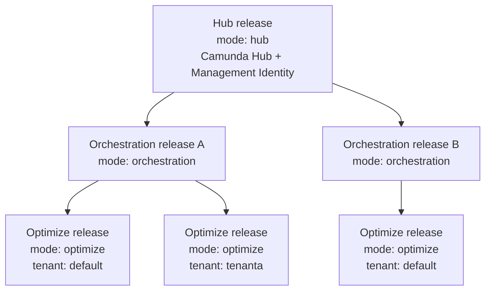

import HelmCliSupport from '../../_partials/_helm-cli-support.md'

:::note Minimum chart versions
This page needs Helm chart 15.0.0 or later for 8.10 releases. For the minimum chart version per Camunda version, see [minimum chart versions](#minimum-chart-versions).
:::

Install Camunda 8.10 Self-Managed as separate Helm releases: one Hub release, one release per Orchestration Cluster, and one Optimize release per Physical Tenant.

This is the baseline topology for a new 8.10 production deployment. Each release declares its role through `global.topology.mode`, so the Hub plane and each execution plane have independent lifecycles. A single Helm chart still produces every component. One Hub release running Camunda Hub can serve many independently deployed Orchestration Clusters, and each cluster can host several [Physical Tenants](/self-managed/concepts/multi-tenancy/physical-tenants.md), each with its own Optimize release.

<a id="choose-your-topology"></a>For other situations, including evaluation with a single `combined` release, see [choose your topology](/self-managed/deployment/helm/install/index.md#choose-your-topology).

<HelmCliSupport />

## Release roles {#release-roles}

`global.topology.mode` selects what a release deploys and what it must be told about the rest of the deployment.

For the minimum Helm chart version of each role, see [minimum chart versions](#minimum-chart-versions).

### Role requirements

| Role            | Chart versions                                                 | Deploys                                                                                                                                                                                                                               | Key requirements                                                                                                                                                                                                                                                     |
| --------------- | -------------------------------------------------------------- | ------------------------------------------------------------------------------------------------------------------------------------------------------------------------------------------------------------------------------------- | -------------------------------------------------------------------------------------------------------------------------------------------------------------------------------------------------------------------------------------------------------------------- |
| `hub`           | 8.10 (15.0.0+)                                                 | Camunda Hub and Management Identity                                                                                                                                                                                                   | `identity.enabled: true`, OIDC authentication, and it's the only release that declares `global.topology.clusters`                                                                                                                                                    |
| `orchestration` | 8.10 (15.0.0+), 8.9 (14.11.0+), 8.8 (13.14.0+), 8.7 (12.14.0+) | 8.10 and 8.9: one Orchestration Cluster and Connectors. 8.8: the same, plus the chart's default bundled Elasticsearch. 8.7: Zeebe, Zeebe Gateway, Operate, Tasklist, Optimize, and Connectors, plus the default bundled Elasticsearch | `global.identity.auth.enabled: true`, `identity.enabled: false`, a reachable `global.identity.service.url`, and the workload enabled. Requirements differ by chart version, see [per-version requirements](./orchestration-release.md#requirements-by-chart-version) |
| `optimize`      | 8.10 (15.0.0+)                                                 | Optimize only                                                                                                                                                                                                                         | `optimize.enabled: true`, `global.noSecondaryStorage: false`, an enabled Elasticsearch or OpenSearch backend with a non-empty host, an OIDC issuer, a reachable Management Identity URL, and `optimize.contextPath` when the chart renders this release's routing    |
| `combined`      | All. This is the behavior of charts without `global.topology`  | Every enabled component in one release                                                                                                                                                                                                | None beyond normal component configuration. This is the default                                                                                                                                                                                                      |

Camunda Hub and its cluster inventory exist only in the 8.10 chart, so `hub` and `optimize` are 8.10-only roles. The 8.7, 8.8, and 8.9 charts support `combined` and `orchestration` only, from the minimum versions above. Earlier versions of those charts have no `global.topology` key: they always behave as `combined`, and setting `orchestration` on them has no effect and produces no error.

A chart 8.7 orchestration release still runs Optimize in-release, so it doesn't follow the one-Optimize-release-per-tenant model.

The chart validates some of these requirements at render time. It fails with a `[camunda][error]` message that names the missing value. It doesn't validate all of them:

- For a `hub` release, the chart enforces `identity.enabled: true` and OIDC authentication. It doesn't check that `global.topology.clusters` is set. Without clusters, Camunda Hub lists no Orchestration Clusters.
- For an `orchestration` release, the chart enforces `global.identity.auth.enabled: true`, `identity.enabled: false`, and the enabled workload. The 8.7, 8.8, and 8.9 charts also enforce a non-empty `global.identity.service.url`. The 8.10 chart doesn't.

Requirements that the chart doesn't enforce are still requirements. Review them before you install.

## How the planes fit together

One Hub release serves any number of Orchestration Clusters. Each cluster hosts one or more Physical Tenants, and each tenant is served by exactly one Optimize release.



Each Physical Tenant, including the default tenant, needs its own Optimize release. See [why Optimize is its own release](./optimize-release.md#why-optimize-is-its-own-release).

## Mix Orchestration Cluster versions under one Hub

An 8.10 Hub release manages Orchestration Cluster releases on the 8.7, 8.8, 8.9, and 8.10 charts. Each cluster deploys from its own chart and its own values, so clusters upgrade independently of the Hub and of each other.

| Orchestration chart | Role to set     | Cluster record needs                                |
| :------------------ | :-------------- | :-------------------------------------------------- |
| 8.10                | `orchestration` | The standard record                                 |
| 8.9                 | `orchestration` | The standard record                                 |
| 8.8                 | `orchestration` | The standard record                                 |
| 8.7                 | `orchestration` | `architecture: legacy` and the legacy service names |

Chart 8.7 predates the unified Orchestration Cluster, so it runs Zeebe, Zeebe Gateway, Operate, and Tasklist as separate workloads. Its Hub cluster record must set `architecture: legacy`, which makes the Hub inventory address those split services and omit the Orchestration Admin component. See [describe a chart 8.7 cluster](./hub-release.md#describe-a-chart-87-cluster).

The Hub release always owns registration, clients, permissions, and inventory, whatever chart version a cluster runs. The older charts can't own any of that, because Camunda Hub doesn't exist in them.

## Why the topology is split

- **Independent cluster lifecycle.** Each Orchestration Cluster is deployed, scaled, upgraded, and removed on its own schedule, without declaring its sibling clusters or duplicating their configuration.
- **One authoritative inventory.** Management Identity registration and Camunda Hub's cluster list both derive from the same `global.topology.clusters` records, so client IDs, audiences, roles, and endpoints can't drift apart.
- **Tenant-level isolation.** Physical Tenants give each team separate data storage and independent backup and restore within one cluster, and each tenant's Optimize gets its own OIDC client and resource server.
- **Declarative operation.** Topology renders from values alone, with no cluster discovery, so Helm, Argo CD, and Flux all produce the same resources.

### What the split does not give you

- **Hub is single-region.** Multi-region guidance applies to the Orchestration Cluster only.
- **Physical Tenants share compute.** Tenants have isolated data and independent management, but they share the cluster's brokers and gateways, so runtime interference is reduced rather than eliminated. See [what is not isolated](/self-managed/concepts/multi-tenancy/physical-tenants.md).
- **Identity reconciliation is additive.** Removing a cluster or tenant record doesn't delete its external client, resource server, permissions, or role. Inventory and clean those objects yourself, after the releases that used them have stopped.
- **Authentication isolation isn't storage isolation.** Separate OIDC credentials per cluster and tenant do nothing to separate shared Elasticsearch or OpenSearch data. Index prefixes do that, and they're your responsibility. See [configure Physical Tenants across releases](./physical-tenants.md).
- **Scale limits are undefined.** Supported cluster and tenant counts haven't been established. Validate your own target scale before committing to it.

<a id="what-the-chart-does-not-own"></a>For what the chart deploys and what you provide yourself, see [what the chart does not own](/self-managed/deployment/helm/configure/configuration-responsibilities.md#what-the-chart-does-not-own).

## Minimum chart versions

This table lists the minimum Helm chart version for each release role.

| Camunda version | Chart line | Minimum chart version | Adds                                                                    |
| :-------------- | :--------- | :-------------------- | :---------------------------------------------------------------------- |
| 8.10            | 15.x       | 15.0.0                | The `hub`, `orchestration`, and `optimize` roles, and `physicalTenants` |
| 8.9             | 14.x       | 14.11.0               | The `orchestration` role                                                |
| 8.8             | 13.x       | 13.14.0               | The `orchestration` role                                                |
| 8.7             | 12.x       | 12.14.0               | The `orchestration` role, with `architecture: legacy` in the Hub record |

Older 8.7, 8.8, and 8.9 charts have no `global.topology` key. They ignore `global.topology.mode` and deploy a combined release. Verify the chart version before you set the role.

## Install order

Install in dependency order, and confirm each release is healthy before starting the next.

1. Namespace-local Secret projections and TLS certificates.
2. The [Hub release](./hub-release.md).
3. One or more [Orchestration Cluster releases](./orchestration-release.md).
4. One [Optimize release](./optimize-release.md) per Physical Tenant, including the default tenant.

The Hub release comes first because it runs Management Identity and, for a Keycloak-administered deployment, creates the OIDC clients the other releases authenticate with.

The Hub release always deploys from the 8.10 chart. Each Orchestration Cluster release can deploy from the 8.7, 8.8, 8.9, or 8.10 chart, using its own chart and values, so clusters upgrade independently of the Hub. See [requirements by chart version](./orchestration-release.md#requirements-by-chart-version).

## Before you begin

Prepare the following resources:

- An OpenID Connect (OIDC) provider that every namespace can reach, with a pinned issuer. The examples use an external Keycloak instance with Management Identity-managed client registration.
- Separate public hostnames and TLS certificates for the Hub and orchestration namespaces.
- External PostgreSQL databases for Management Identity and Camunda Hub.
- A supported secondary storage backend for the Orchestration Cluster, and Elasticsearch or OpenSearch for Optimize.
- Network policies that permit Domain Name System (DNS) traffic and the required cross-namespace service traffic.

Camunda 8.10 bundles no Elasticsearch, PostgreSQL, or Keycloak subcharts, so these must exist before you install. See [deploy required dependencies](/self-managed/deployment/helm/configure/operator-based-infrastructure.md).

The examples use `camunda` as the release name in every namespace, `hub` as the Hub namespace, and `orchestration` as the orchestration namespace. If you change a release name or namespace, update every Kubernetes service name that references it.

Select supported chart versions from the [Helm chart version matrix](https://helm.camunda.io/camunda-platform/version-matrix/), then set them before installation. The Hub and Optimize releases always use the 8.10 (15.x) chart. Each Orchestration Cluster release uses the chart for its own Camunda version:

```sh
export HUB_CHART_VERSION=<15.x-chart-version>
export ORCHESTRATION_CHART_VERSION=<chart-version-for-this-cluster>
```

## Allow required network traffic

If you enforce NetworkPolicies, allow the following traffic in addition to your database and secondary-storage connections:

| Source                  | Destination                                               | Ports                   | Purpose                                                 |
| ----------------------- | --------------------------------------------------------- | ----------------------- | ------------------------------------------------------- |
| All namespaces          | Cluster DNS                                               | `53/TCP`, `53/UDP`      | Resolve cross-namespace service names                   |
| Camunda Hub             | `camunda-zeebe-gateway.orchestration.svc.cluster.local`   | `26500/TCP`, `8080/TCP` | Deploy processes and call the Orchestration Cluster API |
| Camunda Hub             | `camunda-zeebe.orchestration.svc.cluster.local`           | `9600/TCP`              | Check Orchestration Cluster application readiness       |
| Camunda Hub             | `camunda-optimize.<optimize-namespace>.svc.cluster.local` | `80/TCP`                | Check Optimize readiness                                |
| Camunda Hub             | `camunda-connectors.orchestration.svc.cluster.local`      | `8080/TCP`              | Check Connectors readiness                              |
| Orchestration namespace | `camunda-identity.hub.svc.cluster.local`                  | `80/TCP`                | Use central Management Identity                         |
| Optimize namespace      | `camunda-identity.hub.svc.cluster.local`                  | `80/TCP`                | Use central Management Identity                         |
| All namespaces          | Your OIDC provider                                        | Provider HTTPS port     | Authenticate users and clients                          |

Restrict policies to the listed workloads and namespaces instead of allowing unrestricted cross-namespace traffic.

## Manage secrets across namespaces

Kubernetes Secrets are namespace-scoped. When Management Identity administers an external Keycloak, create each workload client secret in both the Hub namespace and the workload namespace with identical values. With another OIDC provider, Management Identity doesn't consume the workload client secrets, so project them only into the workload namespaces.

The following examples use these Secrets:

| Secret                   | Key                     | Required namespaces                 | Purpose                                                  |
| ------------------------ | ----------------------- | ----------------------------------- | -------------------------------------------------------- |
| `keycloak-admin`         | `password`              | `hub`                               | Keycloak administration for Management Identity          |
| `identity-first-user`    | `password`              | `hub`                               | Initial Management Identity user                         |
| `identity-database`      | `password`              | `hub`                               | Management Identity database                             |
| `hub-database`           | `password`              | `hub`                               | Camunda Hub database                                     |
| `hub-pusher`             | `app-key`, `app-secret` | `hub`                               | Stable Camunda Hub WebSocket credentials across upgrades |
| `orchestration-oidc`     | `client-secret`         | `hub`, `orchestration`              | Orchestration OIDC client                                |
| `connectors-oidc`        | `client-secret`         | `hub`, `orchestration`              | Connectors OIDC client                                   |
| `optimize-oidc`          | `client-secret`         | `hub`, Optimize namespace           | Optimize OIDC client, one per Physical Tenant            |
| `secondary-storage`      | `password`              | `orchestration`, Optimize namespace | Elasticsearch password for Orchestration and Optimize    |
| `hub-tls`                | `tls.crt`, `tls.key`    | `hub`                               | Hub Ingress TLS                                          |
| `orchestration-tls`      | `tls.crt`, `tls.key`    | `orchestration`                     | Orchestration HTTP Ingress TLS                           |
| `orchestration-grpc-tls` | `tls.crt`, `tls.key`    | `orchestration`                     | Orchestration gRPC Ingress TLS                           |

Use an external secret manager to synchronize the values. Don't store production credentials directly in a Helm values file. See [secret management](/self-managed/deployment/helm/configure/secret-management.md).

## Deploy with GitOps

The topology values are deterministic and don't require cluster discovery or imperative deployment tooling. Store each release's values with its own Helm release definition.

Apply resources in the [install order](#install-order). For Flux, make each orchestration `HelmRelease` depend on the Hub release:

```yaml
spec:
  dependsOn:
    # This is the Flux HelmRelease metadata.name, not Helm's releaseName.
    - name: <hub-helmrelease-name>
      namespace: hub
```

For Argo CD, use sync waves or separate Applications so the Hub release becomes healthy before orchestration releases are synchronized, and each orchestration release before its Optimize releases.

For Keycloak-managed registration, client Secret names can be identical across namespaces, but Kubernetes Secrets remain namespace-scoped. Project both copies from the same external secret source to prevent drift.

The standalone chart-managed PersistentVolumeClaims for Management Identity, Optimize, and Connectors render when the corresponding component's `persistence.enabled` value is `true`, even when the release topology suppresses that component's workload. This behavior keeps PVC ownership declarative and produces the same desired resources with Helm, Argo CD, and Flux. Set `persistence.enabled` to `false` only after you no longer need the chart to manage that claim and have verified your GitOps pruning and storage reclaim policies.

:::warning
Orchestration Cluster broker PVCs are StatefulSet volume claim templates and don't follow this standalone PVC behavior. Changing a release to `hub` mode suppresses the Orchestration Cluster StatefulSet. Preserve and migrate broker storage separately when you move an existing cluster between releases or namespaces.
:::

## Upgrade an existing deployment

This guide covers fresh releases.

To upgrade an existing 8.9 deployment, first complete the in-place version upgrade while preserving the existing release name, namespace, Orchestration Cluster primary storage, and external data services. See [upgrade Camunda 8.9 to 8.10 using Helm](/self-managed/upgrade/helm/890-to-8100.md).

Adopting this topology afterwards is a separate operation with its own data and rollback planning. See [move from a combined release to the split topology](/self-managed/upgrade/helm/combined-to-split-topology.md).

## Existing configurations

The default `global.topology.mode: combined` preserves the existing single-release and single-namespace behavior.

Existing multi-namespace configurations that use `global.identity.auth.*.alwaysRegister`, component authentication values under disabled components, or manual `camundaHub.restapi.clusters` remain supported. This release doesn't deprecate or remove those values.

In `hub` mode, topology values replace the legacy Identity registration presets. An explicitly configured `camundaHub.restapi.clusters` or legacy `webModeler.restapi.clusters` list still takes precedence over generated Hub inventory.

Any future removal must retain compatibility for at least one minor release, emit GitOps-visible deprecation warnings with migration guidance, and occur only in the next major chart release according to the Helm chart deprecation policy.

### Content from the multi-namespace page

The multi-namespace configuration page moved to this section in 8.10. Its content is now on these pages:

- <a id="configure-the-hub-namespace"></a>Configure the Hub namespace: [install the Camunda Hub release](./hub-release.md).
- <a id="configure-the-orchestration-namespace"></a>Configure the orchestration namespace: [install an Orchestration Cluster release](./orchestration-release.md).
- <a id="add-another-orchestration-cluster"></a>Add another Orchestration Cluster: [add another Orchestration Cluster](./orchestration-release.md#add-another-orchestration-cluster).
