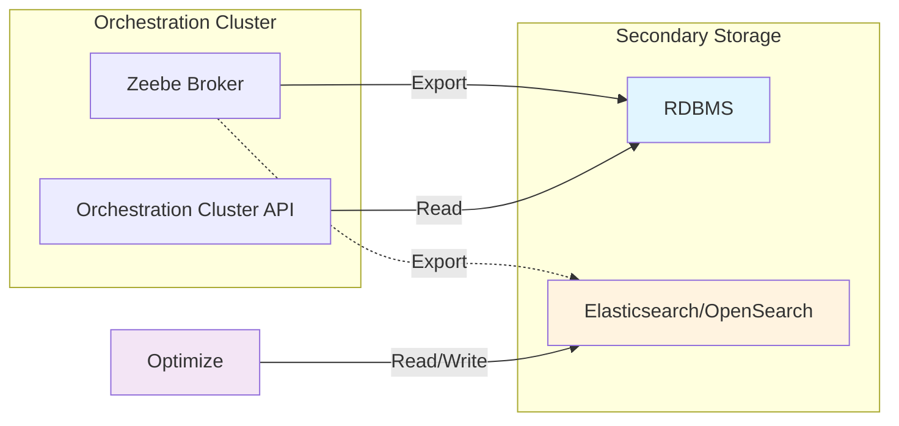

Install Camunda 8 Self-Managed manually on a VM, bare-metal server, or standalone Java runtime while using a relational database (RDBMS) as **secondary storage**.

:::caution
Manual installation is **not** supported for Kubernetes. If you run on Kubernetes, use the [Helm charts](/self-managed/deployment/helm/index.md).
:::

## Secondary storage architecture

The Orchestration Cluster reads from a single configured secondary storage type (RDBMS in this deployment). However, the Zeebe broker can export to multiple targets simultaneously. If you deploy Optimize, configure both the RDBMS exporter (for Orchestration Cluster operations) and the Elasticsearch/OpenSearch exporter (for Optimize).

**Key points:**

- Requests to the Orchestration Cluster API read from the configured secondary storage (RDBMS).
- Optimize requires Elasticsearch or OpenSearch and reads and writes directly to it.
- The Orchestration Cluster exports to multiple targets simultaneously to support this architecture.

## Supported installation targets

- VM-based deployments
- Bare-metal installations
- Standalone Java application deployments

## Prerequisites

- **Supported RDBMS**: See [RDBMS support policy](/self-managed/concepts/databases/relational-db/rdbms-support-policy.md).
- **JDBC drivers**: See [RDBMS configuration](/self-managed/deployment/manual/rdbms/configuration.md).
- **Schemas and scripts**: Use the bundled SQL or Liquibase scripts for schema creation and upgrades. See [Access SQL and Liquibase scripts](/self-managed/deployment/helm/configure/database/access-sql-liquibase-scripts.md).

## When to choose manual installation

Choose manual installation when you run Camunda 8 on **VMs, bare metal, or a standalone Java runtime** and need full control over the operating system, networking, and lifecycle management.

If you run on Kubernetes, use [Helm charts](/self-managed/deployment/helm/index.md). For local development or evaluation, consider [Camunda 8 Run](/self-managed/quickstart/developer-quickstart/c8run.md).

## Supported features

The Orchestration Cluster is fully supported with RDBMS secondary storage for workflow execution, instance monitoring, and user task management.

## Get started

1. [Configure drivers and connections](/self-managed/deployment/manual/rdbms/configuration.md).
2. Review [operations and maintenance](/self-managed/deployment/manual/rdbms/operations.md) for backup, upgrades, troubleshooting, and tuning.
3. Review the [production architecture](/self-managed/deployment/manual/rdbms/rdbms-production-architecture.md) for sizing and topology guidance.

## Related documentation

- [Secondary storage architecture](/self-managed/concepts/secondary-storage/index.md)
- [RDBMS support policy](/self-managed/concepts/databases/relational-db/rdbms-support-policy.md)
- [Manual installation overview](/self-managed/deployment/manual/install.md)
