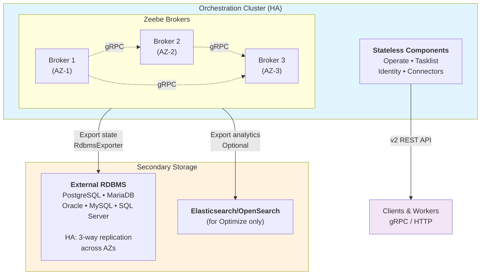

Understand reference architectures for running Camunda 8 Self-Managed in production with a relational database (RDBMS) as secondary storage, including supported topologies, Orchestration Cluster interactions, and critical constraints.

## Recommended topology

For production deployments with RDBMS, Camunda recommends a **HA Zeebe cluster backed by an external managed RDBMS**:

### Key characteristics

**Clustering**

- Minimum three brokers for production HA
- Each broker in separate availability zone
- Default replication factor 3 (spans AZs)

**Secondary storage**

- Single external managed RDBMS instance
- Database handles replication and failover
- Camunda does not manage database HA

**Data flow**

- Processes are executed
- State is flushed to RDBMS
- Operate and Tasklist access the Orchestration Cluster API and do not directly access the database (v2 API)

## When Elasticsearch/OpenSearch is required

Elasticsearch or OpenSearch is required **only for Optimize**. When Optimize is enabled:

- Deploy Elasticsearch/OpenSearch alongside your RDBMS
- Enable the Elasticsearch or OpenSearch exporter to push analytics data
- The Orchestration Cluster uses RDBMS as secondary storage

Without Optimize: RDBMS-only stack is fully supported.

## Production constraints

❌ **ES/OS ↔ RDBMS migration not supported**: Choose your secondary storage backend before production. No automated migration tools available.

❌ **Uniform broker configuration required**: All brokers in a cluster must export to the same secondary storage backend. You can deploy both RDBMS and Elasticsearch/OpenSearch in the same environment (e.g., RDBMS for Zeebe, Elasticsearch/OpenSearch for Optimize), but each broker cluster must choose one.

❌ **v1 API not supported**: Only the v2 Orchestration Cluster REST API works with RDBMS. See [migrate to the Orchestration Cluster API](/apis-tools/migration-manuals/migrate-to-camunda-api.md).

❌ **No automatic fallback**: If RDBMS becomes unavailable, Zeebe continues processing in-memory but cannot export. Pending operations queue until database recovers.

## Network and security

- **Zeebe ↔ RDBMS**: Low-latency, private network connectivity
- **All components ↔ RDBMS**: Use TLS in production
- **Network isolation**: Restrict RDBMS access to Camunda pods only (use NetworkPolicies)

## Supported scenarios

✅ **Single-node orchestration + external RDBMS** (non-HA, acceptable for non-critical workloads)

✅ **HA Zeebe cluster + external managed RDBMS** (recommended for production)

✅ **Managed database services** (AWS Aurora, Azure Database, GCP Cloud SQL)

## Orchestration Cluster component details

- **Zeebe**: Exports state to RDBMS at configurable intervals (default 0.5s)
- **Operate and Tasklist**: Access the Orchestration Cluster API (v2), stateless, scalable independently
- **Optimize**: Requires Elasticsearch/OpenSearch (cannot use RDBMS)

## Next steps

- [RDBMS configuration](/self-managed/deployment/manual/rdbms/configuration.md)
- [RDBMS support policy](/self-managed/concepts/databases/relational-db/rdbms-support-policy.md)
- [RDBMS Helm configuration](/self-managed/deployment/helm/configure/database/rdbms.md)
